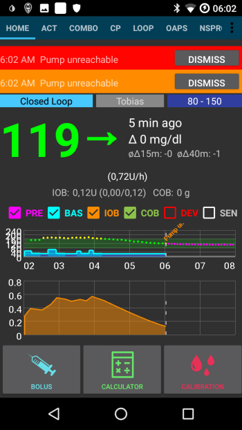

# AkkuChek Combo Tipps zum Einstieg

**HINWEIS:** Ab AAPS Version 3.2, wurde ein [neuer Combo-Treiber](../Configuration/Accu-Chek-Combo-Pump-v2.md) (auch als 'combov2' bezeichnet) hinzugefügt. Der alte Treiber wird auch 'Ruffy-based driver' genannt. Einige Teile dieses Dokuments gelten nur für den alten Treiber. Diese Abschnitte werden entsprechend gekennzeichnet.

## Wie man einen reibungslosen Betrieb gewährleistet

* **Hab immer dein Smartphone dabei**, lege es in der Nacht neben dein Bett. Da du während des Schlafens auf der Pumpe liegen könntest, funktioniert eine höhere Position (auf einem Regal oder Brett) am besten.
* Always make sure that the pump battery is as full as possible. See the battery section for tipps regarding the battery.

* (Only applies to the old driver) It is best to **not touch the app ruffy** while the system is running. If the app is started again, the connection to the pump can break off. Once the pump is connected to ruffy, there is no need to re-connect. Even after a restart of the phone, the connection is automatically re-established. If possible, move the app to an unused screen or in a folder on your smartphone so you do not accidentally open it.

* Nur für den alten Treiber gültig: Solltest Du während der Loop läuft, versehentlich die App gestartet haben, hilft es das Smartphone neu zu starten.
* Whenever possible, only operate the pump via the AAPS app. To facilitate this, activate the key lock on the pump under **PUMP SETTINGS / KEY LOCK / ON**. Es ist lediglich dann notwendig, die Tasten der Pumpe zu benutzen, wenn das Reservoir oder die Batterie ausgewechselt werden müssen. 

## Pumpe nicht erreichbar. Was ist zu tun?

### Alarm für "Pumpe nicht erreichbar" aktivieren

* In AAPS, go to **Settings / Local Alarms** and activate **alarm when pump is unreachable** and set **pump not reachable limit [Min]** to **31** minutes.
* Das gibt dir genug Zeit, dass der Alarm nicht ausgelöst wird, wenn du das Smartphone auf dem Schreibtisch liegen lässt und das Zimmer verlässt, aber informiert dich, wenn die Pumpe für einen Zeitraum nicht erreichbar ist, der die Dauer einer temporären Basalrate übersteigt.

### Erreichbarkeit der Pumpe wiederherstellen

* When AAPS reports a **pump unreachable** alarm, first release the keylock and **press any key on the pump** (e.g. "down" button). As soon as the pump display has turned off, press **Refresh** on the **Combo Tab** in AAPS. Meistens funktioniert die Verbindung dann wieder.
* If that does not help, reboot your smartphone. After the restart, AAPS will be reactivated and a new connection will be established with the pump. If you are using the old driver, ruffy will be reactivated as well.

* The tests with different smartphones have shown that certain smartphones trigger the "pump unreachable" error more often than others. [AAPS Phones](https://docs.google.com/spreadsheets/d/1gZAsN6f0gv6tkgy9EBsYl0BQNhna0RDqA9QGycAqCQc/edit) lists successfully tested smartphones.

### Ursachen und Folgen von häufigen Kommunikationsfehlern

* On phones with **low memory** (or **aggressive power-saving** settings), AAPS is often shut down. Das kannst du daran erkennen, dass die Buttons Bolus und Rechner auf dem Hauptbildschirm nicht angezeigt werden, wenn AAPS gestartet wird, weil das System sich initialisiert. Das kann "Pumpe nicht erreichbar"-Alarme beim Start auslösen. In the **Last Connection** field of the Combo tab, you can check when AAPS last communicated with the pump.

* Dieser Fehler kann dafür sorgen, dass die Batterie der Pumpe sich schneller entlädt, da das Basalprofil von der Pumpe eingelesen wird, wenn die App neu gestartet wird.
* Er erhöht außerdem die Wahrscheinlichkeit, dass der Fehler auftritt, der dafür sorgt, dass die Pumpe alle eingehenden Verbindungsanfragen unterbindet, bis eine Taste an der Pumpe gedrückt wird. 

## Abbruch der temporären Basalrate schlägt fehl

* Occasionally, AAPS can not automatically cancel a **TBR CANCELED** alert. Then you have to either press **UPDATE** in the AAPS **Combo tab** or the alarm on the pump will need to be confirmed.

## Überlegungen zur Pumpenbatterie

### Wechsel der Batterie

* Nach einem **Batterie fast leer**-Alarm sollte die Batterie so bald wie möglich gewechselt werden, damit genug Leistung für eine zuverlässige Bluetooth-Verbindung mit dem Smartphone vorhanden ist, selbst wenn das Smartphone weiter von der Pumpe entfernt ist.
* Selbst nach einem **Batterie fast leer**-Alarm kann die Batterie noch für einen längeren Zeitraum benutzt werden. Trotzdem ist es empfehlenswert immer eine neue Batterie griffbereit zu haben, nachdem der Alarm ausgelöst wurde.
* Bevor Du den Akku wechselst, drücke auf das **Loop** Symbol auf dem Hauptbildschirm und wählen **Loop stoppen für 1 Stunde** aus. 
* Warte darauf, dass AndroidAPS die Kommunikation mit der Pumpe beendet und das Bluetooth Logo auf der Pumpe verschwunden ist.

* Hebe die Tastensperre auf der Pumpe auf, versetze die Pumpe in den Stop-Modus, bestätige bei Bedarf den Abbruch einer temporären Basalrate und tausche die Batterie aus.
* Nur für den alten Treiber gültig: Sollte die Uhr der Pumpe den Batteriewechsel nicht überlebt haben, setze das Datum und die Uhrzeit auf der Pumpe genau auf das Datum/die Uhrzeit des AAPS-Smartphones. (Der neue Treiber nimmt die Anpassungen automatisch auf der Pumpe vor.)
* Danach versetze die Pumpe wieder in den Start-Modus, wähle **Fortfahren**, indem du auf dem Startbildschirm lange auf **Pausiert** drückst.
* AAPS will re-set a necessary temporary basal rate with the arrival of the next blood sugar value.

(Accu-Chek-Combo-Tips-for-Basic-usage-battery-type-and-causes-of-short-battery-life)=

### Batterieart und Ursachen für eine kurze Lebensdauer der Batterie

* Häufige Bluetooth-Verbindungen verbrauchten eine Menge Energie, verwende nur **qualitativ hochwertige Batterien** wie Energizer Ultimate Lithium, die "Power One"s auf dem "grossen" Accu-Chek Servicepack oder verwende Eneloop Batterien, wenn Du Dich für einen wiederaufladbaren Akku entscheidest. 

 

Ranges for typical life time of the different battery types are as follows:

* **Energizer Ultimate Lithium**: 4 bis 7 Wochen
* **Power One Alkaline** (Varta) aus dem Service-Pack: 2 bis 4 Wochen
* **Eneloop wiederaufladbare** Batterien (BK-3MCCE): 1-3 Wochen

If your battery life is significantly shorter than the ranges given above, please check the following possible causes:

* Nur für den alten Treiber gültig: Neuere Versionen (ab März 2018) der [ruffy-App](https://github.com/MilosKozak/ruffy) führen zu einer deutlich längeren Lebensdauer der Batterie. Falls Du Probleme mit der Lebensdauer der Batterie haben solltest, wechsle auf die neueste Version.
* Es gibt verschiedene Varianten der Batterie Abdeckung bei der Combo Pumpe, die teilweise einen Kurzschluss bei der Batterie verursachen und sie schnell entladen. Die Abdeckungen ohne dieses Problem kann man an den goldenen Metallkontakten erkennen.
* Wenn die Uhr in der Pumpe einen kurzen Batteriewechsel nicht "überlebt", kann es sein, dass der Kondensator kaputt ist, der die Uhr nach einem kurzen Energieverlust weiter laufen lässt. In diesem Fall hilft nur ein Austausch der Pumpe durch Roche, was während der Garantiezeit kein Problem ist. 
* Die Hardware des Smartphones und die Software (Android Betriebssystem und Bluetooth Protokoll) beeinflussen ebenfalls die Lebensdauer der Batterie in der Pumpe, wobei die genauen Faktoren bisher noch nicht bekannt sind. Wenn du die Möglichkeit hast, versuche es mit einem anderen Smartphone und vergleiche die Lebensdauer der Batterie.

## Zeitumstellung (Sommer- / Winterzeit)

**NOTE**: The new driver automatically sets date and time and handles daylight saving time changes on its own. The steps below all only apply to the old driver.

* Zum aktuellen Zeitpunkt unterstützt der Combo-Treiber keine automatische Anpassung der Zeit in der Pumpe.
* Während der Nacht der Zeitumstellung wird die Zeit des Smartphones aktualisiert, aber die Zeit in der Pumpe bleibt unverändert. Das löst gegen 3 Uhr morgens einen Alarm aus, weil die Zeiten der Systeme ab dann voneinander abweichen.
* Wenn du in der Nacht nicht geweckt werden willst, **deaktiviere die automatische Zeitanpassung auf dem Smartphone** am Abend bevor die Zeitumstellung erfolgt und passe die Zeit am nächsten Morgen manuell an. Ein guter Weg, um mit Zeitumstellungen umzugehen ist, in eine Zeitzone zu wechseln, die sich auf dem gleichen Längengrad befindet, auf dem Du Dich befindest, aber näher am Äquator liegt (in der es keine Sommer-/Winterzeitumstellung gibt). Beispiel: Wenn Du in der Sommerzeit in Mitteleuropa bist (CEST/GMT+2), wechselst Du in der Nacht vor der Umstellung auf Winterzeit die Zeitzone Deines Smartphones in der Nacht vor der Umstellung auf Winterzeit in die Zeitzone Landes Zimbabwe (CAT). Am darauf folgenden Morgen änderst Du die Zeitzone Deines Smartphones auf Mitteleuropäische Zeit (CET/GMT+1). Gleichzeitig änderst Du die Uhreinstellungen Deiner Pumpe auf die Winterzeit-Uhrzeit. Bei der Umstellung von Winter- auf Sommerzeit gehst Du umgekehrt vor. Wechsle vor der Zeitumstellung z.B. in die Zeitzone Nigerias (CET/GMT+1) und gehe zurück auf die Mitteleuropäische Sommerzeit (CEST/GMT+2) am Morgen nach der Zeitumstellung. Passe die Pumpenzeit entsprechend an die dann gültige Sommerzeit an. Unter https://www.timeanddate.com/time/map/ kannst Du ein passendes Land und die Zeitzone auswählen.

## Erweiterter Bolus, Multiwave Bolus

The OpenAPS algorithm does not support a parallel extended bolus or multiwave bolus. But a similar treatment can be achieved by the following alternatives:

* Nutze **e-Carbs**, wenn Du Kohlenhydrate direkt oder über den Rechner eingibst indem Du die volle Mahlzeit eingibst und unter 'Dauer' bzw. 'KH-Zeit' die Zeitspanne eingibst, in der die KH voraussichtlich verstoffwechselt werden. Das System wird dann die KH-Menge auf gleichmäßig auf kleinere Mengen aufteilen und diese über die angegebene Zeit verteilen. Das hilft dem Algorithmus beim regelmäßigen Prüfen der Glukosewertänderungen die entsprechende Insulindosis abzugeben. Um eine Art Multi-Wave-Bolus nachzuahmen, kannst Du auch einen kleinen Einzelbolus mit e-carbs kombinieren. 
* Before eating, on the **Actions tab** in AAPS set as a temporary **Eating Soon** goal with target glucose 80 for several hours. Die Dauer sollte dem Intervall entsprechen, das du für einen erweiterten Bolus verwenden würdest. Dadurch wird Dein Zielwert niedriger als üblich gehalten und somit die (benötigte) Insulinmenge erhöht werden.
* Verwende dann **RECHNER** auf dem Startbildschirm, um die Kohlenhydrate der Mahlzeit einzugeben, aber wende den Wert nicht direkt an, der Dir vom Bolusrechner vorgeschlagen wird. Korrigiere die Insulindosis nach unten, wenn ein Multi-Wave-Bolus abgegeben werden soll. Der Algorithmus muss nun, abhängig von der Mahlzeit, zusätzliche Mikroboli (SMB) abgeben oder eine sehr hohe temporäre Basalrate setzen, um der Steigerung des Glukosewertes entgegenzuwirken. An dieser Stelle sollte mit der Sicherheitsgrenze für die Basalrate (Max IE / h, Maximum basal IOB) sehr vorsichtig experimentiert und falls notwendig temporär geändert werden.

* If you are tempted to just use the extended or multiwave bolus directly on the pump, AAPS will penalize you with disabling the closed loop for the next six hours to ensure that no excess insulin dosage is calculated.

## Alarme bei Bolusabgabe

* If AAPS detects that an identical bolus has been successfully delivered at the same minute, bolus delivery will be prevented with identical numer of insulin units. Wenn du dieselbe Bolusmenge unbedingt innerhalb kurzer Zeit erneut abgeben möchtest, warte zwei Minuten und gib ihn dann ab. Wenn die erste Bolusabgabe unterbrochen wurde oder aus anderen Gründen nicht abgegeben wurde, kannst du den Bolus seit AAPS 2.0 direkt wieder abgeben.
* Hintergrund für dieses Verhalten ist ein Sicherheitsmechanismus, der die Bolus-Historie der Pumpe liest, bevor ein neuer Bolus abgegeben wird, um das Insulin On Board (IOB) auch dann korrekt zu berechnen, wenn direkt an der Pumpe ein Bolus abgegeben wurde. An dieser Stelle müssen nicht zu unterscheidende Einträge verhindert werden.

* Dieser Mechanismus verhindert ebenfalls einen zweiten Fehler: wenn während der Benutzung des Bolus-Rechners ein weitere Bolus direkt an der Pumpe abgegeben wird und sich dadurch die Bolus-Historie ändert, ist die Basis der Bolusberechnung falsch und die Bolusabgabe wird abgebrochen. 

