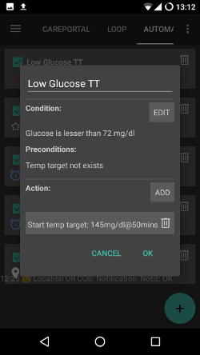

Automatisierung
**************************************************

Was ist Automatisierung
==================================================
Für gleichbleibende, mehrfach auftretende Ereignisse, kann es sein, dass man immer dieselben Einstellungen ändern muss. Um zusätzliche Arbeit zu vermeiden, kann man versuchen das Ganze zu automatisieren (sofern man es genau genug spezifizieren kann). 

Zum Beispiel kann man ein automatisiertes Hypo-Temp-Target erstellen, das bei einem niedrigen Blutzucker automatisch aktiviert wird. Oder wenn man sich in seinem Sportstudio befindet, könnte automatisch ein temporäres Ziel aktiviert werden. 

Bevor Du Automatisierung nutzt, solltest Du Dich mit `Temporären Zielen <./temptarget.html>`_ und/oder `Profil Wechsel <./Profiles.html>`_ auseinander gesetzt haben. 

Stelle sicher, dass Du wirklich verstehst, wie Automation funktioniert bevor Du Deine erste einfache Regel erstellst. **Instead of action, let AAPS first display only a notification.** When you are sure automation is triggered at the right time, replace notification by real action.

.. image:: ../images/Automation_ConditionAction_RC3.png
  :alt: Automation Bedingung und Aktion

Wie erstellt man eine Automatisierung
==================================================
Um eine Automatisierung zu erstellen, gibt man dieser einen Namen, mindestens eine Bedingung und mindestens eine auszuführende Aktion. 

Wichtiger Hinweis
--------------------------------------------------
**Automation bleibt aktiv, wenn Du den Loop deaktivierst!**

So make sure to deactivate automation rules during these occasions if neccessary. You can do so by unticking the box left of the name of your automation rule.

.. image:: ../images/Automation_ActivateDeactivate.png
  :alt: Automation Regeln ein- und ausschalten

Allgemein
--------------------------------------------------
Es gibt ein paar Einschränkungen:

* Der Glukosewert muss zwischen 72 und 270 md/dl (4 und 15 mmol/l) liegen.
* Der Prozentsatz des Profils muss zwischen 70% und 130% liegen.
* Es gibt ein 5 Minuten  Zeitlimit zwischen den einzelnen Ausführungen (und vor der ersten Ausführung).

**Achtung:**

* **weniger als -2 bedeutet: -3 und geringer (-4, -10, etc)**
* **mehr als -2 bedeutet: -1 und größer (-1, 0, +10)**

Bedingung
--------------------------------------------------
Man kann zwischen verschiedenen Bedingungen wählen. Hier sind nur ein paar erwähnt, aber die meisten sind selbsterklärend und werden daher hier nicht beschrieben:

* connect conditions: you can have several conditions and can link them with 

  * "Und"
  * "Oder"
  * "Exclusive or" (which means that if one - and only one of the - conditions applies, the action(s) will happen)
   
* Zeit vs. Wiederkehrende Zeit

  * Zeit = einmaliges Ereignis
  * Wiederkehrende Zeit = etwas, das regelmäßig passiert (z.B.  einmal pro Woche, jeden Werktag etc.)
   
* Standort: in "Konfiguration" (Automation) kann man auswählen, welchen Standort Service man möchte:

  * Use passive location: AAPS only takes locations when other apps are requesting it
  * Netzwerkstandort: Bestimmung des Standorts mithilfe der Infrastruktur Deines Mobilfunkanbieters (teilweise recht ungenau)
  * GPS-Standort (Achtung! Kann zu übermäßigen Akkuverbrauch führen!)
  
Aktion
--------------------------------------------------
Du kannst eine oder mehrere Aktionen wählen: 

* temporäres Ziel (TT) starten 

  * muss zwischen 72 mg/dl und 270 mg/dl (4 mmol/l und 15 mmol/l) liegen
  * funktioniert nur, wenn aktuell kein temporäres Ziel eingestellt ist
   
* Temporäres Ziel (TT) stoppen
* Benachrichtigung/Notiz
* prozentuale Änderung des Profils

  * muss zwischen 70% und 130% liegen 
  * funktioniert nur, wenn aktuell das Profil mit 100% läuft

Nachdem du deine Aktionen hinzugefügt hast, **vergesse nicht die Standard-Werte zu ändern** indem du auf die Standard-Werte klickst.
 
.. image:: ../images/Automation_Default_V2_5.png
  :alt: Automation Standard-Werte vs.  eigene Werte

Automation-Regeln sortieren
-----
Zum Sortieren von Automation-Regeln klicke und halte die Schaltfläche mit den vier Linien auf der rechten Seite des Bildschirms und bewege sie nach oben oder unten.

.. image:: ../images/Automation_Sort.png
  :alt: Automation-Regeln sortieren
  
Automation-Regeln löschen
-----
Zum Löschen die Regel einfach nach links oder rechts wegwischen.

.. image:: ../images/Automation_Delete.png
  :alt: Automation-Regeln löschen

Empfehlungen und Vorbehalte
==================================================
* When you start using automation or create a new rule, first add a notification only until you are sure the rule is working well.
* Beobachte die Resultate Deiner Regel.
* Don't try to make conditions too easy (i.e.: IF bg > 80 mg/dl AND bg < 180 mg/dl)

  **Doppelt wichtig, wenn die Aktion ein Profilwechsel ist!**
 
* Try to use Temp Targets instead of Profile Switches. Temporäre Ziele setzen `Autosens <../Usage/Open-APS-features.html#autosens>`_ nicht auf 0 zurück.
* Setze Profilwechsel sparsam und nur als letzte Möglichkeit ein.

  * Durch einen Profilwechsel wird `Autosens <../Usage/Open-APS-features.html#autosens>`_ für mind. 6 Stunden unbrauchbar.

* Profilwechsel setzen Dein Profil nicht automatisch auf das Standardprofil zurück.

  * Dafür musst Du eine weitere Regel erstellen, um zum Standardprofil zurück zu wechseln, oder es manuell tun!
  * Increased risk of hypoglycemia if profile switch does not expire or reset back to base profile.

Beispiele
==================================================
These are just setup examples, no advises. Don't reproduce them without being aware what you are actually doing or why you need them.

* Profilwechsel für Deine täglichen Aktivitäten (z. B. Schule, Sport, Wochenende vs. Arbeitstag) mit Standort, WLAN SSID, Zeit etc.
* Setting temp target for activities based on time, location, connection to a bluetooth device...
* Bald-Essen-Temp Target auf Basis von Zeit, Standort,...

Temporäres Ziel bei niedrigem Blutzucker
--------------------------------------------------

This is made by someone who wants to get a hypo temp target automatically when having low glucose.

Mittagsessen Temporäres Ziel
--------------------------------------------------
.. image:: ../images/Automation3.png
  :alt: Automation3
  
This example is made by someone who has lunch at work at the same time every day during the week. If he or she stays at a certain time in his or her lunch location, automation will set a low temp target (eating soon) while waiting for the lunch. Because of the "And" connection, it only happens during the chosen time and if he or she is at the chosen location. So it does not work on any other time at this location or on this time when the person stays at home. 

Incorrect use of automation
--------------------------------------------------
Please be aware to use automation incorrectly. Dies könnte zu Schwierigkeiten und sogar zu einer Gefahr für Deine Gesundheit führen. Beispiele für eine fehlerhafte Verwendung sind z. B.:

* Versuche, den Algorithmus zu überlisten statt ihn nur zu unterstützen (z.B.  Profilwechsel statt Feinanpassung der Basalrate und Faktoren)
* Profilwechsel zum Ausgleich von Lebensmitteln festlegen
* Profilwechsel ohne Dauer festlegen
* Einweg-Regeln (z.B.  Regel einrichten, aber Rückgängigmachung vergessen)
* Langzeitregeln erstellen

Alternativen
==================================================

For advanced users, there are other posibilities to automate tasks using IFTTT or a third party Android app called Automate. Einige Beispiele findest Du `hier <./automationwithapp.html>`_.
