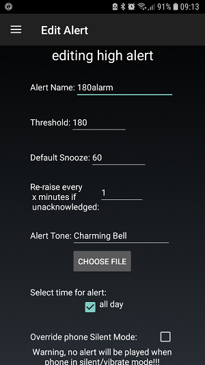

# Automatisierung mit Drittanbieter-App Android Automate

**Dieser Artikel wurde vor Erscheinen von AndroidAPS Version 2.5 geschrieben. Mittlerweile gibt es ein [automation plugin in AndroidAPS](./Automation.rst) selbst. Für einige ist dieser Artikel vielleicht dennoch nützlich, die Drittanbieter-App sollte jedochn nur von fortgeschrittenen Benutzern verwendet werden.**

Da AndroidAPS ein hybrides Closed-Loop-System ist, muss der Benutzer noch einige Informationen von Hand eingeben (z.B. Bewegung, Spritz-Ess-Abstand ("eating soon"), Chillen auf dem Sofa...). Häufig wiederkehrende manuelle Eingaben können über externe Tools wie Automate oder IFTTT automatisiert werden, um die AndroidAPS-Funktionen zu erweitern.

## Android Automate App

Mit der kostenlosen Android™ Anwendung Automate kannst du verschiedene Aufgaben auf deinem Smartphone automatisieren. Create your automations with flowcharts, make your device automatically change settings like Bluetooth, Wi-Fi, NFC or perform actions like sending SMS, e-mail, based on your location, the time of day, or any other “event trigger”. Du kannst fast alles auf deinem Gerät automatisieren, Automate unterstützt sogar Plug-Ins für Tasker und Locale.

Mit diesem Tool kannst du leicht Workflows erstellen, mit denen dein Diabetes basierend auf mehreren Bedingungen automatisch behandelt wird nach dem Prinzip "Wenn dies... und dies... aber nicht dies..., dann mache das... und das...". Es gibt Tausende von Möglichkeiten, die du konfigurieren kannst.

Bis jetzt ist es **notwendig, mit Nightscout Profilen**zu loopen, da Automate die Befehle über HTTP-Anfragen direkt in deiner Nightscout-Website ausführt, die sie anschließend mit deiner AndroidAPS-App synchronisiert.

**Offline looping (direct communication between Automate and AndroidAPS app) is not supported yet**, but technologically possible. Vielleicht wird es in Zukunft dafür eine Lösung geben. Wenn du einen Weg dazu gefunden hast, füge ihn bitte dieser Dokumentation hinzu oder kontaktiere einen Entwickler.

### Grundvoraussetzungen

#### Automate App

Lade Android Automate im Google Play Store oder unter <https://llamalab.com/automate/> herunter und installiere es auf demselben Smartphone wie AndroidAPS.

In Automate, tap on hamburger menu on the upper left of the screen > Settings > Check 'Run on system startup'. Dadurch werden deine Workflows automatisch nach dem Systemstart ausgeführt.

#### AndroidAPS

In AndroidAPS, tap on 3 dots menu on the upper right screen and go to Preferences > NSClient > Connection settings > Uncheck 'Use WiFi connection only' and 'Only if charging' as the automated treating does only work when AndroidAPS has an actual nightscout connection.

In AndroidAPS, tap on 3 dots menu on the upper right screen and go to Preferences > NSClient > Advanced Settings > Uncheck 'NS upload only (disabled sync)' and 'No upload to NS'

### Workflow-Beispiele

#### Beispiel 1: Wenn Aktivität (z.B. Gehen oder Laufen) erkannt wird, dann setze ein hohes TT. Und wenn die Aktivität endet, dann warte 20 Minuten und brich anschließend das TT ab

Dieser Workflow wird die Smartphone-Sensoren (Pedometer, Gravitationssensor...) überwachen, die das Aktivitätsverhalten erkennen. If there is recent activity like walking, running or riding a bicycle present, then Automate will set a user specified high temporary target for the user specified time. Wenn die Aktivität endet, erkennt das dein Smartphone, wartet 20 Minuten und setzt dann den Zielwert zurück auf den im Profil hinterlegten Standardwert.

Lade das Automate script herunter <https://llamalab.com/automate/community/flows/27808>herunter.

Bearbeite den "Sling", indem du auf das Stift-Symbol tippst > Flowchart

Passe den Workflow nach deinen Wünschen wie folgt an:

1. = Hohes TT setzen
2. = Go back to normal target 20 minutes after the end of activity

1 

2 

Request-URL: Deine NS-URL mit der Endung "/api/v1/treatments.json" (z.B. https://my-cgm.herokuapp.com/api/v1/treatments.json)

Request content:

* targetTop / targetBottom: Der hohe TT-Wert (der obere und untere Wert sollten identisch sein)
* duration: Die Dauer des hohen TT (nach Zeitablauf wird der Loop auf das reguläre Profilziel zurückgehen, es sei denn, die Aktivität geht weiter). 
* secret: Deine API SHA1 Hash. Das ist NICHT dein API-Key! Du kannst deinen API-Key in das SHA1 Format konvertieren unter <http://www.sha1-online.com/>

Save: Tippe auf "Done" und auf den Haken

Workflow starten: Tippe auf die Play-Taste

#### Beispiel 2: Wenn xDrip+ einen "BG hoch"-Alarm meldet, dann setze ein niedriges TT für ... Minuten.

Dieser Workflow wird die xDrip+ Benachrichtigungen überwachen. If there is triggered a user specified xDrip+ high BG alert, then Automate will set a user specified low temporary target for the user specified time. Nach Zeitablauf wird ggf. eine erneute Warnung die Dauer des niedrigen TT verlängern.

##### xDrip+

Erstens musst du in xDrip+ eine "BG-hoch"-Warnung wie folgt einrichten:

Alert name: (Pay attention on it!) This name is essential for firing the trigger. It should be unmistakable and not similar to other alert names. Beispiel: "180alarm" sollte nicht neben "80alarm" existieren.

Threshold: BG-Wert, der den hohen Alarm auslösen soll.

Default Snooze: Gib hier an, für wie lange du das niedrige temporäre Ziel setzen wirst, da die Warnung sonst erneut auftauchen wird und dann die Dauer des niedrigen temporären Ziels verlängert.

##### Automate

Zweiens, downloade das Automate script <https://llamalab.com/automate/community/flows/27809>.

Bearbeite den "Sling", indem du auf das Stift-Symbol tippst > Flowchart

Passe den Workflow nach deinen Wünschen wie folgt an:

Unter "Notification posted?" musst du als "TITLE" den Namen derjenigen xDrip+ Warnung eingeben, die den Trigger auslösen soll. Am Wortanfang und am Wortende musst du als Variable einen * hinzufügen.

Request-URL: Deine NS-URL mit der Endung "/api/v1/treatments.json" (z.B. https://my-cgm.herokuapp.com/api/v1/treatments.json)

Request content:

* targetTop / targetBottom: Der hohe TT-Wert (der obere und untere Wert sollten identisch sein)
* duration: Die Dauer des hohen TT (nach Zeitablauf wird der Loop auf das reguläre Profilziel zurückgehen, es sei denn, die Aktivität geht weiter). Es ist empfehlenswert, dass du hier dieselbe Dauer verwendest wie für "Standard snooze" in den Einstellungen der xDrip+Warnung
* secret: Deine API SHA1 Hash. Das ist NICHT dein API-Key! Du kannst deinen API-Key in das SHA1 Format konvertieren unter <http://www.sha1-online.com/>

Save: Tippe auf "Done" und auf den Haken

Workflow starten: Tippe auf die Play-Taste

#### Beispiel 3: Kann von dir selbst hinzugefügt werden!!!

Bitte füge weitere Workflows hinzu, indem du die .flo-Datei in die Automate-Community hochlädst (unter dem Stichwort 'Nightscout') und beschreibe sie hier, indem du einen [Pull Request auf das AndroidAPSdocs Repository](../make-a-PR.md) machst.

## If this, then that (IFTTT)

Zögere nicht, mit einem PR ein Tutorial hierfür hinzuzufügen...