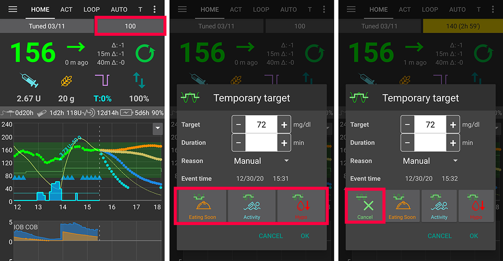

# Temporäre Ziele

## Was sind temporäre Ziele und wie nutzt und richtet man sie ein?

Mit temporären Zielen (oder kurz - aus dem Englischen - TT von temp Targets) kann man den Blutzuckerzielwert für eine selbst definierte Dauer verändern. Da diese meistens für Aktivität, Hypo-Kohlenhydrate oder vor dem Essen benötigt werden, kannst du dir temporäre Ziele dafür vordefinieren. Um solche einzurichten, kannst du im Menü in der rechten oberen Ecke zu Einstellungen-> Andere-> Vordefinierte Ziele gehen.

Vordefinierte temporäre Ziele kannst du auswählen und aktivieren, indem du entweder lange auf das Zielbereich-Feld auf der "Home"-Seite drückst oder auf den orangen "Kohlenhydrate"-Button. Um manuell ein [ "Benutzerdefiniertes Temporäres Ziel" ](../Usage/temptarget#benutzerdefiniertes-temp-target) (BG-Wert und/oder Dauer) zu setzen, verwende "Benutzerdefiniert", nachdem Du Dein Ziel in der oberen rechten Ecke lang gedrückt hast oder verwende die Schaltfläche "Temporäres Ziel" auf der Registerkarte (Tab) ["Aktionen"](../Configuration/Config-Builder#aktionen).

## Hypo Temp-Target

Das ist wohl das wichtigste Temp Target. Dafür gibt es verschiedene Gründe:

1. Hypowahrnehmung: Normalerweise sollte der Loop das Abfallen des Bz abfangen, aber manchmal kannst du das besser als der Loop vorhersehen. Der Loop kann schneller reagieren, wenn Du ein höheres Bz-Ziel eingestellt hast.
2. Wenn Du schnell wirkende Kohlenhydrate zur Hypobehandlung isst wird Dein BZ sehr schnell ansteigen. Der Loop würde dies zu korrigieren versuchen oder sogar SMB geben, falls Du diese nutzt. Ein "Hypo Temp-Target" kann das verhindern. 
3. (für Fortgeschrittene, [Ziel (objective) 10](../Usage/Objectives#objective-10-enabling-additional-oref1-features-for-daytime-use-such-as-super-micro-bolus-smb)): Du kannst für Temp Targets ab 100 mg/dl bzw. 5.5 mmol/l “Hohe temp. Ziele erhöhen die Sensitivität” einstellen, so dass AndroidAPS sensibler reagiert.
4. (für Fortgeschrittene, [Ziel (objective) 10](../Usage/Objectives#objective-10-enabling-additional-oref1-features-for-daytime-use-such-as-super-micro-bolus-smb)): Du kannst “SMB bei temporären Zielen oberhalb des regulären Ziels” deaktivieren. In diesem Fall wird AndroidAPS auch bei COB > 0, “SMB bei aktiven temporären Zielen” und “SMB immer aktivieren” keine SMB abgeben. 

Hinweis: Wenn du Kohlenhydrate über den Carbs Button eingibst und dein BZ unter 72 mg/dl bzw. 4 mmol/l liegt, wird Hypo TT automatisch aktiviert.

## Aktivitäten Temp-Target

Vor und während sportlicher Aktivitäten kannst du einen höheren Zielwert setzen, um eine Unterzuckerung zu vermeiden. Um das Setzen des temporären Ziels zu vereinfachen, kannst du ein Standard Aktivitäten TT definieren. Abhängig von DIA, IOB und Deinen Erfahrungen macht es ggf. Sinn, dass temporäre Ziel vor der Aktivität einzustellen. Weitere Informationen findest Du in den [FAQ unter Sport](../Getting-Started/FAQ#sport).

Für Fortgeschrittene, [Ziel (objective) 10](../Usage/Objectives#objective-10-enabling-additional-oref1-features-for-daytime-use-such-as-super-micro-bolus-smb): Der Vorteil des Aktivitäten TT ist, dass du für Temp Targets ab 100 mg/dl bzw. 5.5 mmol/l “Hohe temp. Ziele erhöhen die Sensitivität” einstellen kannst. AndroidAPS reagiert dann sensibler. Manche machen stattdessen auch einen Profilwechsel vor/während der Aktivität. Das kann jeder halten wie er will. Wenn "SMB bei temporären Zielen oberhalb des regulären Ziels" deaktiviert ist, wird AndroidAPS auch bei COB > 0, "SMB bei aktiven temporären Zielen" und "SMB immer aktivieren" keine SMB abgeben.

## Bald essen Temp-Target

Wenn du weißt, dass du bald essen wirst, kannst du dieses TT aktivieren, damit vor dem Essen bereits mehr Insulin vorhanden ist. Vor allem für all diejenigen, die auf einen Spritz-Ess-Abstand verzichten, kann dies eine gute Alternative sein, den BZ vor dem Essen etwas zu senken. Mehr über den "Bald essen Modus" kannst du im Artikel ['How to do “eating soon” mode'](https://diyps.org/2015/03/26/how-to-do-eating-soon-mode-diyps-lessons-learned/) oder [hier](https://diyps.org/tag/eating-soon-mode/) lesen.

Für Fortgeschrittene, [Ziel (objective) 10](../Usage/Objectives#objective-10-enabling-additional-oref1-features-for-daytime-use-such-as-super-micro-bolus-smb): Wenn Du OpenAPS SMB benutzt und “Niedrige temp. Ziele senken die Sensitivität” aktivierst, agiert AndroidAPS etwas aggressiver. Dies erfordert ein temporäres Ziel von weniger als 100 mg/dl bzw. 5,5 mmol/l. Dies erfordert ein temporäres Ziel von weniger als 100 mg/dl bzw. 5,5 mmol/l.

## Benutzerdefiniertes Temp-Target

Manchmal benötigst du ein temporäres Ziel, das von den Standard-Tt abweicht. Dieses setzt du, indem du entweder lang auf den Zielwert oben rechts auf dem Startbildschirm drückst oder auf dem "Aktionen" Tab.

