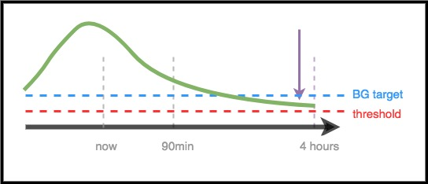

# Für Mediziner und Fachpersonal - Eine allgemeine Einführung in und eine Anleitung für AAPS

Diese Seite richtet sich an medizinischer Fachpersonal, das Interesse an der Open-Source-Technologie der künstlichen Bauchspeicheldrüse wie AAPS hat, und an Patienten, die diese Informationen mit ihren Ärzten und dem Diabetes-Team teilen möchten.

Dieser Leitfaden enthält einige wichtige Informationen über DIY Closed Looping und speziell über die Funktionsweise von AAPS. Für weiterführende Informationen zu all diesen Themen, lohnt sich ein Blick auf die [ausführliche AAPS-Online-Dokumentation](../index.md). Bei Fragen wenden Sie sich bitte an Ihren Patienten bezüglich weiterer Details oder zögern Sie nicht, die Community zu kontaktieren. (Wenn Sie nicht auf Social Media (z.B. Twitter<0> oder Facebook) sind, können Sie gerne eine E-Mail an developers@AndroidAPS.org senden.) [Einige der neuesten Studien und ergebnisbezogenen Daten finden Sie unter diesem Link](https://openaps.org/outcomes/).
 

## Die Schritte zum Aufbau eines DIY Closed Loop

Um mit AAPS zu beginnen, sollten folgende Schritte unternommen werden:

* Finde eine [kompatible Pump](../Getting-Started/CompatiblePumps.md), ein [kompatibles Android-Gerät](../Getting-Started/Phones.md), und einen [kompatiblen Sensor (CGM)](../Getting-Started/CompatiblesCgms.md).
* [Lade den AAPS-Quellcode herunter und erstelle die Software](../SettingUpAaps/BuildingAaps.md).
* [Konfigurieren Sie die Software so, dass sie mit Ihren Diabetes-Geräten kommuniziert, richten Sie sie ein und nehmen Sie Sicherheitseinstellungen vor](../SettingUpAaps/SetupWizard.md).

## Wie ein DIY Closed Loop funktioniert

Ohne ein Closed Loop System sammelt der Patient mit Diabetes Daten von seiner Pumpe und seinem CGM, entscheidet, was zu tun ist, und ergreift entsprechende Maßnahmen.

Bei der automatisierten Insulinverabreichung macht das System das Gleiche: Es sammelt Daten von der Pumpe, dem CGM und andere Informationen, die protokolliert werden (z.B. über Nightscout). Diese Informationen verwendet es als Basis seiner Berechnungen und entscheidet, wie viel mehr oder weniger Insulin benötigt wird (über oder unter der zugrunde liegenden Basalrate). Mittels temporärer Basalraten werden die notwendigen Anpassungen vorgenommen, um den BZ stabil zu halten oder in den Zielbereich zu bringen.

Wenn das Gerät, auf dem AAPS läuft, kaputt geht oder die Bluetooth-Verbindung zur Pumpe verliert, fällt die Insulinpumpe nach dem Ende der letzten temporären Basalrate wieder auf die im Profil hinterlegte Basalrate zurück und verhält sich wie eine herkömmliche Pumpe.

## Wie Daten gesammelt werden

Mit AAPS läuft auf dem Android-Gerät eine spezielle App, die Berechnungen vornimmt. Das Smartphone/Smartwatch kommuniziert über Bluetooth mit der unterstützten Pumpe. AAPS kann mit anderen Geräten und der Cloud über WLAN oder mobile Datenverbindungen kommunizieren, um so zusätzliche Informationen zu sammeln. Über diesen Weg können Patienten, Pflegepersonal und Angehörige auch nachverfolgen, was und warum AndroidAPS etwas tut.

Das Android-Gerät muss:

* mit der Pumpe kommunizieren und den Verlauf auslesen, um zu ermitteln, wie viel Insulin abgegeben wurde
* mit dem CGM kommunizieren (entweder direkt oder über einen Cloud Server), um den BZ-Verlauf zu kennen

Sobald das Gerät die Daten gesammelt hat, analysiert der Algorithmus sie und führt die Entscheidungsfindung auf Basis der Einstellungen (Korrektur- und BE-Faktoren, DIA, Zielwert/-bereich, etc.) durch. Bei Bedarf gibt es dann Kommadnos an die Pumpe, um die Insulinabgabe zu verändern.

Es sammelt zudem alle Informationen über Boli, Kohlenhydrataufnahme und temporäre Änderungen des Zielwerts/-bereichs von der Pumpe oder von Nightscout, um sie in die Berechnung der Insulinabgabe einzubeziehen.

## Woher weiß es, was es zu tun hat?

Die Open-Source-Software wurde entwickelt, um die bisher von Diabetikern händisch durchgeführten Tätigkeiten zu übernehmen und zu berechnen, wie die Insulinzufuhr angepasst werden sollte. Zuerst sammelt das System die Daten aller verbundenen Geräte und aus der Cloud, bereitet sie auf und führt die notwendigen Berechnungen durch. Ausgehend von verschiedenen Szenarien werden die erwarteten BZ-Bereiche der kommenden Stunden vorhergesagt und die notwenigen Anpassungen der Insulingabe berechnet, um den BZ im Zielbereich zu halten oder wieder dorthin zu bringen. Anschließend sendet es notwendigen Anpassungen an die Pumpe. Danach werden die Daten aus der Pumpe ausgelesen und die Berechnungen starten neu.

Es ist wichtig, qualitativ hochwertige CGM-Daten zu haben, da die Werte aus dem CGM die wichtigsten Eingabeparameter sind.

AAPS wurde so entworfen, dass alle Eingabedaten, die daraus resultierende Empfehlung und die abgeleiteten Maßnahmen völlig transparent nachverfolgbar sind. Daher kann die Frage, "Warum tut es das?" zu jedem Zeitpunkt mit einem Blick in die Log-Dateien leicht beantwortet werden.

## Beispiele für die Entscheidungsfindung des AAPS-Algorithmus

AAPS verwendet den gleichen OpenAPS-Algorithmus und -Funktionsumfang. Der Algorithmus macht, basierend auf den Einstellungen und der aktuellen Situation, mehrere Vorhersagen, die verschiedene Szenarien berechnen, was in der Zukunft passieren könnte. In Nightscout werden diese als "violette Linien" angezeigt. Die [Vorhersagelinien](#aaps-screens-prediction-lines) sind in AAPS, zur besseren Unterscheidung, verschieden eingefärbt. In den Log-Dateien kann nachvollzogen werden, welche dieser verschiedenen Vorhersagen in welchem Zeitraum für die Berechnung der notwendigen Maßnahmen verwendet wurde.

### Hier einige Beispiele für die Vorhersagelinien und wie sie sich unterscheiden können:

### Die folgenden Beispiele zeigen verschiedene Zeiträume und wie sie die Insulingabe beeinflussen:

### Szenario 1 - ZeroTemp aus Sicherheitsgründen I

Zwar steigt der BZ auf kurze Sicht an, es wird aber erwartet, dass er mittelfristig deutlich sinken wird. Tatsächlich wird prognostiziert, dass er nicht nur unter den Zielwert, *sondern auch* unter die Sicherheitsschwellenwert fallen wird. Um eine Hypo zu vermeiden, setzt AAPS aus Sicherhheitsgründen ein sogenanntes "zero temp" (temporäre Basalrate mit 0 %) bis der erwartete Glukosewert dauerhaft über der Sicherheitsschwelle liegt.

### Szenario 2 - ZeroTemp aus Sicherheitsgründen II

In diesem Beispiel wird erwartet, dass der BZ in Kürze unter den Sicherheitsschwellenwert sinken, jedoch mittelfristig deutlich über den Zielwert steigen wird. Da der kurzfristig erwartete Wert aber unter dem Sicherheitsschwellwert liegt, setzt AAPS erneut ein "zero temp" bis der erwartete Glukosewert dauerhaft darüber liegt.

### Szenario 3 - erhöhter Insulinbedarf

Die Vorhersage in diesem Beispiel erwartetet ein Abfallen unter den Zielwert in der nahen Zukunft. Allerdings wird nicht erwartet, dass dieser Wert unter den Sicherheitsgrenzwert sinkt. Der langfristig erwartete BZ-Wert liegt oberhalb des Zielwertes. AAPS wird, um eine baldige Hypo zu vermeiden, kein zusätzliches Insulin abgeben, da jedes zusätzliche Insulin zu einer Vorhersage unter den Schwellwert führen würde. AndroidAPS beobachtet die CGM-Werte weiterhin und wird Insulin abgeben, sobald dies sicher möglich ist (ohne Unterzuckerungsgefahr), um den erwarteten hohen Wert zurück in den Zielbereich zu bringen. *(Je nach Einstellung sowie Menge und Zeitpunkt des benötigten Insulins kann dieses Insulin über eine temporäre Basalrate oder SMB (Super Micro Bolus) abgegeben werden).*

### Szenario 4 - Reduktion der Insulingabe aus Sicherheitsgründen

In diesem Beispiel erkennt AAPS, dass der Glukosewert deutlich über den Zielwert hinaus ansteigen wird. Aufgrund des bereits im Körper befindlichen Insulins und dessen Wirkdauer wird aber erwartet, dass der Zielbereich ohne zusätzliche Insulingabe wieder erreicht werden kann. Tatsächlich wird sogar ein Abfallen unter den Zielwert erwartet. In der Folge AAPS daher kein zusätzliches Insulin abgeben, um nicht mittelfristig eine Unterzuckerung zu verursachen. Obwohl der BZ-Wert hoch ist und steigt, wird in einem solchen Szenario eher eine Reduktion der Basalrate durch AndroidAPS zu erwarten sein.

## Optimierung von Einstellungen und Änderungen

Als Arzt, der möglicherweise keine Erfahrung mit AAPS oder DIY Closed Loop Systemen hat, kann es eine Herausforderung sein, Deinem Patienten zu helfen, seine Einstellungen zu optimieren oder Änderungen vorzunehmen, um so seine Werte zu verbessern. Wir verfügen in der Gemeinschaft über mehrere Tools und Leitfäden<0>, die den Patienten helfen, kleine, getestete Anpassungen vorzunehmen, um ihre Einstellungen zu verbessern.
 

Das Wichtigste für den Patienten ist, nur jeweils eine Änderung vorzunehmen und deren Auswirkungen 2 - 3 Tage lang zu beobachten, bevor er sich entscheidet, eine andere Einstellung zu ändern oder zu modifizieren. Dies gilt natürlich nicht, wenn es sich offensichtlich um eine "schlechte Anpassung" handelt, die die Situation verschlimmert. In diesem Fall sollte er sofort zur vorherigen Einstellung zurückkehren. Wir Menschen tendieren dazu, alles auf einmal ändern zu wollen. Aber wenn man das tut kann es sein, dass daraus suboptimale Einstellungen entstehen, die nur schwer wieder in einen guten Status zurückgeführt werden können.

Eines der leistungsfähigsten Werkzeuge zur Durchführung von Einstellungsänderungen ist ein automatisiertes Kalkulationstool für Basalraten, ISF und BE-Faktoren. Es heißt “[Autotune](https://openaps.readthedocs.io/en/latest/docs/Customize-Iterate/autotune.html)”. Es ist so konzipiert, dass es unabhängig/manuell ausgeführt werden kann und die Daten Sie oder Ihren Patienten dabei unterstützen, schrittweise Änderungen an den Einstellungen vorzunehmen. Es hat sich in der Community bewährt, Autotune-Berichte zuerst zu überprüfen bevor man versucht, manuelle Anpassungen an den Einstellungen vorzunehmen. Mit AAPS wird Autotune als Ausnahme ausgeführt, obwohl es derzeit Bemühungen gibt, es auch direkt in AAPS zu integrieren. Da diese Parameter sowohl für die Standardpumpentherapie als auch für den Closed Loop die Basis darstellen, wäre die Diskussion der Autotune-Ergebnisse und die Anpassung dieser Parameter die natürliche Verbindung zum Arzt.

Darüber hinaus beeinflusst das menschliche Verhalten, das in der manuellen Diabetes-Therapie erlernt wurde, oft die Ergebnisse - auch bei einem DIY Closed Loop. Wenn zum Beispiel ein niedriger Glukosewert vorhergesagt wird und AAPS das Insulin reduziert, kann eine geringe Menge an Kohlenhydraten (z.B. 3-4g Kohlenhydrate) ausreichen, um einen Glukosewert von 70 mg/dl (3.9 mmol) zu erhöhen. In vielen Fällen kann es aber sein, dass der Patient sich auf Basis seiner bisherigen Erfahrungen entscheidet, deutlich mehr Kohlenhydrate zu sich zu nehmen. Dies führt zu einem schnelleren Anstieg sowohl aus der zusätzlichen Glukose als auch durch die von AndroidAPS im Vorfeld vorgenommene Reduktion der Insulingabe.

## OpenAPS

**Dieser Leitfaden wurde aus dem [The clinician's guide to OpenAPS](https://openaps.readthedocs.io/en/latest/docs/Resources/clinician-guide-to-OpenAPS.html) übernommen und angepasst.** OpenAPS ist ein System, das für den Betrieb auf einem kleinen tragbaren Computer (allgemein als "Rig" bezeichnet) entwickelt wurde. AAPS greift auf viele der in OpenAPS implementierten Techniken zurück und teilt einen Großteil der Logik und Algorithmen, weshalb dieses Handbuch dem ursprünglichen OpenAPS-Handbuch sehr ähnlich ist. Ein Großteil der Informationen über OpenAPS kann leicht auf AAPS übertragen werden, wobei der Hauptunterschied in der genutzten Hardware, auf der die Software ausgeführt wird, liegt.

## Zusammenfassung

Dies soll ein erster allgemeiner Überblick über die Funktionsweise von AAPS sein. Für weitere Informationen fragen sprich mit Deinem Patienten, gehe auf die Community zu oder lies' die vollständige online verfügbare AAPS-Dokumentation.

Zusätzliche Literaturhinweise:

* Die [vollständige AAPS-Dokumentation](../index.md)
* Das [OpenAPS Reference Design](https://OpenAPS.org/reference-design/) das erklärt, wie OpenAPS für die Sicherheit konzipiert ist: https://openaps.org/reference-design/
* Die [vollständige OpenAPS-Dokumentation](https://openaps.readthedocs.io/en/latest/index.html) 
  * Weitere [Details zur OpenAPS Berechnungen](https://openaps.readthedocs.io/en/latest/docs/While%20You%20Wait%20For%20Gear/Understand-determine-basal.html#understanding-the-determine-basal-logic)