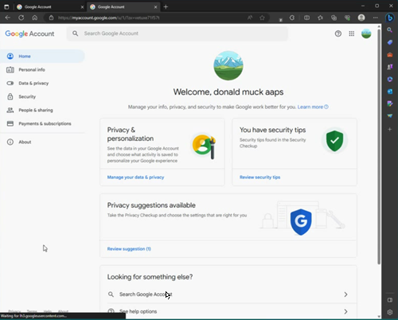
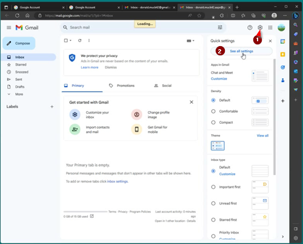

# Ein separates Google-Konto für AAPS (optional)

Einige **AAPS**-Nutzende verwenden ihr Standard-E-Mail-Konto auch für **AAPS**. Andere **AAPS**-Nutzende (oder deren betreuende Person) richten ein spezielles **AAPS**-E-Mail-Konto ein. Das ist optional. Wie man das machen kann, beschreiben wir unten beispielhaft.

Wenn Du für **AAPS** kein eigenes Google Mail-Konto einrichten möchtest, kannst Du direkt zum nächsten Abschnitt [AAPS erstellen](../SettingUpAaps/BuildingAaps.md) gehen.

```{admonition} Advantages of a dedicated Google account for AAPS
:class: dropdown

- Mit einem dedizierten Google Drive-Speicherplatz läufst Du nicht in die Gefahr Dein persönliches Google Drive-Limit durch den **Export der Einstellungen** zu überschreiten.
- Jede **AAPS**-Version (und die Hilfs-Apps wie xDrip+, BYODA, usw.) wird an einem, von Deiner Computer-Hardware unabhängigen, gemeinsamen Ort gespeichert. Wenn Dein Smartphone oder PC defekt ist, gestohlen wird oder verloren geht, hast Du weiterhin Zugriff.
- Durch die Vereinheitlichung des Setups wird die Online-Unterstützung für Nutzende, die eine Verzeichnisstruktur verwenden, vereinfacht.
- Je nach Setup (siehe unten) hast Du einen Alias für die Kommunikation innerhalb der Community und kannst damit Deine Privatsphäre schützen. 
- Kinder mit Diabetes Typ 1 können ihr eigenes "Alltags"-E-Mail-Konto [Standard-E-Mail-Konto] als Jugendliche behalten, während sie **AAPS** und die damit verbundene Funktionen, die ein Erwachsenenkonto erfordern, nutzen.
- Gmail ermöglicht es bis zu 4 Konten unter derselben Telefonnummer zu registrieren.
```

## Wie Du ein dediziertes Google-Konto für AAPS einrichtest

(⌛Ungefähr 10 Minuten)


Voraussetzungen:

* Du hast einen Windows-PC (Windows 10 oder neuer) und ein Android-Smartphone (Android 9 oder neuer), auf dem die **AAPS**-App installiert wird. Beide Geräte haben die neuesten Sicherheitsupdates, Internetzugang und Administrator-Rechte, da einige Schritte das Herunterladen und die Installation von Programmen erfordern.
* Das Android-Smartphone ist bereits mit Deiner persönlichen „Alltags“-E-Mail-Adresse[Standard-E-Mail-Adresse], wie z. B. einem Gmail-Konto, eingerichtet.

```{admonition} Things to consider when setting up your new account
:class: dropdown
- Aus Datenschutzgründen kannst Du einen anderen als den eigenen Namen verwenden, der aber dennoch einen Bezug (wie z.B. t1dsuperstar) herstellt. Damit kannst Du dann dieses Konto in den öffentlichen **AAPS**-Foren verwenden und gleichzeitig Deine Privatsphäre bewahren. Da Google eine Wiederherstellungs-E-Mail und Telefonnummer benötigt, ist es immer noch nachverfolgbar.
- Das neue **AAPS**-Konto wird dieselbe Telefonnummer zur Verifizierung verwenden wie Dein „_Standard_“-Konto. Es wird die Standard-E-Mail-Adresse zur Überprüfung verwenden;
- Wir werden die E-Mail-Weiterleitung so einrichten, dass jede E-Mail, die an das neue AAPS-Konto gesendet wird, an das Standard-Konto weitergeleitet wird (es besteht also keine Notwendigkeit, zwei verschiedene Postfächer zu prüfen );
- Verwende unterschiedliche Passwörter für Dein Standard-E-Mail-Konto und das spezielle AAPS-Google-Mail-Konto
- Wenn Du eine „Zwei-Faktor-Authentisierung“ (aka Multi-Faktor-Authentifizierung) für ein Google Mail-Konto nutzt, kannst Du es auch für beide Konten tun.
- Wenn Du planst Google „Passkeys“ zu nutzen, stelle sicher, dass Du mehrere Geräte registrierst. Das verhindert, dass Du Dich selbst aussperrst. Nutze es nur auf Geräten, die Du alleine nutzt (_z. B. nicht auf einem PC mit einem gemeinsam genutzten Konto, das auch andere Personen entsperren können).
```


```{admonition}  Video Walkthrough! 
:class: Note
Klicke [hier](<https://drive.google.com/file/d/1dMZTIolO-kd2eB0soP7boEVtHeCDEQBF/view?usp=drive_link>), um einen Video Walkthrough zum Setup eines dedizierten Google-Kontos zu starten.
```

 Im Video werden drei Schritte beschrieben:

In diesem Beispiel: 
- Dein bestehendes „_Standard_“-Google-Konto ist <donald.muck42@gmail.com>  
- Dein neues „_AAPS_“-Gmail-Konto wird <donald.muck42.aaps@gmail.com> sein 


### Gehe zu <https://account.google.com> 

 Wenn Du bereits bei Google angemeldet bist, wirst Du direkt auf Deine „Standard“-**Mein Konto**-Seite weitergeleitet. (1) Klicke oben rechts auf der Seite auf Dein Profilbild (in diesem Fall ein sehr einfaches ) (2) Wähle „_Konto hinzufügen_”.


### Gib die Details zu Deinem NEUEN dedizierten Konto ein: 

- Gib das neue Konto ein 
- Konto erstellen
- Für meine private Nutzung. 


### Gib Deine persönlichen Daten ein:
 - Vorname eingeben
 - Nachname
 - Geburtsdatum (muss volljährig sein)

### Wähle Deine NEUE E-Mail-Adresse & Passwort

In diesem Beispiel wird „.AAPS“ zu Donald Mucks vorhandener Adresse hinzugefügt…\
Lege Dein Passwort fest

### Gib eine Telefonnummer ein, mit der Du SMS-Verifizierungen empfangen kannst

Gmail sendet Dir jetzt einen eindeutigen Code, der zur Validierung eingegeben werden kann.

### Gib die Wiederherstellungs-E-Mail-Adresse ein

In diesem Fall ist es Deine bestehende „_Standard_“-E-Mail…

### Einrichtung Deines Kontos abschließen

Gmail wird den Kontonamen anzeigen. Du wirst gebeten, die Gmail-AGBs zu akzeptieren und Deine Personalisierungseinstellungen zu bestätigen.

### Passe die Anzeige des neuen Profils an

An diesem Punkt solltest Du auf Gmails Mein-Konto-Seite, auf der Dein neues (für **AAPS** gedachte) E-Mail-Konto angezeigt wird, sein. Das Profilbild wird standardmäßig auf den ersten Buchstaben Deines Namens gesetzt. Ändere es auf etwas Nicht-Verwechselbares, um spätere Verwirrung zu vermeiden… in diesem Beispiel ersetzen wir Donald.Muck.AAPS durch 

\


### Öffne die Gmail-Website in beiden Fenstern, um das neue Konto zu konfigurieren

Um nicht ein weiteres E-Mail-Konto monitoren zu müssen, leite alle unter der neuen, mit **AAPS**-verbundenen E-Mail-Adresse, an Deine Standard-E-Mail-Konto weiter\
Dieser Teil kann etwas verwirrend sein, da Du hier zwischen den beiden Konten hin und her springen musst. Um es zu vereinfachen, öffne zwei separate Browserfenster übereinander:

1. Bewege Deinen bereits geöffneten Browser auf dem Bildschirm nach oben und passe die Größe so an, dass er ungefähr die Hälfte des oberen Bildschirmbereichs einnimmt…
2. Klicke mit der rechten Maustaste auf das Browser-Logo in Deiner Taskleiste
3. Wähle „Neues Fenster“ aus dem Menü und passe es so an, dass es nur die untere Hälfte des Bildschirms belegt.

Öffne in beiden Browser-Fenstern <https://gmail.com>. Stelle sicher, dass Dein persönliches Konto oben und das neue spezielle **AAPS**-Konto unten ist und durch das Profilbild in der rechten oberen Ecke leicht identifiziert werden kann. (falls erforderlich, kannst Du durch das Klicken auf das Profilbild und die Auswahl des richtigen Kontos zwischen Konten wechseln).


Deine Google Mail-Startseite sollte jetzt so aussehen:\


 ### Öffne die Einstellungen des neuen Gmail-Kontos (unteres Fenster)…

- Klicke auf das Zahnrad links vom Profilbild
- Wähle dann „**Alle Einstellungen aufrufen**”



### Weiterleitung einrichten…

- Klicke auf die Registerkarte „Weiterleitung und POP/IMAP-Einstellungen“
- Klicke auf „Weiterleitungsadresse hinzufügen“
- Gib Deine "Standard"-E-Mail-Adresse ein
- Gmail sendet einen Bestätigungscode an Deine „Standard“-E-Mail-Adresse.
- Du wirst zu Deinem Standardprofil zurückkehren und dort auf den Link klicken, um die Weiterleitung zu bestätigen (oder den Code aus der Bestätigungs-E-Mail von Gmail in Deinem "Standard"-Gmail-Fenster zu erhalten und ihn in Dein "neues dediziertes AAPS"-Gmail-Fenster zu kopieren und einzufügen).

Es gibt ziemlich viel Hin und Her zwischen den Fenstern, aber dies stellt sicher, dass Du beim Prüfen Deiner Standard-Kontomails auch die E-Mails (wie z. B. Gmail-Benachrichtigungen) siehst, die von Deinem dedizierten AAPS-Konto weitergeleitet wurden.


### Bestätige die E-Mail-Adresse für Weiterleitungen

- In der "Standard"-Gmail (oberes Fenster) erhältst Du die E-Mail "Gmail-Weiterleitungsbestätigung".
- Öffne sie und "klicke auf den Link, um die Anfrage zu bestätigen"

### Archiviere weitergeleitete E-Mails im neuen dedizierten Gmail-Konto (unteres Fenster)

<!---->

1. Aktualisiere das untere Fenster
2. Prüfe "E-Mails weiterleiten"
3. Und archiviere die Kopie der Gmail (um das neue dedizierte Postfach sauber zu halten)
4. Scrolle bis ganz unten, und speichere Deine Änderungen\
   


Glückwunsch! Du hast jetzt ein spezielles Google-Konto für AAPS erstellt. Im nächsten Schritt [erstellst Du die AAPS-App](../SettingUpAaps/BuildingAaps.md).