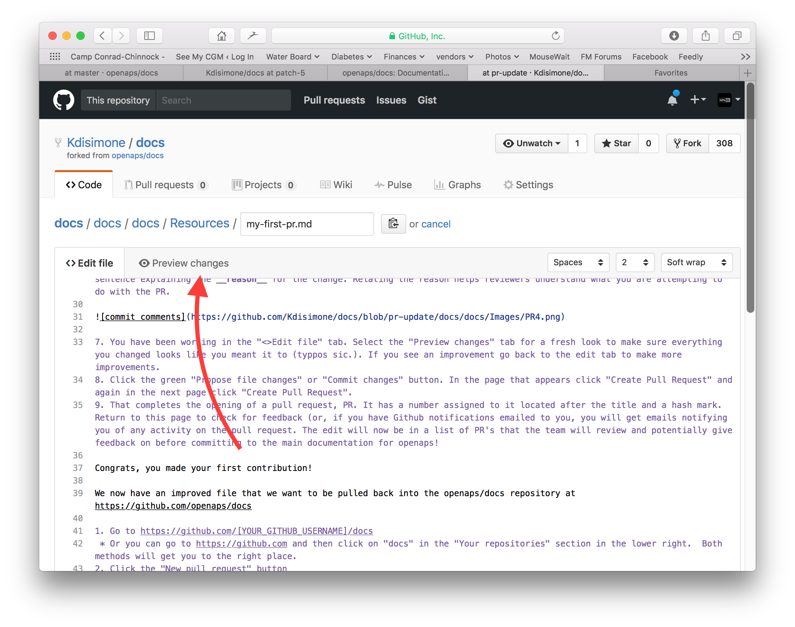

# Wie man die Dokumentation bearbeitet

**An dieser Stelle wird nur die Bearbeitung der englischen Dokumentation erläutert. Alle neuen Informationen müssen zuerst in Englisch eingegeben werden. Falls du diese in eine andere Sprache übersetzen willst (Danke dafür!), nutze bitte [crowdin](https://crowdin.com/project/androidapsdocs).**

Hinweise zum Formatieren von Texten (Überschriften, fett...) und zum Setzen von Links findest Du weiter unten auf dieser Seite im Bereich ["Code-Syntax"](make-a-PR-code-syntax).

## Allgemein

Bei Fragen, Feedback oder neuen Ideen für die Dokumentation erreichst Du das Docs team via [discord](https://discord.gg/4fQUWHZ4Mw). Einen "pull request" zu machen ist nicht schwierig, aber wir können Dir helfen, die Dokumentation zu bearbeiten.

Es kann sein, dass dir irgendwann vorgeschlagen wird, einen PR zu machen. PR, die Abkürzung für Pull-Request, ist eine Möglichkeit wie man Quellcode oder - wie in diesem Fall - Dokumentationen auf GitHub ergänzen oder ändern kann. Es ist eigentlich nicht allzu schwer und eine gute Möglichkeit, einen Beitrag zu leisten. Diese Dokumentation gibt es, weil Leute wie du PRs gemacht haben. Mach dir keine Sorgen einen Fehler zu machen oder irgendwie die falschen Dokumente zu bearbeiten. Es wird immer Korrektur gelesen, bevor Änderungen in die "finale" AndroidAPS Dokumentation integriert werden. Du kannst das Original nicht zerstören, wenn du beim PR etwas falsch machst. Die allgemeine Vorgehensweise ist:

* Mache Änderungen und Verbesserungen am Code oder der Dokumentation, indem du das bestehende Dokument veränderst.
* Vergewissere dich, dass die Änderungen gut aussehen.
* Füge Notizen hinzu, damit andere die Änderungen verstehen können.
* Erstelle einen Pull-Request, durch den die Administratoren aufgefordert werden deine Änderungen zu verwenden.
* Sie werden sich das anschauen und entweder (1) deine Änderungen übernehmen (2) deine Änderungen kommentieren oder (3) ein neues Dokument mit deinen Änderungen erstellen.

(Randbemerkung: Wenn Du ein visueller Lerner bist, gibt es [hier](https://youtu.be/4b6tsL0_kzg) ein YouTube Video, das den PR-Prozess darstellt.)

In unserem Beispiel nehmen wir nun eine Änderung an der AndroidAPS-Dokumentation vor. Dies muss nicht in einer Linux-Umgebung durchgeführt werden. Es kann auf jedem Windows-PC, Mac, etc. erfolgen. (jedem Computer mit Internet-Zugang).

1. Gehe zu https://github.com/openaps/AndroidAPSdocs und klicke auf "Fork" oben rechts, um deine eigene Kopie des Repositories (=Quell-Code) zu machen.


2. Wechsle zu einer beliebigen Seite und navigiere zu der Seite, die du bearbeiten möchtest. Klicke auf die Black-Box unten links in der Seite mit dem grünen Wort "v: newest" oder ähnliches. Es öffnet sich ein Pop-Up-Fenster. Klicke in diesem auf "edit", um in GitHub zu bearbeiten. 


     Oder du klickst auf den “Edit in Github”-Link in der oberen rechten Ecke und klickst dann auf das Bleistift-Symbol, das in der oberen Leiste der Seite erscheint, um diese zu editieren. 
    


3. Beide Optionen in Schritt 2 führen dazu, dass ein neuer Branch in DEINEM kopierten Repository erstellt wird, wo die Änderungen gespeichert werden sollen. Editiere die Datei.

Wir verwenden Markdown für die Dokumentation. Die Datei hat das Suffix ".md". Die Markdown-Spezifikation ist nicht fixiert und wir verwenden im Moment den myst_parser für unsere Markdown-Dateien. Achte auf den richtigen Syntax wie [unten](make-a-PR-code-syntax) beschrieben.


4. Du arbeitest im "<>Edit file" Reiter. Wechsle zum "Preview changes" Reiter, um auf die Vorschau einen Blick zu werfen, damit alles was du geändert hast so aussieht wie du es wolltest (Rechtschreibfehler prüfen). Wenn du etwas entdeckst, das ausgebessert werden muss, wechsle wieder zum edit Reiter, um die Ausbesserungen vorzunehmen. 



5. Wenn du mit deinen Änderungen fertig bist, scrolle zum Seitenende. In der Box am Seitenende solltest du deine Kommentare im Textfeld namens "Add an optional extended description..." einfügen. Der Standardtitel beinhaltet den Dateinamen. Versuche einen Satz dazu zu schreiben, **warum** du etwas geändert hast. Die Angabe des Grundes hilft den Admins zu verstehen, was du mit deinem PR bezweckst.


6. Klicke auf den grünen "Propose file changes" (Änderungen vorschlagen) oder "Commit changes" (Änderungen integrieren) Button. Auf der Seite, die dann erscheint, klicke auf "Create Pull Request" und auf der dann erscheinenden Seite klicke auf "Create Pull Request".


7. Das war der letzte Schritt zur Erstellung eines pull requests, PR. GitHub ordnet dem PR eine Nummer, die du nach dem Titel findest, zu und einen Hashtag. Rufe diese Seite wieder auf, um Feedback zu erhalten (oder du erhältst automatisch E-Mail Benachrichtigungen über Aktivitäten bei deinem PR, wenn du Github entsprechend konfiguriert hast). Die Änderung wird nun in einer Liste von PR's aufgeführt, die das Team überprüfen wird; es wird gegebenenfalls Rückmeldungen dazu geben, bevor die Änderung in die Hauptdokumentation für AndroidAPS einfließt! Wenn du den Fortschritt des PR überprüfen willst, kannst du auf das Logo mit der Glocke in der oberen rechten Ecke deines GitHub-Kontos klicken, wo du dann alle deine PRs siehst.


PS: dein Fork und Branch befinden sich nach wie vor auf deinem persönlichen GitHub Konto. Nachdem Du die Benachrichtigung erhalten hast, dass Dein PR integriert wurde, kannst Du Deinen Branch löschen, wenn Du damit fertig bist (der Benachrichtigungsbereich in Schritt 8 stellt Dir einen Link zur Verfügung, um den Branch zu löschen, wenn er geschlossen oder integriert wurde). Künftige Änderungen werden immer mit einer aktuellen Version des AndroidAPS Repositories beginnen, wenn Du diese Vorgehensweise verwendest. Wenn Du eine andere Methode verwendest, um einen PR zu starten (z.B. Du fängst mit einem lokalen Fork des Master Branches an), musst Du sicherstellen, dass Dein Repository aktuell ist, indem Du erst ein "compare" ausführst und damit alle Updates integrierst, die seit dem letzten Update Deines Forks stattgefunden haben. Da häufig vergessen wird, die eigenen Repositories auf dem aktuellen Stand zu halten, empfehlen wir, den PR Prozess wie oben beschrieben zu verwenden, bis Du dich mit der Ausführung von "compares" vertraut gemacht hast.

(make-a-PR-code-syntax)=

## Code-Syntax

Wir verwenden Markdown für die Dokumentation. Die Dateien haben die Endung "*.md".

(make-a-PR-image-size)=

### Bildgröße

Nutze bei der Verwendung von Bildern bitte angemessene Größen. Screenshot-Bilder sollten bis zu **1050 Pixel breit** sein.

### Textformatierung

* fett: `**Text**`
* kursiv: `*Text*`
* Überschrift 1: `# Überschrift`
* Überschrift 2: `## Überschrift`
* Überschrift 3: `### Überschrift`

### Nummerierte Liste

    1. erste
    1. zweite
    1. dritte
    

1. erste
2. zweite
3. dritte

### ungeordnete Liste

    - ein Element
    - ein anderes Element
    - und ein anderes Element
    

* ein Element
* eine andere HTML-Element.
* und ein anderes Element

### mehrstufige Liste

Um Listen in Listen einfügen, rückst Du die nächste Ebene mit 4 zusätzlichen Leerzeichen zur vorangegangenen Ebene nach rechts ein.

    1. erste
    1. zweite
    1. dritte
      1. ein Element
      1. ein anderes Element
      1. und ein anderes Element. vier
    1. fünf
    1. sechs
    

1. erste
2. zweite
3. dritte 1. ein Element 1. ein anderes Element 1. und ein anderes Element
4. vier
5. fünf
6. sechs

### Bilder

* Bilder: ``

### Links

* externe Links: `[Linktext](www.url.tld)`
* Interne Links zu .md Seiten: `[Linktext](.../folder/file.md)`
* Interner Link zu .rst Seiten: `[Linktext] (.../folder/file.rst)`

### Interne Links

Wenn du einen internen Link in die AndroidAPS Dokumentation einfügen willst, benutze bitte nur **relative Links**. Nur dann funktioniert der Link auch in anderen Sprachen (Tschechisch, Russisch...).

* `[text](/Usage/Test.md)` legt einen Hyperlink fest, der aus dem aktuellen Verzeichnis auf das Unterverzeichnis /Usage verweist. Die Erweiterung der Zieldatei muss .md oder .rst sein (nicht .html)
* `[text](./Usage/Test.md)` legt einen Hyperlink fest, der auf ein Verzeichnis unterhalb des aktuellen Verzeichnisses beginnt und dort auf das Verzeichnis /Usage verweist. Die Endung der Zieldatei muss .md sein.
* Um den Link auf einen **Anker** (d.h. eine Überschrift) zu setzen, muss die Dateierweiterung weggelassen werden. 
  * `[text](../Usage/Test.md#anchor)`

### Notizen

    ```{admonition} Freundliche Notiz
    :class: note
    
    Dies ist eine Notiz.
    

    <br />```{admonition} Freundliche Notiz
    :class: note
    
    Dies ist eine Notiz.
    

### Warnungen

    ```{admonition} Starke Warnung
    :class: warning
    
    Dies ist eine Warnung.
    

    <br />```{admonition} Starke Warnung
    :class: warning
    
    Dies ist eine Warnung.
    

## Mehrere Bilder zum Wiki hinzufügen

Wenn Du vor hast viele Änderungen zu machen, die auch das Hinzufügen von Bildern beinhalten, um Teile der Dokumentation zu illustrieren (Danke!), könnte dir folgende Möglichkeit helfen:

* Wenn Du Screenshots speicherst, benenne diese mit einem beschreibenden Namen - aber vermeide Leerzeichen, da dies GitHubs Syntax verwirrt. Verwende stattdessen Unterstriche. Z.B. Example_batch_images_upload.png statt "Example batch images upload.png". 
* Bitte verwende angemessene Größen. Screenshot-Bilder sollten bis zu **1050 Pixel breit** sein.
* Mehrere Bilder kannst Du auf diese Art leicht hochladen:
  
  1. Navigiere zu dem Bilder Verzeichnis (https://github.com/openaps/AndroidAPSdocs/tree/master/docs/EN/images) - aber vergewissere dich, dass Du Dich in Deinem Fork / Deiner Kopie des Bilderverzeichnisses befindest (ersetze "openaps" in der URL mit Deinem GitHub Benutzernamen).
  
  2. Klicke in die rechte obere Ecke wo "Upload files" steht
  
  3. Ziehe deine Bilder auf den Bildschirm
  
  4. Führe einen "Commit" auf Deinen Branch aus
  
  5. Nun kannst Du die URL / den relativen Pfad jedes Bildes ermitteln, um darauf zu referenzieren, wenn Du das Bild in der Dokumentation verwenden willst.
  
  6. Beispiele, wie man Bilder hinzufügt, kannst Du Dir im "rohen" Code von Seiten anschauen, in denen schon erfolgreich Bilder eingefügt wurden. Stelle sicher, dass Du den [richtigen Code-Syntax](./make-a-PR.html#code-syntax) für den aktuellen Seitentyp (.md oder .rst) verwendest. Hauptsächlich geht es darum, dass Du dem Linktext einen relativen Pfad wie folgt beschrieben zuweist:
    
    * Für .md Seiten: `` (Dieser Code entspricht genau dem, um das untenstehende Bild einzubetten.)
    * Für .rst Seiten: `.. image:: ../images/Example_batch_images_upload.png`  
      `:alt: Beispiel für das Hochladen von Bildern im Batch`


7. Nachdem Du Bilder hinzugefügt oder Veränderungen vorgenommen hast, kannst Du einen PR auf den master Branch von AndroidAPSdocs machen.