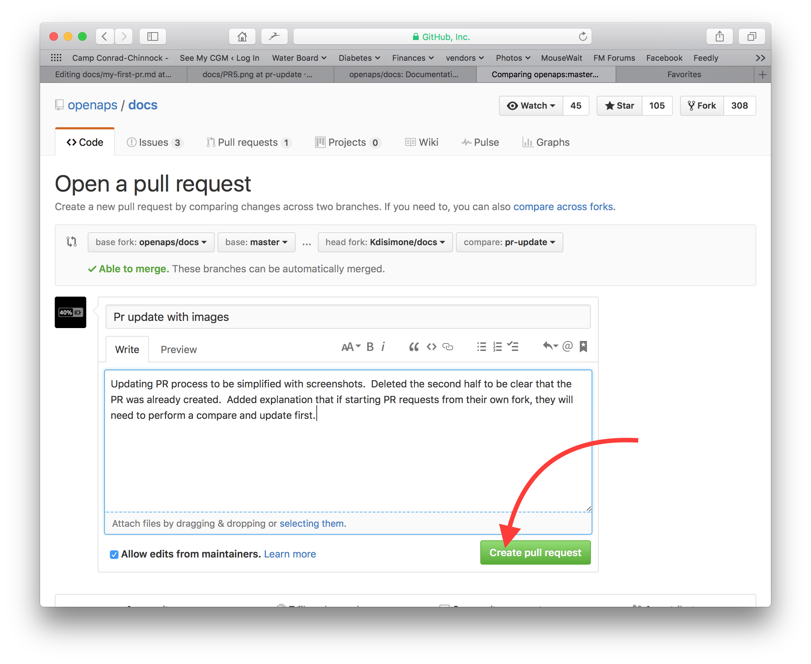
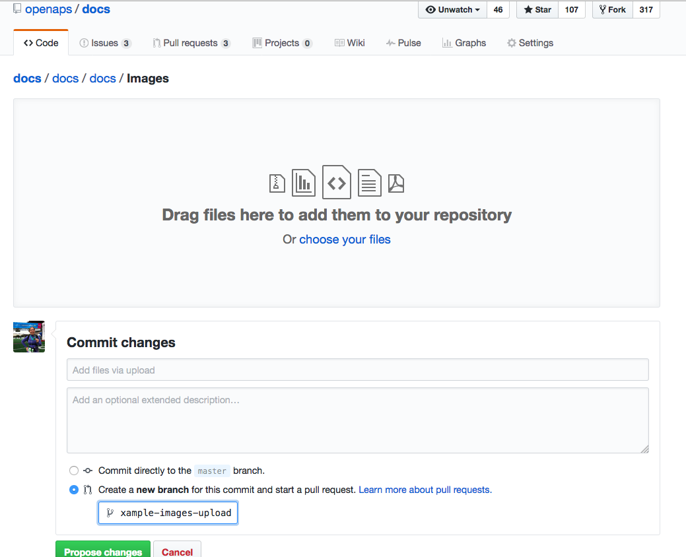

# Wie man den ersten PR (Pull Request) macht

`An dieser Stelle wird nur die Bearbeitung der englischen Dokumentation erläutert. 
Falls Du in eine andere Sprache übersetzen willst (Danke!) benutze bitte [crowdin](https://wikitranslations.androidaps.org).`

`For any questions, feedback or new ideas you can contact the documentation team via email (wiki@androidaps.org). 
Doing a PR isn't difficult, but we can help you editing the documentation.`

At some point it will be suggested that you make a PR. PR is short for pull request, and it is a way of adding or editing information stored in GitHub. It's actually not too hard to do one and it is a great way to contribute. This documentation is here because people like you made PRs. Don't worry about making a mistake or somehow editing the wrong documents. There is always a review process before changes are merged into the "formal" AndroidAPS documentation repository. You can't mess up the originals through any accidents in the PR process. The general process is:

* Mache Änderungen und Verbesserungen am Code oder der Dokumentation, indem du das bestehende Dokument veränderst.
* Vergewissere dich, dass die Änderungen gut aussehen.
* Füge Notizen hinzu, damit andere die Änderungen verstehen können.
* Erstelle einen Pull-Request, durch den die Administratoren aufgefordert werden deine Änderungen zu verwenden.
* Sie werden sich das anschauen und entweder (1) deine Änderungen übernehmen (2) deine Änderungen kommentieren oder (3) ein neues Dokument mit deinen Änderungen erstellen.

(Side note: If you are a visual learner, there is a YouTube video [here](https://youtu.be/4b6tsL0_kzg) showing the PR workflow.)

For our example we are going to make an edit to AndroidAPSdocs. This does NOT need to be done in the linux environment on your rig. This can be done on any Windows PC, Mac, etc. (any computer with Internet access).

1. Gehe zu https://github.com/openaps/AndroidAPSdocs und klicke auf "Fork" oben rechts, um deine eigene Kopie des Repositories (=Quell-Code) zu machen. 
2. Gehe zu http://androidaps.readthedocs.io/en/latest/Getting-Started/Safety-first.html oder ähnliches und navigiere zu der Seite, die du bearbeiten möchtest. Klicke auf die Black-Box unten links in der Seite mit dem grünen Wort "v: newest" oder ähnliches. In dem Fenster das nun erscheint klicke auf das Wort "edit", um es in Github zu editieren.   
     Oder du klickst auf den "Edit in Github"-Link in der oberen rechten Ecke und klickst dann auf das Bleistift-Symbol das in der oberen Leiste der Seite erscheint, um diese zu editieren. 
3. Beide Optionen in Schritt 2 führen dazu, dass ein neuer Branch in DEINEM kopierten Repository erstellt wird, wo die Änderungen gespeichert werden sollen. Editiere die Datei. 
4. Du arbeitest im "<>Edit file" Reiter. Wechsle zum "Preview changes" Reiter, um auf die Vorschau einen Blick zu werfen, damit alles was du geändert hast so aussieht wie du es wolltest (Rechtschreibfehler prüfen). Wenn du etwas entdeckst, das ausgebessert werden muss, wechsle wieder zum edit Reiter, um die Ausbesserungen vorzunehmen. 
5. Wenn du mit deinen Änderungen fertig bist, scrolle zum Seitenende. In der Box am Seitende solltest du deine Kommentare im Textfeld namens "Add an optional extended description..." einfügen. Der Standardtitel beinhaltet den Dateinamen. Versuche einen Satz dazu zu schreiben, **warum** du etwas geändert hast. Die Angabe des Grundes hilft den Admins zu verstehen, was du mit deinem PR bezweckst. 
6. Klicke auf den grünen "Propose file changes" (Änderungen vorschlagen) oder "Commit changes" (Änderungen integrieren) Button. Auf der Seite, die dann erscheint, klicke auf "Create Pull Request" und auf der dann erscheinenden Seite klicke auf "Create Pull Request". 
7. Das war der letzte Schritt zur Erstellung eines pull requests, PR. GitHub ordnet dem PR eine Nummer, die du nach dem Titel findest, zu und einen Hashtag. Rufe diese Seite wieder auf, um Feedback zu erhalten (oder du erhältst automatisch E-Mail Benachrichtigungen über Aktivitäten bei deinem PR, wenn du Github entsprechend konfiguriert hast). Die Änderung wird nun in einer Liste von PR's aufgeführt, die das Team überprüfen wird; es wird gegebenenfalls Rückmeldungen dazu geben, bevor die Änderung in die Hauptdokumentation für AndroidAPS einfliesst! Wenn du den Fortschritt des PR überprüfen willst, kannst du auf das Logo mit der Glocke in der oberen rechten Ecke deines GitHub-Kontos klicken, wo du dann alle deine PRs siehst. 

Congrats, you made your first contribution!

PS, your fork and branch will still be sitting on your own personal GitHub account. After you get a notification that your PR has been merged, you can delete your branch if you are done with it (Step 8's notification area will provide a link to delete the branch once it has been closed or merged). For future edits, if you follow this procedure the edits will always start with an updated version of the AndroidAPSdocs repositories. If you choose to use another method to start a PR request (e.g., editing starting from your forked repo's master branch as the starting point), you will need to ensure your repo is up-to-date by performing a "compare" first and merging in any updates that have happened since you last updated your fork. Since people tend to forget to update their repos, we recommend using the PR process outlined above until you get familiar with performing "compares".

### Tips für Fortgeschrittene um interne Links hinzuzufügen

If you want to set an internal link within the AndroidAPS documentation, please only use **relative links**. Only this will make the link work in the other languages as well.

In files with **.md** ending:

* `[text](../Usage/Test.md)` legt einen Hyperlink fest, der auf ein Verzeichnis oberhalb des aktuellen Verzeichnisses beginnt und dort auf das Verzeichnis /Usage verweist. Die Erweiterung der Zieldatei muss .md oder .rst sein (nicht .html)
* `[text](/Usage/Test.md)` legt einen Hyperlink fest, der aus dem aktuellen Verzeichnis auf das Unterverzeichnis /Usage verweist. Die Erweiterung der Zieldatei muss .md oder .rst sein (nicht .html)

To set the link to an **anchor** (i.e. a headline) you have to omit the file extension

* `[text](../Usage/Test#anchor)` statt `[text](../Usage/Test.md#anchor)`

In files with **.rst** ending:

* `Text <../Usage/Test.md>` legt einen Hyperlink fest, der auf ein Verzeichnis oberhalb des aktuellen Verzeichnisses beginnt und dort auf das Verzeichnis /Usage verweist. Die Erweiterung der Zieldatei muss .md oder .rst sein (nicht .html)
* `Text <./Usage/Test.md>` legt einen Hyperlink fest, der aus dem aktuellen Verzeichnis auf das Unterverzeichnis /Usage verweist. Die Erweiterung der Zieldatei muss .md oder .rst sein (nicht .html)

### Tipps für das Hinzufügen mehrerer Bilder zur Dokumentation für Fortgeschrittene

If you are planning to make a lot of edits, including adding images to help illustrate parts of the documentation (thank you!), you may want to take the following approach:

* Wenn du Screenshots speicherst, benenne diese mit einem beschreibenden Namen - aber vermeide Leerzeichen, da dies GitHubs Syntax verwirrt. Verwende stattdessen Unterstriche. Z.B. Example_batch_images_upload.png statt "Example batch images upload.png".

* Mehrere Bilder kannst du auf diese Art leicht hochladen:
    
    1. Navigiere zu dem Bilder Verzeichnis (https://github.com/openaps/AndroidAPSdocs/tree/master/docs/EN/images) - aber vergewissere dich, dass du dich in deinem Fork / deiner Kopie des Bilderverzeichnisses befindest (ersetze "openaps" in der URL mit deinem GitHub Benutzernamen).
    
    2. Klicke in die rechte obere Ecke wo "Upload files" steht
    
    3. Ziehe deine Bilder auf den Bildschirm
    
    4. Führe einen "Commit" auf deinen Branch aus
    
    5. Nun kannst Du die URL / den relativen Pfad jedes Bildes ermitteln, um darauf zu referenzieren, wenn Du das Bild in der Dokumentation verwenden willst.
    
    6. Beispiele, wie man Bilder hinzufügt, kannst du dir im "rohen" Code von Seiten anschauen, in denen schon erfolgreich Bilder eingefügt wurden. Es ist wichtig, eine reine Textbeschreibung zu haben, der ein Link mit einem relativen Pfad zu dem Bild folgt. Etwa so: ``
    
    (Dieser Code zeigt exakt, wie das Bild weiter unten eingefügt wurde, um angezeigt zu werden.)

7. Nachdem du Bilder hinzugefügt oder Veränderungen vorgenommen hast, kannst du einen PR auf das master branch von AndroidAPSdocs machen.