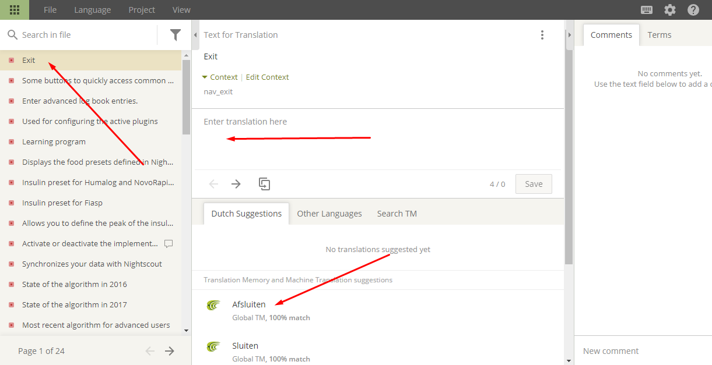
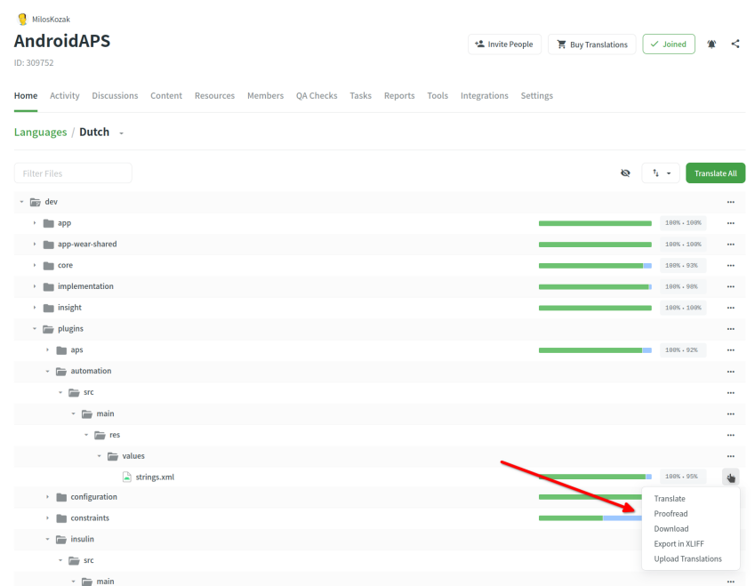

# Wie man Zeichenketten für die AndroidAPS-App oder die Dokumentation übersetzt

* Für die Zeichenketten, die in der App verwendet werden, gehe zu <https://crowdin.com/project/androidaps> und melden Dich mit Deinem GitHub Konto an
* Für die Dokumentation besuche bitte <https://crowdin.com/project/androidapsdocs> und melde Dich mit Deinem GitHub Account an

* Sende Deinen Beitrittswunsch an das Docs-Team. Klicke dazu auf die Fahne der gewünschten Sprache und dann auf der nächsten Seite rechts oben auf den Button "Join". Gib die gewünschte(n) Sprach(n) an, ein paar Infos zu Dir und Deiner AAPS Erfahrung und auch ob Du als Übersetzter oder Lektor (nur Personen mit Übersetzungs- und längerer AAPS-Erfahrung ) unterstützen möchtest.

```{admonition} Time for Approval :class: note

Die Genehmigung ist ein manueller Schritt. Als gemeinnützige Organisation stellen wir keine SLAs zur Verfügung, aber im Allgemeinen erfolgt die Genehmigung in < 1 Tag. Falls nicht, kontaktiere bitte das Doc Team über Facebook oder Discord.

    <br />* When we approve you, click the flag
       
    
    ## Translation of the app
    
    (translations-translate-strings-for-androidaps-app)=
    ### Translate strings for AndroidAPS app
    
    * If you have no preference for strings you translate just select the "Translate All" button to start. It will show you the strings which need translation.
    
       
    
    * If you want to translate an individual file please search for the file via search dialog or tree structure and click on the filename to start the translation work on strings in that file.
    
       
    
    * Translate sentences on left side by adding new translated text or use & edit suggestion 
    
       
    
    
    ### Proofread strings for AndroidAPS app
    
    * Proofreaders start by selecting "Proofread" when starting from the language home screen.
    
        
    
    
      and approve translated texts 
    
       
    
    When a proofreader approves a translation it will be added to the next version of AndroidAPS.
    
    (translations-translation-of-the-documentation)=
    ## Translation of the documentation
    
    * Click the name of the docs page you want to translate
    
    
    
    
    * Translate sentences by sentence
    
        1. The yellow text is the text you are working at the moment.
    
        1. The green text is already translated. You don't need to do this again.
    
        1. The red text is the remaining text which have to be translated.
    
        1. This is the source text you are working on at the moment
    
        1. This is the translation you are preparing. You can copy the text from above or select one of the suggestions below.
    
        1. These are the suggestion for a translation. Especially you can see how much Crowdin rates this as a fit or if it was already just in the past and come up through text rearrangements but not content change.
        1. Press the "save" button to save a proposal for the translation. It will then promoted to a proofreader for final check.
    
    
    
    * A translated page will not be published in docs before 
    
        1. the translation is proofread
    
        1. the sync run between Crowdin and Github finished (once an hour) which creates an PR for Github.
    
        1. the PR in Github was approved.
    
    In general this needs 1 - 3 days but might during holiday take a little bit longer.
    
    ### Translating links
    
    ```{admonition} Links are not translated anymore
    :class: note
    
    Links are not translated anymore. In the past we had a topic here but this is gone as through migraton to Markdown and the myst_parser we explicitly create labels in the english text and propagate these labels under the hood to the languages.
    
    

You are translating the text which represents the link. Please you have to be carefull **not** to remove the link which is represented by a pair of `<0></0>` tags or if their are more in one paragraph other numbers.

It's the proofreaders job to have a special look on this!

### Proofreading

* Proofreaders have to switch to Proofreading mode
    
    
    
    and approve translated texts
    
    

* When a proofreader approves a translation it will be added to the next docs build which happens in no fixed schedule on demand but around once a week except during hollidays. To speed up the process you can inform docs team about new translations.