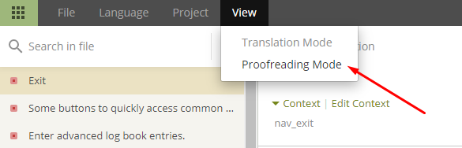

# App oder Dokumentation übersetzen

* Gehe zu <https://translations.androidaps.org> oder <https://wikitranslations.androidaps.org> und melde Dich mit Deinem Github Konto an.

* Sende Deinen Beitrittswunsch an das Wiki-Team. Klicke dazu auf die Fahne der gewünschten Sprache und dann auf der nächsten Seite rechts oben auf den Button "Join". Gib die gewünschte(n) Sprach(n) an, ein paar Infos zu Dir und Deiner AAPS Erfahrung und auch ob Du als Übersetzter oder Lektor (nur Personen mit Übersetzungs- und längerer AAPS-Erfahrung ) unterstützen möchtest.

* Wenn wir dich freigeschalten haben, klicke auf die entsprechende Landesflagge.

## Texte für die AndroidAPS App übersetzen

* Klicke auf strings.xml
    
    

* Übersetze Sätze auf der linken Seite, indem du übersetzten Text hinzufügst oder verwende & edit suggestion
    
    

* Lektoren müssen zum Proofreading-Modus wechseln
    
    
    
    und übersetzte Texte freigeben.
    
    

Wenn ein Lektor eine Übersetzung freigibt, wird sie in der nächsten Version von AndroidAPS hinzugefügt. Am Anfang wäre es gut, auch die vorhandenen Übersetzungen, die noch nicht genehmigt sind, durchzuschauen und zu korrigieren oder zu genehmigen, wenn sie korrekt sind.

## Wiki-Seiten übersetzen

* Klicke auf den Namen der Wiki-Seite, die Du übersetzen willst.
    
    

* Übersetze Satz für Satz:
    
    1 Noch nicht übersetzter Text wird auf der linken Seite mit rotem Hintergrund angezeigt.
    
    2 Du kannst einen Übersetzungsvorschlag in das Bearbeitungsfeld kopieren, indem Du darauf klickst.
    
    3 Passe den Vorschlag ggf. an oder übersetze selbst.
    
    4 Klicke auf 'safe'.
    
    

* Lektoren müssen zum Proofreading-Modus wechseln
    
    
    
    und übersetzte Texte freigeben.
    
    

Wenn ein Lektor eine Übersetzung freigibt, wird sie in das nächste 'Wiki Build' aufgenommen. Um den Prozess zu beschleunigen, kannst Du das Wiki-Team über neue Übersetzungen informieren.