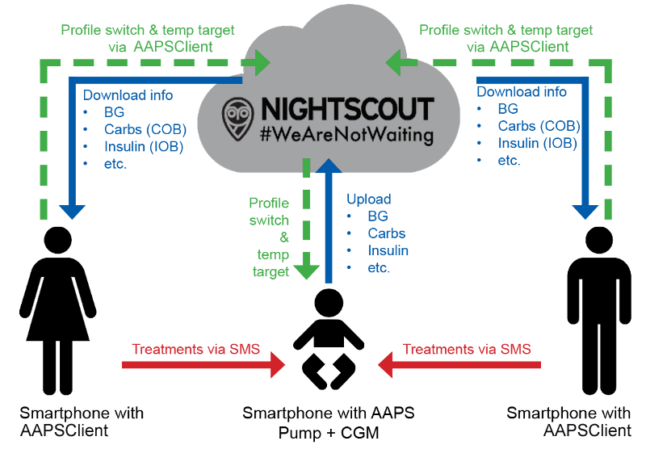

Remote monitoring
**************************************************

  
AndroidAPS offer several options for remote monitoring of children and also allows to send remote commands. Of course you can also use remote monitoring to follow your partner or friend.

Functions
==================================================
* Kid's pump is controlled by kid's phone using AndroidAPS.
* Parents can remotely follow seeing all relevant data such as glucose levels, carbs on board, insulin on board etc. using **NSClient app** on their phone. Settings must be the same in AndroidAPS and NSClient.
* Parents can be alarmed by using **xDrip+ app in follower mode** on their phone.
* Remote control of AndroidAPS using `SMS Commands <../Children/SMS-Commands.html>`_ secured by two-factor authentication.
* Remote profile switch and temp targets through NSClient app.

Tools and apps for remote monitoring
--------------------------------------------------
* `Nightscout <http://www.nightscout.info/>`_ in web browser (mainly data display)
*	NSClient app
*	Dexcom follow if you are using original Dexcom app (BG values only)
*	`xDrip+ <../Configuration/xdrip.html>`_ in follower mode (mainly BG values and **alarms**)
*	`Sugarmate <https://sugarmate.io/>`_ or `Spike <https://spike-app.com/>`_ on iOS (mainly BG values and **alarms**)

Things to consider
==================================================
* Setting the correct `treatment factors <../Getting-Started/FAQ.html#how-to-begin>`_ (basal rate, DIA, ISF...) is difficult for kids, especially when growth hormones are involved. 
* Settings must be the same in AndroidAPS and NSClient.
* Consider time gap between master and follower due to time for up- and download as well as the fact that AAPS master phone will only upload after loop run.
* So take your time to set those correctly and test them in real life with your kid next to you before starting remote monitoring and remote treatment. School holidays might be a good time for that.
* What is your emergency plan when remote control does not work (i.e. network problems)?
* Remote monitoring and treatment can be really helpful in kinder garden and elementary school. But make sure the teachers and educators are aware of your kid's treatment plan. Examples for such care plans can be found in the `files section of AndroidAPS users <https://www.facebook.com/groups/AndroidAPSUsers/files/>`_ on Facebook.
