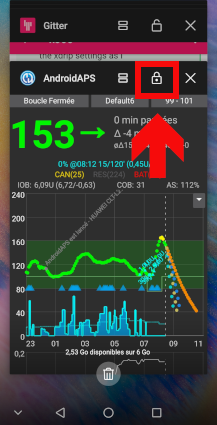

# Πώς να διαμορφώσετε ένα τηλέφωνο Huawei

Υπάρχουν διάφορες επιλογές, μερικές συγκεκριμένες για Android, μερικές συγκεκριμένες για Huawei:

* Add AAPS and xdrip+ to apps list which ignore battery optimisations:
  
  * Ρυθμίσεις / Εφαρμογές / Ρυθμίσεις / Ειδικές εξουσιοδοτήσεις / Παράβλεψη βελτιστοποίησης μπαταρίας / Επιλέξτε "Όλες οι εφαρμογές" / Ρυθμίστε την εφαρμογή σε επιτρεπτή
    
    

* Ρύθμιση των επιλογών της μπαταρίας:
  
  * Ρυθμίσεις / Εφαρμογές / Επιλογή AndroidAPS / xdrip + / Κάτω από την μπαταρία / Εκκίνηση εφαρμογής
    
    * Βεβαιωθείτε ότι έχετε καταργήσει την "αυτόματη διαχείριση"
    * Επιτρέψτε:
      
      * Αυτόματη εκκίνηση
      * Δευτερεύων εκκίνηση( μπορεί να ξεκινήσει από άλλες εφαρμογές)
      * Εκτέλεση στο υπόβαθρου
        
        

* Κλείδωσε εφαρμογή
  
  * Μεταβείτε στην τελευταία λίστα εφαρμογής και επιλέξτε το εικονίδιο κλειδώματος
    
    

For xDrip+, you must enable persistent notifications (within xDrip+ app):

* Settings / less common settings / other misc options / Run Collector in foreground
  
  

Ανάλογα με την έκδοση Android, αυτές οι ρυθμίσεις είναι κάπου αλλού. Αυτές οι εξηγήσεις αφορούν το Android 8.1.