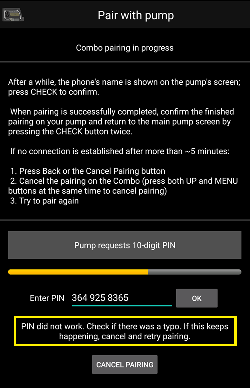

- - -
orphan: true
- - -

# Αντλία Accu Chek Combo

**Αυτό το λογισμικό αποτελεί μέρος μιας DIY (Φτιάξε το Μόνος Σου) λύσης και δεν είναι ένα προϊόν, αλλά απαιτεί από ΕΣΑΣ να διαβάσετε, να μάθετε και να κατανοήσετε το σύστημα συμπεριλαμβανομένου του τρόπου χρήσης του. Δεν είναι κάτι που αναλαμβάνει τη διαχείριση του διαβήτη σας για σας, αλλά σας επιτρέπει να βελτιώσετε το διαβήτη σας και την ποιότητα της ζωής σας αν είστε διατεθειμένοι να αφιερώσετε το χρόνο που χρειάζεται. Μη βιαστείτε, αλλά αντίθετα δώστε στον εαυτό σας χρόνο για να μάθετε. Εσείς και μόνο είστε υπεύθυνοι για οτιδήποτε κάνετε με αυτό.**

## Απαιτήσεις υλικού και λογισμικού

* A Roche Accu-Chek Combo (any firmware, they all work).
* Μια συσκευή Smartpix ή Realtyme μαζί με το λογισμικό 360 Configuration Software για τη ρύθμιση της αντλίας. (Η Roche αποστέλλει τις συσκευές Smartpix και το λογισμικό για τη ρύθμιση δωρεάν στους πελάτες της κατόπιν αιτήματος.)
* A compatible phone. Android 9 (Pie) or newer is a must. If using LineageOS, the minimum supported version is 16.1. See [release notes](#maintenance-android-version-aaps-version) for details.
* The AndroidAPS app installed on your phone.

Some phones may work better than others, depending on their quality of Bluetooth support and whether or not they have additional, very aggressive power saving logic. A list of phones can be found in the [AAPS Phones](#Phones-list-of-tested-phones) document. Παρακαλώ προσέξτε ότι η λίστα δεν είναι ολοκληρωμένη και έχει φτιαχτεί από την προσωπική εμπειρία άλλων χρηστών. Σας ενθαρρύνουμε επίσης να εισαγάγετε και εσείς την εμπειρία σας και, συνεπώς, να βοηθήσετε άλλους (αυτά τα προγράμματα προχωρούν με τη συνδρομή όλων).

(combov2-before-you-begin)=
## Before you begin

**SAFETY FIRST** - do not attempt this process in an environment where you cannot recover from an error. Keep your Smartpix / Realtyme device handy, along with the 360 Configuration Software. Plan on spending about an hour for setting everything up and checking that everything is working properly.

Be aware of the following limitations:

* Extended bolus and multiwave bolus are currently not supported (you can use [Extended Carbs](../DailyLifeWithAaps/ExtendedCarbs.md) instead).
* Only one basal profile (the first one) is supported.
* The loop is disabled if the currently active profile on the pump isn't profile no. 1. This continues until profile no. 1 is made the active one; when that is done, the next time AAPS connects (either on its own after a while or because the user presses the Refresh button in the combov2 user interface), it will notice that profile no. 1 is the current one, and enable the loop again.
* If the loop requests a running TBR to be cancelled, the Combo will set a TBR of 90% or 110% for 15 minutes instead. This is because actually cancelling a TBR causes an alert on the pump which causes a lot of vibrations, and these vibrations cannot be disabled.
* Η σταθερότητα της σύνδεσης bluetooth διαφέρει ανάλογα με το τηλέφωνο, προκαλώντας συναγερμούς "μην εύρεση αντλίας", όταν δεν υπάρχει πλέον σύνδεση με την αντλία. Εάν εμφανιστεί αυτό το σφάλμα, βεβαιωθείτε ότι το Bluetooth είναι ενεργοποιημένο, πατήστε το κουμπί Ανανέωση στην καρτέλα Combo για να δείτε αν αυτό προκλήθηκε από ένα ενδιάμεσο θέμα και αν εξακολουθεί να μην έχει δημιουργηθεί σύνδεση, επανεκκινήσετε το τηλέφωνο και συνήθως το ζήτημα διορθώνεται.
* There is another issue were a restart doesn't help but a button on the pump must be pressed (which resets the pump's Bluetooth stack), before the pump accepts connections from the phone again.
* Η ρύθμιση ενός TBR στην αντλία πρέπει να αποφεύγεται, αφού το κύκλωμα αναλαμβάνει τον έλεγχο των TBRs. Η ανίχνευση ενός νέου TBR στην αντλία μπορεί να διαρκέσει έως και 20 λεπτά και η επίδραση του TBR θα ληφθεί υπόψη μόνο από τη στιγμή που ανιχνεύεται, οπότε στη χειρότερη περίπτωση μπορεί να υπάρχουν 20 λεπτά του TBR που δεν φαίνονται στην IOB.

If you have been using the old Combo driver that depends on the separate Ruffy app, and want to move to this new one, note that the pairing has to be done again - Ruffy and the new Combo driver are not able to share pairing information. Also, make sure that Ruffy is _not_ running. If in doubt, long-press the Ruffy app icon to bring up a context menu. In that menu, press on "App Info". In the UI that just opened up, press "Force stop". That way, it is ensured that an active Ruffy instance cannot interfere with the new driver.

Also, if you are migrating from the old driver, be aware that the new driver communicates a bolus command in an entirely different way to the Combo that is much faster, so don't be surprised when a bolus starts immediately regardless of the dosage. Furthermore, the general suggestions, tips and tricks etc. about dealing with Ruffy pairing and connection problems do not apply here, since this is an entirely new driver that shares no code with the old one.

This new driver is currently written to support the following languages on the Combo. (This is unrelated to the language in AAPS - it is the language shown on the Combo's LCD itself.)

* Αγγλικά
* Spanish
* French
* Italian
* Ρώσικα
* Turkish
* Polish
* Τσέχικα
* Hungarian
* Slovak
* Romanian
* Croatian
* Ολλανδικά
* Ελληνικά
* Finnish
* Norwegian
* Portuguese
* Swedish
* Danish
* Γερμανικά
* Slovenian
* Λιθουανικά

**Important**: If your pump is set to a language that is not part of this list, please contact the developers, and set the pump's language to one in this list. Otherwise, the driver won't work properly.

## Phone setup

It is very important to make sure that battery optimizations are turned off. AAPS already auto-detects when it is subject to these optimizations, and requests in its UI that these be turned off. But, on modern Android phones, Bluetooth _itself_ is an app (a system app). And, usually, that "Bluetooth app" is run _with battery optimizations on by default_. As a result, Bluetooth can refuse to respond when the phone aims to save power because it kills off the Bluetooth app. This means that in that Bluetooth system app's settings, battery optimizations must be turned off as well. Unfortunately, how one can find that Bluetooth system app differs between phones. In stock Android, go to Settings -> Apps -> See all N apps (N = the number of apps on your phone). Then, open the menu to the top right corner, tap on "Show system" or "Show system apps" or "All apps". Now, in the newly expanded list of apps, look for a "Bluetooth" app. Select it, and on its "App info" UI, tap on "Battery". There, disable battery optimizations (sometimes called "battery usage").

## Combo setup

* Configure the pump using the Accu-Chek 360 Configuration Software. Αν δεν έχετε το λογισμικό, παρακαλώ καλέστε την γραμμή υποστήριξης Accu-Check. Συνήθως στέλνουν στους εγγεγραμμένους χρήστες ένα CD με το "Λογισμικό Διαμόρφωσης Αντλίας 360" και μια συσκευή σύνδεσης SmartPix USB με υπέρυθρη σύνδεση (η συσκευή Realtyme λειτουργεί επίσης εάν το έχετε).

  - **Required settings** (marked green in screenshots):

     * Ορίστε/αφήστε τη διαμόρφωση του μενού ως "Standard", το οποίο θα αφήσει να εμφανίζονται μόνο τα υποστηριζόμενα μενού/ενέργειες στην αντλία και να αποκρύπτονται εκείνα τα οποία δεν υποστηρίζονται (εκτεταμένο/συνδυαστικό bolus, πολλαπλοί βασικοί ρυθμοί) που προκαλούν περιορισμό της λειτουργικότητας του κυκλώματος όταν χρησιμοποιούνται επειδή δεν είναι δυνατό να τρέξετε το κύκλωμα με ασφαλή τρόπο όταν χρησιμοποιούνται.
     * Verify the _Quick Info Text_ is set to "QUICK INFO" (without the quotes, found under _Insulin Pump Options_).
     * Set TBR _Maximum Adjustment_ to 500%
     * Disable _Signal End of Temporary Basal Rate_
     * Set TBR _Duration increment_ to 15 min
     * Ενεργοποιήστε το Bluetooth

  - **Recommended settings** (marked blue in screenshots)

     * Ορίστε το συναγερμό για χαμηλή αμπούλα ινσουλίνης σύμφωνα με τις προτιμήσεις σας
     * Ρυθμίστε το μέγιστο bolus που είναι κατάλληλο για τη θεραπεία σας για να προστατεύεστε από σφάλματα του λογισμικού
     * Ομοίως, ρυθμίστε τη μέγιστη διάρκεια του Προσωρινού Βασικού Ρυθμού (TBR) TBR για ασφάλεια. Επιτρέψτε τουλάχιστον 3 ώρες, αφού η επιλογή αποσύνδεσης της αντλίας για 3 ώρες ρυθμίζει ένα Προσωρινό Βασικό 0% για 3 ώρες.
     * Enable key lock on the pump to prevent bolusing from the pump, esp. when the pump was used before and quick bolusing was a habit.
     * Ορίστε χρονικό όριο οθόνης και χρονικό όριο μενού στο ελάχιστο των 5,5 και 5 αντίστοιχα. Αυτό επιτρέπει στο AAPS να επανέλθει πιο γρήγορα από καταστάσεις σφάλματος και να μειώσει τις δονήσεις που μπορεί να προκύψουν κατά τη διάρκεια τέτοιων σφαλμάτων

  

  

  

  

## Activating the driver and pairing it with the Combo

* Select the "Accu-Chek Combo" driver in [Config builder > Pump](../SettingUpAaps/ConfigBuilder.md). **Important**: There is the old driver, called "Accu-Chek Combo (Ruffy)", in that list as well. Do _not_ select that one.

  

* Tap the cog-wheel to open the driver settings.

* In the settings user interface, tap on the button 'Pair with pump' at the top of the screen. This opens the Combo pairing user interface. Follow the instructions shown on screen to start pairing. When Android asks for permission to make the phone visible to other Bluetooth devices, press "allow". Eventually, the Combo will show a custom 10-digit pairing PIN on its screen, and the driver will request it. Enter that PIN in the corresponding field.

  

  

  

  

  

* When the driver asks for the 10-digit PIN that is shown on the Combo, and the code is entered incorrectly, this is shown: 

* Once pairing is done, the pairing user interface is closed by pressing the OK button in the screen that states that pairing succeeded. After it is closed, you return to the driver settings user interface. The 'Pair with pump' button should now be greyed out and disabled.

  The Accu-Chek Combo tab looks like this after successfully pairing:

  

  if however there is no pairing with the Combo, the tab looks like this instead:

  

* To verify your setup (with the pump **disconnected** from any cannula to be safe!) use AAPS to set a TBR of 500% for 15 min and issue a bolus. Η αντλία θα πρέπει τώρα να έχει σε λειτουργία το TBR και το bolus στο ιστορικό. Το AAPS θα πρέπει επίσης να δείχνει το ενεργό TBR και το bolus που χορηγήθηκε.

* On the Combo, it is recommended to enable the key lock to prevent bolusing from the pump, esp. when the pump was used before and using the "quick bolus" feature was a habit.

## Notes about pairing

The Accu-Chek Combo was developed before Bluetooth 4.0 was released, and just one year after the very first Android version was released. This is why its way of pairing with other devices is not 100% compatible with how it is done in Android today. To fully overcome this, AAPS would need system level permissions, which are only available for system apps. These are installed by the phone makers into the phone - users cannot install system apps.

The consequence of this is that pairing will never be 100% without problems, though it is greatly improved in this new driver. In particular, during pairing, Android's Bluetooth PIN dialog can briefly show up and automatically go away. But sometimes, it stays on screen, and asks for a 4-digit PIN. (This is not to be confused with the 10-digit Combo pairing PIN.) Do not enter anything, just press cancel. If pairing does not continue, follow the instructions on screen to retry the pairing attempt.

(combov2-tab-contents)=
## Accu-Chek Combo tab contents

The tab shows the following information when a pump was paired (items are listed from top to bottom):

1. _Driver state_: The driver can be in one of the following states:
   - "Disconnected" : There is no Bluetooth connection; the driver is in this state most of the time, and only connects to the pump when needed - this saves power
   - "Connecting"
   - "Checking pump" : the pump is connected, but the driver is currently performing safety checks to ensure that everything is OK and up to date
   - "Ready" : the driver is ready to accept commands from AAPS
   - "Suspended" : the pump is suspended (shown as "stopped" in the Combo)
   - "Executing command" : an AAPS command is being executed
   - "Error" : an error occurred; the connection was terminated, any ongoing command was aborted
2. _Last connection_: How many minutes ago did the driver successfully connect to the Combo; if this goes beyond 30 minutes, this item is shown with a red color
3. _Current activity_: Additional detail about what the pump is currently doing; this is also where a thin progress bar can show a command's execution progress, like setting a basal profile
4. _Battery_: Battery level; the Combo only indicates "full", "low", "empty" battery, and does not offer anything more accurate (like a percentage), so only these three levels are shown here
5. _Reservoir_: How many IU are currently in the Combo's reservoir
6. _Last bolus_: How many minutes ago the last bolus was delivered; if none was delivered yet after AAPS was started, this is empty
7. _Temp basal_: Details about the currently active temporary basal; if none is currently active, this is empty
8. _Base basal rate_: Currently active base basal rate ("base" means the basal rate without any active TBR influencing the basal rate factor)
9. _Serial number_: Combo serial number as indicated by the pump (this corresponds to the serial number shown on the back of the Combo)
10. _Bluetooth address_: The Combo's 6-byte Bluetooth address, shown in the `XX:XX:XX:XX:XX:XX` format

The Combo can be operated through Bluetooth in the _remote-terminal_ mode or in the _command_ mode. The remote-terminal mode corresponds to the "remote control mode" on the Combo's meter, which mimics the pump's LCD and four buttons. Some commands have to be performed in this mode by the driver, since they have no counterpart in the command mode. That latter mode is much faster, but, as said, limited in scope. When the remote-terminal mode is active, the current remote-terminal screen is shown in the field that is located just above the Combo drawing at the bottom. When the driver switches to the command mode however, that field is left blank.

(The user does not influence this; the driver fully decides on its own what mode to use. This is merely a note for users to know why sometimes they can see Combo frames in that field.)

At the very bottom, there is the "Refresh" button. This triggers an immediate pump status update. It also is used to let AAPS know that a previously discovered error is now fixed and that AAPS can check again that everything is OK (more on that below in [the section about alerts](#combov2-alerts)).

## Προτιμήσεις

These preferences are available for the combo driver (items are listed from top to bottom):

1. _Pair with pump_: This is a button that can be pressed to pair with a Combo. It is disabled if a pump is already paired.
2. _Unpair pump_: Unpairs a paired Combo; the polar opposite of item no. 1. It is disabled if no pump is paired.
3. _Discovery duration (in seconds)_: When pairing, the drivers makes the phone discoverable by the pump. This controls how long that discoverability lasts. By default, the maximum (300 seconds = 5 minutes) is selected. Android does not allow for discoverability to last indefinitely, so a duration has to be chosen.
4. _Autodetect and automatically enter insulin reservoir change_: If enabled, the "reservoir change" action that is normally done by the user through the "prime/fill" button in the Action tab. This is explained [in further detail below](#combov2-autodetections).
5. _Autodetect and automatically enter battery change_: If enabled, the "battery change" action that is normally done by the user through the "pump battery change" button in the Action tab. This is explained [in further detail below](#combov2-autodetections).
6. _Enable verbose Combo logging_: This greatly expands the amount of logging done by the driver. **CAUTION**: Do not enable this unless asked to by a developer. Otherwise, this can add a lot of noise to AndroidAPS logs and lessen their usefulness.

Most users only ever use the top two items, the _Pair with pump_ and _Unpair pump_ buttons.

(combov2-autodetections)=
## Autodetecting and automatically entering battery and reservoir changes

The driver is capable of detecting battery and reservoir changes by keeping track of the battery and reservoir levels. If the battery level was reported by the Combo as low the last time the pump status was updated, and now, during the new pump status update, the battery level shows up as normal, then the driver concludes that the user must have replaced the battery. The same logic is used for the reservoir level: If it now is higher than before, this is interpreted as a reservoir change.

This only works if the battery and reservoir are replaced when these levels are reported as low _and_ the battery and reservoir are sufficiently filled.

These autodetections can be turned off in the Preferences UI.

(combov2-alerts)=
## Alerts (warnings and errors) and how they are handled

The Combo shows alerts as remote-terminal screens. Warnings are shown with a "Wx" code (x is a digit), along with by a short description. One example is "W7", "TBR OVER". Errors are similar, but show up with an "Ex" code instead.

Certain warnings are automatically dismissed by the driver. These are:

- W1 "reservoir low" : the driver turns this into a "low reservoir" warning that is shown on the AAPS main tab
- W2 "battery low" : the driver turns this into a "low battery" warning that is shown on the AAPS main tab
- W3, W6, W7, W8 : these are all purely informational for the user, so it is safe for the driver to auto-dismiss them

Other warnings are _not_ automatically dismissed. Also, errors are _never_ automatically dismissed. Both of these are handled the same way: They cause the driver to produce an alert dialog on top of the AAPS UI, and also cause it to abort any ongoing command execution. The driver then switches to the "error" state (see [the Accu-Chek Combo tab contents description above](#combov2-tab-contents)). This state does not allow for any command execution. The user has to handle the error on the pump; for example, an occlusion error may require replacing the cannula. Once the user took care of the error, normal operation can be resumed by pressing the "Refresh" button on the Accu-Chek Combo tab. The driver then connects to the Combo and updates its status, checking for whether an error is still shown on screen etc. Also, the driver auto-refreshes the pump status after a while, so manually pressing that button is not mandatory.

Bolusing is a special case. It is done in the Combo's command mode, which does not report mid-bolus that an alert appeared. As a consequence, the driver cannot automatically dismiss warnings _during_ a bolus. This means that unfortunately, the pump will be beeping until the bolus is finished. The most common mid-bolus alert typically is W1 "reservoir low". **Don't** dismiss Comnbo warnings on the pump itself manually during a bolus. You risk interrupting the bolus. The driver will take care of the warning once the bolus is over.

Alerts that happen while the driver is not connected to the Combo will not be noticed by the driver. The Combo has no way of automatically pushing that alert to the phone; it is always the phone that has to initiate the connection. As a consequence, the alert will persist until the driver connects to the pump. Users can press the "Refresh" button to trigger a connection and let the driver handle the alert right then and there (instead of waiting until AAPS itself decides to initiate a connection).

**IMPORTANT**: If an error occurs, or a warning shows up that isn't one of those that are automatically dismissed, the driver enters the error state. In that state, the loop **WILL BE BLOCKED** until the pump status is refreshed! It is unblocked after the pump status is updated (either by manual "Refresh" button press or by the driver's eventual auto-update) and no error is shown anymore.

## Things to be careful about when using the Combo

* Keep in mind that this is not a product, esp. in the beginning the user needs to monitor and understand the system, its limitations and how it can fail. It is strongly advised NOT to use this system when the person using it is not able to fully understand the system.
* Due to the way the Combo's remote control functionality works, several operations (especially setting a basal profile) are slow compared to other pumps. This is an unfortunate limitation of the Combo that cannot be overcome.
* Μην ρυθμίσετε ή ακυρώσετε ένα TBR στην αντλία. The loop assumes control of TBRs and cannot work reliably otherwise, since it's not possible to determine the start time of a TBR that was set by the user on the pump.
* Don't press any buttons on the pump while AAPS communicates with the pump (the Bluetooth logo is shown on the pump while it is connected to AAPS). Doing that will interrupt the Bluetooth connection. Only do that if there are problems with establishing a connection (see [the "Before you begin" section above](#combov2-before-you-begin)).
* Don't press any buttons while the pump is bolusing. In particular, don't try to dismiss alerts by pressing buttons. See [the section about alerts](#combov2-alerts) for a more detailed explanation why.

## Checklist for when no connection can be established with the Combo

The driver does its best to connect to the Combo, and uses a couple of tricks to maximize reliability. Still, sometimes, connections aren't established. Here are some steps to take for trying to remedy this situation.

1. Press a button on the Combo. Sometimes, the Combo's Bluetooth stack becomes non-responsive, and does not accept connections anymore. By pressing a button on the Combo and making the LCD show something, the Bluetooth stack is reset. Most of the time, this is the only step that's needed to fix the connection issues.
2. Restart the phone. This may be needed if there is an issue with the phone's Bluetooth stack itself.
3. If the Combo's battery cap is old, consider replacing it. Old battery caps can cause issues with the Combo's power supply, which affect Bluetooth.
4. If connection attempts still keep failing, consider unpairing and then re-pairing the pump.
