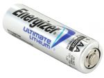
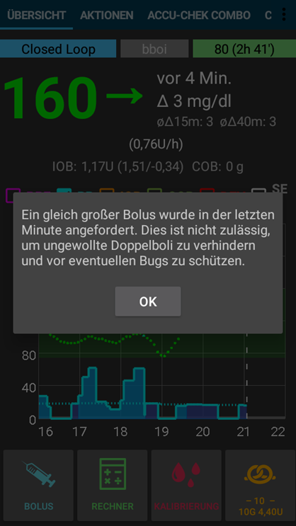
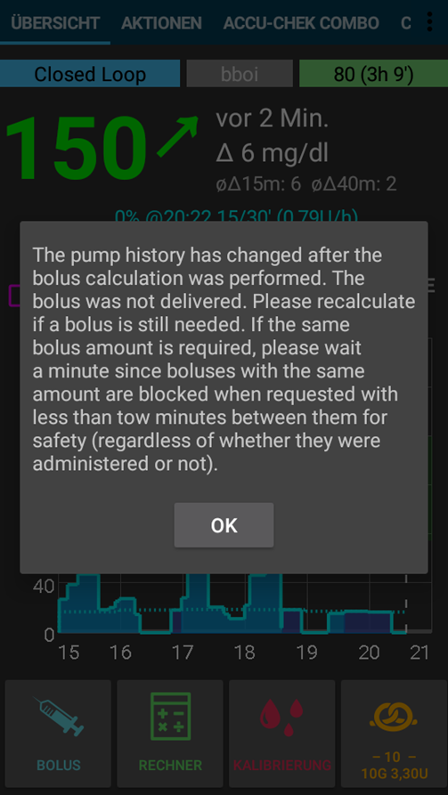

# Accu-Chek Combo Tips for basic usage

## Πώς να εξασφαλίσετε ομαλές λειτουργίες

* Always **carry the smartphone with you**, leave it next to your bed at night. As your pump may lay behind or under you body while you sleep, a higher position (on a shelf or board) works best.
* Always make sure that the pump battery is as full as possible. See the battery section for tipps regarding the battery.
* Whenever possible, only operate the pump via the AAPS app. To facilitate this, activate the key lock on the pump under **PUMP SETTINGS / KEY LOCK / ON**. Μόνο όταν αλλάζετε την μπαταρία ή την κασέτα, είναι απαραίτητο να χρησιμοποιήσετε τα πλήκτρα της αντλίας. 

## Η αντλία δεν είναι προσβάσιμη. Τι να κάνετε;

### Ενεργοποιήστε τον συναγερμό μη προσιτής αντλίας

* In AAPS, go to **Settings / Local Alarms** and activate **alarm when pump is unreachable** and set **pump not reachable limit [Min]** to **31** minutes.
* This will give you enough time to not trigger the alarm when leaving the room while your phone is left on the desk, but informs you if the pump cannot be reached for a time that exceeds the duration of a temporary basal rate.

### Επαναφέρετε την προσβασιμότητα της αντλίας

* When AAPS reports a **pump unreachable** alarm, first release the keylock and **press any key on the pump** (e.g. "down" button). As soon as the pump display has turned off, press **Refresh** on the **Combo Tab** in AAPS. Τότε συνήθως η επικοινωνία επανέρχεται.
* If that does not help, reboot your smartphone. After the restart, AAPS will be reactivated and a new connection will be established with the pump. If you are using the old driver, ruffy will be reactivated as well.

* The tests with different smartphones have shown that certain smartphones trigger the "pump unreachable" error more often than others. See [AAPS Phones](#Phones-list-of-tested-phones) for successfully tested smartphones.

### Αιτίες και συνέπειες των συχνών σφαλμάτων επικοινωνίας

* On phones with **low memory** (or **aggressive power-saving** settings), AAPS is often shut down. Μπορείτε να το δείτε από το γεγονός ότι τα Bolus και η αριθμομηχανή στην Αρχική οθόνη δεν εμφανίζονται όταν ανοίξετε το AAPS επειδή αρχικοποιείται το σύστημα. Αυτό μπορεί να προκαλέσει "συναγερμούς απρόσιτης αντλίας " κατά την εκκίνηση. In the **Last Connection** field of the Combo tab, you can check when AAPS last communicated with the pump.

* Αυτό το σφάλμα μπορεί να εξαντλήση την μπαταρία της αντλίας γρηγορότερα, επειδή το βασικό προφίλ διαβάζεται από την αντλία όταν ξαναρχίσει η εφαρμογή.
* Αυξάνει επίσης την πιθανότητα να προκαλέσει το σφάλμα που προκαλεί την απόρριψη της αντλίας από όλες τις εισερχόμενες συνδέσεις μέχρι να πιεστεί ένα κουμπί στην αντλία. 

## Η ακύρωση του προσωρινού βασικού ρυθμού αποτυγχάνει

* Occasionally, AAPS can not automatically cancel a **TBR CANCELED** alert. Then you have to either press **UPDATE** in the AAPS **Combo tab** or the alarm on the pump will need to be confirmed.

## Υποδείξεις της μπαταρίας της αντλίας

### Αλλαγή μπαταρίας

* Μετά από συναγερμό ** χαμηλής μπαταρίας **, η μπαταρία θα πρέπει να αλλάξει το συντομότερο δυνατόν ώστε να έχει πάντα αρκετή ενέργεια για αξιόπιστη επικοινωνία Bluetooth με το smartphone, ακόμα και αν το τηλέφωνο βρίσκεται σε ευρύτερη απόσταση από την αντλία.
* Ακόμα και μετά από συναγερμό ** χαμηλής μπαταρίας **, η μπαταρία μπορεί να χρησιμοποιηθεί για μεγάλο χρονικό διάστημα. Ωστόσο, συνιστάται να έχετε πάντα μαζί σας μια νέα μπαταρία μετά από ένα συναγερμό χαμηλής μπαταρίας.
* Before changing the battery, press on the **Loop** symbol on the main screen and select **Suspend loop for 1h**. 
* Wait for the pump to communicate with the pump and the bluetooth logo on the pump has faded.

* Release the key lock on the pump, put the pump into stop mode, confirm a possibly canceled temporary basal rate, and change the battery quickly.
* When using the old driver, if the clock on the pump did not survive the battery change, re-set the date and time on the pump to exactly the date/time on your phone running AAPS. (The new driver automatically updates the pump's date and time.)
* Then put the pump back in run mode select **Resume** when pressing on the **Suspended Loop** icon on the main screen.
* AAPS will re-set a necessary temporary basal rate with the arrival of the next blood sugar value.

(Accu-Chek-Combo-Tips-for-Basic-usage-battery-type-and-causes-of-short-battery-life)=

### Τύπος μπαταρίας και αιτίες βραχείας διάρκειας ζωής της μπαταρίας

* As intensive Bluetooth communication consumes a lot of energy, only use **high-quality batteries** like Energizer Ultimate Lithium, the "power one"s from the "large" Accu-Chek service pack, or if you are going for a rechargeable battery, use Eneloop batteries. 

 

Ranges for typical life time of the different battery types are as follows:

* **Energizer Ultimate Lithium**: 4 έως 7 εβδομάδες
* **Power One Alkaline** (Varta) from the service pack: 2 to 4 weeks
* **Eneloop rechargeable** batteries (BK-3MCCE): 1 to 3 weeks

If your battery life is significantly shorter than the ranges given above, please check the following possible causes:

* Υπάρχουν ορισμένες παραλλαγές του καπακιού μπαταρίας της αντλίας Combo, το οποίο βραχυκυκλώνει εν μέρει τις μπαταρίες και τις αποστραγγίζει γρήγορα. Τα καπάκια χωρίς αυτό το πρόβλημα μπορούν να αναγνωριστούν από τις χρυσές μεταλλικές επαφές.
* Εάν το ρολόι της αντλίας δεν «επιβιώσει» από μια μικρή αλλαγή μπαταρίας, είναι πιθανό να σπάσει ο πυκνωτής ο οποίος κρατάει το ρολόι σε λειτουργία κατά τη διάρκεια μιας σύντομης διακοπής ρεύματος. In this case, a replacement of the pump by Roche might help, which is not a problem during the warranty period. 
* Το υλικό και το λογισμικό smartphone (λειτουργικό σύστημα Android και στοίβα bluetooth) επηρεάζουν επίσης τη διάρκεια ζωής της μπαταρίας της αντλίας, παρόλο που οι ακριβείς παράγοντες δεν είναι ακόμη πλήρως γνωστοί. Εάν έχετε την ευκαιρία, δοκιμάστε ένα άλλο smartphone και συγκρίνετε τη διάρκεια ζωής της μπαταρίας.

## Εκτεταμένο bolus, πολλαπλό bolus

The OpenAPS algorithm does not support a parallel extended bolus or multiwave bolus. But a similar treatment can be achieved by the following alternatives:

* Use **e-Carbs** when entering carbs or using the Calculator by entering the carbs of the full meal and the duration you expect the carbs to arrive as glucose in you blood. The system will then calculate small carbs equally distributed over the whole duration which will cause th algorithm to provide equivalent insulin dosing while still permanently checking the overall rise/decrease of the blood glucose level. For a multiwave bolus approach, you can also combine a smaller immediate bolus with e-carbs. 
* Before eating, on the **Actions tab** in AAPS set as a temporary **Eating Soon** goal with target glucose 80 for several hours. The duration should be based on the interval you would choose for an extended bolus. This will keep your target lower than usual and therefore increase the amount of insulin delivered.
* Then use the **CALCULATOR** to enter the full carbs of the meal, but do not directly apply the values suggested by the bolus calculator. If a multiwave-like bolus is to be delivered, correct the insulin dosage down. Depending on the meal, the algorithm now has to deliver additional SMBs or higher temporary basal rates to counteract the increase in blood sugar. Here, the safety limitation of the basal rate (Max IE / h, Maximum basal IOB) should be very carefully experimented with and, if necessary, temporarily changed.

* If you are tempted to just use the extended or multiwave bolus directly on the pump, AAPS will penalize you with disabling the closed loop for the next six hours to ensure that no excess insulin dosage is calculated.

## Συναγερμοί κατά την χορήγηση bolus

* If AAPS detects that an identical bolus has been successfully delivered at the same minute, bolus delivery will be prevented with identical number of insulin units. If your really want to bolus the same insulin twice in short succession, just wait two more minutes and then deliver the bolus again. If the fist bolus has been interrupted or was not delivered for other reasons, you can immediately re-submit the bolus since AAPS 2.0.
* The alarm is a safety mechanism that reads the pump's bolus history before submitting a new bolus to correctly calculate insulin on board (IOB), even when a bolus is delivered directly from the pump. Εδώ πρέπει να αποφευχθούν οι δυσδιάκριτες καταχωρήσεις.

* Αυτός ο μηχανισμός είναι επίσης υπεύθυνος για μια δεύτερη αιτία του σφάλματος: Εάν κατά τη χρήση του υπολογισμού των bolus χορηγηθεί ένα άλλο bolus μέσω της αντλίας με τον τρόπο αυτό αλλάζει το ιστορικό των bolus, η βάση του υπολογισμού του bolus είναι λάθος και το bolus ακυρώνετε. 

