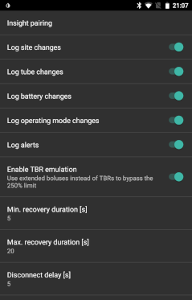

# Accu-Chek Insight Αντλία

**Αυτό το λογισμικό είναι μέρος του DIY τεχνητό παγκρέας και δεν είναι προϊόν, αλλά απαιτεί από εσάς να διαβάσετε, να μάθετε και να κατανοήσετε το σύστημα, συμπεριλαμβανομένου του τρόπου χρήσης του. Δεν είναι κάτι που κάνει όλη τη διαχείριση του διαβήτη για σας, αλλά σας επιτρέπει να βελτιώσετε τα επίπεδα σακχάρων σας και την ποιότητα ζωής σας, εάν είστε πρόθυμοι να αφιερώσετε τον απαιτούμενο χρόνο. Μη βιάζεστε με αυτό, αλλά δώστε χρόνο στον εαυτό σας να μάθει. Εσείς μόνο είστε υπεύθυνοι για οτιδήποτε κάνετε με αυτό.**

* * *

## *ΠΡΟΕΙΔΟΠΟΙΗΣΗ: Εάν είχατε χρησιμοποιήσει το SightRemote στο παρελθόν, παρακαλώ αναβαθμίστε στην νεότερη AAPS και απεγκαταστήστε το SightRemote.*

## Απαιτήσεις υλικού και λογισμικού

* Μία Roche Accu-Chek Insight pump (οποιαδήποτε εταιρεία όλες δουλεύουν) Σημειώσει: Το AAPS πάντα θα αποθηκεύει στο προφίλ του πρώτου βασικού ρυθμού της αντλίας
* Ένα τηλέφωνο Android (Βασικά κάθε έκδοση Android θα λειτουργούσε, αλλά το ίδιο το AndroidAPS απαιτεί τουλάχιστον Android 5 (Lollipop).)
* Την εφαρμογή AndroidAPS εγκατεστημένη στο τηλέφωνό σας

## Ρύθμιση

* Η αντλία Insight πρέπει να συνδέεται μόνο σε μία συσκευή τη φορά. Εάν έχετε χρησιμοποιήσει στο παρελθόν το τηλεχειριστήριο Insight (μετρητής), πρέπει να αφαιρέσετε το μετρητή από τη λίστα ζευγαρωμένων συσκευών της αντλίας σας: Μενού> Ρυθμίσεις> Επικοινωνία> Κατάργηση συσκευής
    
    

* Στο Config Builder της εφαρμογής AndroidAPS επιλέξτε Accu-Chek Insight στην ενότητα αντλιών
    
    

* Αγγίξτε τον οδοντωτό τροχό για να ανοίξετε τις ρυθμίσεις Insight.

* Στις ρυθμίσεις, πατήστε στο κουμπί 'Insight pairing(Insight αντιστοίχηση) ' στο επάνω μέρος της οθόνης. Θα πρέπει να δείτε μια λίστα με όλες τις κοντινές συσκευές Bluetooth (κάτω αριστερά).
* Στην αντλία Insight, μεταβείτε στο Μενού> Ρυθμίσεις> Επικοινωνία> Προσθήκη συσκευής. Η αντλία θα εμφανίσει στην οθόνη (κάτω δεξιά) τον σειριακό αριθμό της αντλίας.
    
    

* Πηγαίνοντας πίσω στο τηλέφωνό σας, πατήστε στον σειριακό αριθμό της αντλίας στη λίστα των συσκευών Bluetooth. Στη συνέχεια, πατήστε αντιστοίχηση για επιβεβαίωση.
    
    

* Τόσο η αντλία όσο και το τηλέφωνο θα εμφανίσουν έναν κωδικό. Βεβαιωθείτε ότι οι κωδικοί είναι οι ίδιοι και στις δύο συσκευές και επιβεβαιώστε το τόσο στην αντλία όσο και στο τηλέφωνο.
    
    

* Επιτυχία! Πείτε ένα μπράβο στον εαυτό σας που τα καταφέρατε.
    
    

* Για να ελέγξετε ότι είναι όλα καλά, επιστρέψτε στο Config builder στο AndroidAPS και αγγίξτε το οδοντωτό τροχό από την αντλία Insight για να μπείτε στις ρυθμίσεις Insight και, στη συνέχεια, αγγίξτε το Insight Pairing και θα δείτε μερικές πληροφορίες σχετικά με την αντλία:
    
    

Σημείωση: Δεν θα υπάρχει μόνιμη σύνδεση μεταξύ της αντλίας και του τηλεφώνου. Μια σύνδεση θα καθοριστεί μόνο εάν είναι απαραίτητο (δηλ. Ο καθορισμός προσωρινών βασικών ρυθμών, η χορήγηση bolus, η ανάγνωση του ιστορικού της αντλίας...). Διαφορετικά, η μπαταρία του τηλεφώνου και της αντλίας θα εξαντλούνταν πολύ γρήγορα.

## Ρυθμίσεις στο AAPS

Στις ρυθμίσεις του Insight στο AndroidAPS μπορείτε να ενεργοποιήσετε τις ακόλουθες επιλογές:

* "Αρχείο Αλλαγές τοποθεσίας καταγραφής": Αυτό θα καταγράψει αυτόματα την αλλαγή καθετήρα όταν εκτελείτε το πρόγραμμα "γεμίσματος κάνουλας" στην αντλία.   
    Σημείωση: Η αλλαγή κάνουλας επαναφέρει επίσης τα Autosens</b>
* "Αρχείο Αλλαγές σωλήνα": Αυτό προσθέτει μια σημείωση στη βάση δεδομένων AndroidAPS όταν εκτελείτε το πρόγραμμα "πλήρωση σωλήνα" στην αντλία.
* "Αρχείο αλλαγής μπαταρίας": Αυτό καταγράφει μια αλλαγή μπαταρίας όταν βάζετε μια νέα μπαταρία στην αντλία.
* "Αρχείο αλλαγής λειτουργίας": Αυτό εισάγει μια σημείωση στη βάση δεδομένων AndroidAPS κάθε φορά που ξεκινάτε, σταματάτε ή κάνετε παύση την αντλία.
* "Αρχείο Ειδοποιήσεις καταγραφής": Καταγράφει μια σημείωση στη βάση δεδομένων AndroidAPS κάθε φορά που η αντλία εκδίδει μια ειδοποίηση (εκτός από τις υπενθυμίσεις, τη δόση και την ακύρωση του TBR - αυτές δεν καταγράφονται).
* " Αρχείο ενεργοποίηση εξομοίωσης TBR": Η αντλία Insight μπορεί να εκδώσει προσωρινές βασικές τιμές (TBRs) έως και 250%. To get round this restriction, TBR emulation will instruct the pump to deliver an extended bolus for the extra insulin if you request a TBR of more than 250%.  
    Note: Just use one extended bolus at a time as multiple extended boluses at the same time might cause errors.
* "Recovery duration": This defines how long AndroidAPS will wait before trying again after a failed connection attempt. You can choose from 0 to 20 seconds. If you experience connection problems, choose a longer wait time.   
      
    Example for min. recovery duration = 5 and max. recovery duration = 20   
      
    no connection -> wait **5** sec.   
    retry -> no connection -> wait **6** sec.   
    retry -> no connection -> wait **7** sec.   
    retry -> no connection -> wait **8** sec.   
    ...   
    retry -> no connection -> wait **20** sec.   
    retry -> no connection -> wait **20** sec.   
    ...

* "Disconnect delay": This defines how long (in seconds) AndroidAPS will wait to disconnect from the pump after an operation is finished. Default value is 5 seconds.

For periods when pump was stopped AAPS will log a temp. basal rate with 0%.

In AndroidAPS, the Accu-Chek Insight tab shows the current status of the pump and has two buttons:

* "Refresh": Refreshes pump status
* "Enable/Disable TBR over notification": A standard Insight pump emits an alarm when a TBR is finished. This button lets you enable or disable this alarm without the need for configuration software.
    
    

## Settings in the pump

Configure alarms in the pump as follows:

* Menu > Settings > Device settings > Mode settings > Quiet > Signal > Sound Menu > Settings > Device settings > Mode settings > Quiet > Volume > 0 (remove all bars)
* Menu > Modes > Signal mode > Quiet

This will silence all alarms from the pump, allowing AndroidAPS to decide if an alarm is relevant to you. If AndroidAPS does not acknowledge an alarm, its volume will increase (first beep, then vibration).

Insight pumps with newer firmware will vibrate briefly every time a bolus is delivered (for example, when AndroidAPS issues an SMB or TBR emulation delivers an extended bolus). Vibration cannot be disabled. Older pumps do not vibrate in these circumstances.

## Battery replacement

The Insight pump has a small internal battery to keep essential functions like the clock running while you are changing the removable battery. If changing the battery takes too long, this internal battery may run out of power, the clock will reset, and you will be asked to enter a new time and date after inserting a new battery. If this happens, all entries in AndroidAPS prior to the battery change will no longer be included in calculations as the correct time cannot be identified properly.

## Insight specific errors

### Extended bolus

Just use one extended bolus at a time as multiple extended boluses at the same time might cause errors.

### Time out

Sometimes it might happen that the Insight pump does not answer during connection setup. In this case AAPS will display the following message: "Timeout during handshake - reset bluetooth".

In this case turn off bluetooth on pump AND smartphone for about 10 seconds and then turn it back on.

## Crossing time zones with Insight pump

For information on traveling accross time zones see section [Timezone traveling with pumps](../Usage/Timezone-traveling#insight).