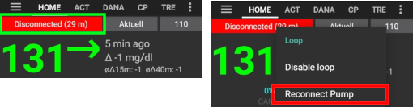

# Συχνές Ερωτήσεις

Αν θέλετε να προσθέσετε ερωτήσεις σε αυτήν την ενότητα, ακολουθήστε αυτές τις [οδηγίες](../make-a-PR.md).

# Γενικά

## Μπορώ να εγκαταστήσω το AndroidAPS, όπως κάνω με τις υπόλοιπες εφαρμογές που έχω;

Όχι. Δεν υπάρχει έτοιμο apk αρχείο, ώστε να είναι δυνατή η εγκατάσταση του σε Android λειτουργικό, με το συνήθη τρόπο. Χρειάζεται να δημιουργήσετε ένα τέτοιο αρχείο μόνοι σας. Αναλυτικές οδηγίες μπορείτε να βρείτε [εδώ](../Installing-AndroidAPS/Building-APK.md). Ο λόγος που δεν διανέμεται τέτοιο αρχείο είναι ο εξής:

Το AndroidAPS χρησιμοποιείται για να ελέγχει την αντλία ινσουλίνης που χρησιμοποιείτε, καθορίζοντας τον ρυθμό ή και την ποσότητα ινσουλίνης που θα λαμβάνετε. Σύμφωνα με την ισχύουσα νομοθεσία στην Ευρώπη, όλα τα συστήματα που ανήκουν σε κατηγορίες όπως είναι οι lla ή llb χαρακτηρίζονται ως ιατρικές συσκευές. Για την κυκλοφορία τέτοιων συσκευών απαιτείται έγκριση από τους αρμόδιους φορείς. Προκειμένου να ληφθεί τέτοιου είδους έγκριση (CE) απαιτείται μία σειρά εγγράφων, μελετών, δοκιμών και ελέγχων. Διαφορετικά, η διάθεση τους δεν είναι νόμιμη. Τέτοιες διαδικασίες ελέγχου και εγκρίσεων υπάρχουν και σε άλλα μέρη του κόσμου.

Τα παραπάνω δεν αφορούν μόνο συστήματα μόνο διατίθενται προς πώληση (δηλ. έναντι χρηματικού ποσού) αλλά σε όλα τα συστήματα, με όποιον τρόπο και αν διανέμονται, ακόμα και αν διατίθενται δωρεάν. Το να δημιουργήσεις ένα ιατρικό σύστημα για δική σου χρήση και με δική σου ευθύνη, είναι η μόνη περίπτωση μη εφαρμογής των παραπάνω.

Για αυτό δεν διατίθενται εκτελέσιμα αρχεία εγκατάστασης του AndroidAPS.

## Από που μπορώ να αρχίσω;

Πρώτον, χρειάζονται τα εξής (hardware) **εξαρτήματα**:

* Μία αντλία ινσουλίνης (Για περισσότερα δείτε τις [υποστηριζόμενες αντλίες ινσουλίνης](Pump-Choices.md)) 
* Ένα Android κινητό (Για iPhone κινητά, δείτε το [iOS Loop](Phones.md) ) 
* [Ένα σύστημα συνεχούς καταγραφής γλυκόζης](../Configuration/BG-Source.rst). 

Δεύτερον, πρέπει να **ρυθμίσετε τα εξαρτήματα** που θα χρησιμοποιήσετε. Δείτε το [παράδειγμα εγκατάστασης με αναλυτικές οδηγίες για τις απαραίτητες ρυθμίσεις](Sample-Setup.md).

Τρίτον, χρειάζεται να **ρυθμίσετε το λογισμικό** που θα χρησιμοποιήσετε: Το AndroidAPS και το σύστημα συνεχούς καταγραφής γλυκόζης (CGM) ή το σύστημα παρακολούθησης γλυκόζης με τεχνολογία Flash (FGM).

Τέταρτον, χρειάζεται να μάθετε και **να καταλάβετε το πως λειτουργεί το OpenAPS** ώστε να μπορείτε να ελέγχετε την αγωγή που ακολουθείτε. Η κύρια αρχή λειτουργίας του looping βασίζεται στην ακρίβεια του βασικού ρυθμού και των στοιχείων των υδατανθράκων που καταναλώνετε. Όλες οι προτάσεις προϋποθέτουν ότι ο βασικός ρυθμός ινσουλίνης καλύπτει τις αντίστοιχες ανάγκες σας. Συνεπώς, οι αυξομειώσεις που μπορεί να προκύπτουν οφείλονται σε άλλους λόγους, όπως είναι το άγχος, η άσκηση κ. λπ., και για αυτό απαιτούνται επιπλέον ρυθμίσεις. Οι ρυθμίσεις που μπορεί να κάνει το κλειστό κύκλωμα έχουν περιοριστεί λόγο ασφάλειας (δείτε το μέγιστο επιτρεπόμενο προσωρινό βασικό ρυθμό στο [ OpenAPS Reference Design ](https://openaps.org/reference-design/)), πράγμα που σημαίνει ότι δεν θέλετε να χάσετε την επιτρεπόμενη δοσολογία στη διόρθωση ενός λάθους βασικού. Αν, για παράδειγμα, έχετε συχνά χαμηλές μετρήσεις στην προσέγγιση ενός γεύματος, τότε είναι πιθανό να πρέπει να προσαρμόσετε τις βασικές σας ανάγκες. Μπορείτε να χρησιμοποιήσετε το [autotune ](http://openaps.readthedocs.io/en/latest/docs/Customize-Iterate/autotune.html#phase-c-running-autotune-for-suggested-adjustments-without-an-openaps-rig) για να εξετάσετε ένα μεγάλο σύνολο δεδομένων για να υποδείξετε εάν και πώς πρέπει να προσαρμοστεί ο βασικός και / ή τα ISF και επίσης αν πρέπει να αλλάξετε το λόγο υδατανθράκων. Ή μπορείτε να κάνετε δοκιμές και να ρυθμίσετε το βασικό ρυθμό με τον [παραδοσιακό τρόπο](http://integrateddiabetes.com/basal-testing/).

## Ποιες είναι οι πρακτικές του κυκλώματος που έχω;

### Προστασία με κωδικό πρόσβασης

Αν δεν θέλετε να αλλάζουν εύκολα οι προτιμήσεις σας, μπορείτε να προστατεύσετε με κωδικό πρόσβασης το μενού προτιμήσεων επιλέγοντας στο μενού προτιμήσεων "κωδικό πρόσβασης για τις ρυθμίσεις" και πληκτρολογήστε τον κωδικό πρόσβασης που επιλέγετε. Την επόμενη φορά που θα μεταβείτε στο μενού προτιμήσεων, θα ζητηθεί αυτός ο κωδικός πρόσβασης προτού προχωρήσετε περαιτέρω. Εάν αργότερα θέλετε να καταργήσετε την επιλογή κωδικού πρόσβασης, μεταβείτε στον "κωδικό πρόσβασης για τις ρυθμίσεις" και διαγράψτε το κείμενο.

### Android Wear Smartwatches

Εάν σκοπεύετε να χρησιμοποιήσετε την εφαρμογή wear του Android για bolus ή να αλλάξετε τις ρυθμίσεις, τότε θα πρέπει να διασφαλίσετε ότι οι ειδοποιήσεις από το AndroidAPS δεν αποκλείονται. Η επιβεβαίωση των ενεργειών γίνεται μέσω ειδοποιήσεων.

### Αποσυνδέστε την αντλία

Εάν αφαιρέσετε την αντλία σας για ντους / κολύμβηση / σπορ κ. λπ. θα πρέπει να επιτρέψετε στο AndroidAPS να γνωρίζει ότι δεν παρέχεται ινσουλίνη για να διατηρεί το IOB σωστά.

* Πατήστε παρατεταμένα το πλήκτρο 'Closed loop' (θα καλείται 'Open Loop' όταν δεν το έχετε κλείσει ακόμα) στην κορυφή της αρχικής οθόνης. 
* Επιλέξτε ** "Αποσύνδεση της αντλίας για X λεπτά" **
* Αυτό θα θέσει το βασικό στο μηδέν για εκείνη την χρονική περίοδο.
* Το ελάχιστο χρονικό διάστημα για μια αποσύνδεση εξαρτάται από το ελάχιστο μήκος TBR που μπορεί να ρυθμιστεί στην αντλία. Επομένως, εάν θέλετε να αποσυνδεθείτε για μικρότερο χρονικό διάστημα, πρέπει να χρησιμοποιήσετε το συντομότερο διαθέσιμο χρόνο αποσύνδεσης για την αντλία σας και να επανασυνδεθείτε χειροκίνητα, όπως περιγράφεται παρακάτω.
* Το πλήκτρο 'Κλειστό κύκλωα' (ή 'Ανοιχτό κύκλωμα') θα γίνει κόκκινο και θα ονομάζεται 'Αποσυνδεδεμένο (xx m)' εμφανίζοντας τον εναπομείναντα χρόνο αποσύνδεσης.
* Το AAPS θα επανασυνδέσει την αντλία μετά από τον επιλεγμένο χρόνο αυτόματα και το κλειστό κύκλωμα θα αρχίσει να λειτουργεί ξανά.
    
    

* Εάν ο επιλεγμένος χρόνος ήταν πολύ μεγάλος, μπορείτε να επανασυνδεθείτε χειροκίνητα.

* Πατήστε παρατεταμένα το κόκκινο κουμπί "Αποσυνδεδεμένο (xx m)".
* Επιλέξτε "Επανασύνδεση της αντλίας'
    
    

### Συστάσεις όχι μόνο βάσει μιας μόνο ανάγνωσης του CGM

Για λόγους ασφάλειας, οι συστάσεις που γίνονται δεν βασίζονται σε μία ανάγνωση CGM αλλά στο μέσο δέλτα. Επομένως, εάν χάσετε μερικές αναγνώσεις, μπορεί να χρειαστεί λίγος χρόνος μετά την επιστροφή δεδομένων πριν ξεκινήσει ξανά η επαναφορά του AndroidAPS.

### Περαιτέρω αναγνώσεις

Υπάρχουν διάφορα αγγλικά blogs που έχουν συμβουλές για να καταλάβεις καλύτερα το "κύκλωμα":

* [Fine-tuning Settings](http://seemycgm.com/2017/10/29/fine-tuning-settings/) See my CGM
* [Why DIA matters](http://seemycgm.com/2017/08/09/why-dia-matters/) See my CGM
* [Limiting meal spikes](https://diyps.org/2016/07/11/picture-this-how-to-do-eating-soon-mode/) #DIYPS
* [Hormones and autosens](http://seemycgm.com/2017/06/06/hormones-2/) See my CGM

## Τι εξοπλισμό προτείνεται να έχω μαζί μου για περιπτώσεις έκτακτης ανάγκης;

Πρώτα από όλα, πρέπει να έχετε μαζί σας ό, τι μεταφέρει μαζί του οποιοσδήποτε άλλος με διαβήτη τύπου 1 που χρησιμοποιεί αντλία ινσουλίνης. Επιπρόσθετα προτείνεται να έχετε μαζί σας τα εξής:

* Μπαταρία για την ενέργεια του smartphone σας, wear και (ίσως) αναγνώστη BT
* Διατηρήστε αντίγραφα ασφαλείας (backups) σε ό, τι θεωρείτε χρήσιμο για τις εφαρμογές που χρησιμοποιείτε, όπως το τελευταίο εκτελέσιμο του AndroidAPS που φτιάξατε, τους κωδικούς που χρησιμοποιείτε, αρχεία που περιέχουν ρυθμίσεις (όπως AndroidAPS settings file, xDrip settings file, patched Dexcom app) κ. λπ...
* Μπαταρίες για την αντλία έγχυσης ινσουλίνης

## Πώς να συνδέσετε με ασφάλεια το CGM / FGM;

You can tape it: There are getting sold pre-perforated 'overpatches' for common CGM systems (ask Google or ebay). Κάποιοι χρήστες χρησιμοποιούν χαμηλού κόστους ελαστικές ταινίες κινησιοεπίδεσης (kinesio tape, rocktape).

You can fix it: There are getting sold upper arm bracelets that fix the CGM/FGM with a rubber band (ask Google or ebay).

# Ρυθμίσεις AndroidAPS

Η λίστα που ακολουθεί έχει ως στόχο να σας βοηθήσει να βελτιστοποιήσετε τις ρυθμίσεις. Σας προτείνουμε να δουλέψετε με τα στοιχεία που αναφέρονται δουλεύοντας από πάνω προς κάτω. Προσπαθήστε να θέσετε σωστά την κάθε ρύθμιση προτού προχωρήσετε στην επόμενη. Δοκιμάστε να κάνετε μικρά βήματα αντί να κάνετε πολλές και μεγάλες αλλαγές μαζικά. Μπορείτε να το χρησιμοποιήσετε το [Autotune](https://autotuneweb.azurewebsites.net/) για να σας καθοδηγήσει. Όμως είναι σημαντικό να μην τον ακολουθήσετε στα τυφλά. Μπορεί να μη λειτουργεί σωστά στη δική σας ή και σε ορισμένες άλλες περιπτώσεις. Επίσης, μην ξεχνάτε ότι οι ρυθμίσεις επηρεάζουν η μία την άλλη. Μπορεί να έχετε χρησιμοποιήσει "λάθος" ρυθμίσεις που όμως η λειτουργία τους, σε συνδυασμό με τις άλλες, να είναι εν τέλη σωστή κάτω από συγκεκριμένες συνθήκες. Λόγω αυτών είναι σημαντικό να εξετάσετε μία προς μία τις ρυθμίσεις και να ελέγξετε ότι λειτουργούν όπως θα θέλατε σε διάφορες περιπτώσεις.

## Διάρκεια δράσης ινσουλίνης (DIA)

### Περιγραφή & τρόπος δοκιμής

Η διάρκεια του χρόνου που ινσουλίνη διασπάται τελείως.

Αυτό είναι συχνά πολύ μικρό. Οι περισσότεροι άνθρωποι χρειάζονται τουλάχιστον 5 ώρες, πιθανόν 6 ή και 7 ώρες.

### Επιπτώσεις

Μικρή τιμή στη διάρκεια δράσης της ινσουλινης μπορεί να οδηγήσει σε χαμηλά επίπεδα σακχάρου. Και αντίστροφα.

Εάν το DIA είναι πολύ σύντομο, το AAPS πιστεύει πολύ σύντομα ότι το προηγούμενο bolus σας καταναλώθηκε και, σε ακόμα αυξημένη γλυκόζη, θα σας δώσει περισσότερο bolus. Στην πραγματικότητα το AndroidAPS δεν περιμένει μέχρι να ανέβει πολύ το σάκχαρο σας, αλλά προβλέπει τι πρόκειται να γίνει και με βάση την πρόβλεψη του προσθέτει συνεχόμενα ινσουλίνη. Αυτό ουσιαστικά δημιουργεί " συσσώρευση ινσουλίνης" που το AAPS δεν γνωρίζει.

Παράδειγμα ενός υπερβολικά σύντομου DIA είναι ένα υψηλό BG που ακολουθείται από υπερ-διόρθωση του AAPS και δίνοντας ένα χαμηλό BG.

## Προγραμματισμός βασικού ρυθμού (Μονάδες/Ώρα)

### Περιγραφή & τρόπος δοκιμής

Η ποσότητα της ινσουλίνης που δίνετε σε μια δεδομένη ώρα για να διατηρήσει το BG σε σταθερό επίπεδο.

Δοκιμάστε τα βασικά σας ποσοστά, αναστέλλοντας τον κύκλωμα, με νηστεία, περιμένοντας ας πούμε 5 ώρες μετά το φαγητό και βλέποντας τον τρόπο με τον οποίο η BG αλλάζει. Επαναλάβετε μερικές φορές.

Αν το BG πέφτει, ο βασικός ρυθμός είναι πολύ υψηλός. Και αντίστροφα.

### Επιπτώσεις

Υψηλός βασικός ρυθμός μπορεί να οδηγήσει σε χαμηλότερα του επιθυμητού επίπεδα σακχάρου. Και αντίστροφα.

Βασικές γραμμές της AAPS έναντι του προεπιλεγμένου βασικού ρυθμού. Εάν ο βασικός ρυθμός είναι πολύ υψηλός, ενας 'μηδενικός ρυθμός' θα μετράται ως μεγαλύτερο αρνητικό IOB από ό, τι θα έπρεπε. Αυτό θα οδηγήσει το AAPS να δίνει περισσότερες επακόλουθες διορθώσεις από ό, τι θα έπρεπε για να φέρει τελικά το IOB στο μηδέν.

Επομένως, ένας βασικός ρυθμός πολύ υψηλός θα δημιουργήσει χαμηλά BGs τόσο με το προκαθορισμένο βασικό, αλλά και σε μερικές ώρες, όπως το AAPS διορθώνει ως προς το στόχο.

Αντίστροφα, ένα βασικό ποσοστό πολύ χαμηλό μπορεί να οδηγήσει σε υψηλά επίπεδα BGs και σε μια αποτυχία να φθάσουν τα επίπεδα στο στόχο.

## Ο παράγοντας ευαισθησίας στην ινσουλίνη (ISF) (mmol / l / U ή mg / dl / U)

### Περιγραφή & τρόπος δοκιμής

Η πτώση BG που αναμένεται από τη χορήγηση 1U ινσουλίνης.

Υποθέτοντας το σωστό βασικό, μπορείτε να το δοκιμάσετε αναστέλλοντας τον κύκλωμα, ελέγχοντας ότι το IOB είναι μηδέν και λαμβάνοντας μερικά δισκία γλυκόζης για να φτάσετε σε ένα σταθερό 'υψηλό' επίπεδο.

Στη συνέχεια, πάρτε μια εκτιμώμενη ποσότητα ινσουλίνης (σύμφωνα με το τρέχον 1 / ISF) για να φτάσετε στο στόχο BG.

Να είστε προσεκτικοί, καθώς αυτό είναι αρκετά συχνά ρυθμισμένο πολύ χαμηλά. Πάρα πολύ χαμηλά σημαίνει 1 U θα ρίξει το BG γρηγορότερα από το αναμενόμενο.

### Επιπτώσεις

** Κάτω ISF ** (δηλαδή 40 αντί για 50) = πιο επιθετικό οδηγώντας σε μεγαλύτερη πτώση των BG για κάθε μονάδα ινσουλίνης. Αν είναι πολύ χαμηλή, αυτό μπορεί να οδηγήσει σε χαμηλή BGs.

** Υψηλότερη ISF ** (δηλ. 45 αντί για 35) = λιγότερο επιθετικό / ασθενέστερο που οδηγεί σε μικρότερη πτώση των BG για κάθε μονάδα ινσουλίνης. Αν είναι πολύ υψηλή, αυτό μπορεί να οδηγήσει σε υψηλή BGs.

**Παράδειγμα:**

* BG είναι 190 mg/dl (10,5 mmol) και στόχος είναι τα 100 mg/dl (5,6 mmol). 
* Έτσι θέλετε διόρθωση των 90 mg/dl (= 190 - 110).
* ISF = 30 -> 90 / 30 = 3 μονάδες ινσουλίνης
* ISF = 45 -> 90 / 45 = 2 μονάδες ινσουλίνης

Μια ISF που είναι πολύ χαμηλή (όχι ασυνήθιστη) μπορεί να οδηγήσει σε «υπερβολικές διορθώσεις», επειδή το AAPS πιστεύει ότι χρειάζεται περισσότερη ινσουλίνη για να διορθώσει ένα υψηλό BG από ότι συνήθως. Αυτό μπορεί να οδηγήσει σε «ακανόνιστα» BGs ( όταν νηστεύετε. κατά τη νηστεία). Σε αυτή την περίπτωση θα πρέπει να αυξήσετε το ISF σας. Αυτό σημαίνει ότι το AAPS δίνει μικρότερες δόσεις διόρθωσης, και αυτό θα αποφύγει την υπερβολική διόρθωση ενός υψηλού BG που θα οδηγήσει σε χαμηλή BG.

Αντίθετα, ένα ISF που είναι πολύ υψηλό μπορεί να οδηγήσει σε υπο-διορθώσεις, πράγμα που σημαίνει ότι το BG σας παραμένει πάνω από τον στόχο - ιδιαίτερα αξιοσημείωτο κατά τη διάρκεια της νύχτας.

## Αναλογία Ινσουλίνης υδατανθράκων (IC) (g/U)

### Περιγραφή & τρόπος δοκιμής

Τα γραμμάρια υδατανθράκων για κάθε μονάδα ινσουλίνης.

Μερικοί άνθρωποι χρησιμοποιούν επίσης I: C ως συντομογραφία αντί για IC όταν μιλάμε για αναλογία υδατανθράκων (CR).

Υποθέτοντας ότι είναι σωστός ο βασικός ρυθμός, μπορείτε να ελέγξετε εάν ο IOB είναι μηδέν και ότι βρίσκεστε εντός εμβέλειας, καταναλώνετε ακριβώς γνωστούς υδατάνθρακες και πάρετε μια εκτιμώμενη ποσότητα ινσουλίνης με βάση τη τρέχον αναλογία ινσουλίνης υδατανθράκων. Το καλύτερο είναι να τρώτε φαγητό που τρώτε κανονικά εκείνη την εποχή της ημέρας και να μετρήσετε τους υδατάνθρακες με ακρίβεια.

### Επιπτώσεις

**Χαμηλό IC **= λιγότερα τρόφιμα ανά μονάδα, δηλαδή παίρνετε περισσότερη ινσουλίνη για μια σταθερή ποσότητα υδατανθράκων. Μπορεί επίσης να ονομάζεται "πιο επιθετική".

**Υψηλότερη IC** = περισσότερη τροφή ανά μονάδα, δηλαδή λαμβάνετε λιγότερη ινσουλίνη για ένα σταθερό ποσό των υδατανθράκων. Μπορεί επίσης να ονομάζεται "λιγότερο επιθετική".

Εάν μετά τη πέψη του γεύματος και το IOB έχει επιστρέψει στο μηδέν, το BG σας παραμένει υψηλότερο από ό, τι πριν από το φαγητό, οι πιθανότητες είναι ότι το IC είναι μεγάλο. Αντίθετα, εάν το BG σας είναι χαμηλότερο από ό, τι πριν από το φαγητό, η IC είναι πολύ μικρή.

Αν έχετε χρησιμοποιήσει μέχρι στιγμής τους παράγοντες "μονάδας ψωμιού" (Πόση ποσότητα ινσουλίνης χρειάζεται για να καλύψετε μια μονάδα ψωμιού;) μπορείτε να βρείτε πίνακες μετατροπής online, δηλ. [ εδώ ](https://www.mylife-diabetescare.com/files/media/03_Documents/11_Software/FAS/SOF_FAS_App_KI-Verha%CC%88ltnis_MSTR-DE-AT-CH.pdf).

# Ο αλγόριθμος του APS

## Γιατί εμφανίζεται η ένδειξη "dia: 3" στην καρτέλα "OPENAPS AMA", παρόλο που έχω διαφορετικό DIA στο προφίλ μου;

Στην ΑΜΑ, η DIA στην πραγματικότητα δεν σημαίνει «διάρκεια δράσης της ινσουλίνης». Πρόκειται για μια παράμετρο, η οποία χρησιμοποιείται για τη σύνδεση με το DIA. Τώρα, αυτό σημαίνει, «σε ποιο χρονικό σημείο πρέπει να ολοκληρωθεί η διόρθωση». Δεν έχει καμία σχέση με τον υπολογισμό του IOB. Στο OpenAPS SMB, δεν υπάρχει πλέον ανάγκη για αυτήν την παράμετρο.

## Προφίλ

### Γιατί να χρησιμοποιείτε κατ ελάχιστο. 5 ώρες DIA (χρόνος λήξης ινσουλίνης) αντί για 2-3 ώρες;

Εξηγείται καλά σε [ αυτό το άρθρο ](http://www.diabettech.com/insulin/why-we-are-regularly-wrong-in-the-duration-of-insulin-action-dia-times-we-use-and-why-it-matters/). Μην ξεχάσετε να κάνετε ` ΕΝΕΡΓΟΠΟΙΗΣΗ ΠΡΟΦΙΛ ` μετά την αλλαγή του DIA.

### Τι προκαλεί το κύκλωμα να χαμηλώνει συχνά το BG μου σε υπογλυκαιμικές τιμές χωρίς COB;

Πρώτα απ 'όλα, ελέγξτε το βασικό σας ρυθμό και κάντε δοκιμασία βασικού ρυθμού χωρίς υδατάνθρακες. Εάν είναι σωστό, αυτή η συμπεριφορά προκαλείται συνήθως από πολύ χαμηλή ISF. Μια πολύ χαμηλή ISF μοιάζει συνήθως με αυτό:

### Τι προκαλεί υψηλές μεταγευματικές κορυφές σε κλειστό κύκλωμα;

Πρώτα απ 'όλα, ελέγξτε το βασικό σας ρυθμό και κάντε δοκιμασία βασικού ρυθμού χωρίς υδατάνθρακες. Εάν είναι σωστό και το BG σας πέφτει από το στόχο σας αφού απορροφηθούν πλήρως οι υδατάνθρακες, προσπαθήστε να ορίσετε κάποιον στόχο "να φάει σύντομα" στο AndroidAPS κάποια στιγμή πριν από το γεύμα ή να σκεφτείτε έναν κατάλληλο χρόνο prebolus με τον ενδοκρινολόγο σας. Εάν το BG σας είναι πολύ υψηλό μετά το γεύμα και ακόμα πολύ υψηλό αφού οι υδατάνθρακες απορροφηθούν πλήρως, σκεφτείτε να μειώσετε το IC σας με τον ενδοκρινολόγο σας. Εάν το BG σας είναι πολύ υψηλό ενώ το COB πολύ χαμηλά μετά την απορρόφηση των υδατανθράκων, σκεφτείτε να αυξήσετε το IC σας και έναν κατάλληλο χρόνο prebolus με τον ενδοκρινολόγο σας.

# Αλλες ρυθμισεις

## Ρυθμίσεις Nightscout

### Το AndroidAPS NSClient λέει ότι δεν επιτρέπεται και δεν μεταφορτώνει δεδομένα. Τι μπορώ να κάνω;

Στο NSClient επιλέξτε 'Ρυθμίσεις σύνδεσης'. Ίσως να μην βρίσκεστε σε επιτρεπόμενο δίκτυο WLAN ή έχετε ενεργοποιήσει το "Μόνο εάν φορτίζετε" και το καλώδιο φόρτισης δεν είναι συνδεδεμένο.

## Ρυθμίσεις CGM

### Γιατί λέει το AndroidAPS: "Η πηγή BG δεν υποστηρίζει προηγμένο φιλτράρισμα";

Αν χρησιμοποιείτε άλλο CGM / FGM από το Dexcom G5 ή το G6 στη μητρική λειτουργία xDrip, θα λάβετε αυτήν την ειδοποίηση στην καρτέλα openAPS του AndroidAPS. Δείτε [ Εξομάλυνση δεδομένων γλυκόζης αίματος ](../Usage/Smoothing-Blood-Glucose-Data-in-xDrip.md) για περισσότερες λεπτομέρειες.

## Αντλία

### Που μπορώ να τοποθετήσω την αντλία μου;

Υπάρχουν αναρίθμητες δυνατότητες για την τοποθέτηση της αντλίας. Δεν έχει σημασία αν είστε σε κύκλωμα ή όχι. Αν προτιμάτε να έχετε μια αντλία ινσουλίνης χωρίς σωλήνα και να έχετε μια Dana για κύκλωμα, ελέγξτε τον καθετήρα 30 cm με τη ζώνη της κοιλιάς.

### Μπαταρίες

Το κύκλωμα μπορεί να μειώσει την μπαταρία της αντλίας ταχύτερα από την κανονική χρήση, επειδή το σύστημα αλληλεπιδρά με το bluetooth πολύ περισσότερο από ένα χειροκίνητο χρήστη. Το καλύτερο είναι να αλλάξετε τη μπαταρία στο 25%, καθώς η επικοινωνία γίνεται πιο δύσκολη. Μπορείτε να ρυθμίσετε συναγερμούς για την μπαταρία της αντλίας χρησιμοποιώντας τη μεταβλητή PUMP_WARN_BATT_P στον nightscout ιστότοπό σας. Τα κόλπα για την αύξηση της διάρκειας ζωής της μπαταρίας περιλαμβάνουν:

* μειώστε τη διάρκεια ενεργής οθόνης LCD (στο μενού ρυθμίσεων της αντλίας)
* μειώστε τη διάρκεια παραμονής του φωτισμού (στο μενού ρυθμίσεων της αντλίας)
* επιλέξτε τις ρυθμίσεις ειδοποίησης σε μπιπ και όχι σε δόνηση (στο μενού ρυθμίσεων αντλίας)
* πατήστε μόνο τα κουμπιά στην αντλία για να φορτώσετε ξανά, χρησιμοποιήστε το AndroidAPS για να δείτε όλη την ιστορία, την στάθμη της μπαταρίας και τον ογκο του ρεζερβουάρ.
* AndroidAPS app may often be closed to save energy or free RAM on some phones. When AndroidAPS is reinitialized at each startup it establishes a Bluetooth connection to the pump, and re-reads the current basal rate and bolus history. This consumes battery. To see if this is happening, go to Preferences > NSClient and enable 'Log app start to NS'. Nightscout will receive an event at every restart of AndroidAPS, which makes it easy to track the issue. To reduce this happening, whitelist AndroidAPS app in the phone battery settings to stop the app power monitor closing it down.
    
    For example, to whitelist on a Samsung phone running Android Pie:
    
    * Go to Settings -> Device Care -> Battery 
    * Scroll until you find AndroidAPS and select it 
    * De-select "Put app to sleep"
    * ALSO go to Settings -> Apps -> (Three circle symbol in the top-right of the screen) select "special access" -> Optimize battery usage
    * Scroll to AndroidAPS and make sure it is de-selected.

* clean battery terminals with alcohol wipe to ensure no manufacturing wax/grease remains.

* for [Dana R/RS pumps](../Configuration/DanaRS-Insulin-Pump.md) the startup procedure draws a high current across the battery to purposefully break the passivation film (prevents loss of energy whilst in storage) but it doesn't always work to break it 100%. Αφαιρέστε και επανατοποθετήστε την μπαταρία 2-3 φορές μέχρι να εμφανιστεί 100% στην οθόνη ή χρησιμοποιήστε το κλειδί της μπαταρίας για βραχυκύκλωμα μπαταρίας πριν την τοποθέτηση εφαρμόζοντας και στους δύο ακροδέκτες για ένα δευτερόλεπτο.
* δείτε επίσης περισσότερες συμβουλές στο [ συγκεκριμένους τύπους μπαταρίας ](../Usage/Accu-Chek-Combo-Tips-for-Basic-usage#battery-type-and-causes-of-short-battery-life)

### Αλλαγή δεξαμενών και σωληνών

The change of cartridge cannot be done via AndroidAPS but must be carried out as before directly via the pump.

* Πατήστε παρατεταμένα το "Ανοιχτό κύκλωμα" / "Κλειστό κύκλωμα" στην καρτέλα Home του AndroidAPS και επιλέξτε 'Αναστολή κυκλώματος για 1 ώρα'
* Now disconnect the pump and change the reservoir as per pump instructions.
* Μόλις επανασυνδεθείτε με την αντλία, συνεχίστε με το πάτημα του κουμπιού "Αναστολή (X m)".

Η αλλαγή ενός σωληναρίου όμως δεν χρησιμοποιεί τη λειτουργία "πρωταρχικής έγχυσης" της αντλίας, αλλά γεμίζει το σετ έγχυσης και / ή το σωληνίσκο χρησιμοποιώντας ένα bolus που δεν εμφανίζεται στο ιστορικό των bolus. Αυτό σημαίνει ότι δεν διακόπτει ένα τρέχον προσωρινό βασικό ρυθμό. Στην καρτέλα Δράσεις (Πράξη), χρησιμοποιήστε το πλήκτρο PRIME / FILL για να ρυθμίσετε την ποσότητα ινσουλίνης που απαιτείται για να γεμίσετε το σετ έγχυσης και να ξεκινήσετε την προετοιμασία. Αν το ποσό δεν είναι αρκετό, επαναλάβετε την πλήρωση. Μπορείτε να ορίσετε κουμπιά προεπιλεγμένου ποσού στις Προτιμήσεις> Άλλο> Συμπληρώστε / Αρχίστε την κανονική ποσότητα ινσουλίνης. Δείτε το φυλλάδιο οδηγιών στο κιβώτιο του σωληνίσκου για το πόσες μονάδες θα πρέπει να προετοιμαστούν ανάλογα με το μήκος της βελόνας και το μήκος της σωλήνωσης.

## Ταπετσαρία

Μπορείτε να βρείτε την ταπετσαρία AndroidAPS για το τηλέφωνό σας στη σελίδα [ τηλέφωνα ](../Getting-Started/Phones#phone-background).

## Καθημερινή χρήση

### Υγιεινή

#### Πώς μπορώ να κάνω ένα μπάνιο ή ντουζ;

Μπορείτε να αφαιρέσετε την αντλία ενώ κάνετε ντους ή μπάνιο. Για αυτό το σύντομο χρονικό διάστημα συνήθως δεν θα τη χρειαστείτε. Αλλά πρέπει να το πείτε στο AAPS, έτσι ώστε οι υπολογισμοί IOB να είναι σωστοί.

Δείτε τη [παραπάνω περιγραφή](../Getting-Started/FAQ#disconnect-pump).

### Εργασία

Ανάλογα με το είδος της δουλειάς σας, ίσως να χρησιμοποιείτε διαφορετικούς παράγοντες θεραπείας στις εργάσιμες ημέρες. Σαν κάποιος που χρησιμοποιεί κύκλωμα πρέπει να σκεφτείτε μια [αλλαγή προφίλ](../Usage/Profiles.md) για την εκτιμώμενη εργάσιμη ημέρα σας (π.χ. περισσότερο από 100% για 8 ώρες όταν κάθεστε γύρω ή λιγότερο από 100% όταν είστε ενεργός), υψηλό ή χαμηλό προσωρινό στόχο ή μια [χρονική μετατόπιση του προφίλ σας](../Usage/Profiles#time-shift) όταν στέκεστε πολύ νωρίτερα ή αργότερα από το κανονικό. Εάν χρησιμοποιείτε[ προφίλ Nightscout](../Configuration/Config-Builder#ns-profile), μπορείτε επίσης να δημιουργήσετε ένα δεύτερο προφίλ (π.χ. 'σπίτι' και 'εργάσιμη ημέρα') και να κάνετε καθημερινή αλλαγή προφίλ στο προφίλ που πραγματικά χρειάζεστε.

## Αθλητικές δραστηριότητες

### Αθλήματα

You have to rework your old sports habits from pre-loop times. If you simply consume one or more sports carbs as before, the closed loop system will recognize them and correct them accordingly.

So, you would have more carbohydrates on board, but at the same time the loop would counteract and release insulin.

When looping you should try these steps:

* Make a [profile switch](../Usage/Profiles.md) < 100%.
* Set an [activity temp target](../Usage/temptarget#activity-temp-target) above your standard target.
* If you are using SMB make sure ["Enable SMB with high temp targets"](../Usage/Open-APS-features#enable-smb-with-high-temp-targets) and ["Enable SMB always"](../Usage/Open-APS-features#enable-smb-always) are disabled.

Pre- and postprocessing of these settings is important. Make the changes in time before sport and consider the effect of muscle filling.

If you do sports regularly at the same time (i.e. sports class in your gym) you can consider using [automation](../Usage/Automation.rst) for profile switch and TT. Location based automation might also be an idea but makes preprocessing more difficult.

The percentage of the profile switch, the value for your activity temp target and best time for the changes are individual. Start on the safe side if you are looking for the right value for you (start with lower percentage and higher TT).

### Σεξ

You can remove the pump to be 'free', but you should tell it to AAPS so that the IOB calculations are right.

Δείτε τη [παραπάνω περιγραφή](../Getting-Started/FAQ#disconnect-pump).

### Κατανάλωση Αλκοόλ

Drinking alcohol is risky in closed loop mode as the algorithm cannot predict the alcohol influenced BG correctly. You have to check out your own method for treating this using the following functions in AndroidAPS:

* Deactivating closed loop mode and treating the diabetes manually or
* setting high temp targets and deactivating UAM to avoid the loop increasing IOB due to an unattended meal or
* do a profile switch to noticeably less than 100% 

When drinking alcohol, you always have to have an eye on your CGM to manually avoid a hypoglycemia by eating carbs.

### Ύπνος

#### Πώς μπορώ να χρησιμοποιώ το κλειστό σύστημα ρύθμισης σακχάρου (loop) το βράδυ, χωρίς να εκτίθεμαι στην ακτινοβολία του κινητού και του WiFi;

Many users turn the phone into airplane mode at night. If you want the loop to support you when you are sleeping, proceed as follows (this will only work with a local BG-source such as xDrip+ or patched Dexcom app, it will NOT work if you get the BG-readings via Nightscout):

1. Ενεργοποιήστε τη "λειτουργία πτήσης" στο κινητό σας.
2. Περιμένετε μέχρι να ενεργοποιηθεί η λειτουργία του αεροπλάνου.
3. Ενεργοποιήστε το Bluetooth.

You are not receiving calls now, nor are you connected to the internet. But the loop is still running.

Μερικοί άνθρωποι έχουν ανακαλύψει προβλήματα με την τοπική εκπομπή (το AAPS δεν λαμβάνει τιμές BG από το xDrip+) όταν το τηλέφωνο βρίσκεται σε λειτουργία πτήσης. Μεταβείτε στις Ρυθμίσεις> Ρυθμίσεις μεταξύ εφαρμογών> Εντοπισμός δέκτη και εισαγάγετε ` info.nightscout.androidaps `.

### Ταξίδια

#### Πώς να διαχειριστώ την αλλαγή ώρας;

With Dana R and Dana R Korean you don't have to do anything. For other pumps see [time zone travelling](../Usage/Timezone-traveling.md) page for more details.

## Ιατρικά θέματα

### Νοσηλεία σε νοσοκομείο

If you want to share some information about AndroidAPS and DIY looping with your clinicians, you can print out the [guide to AndroidAPS for clinicians](../Resources/clinician-guide-to-AndroidAPS.md).

### Ραντεβού με το γιατρό σας

#### Αναφορές

You can either show your Nightscout reports (https://YOUR-NS-SITE.com/report) or check [Nightscout Reporter](https://nightscout-reporter.zreptil.de/).