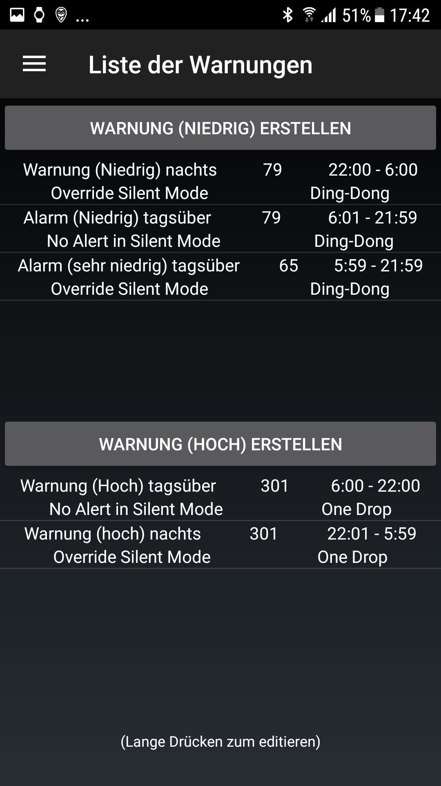

# Sample setup: Samsung S7, Dana RS, Dexcom G6 and Sony Smartwatch

## Περιγραφή

Σε αυτή τη ρύθμιση, το smartphone Samsung Galaxy S7 χρησιμοποιείται ως κέντρο ελέγχου του κυκλώματος. The slightly modified Dexcom App reads glucose values from the Dexcom G6 CGM. AndroidAPS is used to control the Dana RS insulin pump from Korean manufacturer SOOIL via bluetooth. Δεν απαιτούνται άλλες συσκευές.

Δεδομένου ότι η εφαρμογή Dexcom προσφέρει περιορισμένες επιλογές συναγερμού, η εφαρμογή open source xDrip + χρησιμοποιείται για τον ορισμό όχι μόνο υψηλών και χαμηλών συναγερμών αλλά και πρόσθετων συναγερμών σύμφωνα με τις επιμέρους απαιτήσεις.

Προαιρετικά μπορεί να χρησιμοποιηθεί ένα smartwatch wear για Android (σε αυτή τη ρύθμιση δείγματος το Sony Smartwatch 3 (SWR50)) για την εμφάνιση των τιμών γλυκόζης και AndroidAPS στον καρπό σας. Το ρολόι μπορεί ακόμη να χρησιμοποιηθεί για τον έλεγχο του AndroidAPS (δηλ. Διακριτικά να ορίσει ένα bolus γεύματος).

Το σύστημα λειτουργεί εκτός σύνδεσης. Αυτό σημαίνει ότι δεν υπάρχει ανάγκη για σύνδεση δεδομένων από το smartphone στο Internet για λειτουργία.

Παρ 'όλα αυτά, τα δεδομένα μεταφορτώνονται αυτόματα στο Nightscout "στο cloud" όταν δημιουργείται μια σύνδεση δεδομένων. Με αυτόν τον τρόπο μπορείτε να παρέχετε ανά πάσα στιγμή αναλυτικές αναφορές για την επίσκεψη του γιατρού ή να μοιράζεστε τις τρέχουσες αξίες με τα μέλη της οικογένειάς σας. Είναι επίσης δυνατή η αποστολή δεδομένων στη Nightscout μόνο όταν χρησιμοποιείτε μια (προκαθορισμένη) σύνδεση Wi-Fi για να επωφεληθείτε από τις διάφορες αναφορές Nightscout.

## Απαιτούμενος εξοπλισμός

1. Samsung Galaxy S7
    
    * Εναλλακτικά: δείτε [ τη λίστα με τα δοκιμασμένα τηλέφωνα ή ρολόγια](https://docs.google.com/spreadsheets/d/1gZAsN6f0gv6tkgy9EBsYl0BQNhna0RDqA9QGycAqCQc/edit#gid=698881435) για το AndroidAPS

2. [DanaRS](http://www.sooil.com/eng/product/)
    
    * Εναλλακτικά: 
    * [Accu-Chek Combo](../Configuration/Accu-Chek-Combo-Pump.md)
    * [Accu-Check Insight](../Configuration/Accu-Chek-Insight-Pump.md)
    * [DanaR](../Configuration/DanaR-Insulin-Pump.md)
    * [Some old Medtronic pumps (additionally needed: RileyLink/Gnarl hardware, Android Phone with bluetooth low energy / BLE-chipset)](../Configuration/MedtronicPump.md)
    * Other pumps might be available in the future, see [future possible pump drivers](Future-possible-Pump-Drivers.md) for details.

3. [Dexcom G6](https://dexcom.com)
    
    * Εναλλακτικά: δείτε τη λίστα με τις πιθανές [ πηγές γλυκόζης αίματος](../Configuration/BG-Source.rst)

4. Προαιρετικά: Sony Smartwatch 3 (SWR50)
    
    * Alternatives: All [watches with Google Wear OS](https://wearos.google.com/intl/de_de/#find-your-watch) should work fine, for details see [list of tested phones and watches](https://docs.google.com/spreadsheets/d/1gZAsN6f0gv6tkgy9EBsYl0BQNhna0RDqA9QGycAqCQc/edit#gid=698881435) for AndroidAPS (OS must be Android Wear)

## Ρύθμιση του Nightscout

Δείτε λεπτομέρειες [ ρύθμιση Nightscout ](../Installing-AndroidAPS/Nightscout.md)

## Ρύθμιση υπολογιστή

Για να μπορέσετε να δημιουργήσετε μια εφαρμογή Android από τον ελεύθερα διαθέσιμο κώδικα ανοικτού πηγαίου κώδικα AAPS, χρειάζεστε το Android Studio στον υπολογιστή ή στο σημειωματάριό σας (Windows, Mac, Linux). Μια λεπτομερής οδηγία μπορεί να βρεθεί στο [ building the APK ](../Installing-AndroidAPS/Building-APK.md).

Να είστε υπομονετικοί κατά την εγκατάσταση του Android Studio καθώς το λογισμικό κατεβάζει πολλά πρόσθετα δεδομένα μόλις εγκατασταθεί στον υπολογιστή σας.

## Ρύθμιση Smartphone

### Ελέγξτε το υλικολογισμικό του smartphone

* Μενού> Ρυθμίσεις> Πληροφορίες τηλεφώνου> Πληροφορίες λογισμικού: Τουλάχιστον "Android-Version 7.0" (δοκιμάστηκε με επιτυχία μέχρι την έκδοση Android 8.0.0 Oreo - Samsung Experience Version 9.0) 
* Για ενημέρωση υλικολογισμικού: μενού> Προτιμήσεις> ενημέρωση λογισμικού

### Να επιτρέπεται η εγκατάσταση από άγνωστες πηγές

Μενού> Ρυθμίσεις> Ασφάλεια συσκευής> Άγνωστες πηγές> ρυθμιστικό στη δεξιά πλευρά (= ενεργό)

Για λόγους ασφαλείας, αυτή η ρύθμιση θα πρέπει να επαναφέρεται σε ανενεργό μόλις ολοκληρωθεί η εγκατάσταση όλων των εφαρμογών που περιγράφονται εδώ.

### Ενεργοποιήστε το Bluetooth

1. Μενού> Ρυθμίσεις> Συνδέσεις> Bluetooth> ρυθμιστικό στη δεξιά πλευρά (= ενεργό)
2. Μενού> Ρυθμίσεις> Συνδέσεις> Τοποθεσία> ρυθμιστικό στη δεξιά πλευρά (= ενεργό)

Οι υπηρεσίες τοποθεσίας ("GPS") πρέπει να ενεργοποιηθούν για να λειτουργήσει σωστά το Bluetooth.

### Εγκαταστήστε την εφαρμογή Dexcom (τροποποιημένη έκδοση)

Η αρχική εφαρμογή Dexcom από το Google Play Store δεν θα λειτουργήσει επειδή δεν μεταδίδει τις τιμές σε άλλες εφαρμογές. Επομένως, απαιτείται μια έκδοση ελαφρώς τροποποιημένη από την κοινότητα. Μόνο αυτή η τροποποιημένη εφαρμογή Dexcom μπορεί να επικοινωνήσει με το AAPS. Επιπλέον, η τροποποιημένη εφαρμογή Dexcom App μπορεί να χρησιμοποιηθεί με όλα τα Android smartphones όχι μόνο σε αυτά που περιλαμβάνονται στη λίστα συμβατότητας [ της Dexcom ](https://www.dexcom.com/dexcom-international-compatibility).

A mmol/l version and a mg/dl version of the modified Dexcom G6 app are available at <https://github.com/dexcomapp/dexcomapp/tree/master/2.4>. You have to choose G6 [app for your region](../Hardware/DexcomG6#if-using-g6-with-patched-dexcom-app).

To do this perform the following steps on your smartphone:

1. Εάν η αρχική εφαρμογή Dexcom έχει ήδη εγκατασταθεί: 
    * Σταματήστε τον αισθητήρα
    * Uninstall app via Menu > Settings > Apps > Dexcom G6 Mobile > Uninstall
2. Download modified Dexcom app (check unit mg/dl or mmol/l and [region](../Hardware/DexcomG6#if-using-g6-with-patched-dexcom-app) according to your needs): <https://github.com/dexcomapp/dexcomapp/tree/master/2.4>
3. Install modified Dexcom G6 app on your smartphone (= select the downloaded APK file)
4. Start modified Dexcom G6 app, activate/calibrate the sensor according to the given instructions and wait until the warm-up phase is finished.
5. Once the modified Dexcom app shows actual glucose value, setup the warnings (hamburger menu on top left side of the screen) as follows: 
    * Επείγον χαμηλό ` 55mg / dl ` / ` 3.1mmol / l ` (δεν μπορεί να απενεργοποιηθεί)
    * Χαμηλό ` OFF `
    * Υψηλό `OFF`
    * Αύξηση ρυθμού ` OFF `
    * Πτώση ρυθμού ` OFF `
    * Απώλεια σήματος ` OFF `

## Εγκατάσταση AndroidAPS

1. Ακολουθήστε τις οδηγίες για [ δημιουργία του APK ](../Installing-AndroidAPS/Building-APK#generate-signed-apk)
2. [ Μεταφορά ](../Installing-AndroidAPS/Building-APK#transfer-apk-to-smartphone) του παραγόμενου APK στο τηλέφωνό σας
3. [ Διαμορφώστε το AndroidAPS ](../Configuration/Config-Builder.md) ανάλογα με τις ανάγκες σας χρησιμοποιώντας το βοηθό εγκατάστασης ή με μη αυτόματο τρόπο
4. Σε αυτό το δείγμα χρησιμοποιήσαμε (μεταξύ άλλων)

* BG source: `Dexcom G6 App (patched)` -- click cock-wheel and activate `Upload BG data to NS` and `Send BG data to xDrip+` (see [BG source](../Configuration/BG-Source.rst))

* Έχει ενεργοποιηθεί ο NS Client (βλέπε [ Client NS ](../Configuration/Config-Builder#ns-profile) και [ Ρύθμιση Nightscout ](../Installing-AndroidAPS/Nightscout.md))

## Εγκατάσταση xDrip+

xDrip+ is another mature open source app that offers countless possibilities. In this setup, contrary to what the developers first wrote the app for, xDrip+ is not used to collect glucose data from the Dexcom G6, but only to output alarms and to display the current glucose value including the curve on the Android home screen in the widget. With xDrip+ the alarms can be set much more individually than with the Dexcom software, AAPS or Nightscout (no limitation in the selection of sounds, different alarms depending on day/night time etc.).

1. Κατεβάστε την τελευταία σταθερή έκδοση APK του xDrip + με το smartphone σας [ https://xdrip-plus-updates.appspot.com/stable/xdrip-plus-latest.apk ](https://xdrip-plus-updates.appspot.com/stable/xdrip-plus-latest.apk) - όχι την έκδοση από το Google Play Store!
2. Εγκαταστήστε το xDrip + επιλέγοντας το ληφθέν αρχείο APK.
3. Ξεκινήστε το xDrip + και πραγματοποιήστε τις ακόλουθες ρυθμίσεις (μενού χάμπουργκερ στο επάνω αριστερό μέρος) 
    * Ρυθμίσεις> Συναγερμοί και ειδοποιήσεις> Λίστα ειδοποιήσεων επιπέδου γλυκόζης> Δημιουργία ειδοποιήσεων (υψηλή και χαμηλή) ανάλογα με τις ανάγκες σας. 
    * Οι υπάρχοντες συναγερμοί μπορούν να αλλάξουν με μακρύ πάτημα του συναγερμού.
    * Ρυθμίσεις> Συναγερμοί και ειδοποιήσεις> Ειδοποιήσεις βαθμονόμησης: απενεργοποιημένη (υπενθυμίζεται μέσω της τροποποιημένης εφαρμογής Dexcom)
    * Ρυθμίσεις> Πηγή δεδομένων υλικού> 640G / EverSense
    * Ρυθμίσεις> Ρυθμίσεις μεταξύ εφαρμογών> Αποδοχή βαθμονομήσεων> ` ON `
    * Menu > Start sensor (is only "pro forma" and has nothing to do with the running G6 sensor. Αυτό είναι απαραίτητο, διαφορετικά θα εμφανίζεται τακτικά ένα μήνυμα σφάλματος.) 

For more information about xDrip+, see here [BG source page](../Configuration/BG-Source.rst).

### Παράδειγμα ρύθμισης συναγερμού

The "Urgent low alarm" (below 55 mg/dl resp. 3,1 mmol) is a standard alarm from the modified Dexcom app that cannot be disabled.

Tip for meetings / church visits / cinema etc..:

If "Do not disturb" mode is activated in the Samsung Galaxy S7 (Menu > Settings > Sounds and vibration > Do not disturb: slider to right side (= active)), the phone only vibrates during urgent low alarm and does not issue an acoustic warning. For the other alarms set up via xDrip+ you can select whether the silent mode should be ignored (acoustic sound played) or not.

## Απενεργοποιήστε την επιλογή εξοικονόμησης ενέργειας

On your Samsung Galaxy S7 go to Menu > Settings > Device Maintenance > Battery > Unmonitored Apps > + Add apps: Select the apps AndroidAPS, Dexcom G6 Mobile, xDrip+ and Android Wear (if smartwatch is used) one after the other

## Προαιρετικά: Ρύθμιση της συσκευής Sony Smartwatch 3 (SWR50)

With an Android Wear smartwatch life with diabetes can be made even more inconspicuous. The watch can be used to display the current glucose level, the status of the loop etc. on the wrist. Το ρολόι μπορεί ακόμη να χρησιμοποιηθεί για τον έλεγχο του AndroidAPS (δηλ. Διακριτικά να ορίσει ένα bolus γεύματος). To do this, double tap the CGM value of the AAPSv2 watchface. The SWR50 usually runs for a full day until the battery needs to be recharged (same charger as the Samsung Galaxy S7: microUSB).

Details about the information displayed on the watchface can be found [here](../Configuration/Watchfaces.md).

* Εγκαταστήστε την εφαρμογή "Android Wear" στο smartphone σας μέσω του Google Play Store και συνδέστε το smartwatch σύμφωνα με τις οδηγίες εκεί.
* Στο AAPS επιλέξτε μενού χάμπουργκερ (άνω αριστερή γωνία)> Config Builder> Γενικά (στο κάτω μέρος της λίστας)> Φορέστε> ενεργοποιήστε την αριστερή πλευρά, κάντε κλικ στο τιμόνι> ρυθμίσεις Wear και να ενεργοποιείστε ` έλεγχος από ρολόι`
* Στο smartwatch σας: Πατήστε παρατεταμένα το πλήκτρο για να αλλάξετε το ρολόι και επιλέξτε ` AAPSv2 `
* Αν χρειάζεται, κάντε επανεκκίνηση και των δύο συσκευών μία φορά.

## Ρύθμιση αντλίας

see [Dana RS pump](../Configuration/DanaRS-Insulin-Pump.md)