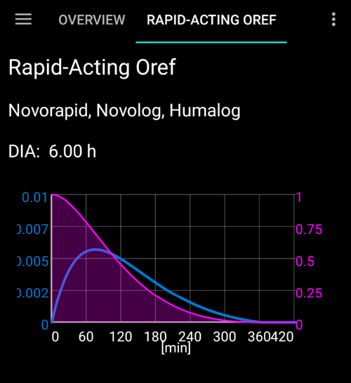

# Οθόνες AndroidAPS

## Αρχική οθόνη

Αυτή είναι η πρώτη οθόνη που θα συναντήσετε όταν ανοίγετε το AndroidAPS και περιέχει τις περισσότερες από τις πληροφορίες που θα χρειαστείτε καθημερινά.

### Ενότητα Α

* πλοηγηθείτε ανάμεσα στις διάφορες λειτουργικές μονάδες του AndroidAPS, μετακινώντας αριστερά ή δεξιά

### Ενότητα Β

* αλλάξτε την κατάσταση του κυκλώματος (ανοικτό κύκλωμα, κλειστό κύκλωμα, κύκλωμα αναστολής κλπ.)
* δείτε το τρέχον προφίλ σας και κάντε [αλλαγή προφίλ](../Usage/Profiles.md)
* δείτε το τρέχον επίπεδο στόχου για τη γλυκόζη αίματος και ορίστε έναν [προσωρινό στόχο](../Usage/temptarget.md).

Πατήστε παρατεταμένα κάποιο από τα κουμπιά για να αλλάξετε τη ρύθμιση. I.e long press the target bar in the upper right ("100" in the screenshot above) to set a temp target.

### Ενότητα Γ

* η πιο πρόσφατη ανάγνωση γλυκόζης αίματος από το CGM σας
* πόσο καιρό πριν διαβάστηκε
* αλλαγές τα τελευταία 15 και 40 λεπτά
* το τρέχον βασικό σας ρυθμό - συμπεριλαμβανομένου οποιουδήποτε προσωρινού βασικού ρυθμού (TBR) που έχει προγραμματιστεί από το σύστημα
* ινσουλίνη επί του οργανισμού (IOB)
* υδατάνθρακες στον οργανισμό (COB)

Οι προαιρετικές[ λυχνίες κατάστασης ](../Configuration/Preferences#overview)(CAN | INS | RES | SEN | BAT) δίνουν μια οπτική προειδοποίηση για χαμηλό επίπεδο δεξαμενής και μπαταρίας, καθώς και για καθυστερημένη αλλαγή τοποθεσίας.

Η ένδειξη ινσουλίνης στον οργανισμό θα είναι μηδενική, εάν εκτελείται μόνο το βασικό σας ρυθμό και δεν υπήρχε ινσουλίνη που να παραμένει από προηγούμενες βόλτες. Οι αριθμοί στις αγκύλες δείχνουν πόσο αποτελείται από την ινσουλίνη που απομένει από τις προηγούμενες bolus και πόσο είναι βασική διακύμανση λόγω προηγούμενων προγραμματισμένων από το AAPS TBR. Αυτή η δεύτερη συνιστώσα μπορεί να είναι αρνητική εάν πρόσφατα υπήρχαν περίοδοι μειωμένης βασικής.

### Ενότητα Δ

Κάντε κλικ στο βέλος στη δεξιά πλευρά της οθόνης στην ενότητα Δ για να επιλέξετε ποιες πληροφορίες εμφανίζονται στα παρακάτω γραφήματα.

### Ενότητα Ε

Είναι το γράφημα που δείχνει τη γλυκόζη αίματος (BG) όπως διαβάζεται από την οθόνη γλυκόζης σας (CGM) και εμφανίζει ειδοποιήσεις Nightscout, όπως βαθμονομήσεις fingerstick και καταχωρήσεις υδατανθράκων.

Πατήστε παρατεταμένα το γράφημα για να αλλάξετε τη χρονική κλίμακα. Μπορείτε να επιλέξετε 6, 8, 12, 18 ή 24 ώρες.

Οι εκτεταμένες γραμμές δείχνουν τους προβλεπόμενους υπολογισμούς και τάσεις BG - εάν το έχετε επιλέξει.

* **Orange** line: [COB](../Usage/COB-calculation.rst) (colour is used generally to represent COB and carbs)
   
   Prediction line shows where your BG (not where cob itself!) will go based on the current pump settings and assuming that the deviations due carb absorption remain constant. This line only appears if there are known COB.

* **Dark blue** line: IOB (colour is used generally to represent IOB and insulin)
   
   Prediction line shows what would happen under the influence of insulin only. For example if you dialled in some insulin and then didn’t eat any carbs.

* **Light blue** line: zero-temp (predicted BG if temporary basal rate at 0% would be set)
   
   Prediction line shows how the IOB trajectory line would change if the pump stopped all insulin delivery (0% TBR).

* **Dark yellow** line: [UAM](../Configuration/Sensitivity-detection-and-COB#sensitivity-oref1) (un-announced meals)
   
   Unannounced meals means that a significant increase in glucose levels due to meals, adrenaline or other influences is detected. Prediction line is similar to the ORANGE COB line but it assumes that the deviations will taper down at a constant rate (by extending the current rate of reduction).

Usually your real glucose curve ends up in the middle of these lines, or close to the one which makes assumptions that closest resemble your situation.

The **solid blue** line shows the basal delivery of your pump. The **dotted blue** line is what the basal rate would be if there were no temporary basal adjustments (TBRs) and the solid blue line is the actual delivery over time.

The **thin yellow** line shows the activity of Insulin. It is based on the expected drop in BG of the insulin in your system if no other factors (like carbs) were present.

### Ενότητα Ζ

This section is also configurable using the options in section D.

* **Insulin On Board** (blue chart): It shows the insulin you have on board. If there were no TBRs, SMBs and no remaining boluses this would be zero. Decaying depends on your DIA and insulin profile settings. 
* **Carbs On Board** (orange chart): It shows the carbs you have on board. Decaying depends on the deviations the algorithm detects. If it detects a higher carb absorption than expected, insulin would be given and this will increase IOB (more or less, depending on your safety settings). 
* **Deviations**: 
   * **GREY** bars show a deviation due to carbs. 
   * **GREEN** bars show that BG is higher than the algorithm expected it to be. 
   * **RED** bars show that BG is lower than the algorithm expected.
* **Sensitivity** (white line): It shows the sensitivity that [Autosens](../Usage/Open-APS-features#autosens) has detected. Sensitivity is a calculation of sensitivity to insulin as a result of exercise, hormones etc.
* **Activity** (yellow line): It shows the activity of insulin, calculated by your insulin profile (it's not derivative of IOB). The value is higher for insulin closer to peak time. It would mean to be negative when IOB is decreasing. 

### Ενότητα Η

Enables you to administer a bolus (normally you would use the Calculator button to do this) and to add a fingerstick CGM calibration. Also a Quick Wizard button would be displayed here if configured in [Config Builder](../Configuration/Config-Builder#quickwizard-settings).

## Η Αριθμομηχανή

When you want to make a meal bolus this is where you will normally make it from.

### Ενότητα Α

contains is where you input the information about the bolus that you want. The BG field is normally already populated with the latest reading from your CGM. If you don't have a working CGM then it will be blank. In the CARBS field you add your estimate of the amount of carbs - or equivalent - that you want to bolus for. The CORR field is if you want to modify the end dosage for some reason, and the CARB TIME field is for pre-bolusing so you can tell the system that there will be a delay before the carbs are to be expected. You can put a negative number in this field if you are bolusing for past carbs.

SUPER BOLUS is where the basal insulin for the next two hours is added to the immediate bolus and a zero TBR is issued for the following two hours to take back the extra insulin. The idea is to deliver the insulin sooner and hopefully reduce spikes.

### Ενότητα Β

shows the calculated bolus. If the amount of insulin on board already exceeds the calculated bolus then it will just display the amount of carbs still required.

### Ενότητα Γ

shows the various elements that have been used to calculate the bolus. You can deselect any that you do not want to include but you normally wouldn't want to.

### Συνδυασμοί COB και IOB και τι σημαίνουν

<ul>
    <li>If you tick COB and IOB unabsorbed carbs that are not already covered with insulin + all insulin that has been delivered as TBR or SMB will be taken into account</li>
    <li>If you tick COB without IOB you run the risk of too much insulin as AAPS is not accounting for what’s already given. </li>
    <li>If you tick IOB without COB, AAPS takes account of already delivered insulin but won’t cover that off against any carbs still to be absorbed. This leads to a 'missing carbs' notice.
</ul>

If you bolus for additional food shortly after a meal bolus (i.e. additional desert) it can be helpful to untick all boxes. This way just the new carbs are being added as the main meal won't necessarily be absorbed so IOB won't match COB accurately shortly after a meal bolus.

### Λανθασμένη ανίχνευση COB

If you see the warning above after using bolus wizard, AndroidAPS has detected that the calculated COB value maybe wrong. So, if you want to bolus again after a previous meal with COB you should be aware of overdosing! For details see the hints on [COB calculation page](../Usage/COB-calculation#detection-of-wrong-cob-values).

## Προφίλ ινσουλίνης

This shows the activity profile of the insulin you have chosen. The PURPLE line shows how much insulin remains after it has been injected as it decays with time and the BLUE line shows how active it is.

You will normally be using one of the Oref profiles - and the important thing to note is that the decay has a long tail. If you have been used to manual pumping you have probably been used to assuming that insulin decays over about 3.5 hours. However, when you are looping the long tail matters as the calculations are far more precise and these small amounts add up when they are subjected to the recursive calculations in the AndroidAPS algorithm.

For a more detailed discussion of the different types of insulin, their activity profiles and why all this matters you can read an article here on [Understanding the New IOB Curves Based on Exponential Activity Curves](https://openaps.readthedocs.io/en/latest/docs/While%20You%20Wait%20For%20Gear/understanding-insulin-on-board-calculations.html#understanding-the-new-iob-curves-based-on-exponential-activity-curves)

And you can read an excellent blog article about it here: [Why we are regularly wrong in the duration of insulin action (DIA) times we use, and why it matters…](http://www.diabettech.com/insulin/why-we-are-regularly-wrong-in-the-duration-of-insulin-action-dia-times-we-use-and-why-it-matters/)

And more at: [Exponential Insulin Curves + Fiasp](http://seemycgm.com/2017/10/21/exponential-insulin-curves-fiasp/)

## Κατάσταση Αντλίας

Here we see the status of the insulin pump - in this case an Accu-Chek Combo. The information displayed is self-explanatory. A long press on the HISTORY button will read the data from your pump history, including your basal profile. But remember only one basal profile is supported on the Combo pump.

## Πύλη φροντίδας

Careportal replicated the functions you will find on your Nightscout screen under the “+” symbol which allows you to add notes to your records.

### Carb correction

Treatment tab can be used to correct faulty carb entries (i.e. you over- or underestimated carbs).

1. Check and remember actual COB and IOB on homescreen.
2. Depending on pump in treatment tab carbs might be shown together with insulin in one line or as a separate entry (i.e. with Dana RS).
   
   

3. Remove the entry with the faulty carb amount.

4. Make sure carbs are removed successfully by checking COB on homescreen again.
5. Do the same for IOB if there is just one line in treatment tab including carbs and insulin.
   
   -> If carbs are not removed as intended and you add additional carbs as explained here (6.), COB will be too high and that might lead to too high insulin delivery.

6. Enter correct carb amount through carbs button on homescreen and make sure to set the correct event time.

7. If there is just one line in treatment tab including carbs and insulin you have to add also the amount of insulin. Make sure to set the correct event time and check IOB on homescreen after confirming the new entry.

## Κύκλωμα, MA, AMA, SMB

You don't normally need to worry about these, they show the results of the OpenAPS algorithm which runs each time the system gets a fresh reading from the CGM. These are discussed elsewhere.

## Προφίλ

AndroidAPS can run using a number of different profile configurations. Typically - as shown here - the Nightscout profile has been downloaded via the built in Nightscout client and is displayed here in read-only form. If you wanted to make any changes you would do this from your Nightscout user interface and then do a [Profile Switch](../Usage/Profiles.md) in AndroidAPS to activate the changes. Data such as the basal profile would then be automatically copied over to your pump.

**DIA:** stands for Duration of Insulin Action and it is discussed above in the section on insulin profiles.

**IC:** is Insulin to Carb ratio. This profile has a number of different values set for different times of day.

**ISF:** is Insulin Sensitivity Factor - the amount by which one unit of insulin will reduce your blood glucose assuming that nothing else changes.

**Basal:** is the basal profile programmed into your pump.

**Target:** is the blood glucose level that you want the rig to be aiming for all the time. You can set different levels for different times of day if you wish, and you can even set an upper and lower range so that the rig will only start to make changes when the predicted blood glucose value falls outside, but if you do that then the rig will respond more slowly and you are unlikely to achieve such stable blood sugars.

## Θεραπεία, xDrip, NSClient

These are simply logs of treatments (boluses and carbs), xDrip messages and messages sent to Nightscout via the built-in Nightscout client. You don't normally need to worry about any of these unless there is a problem.

## Διαμόρφωση

This is where you will set up the configuration of your AndroidAPS rig. This screenshot shows a pretty typical rig using a Combo pump, a Dexcom G5 CGM sensor being managed via xDrip+ and running with NovoRapid insulin on an Oref profile and connected to a Nightscout cloud based server.

The tick box on the right determines if that particular module will be displayed in the top menu bar (see section A at Homescreen) and the small gear wheel symbol allows access to the setting for that module, if there are any.

## Ρυθμίσεις και προτιμήσεις

At the top right of the navigation bar you will find three small vertical dots. Pressing on these takes you to the app's preferences, history browser, setup wizard, about the app information and the exit button that will close AAPS.