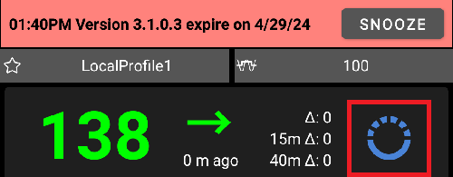

Σημειώσεις έκδοσης
**************************************************
Please follow the instructions in the `update manual <../Installing-AndroidAPS/Update-to-new-version.html>`_. Μπορείτε επίσης να βρείτε μια ενότητα αντιμετώπισης προβλημάτων που αντιμετωπίζει τις πιο συνήθεις δυσκολίες κατά την ενημέρωση στη σελίδα του εγχειριδίου ενημέρωσης.

You will receive the following information as soon as a new update is available:

Τότε έχετε 60 ημέρες για να ενημερώσετε. If you do not update within these 60 days AAPS will fall back to LGS (low glucose suspend - see `glossary <../Getting-Started/Glossary.html>`_) as in `objective 6 <../Usage/Objectives.html>`_.

Αν δεν ενημερώσετε για άλλες 30 ημέρες (90 ημέρες από την ημερομηνία νέας κυκλοφορίας), το AAPS θα μεταβεί σε ανοιχτό κύκλωμα.

Σας παρακαλούμε να καταλάβετε ότι αυτή η αλλαγή δεν έχει σκοπό να σας δυσκολέψει, αλλά γίνετε για λόγους ασφαλείας. Οι νέες εκδόσεις του AndroidAPS δεν παρέχουν μόνο νέες λειτουργίες αλλά και σημαντικές διορθώσεις ασφαλείας. Ως εκ τούτου, είναι απαραίτητο κάθε χρήστης να ενημερώνει όσων το δυνατό πιο γρήγορα.. Δυστυχώς υπάρχουν ακόμα αναφορές σφαλμάτων από πολύ παλιές εκδόσεις, γι 'αυτό προσπαθείστε να βελτιώσετε την ασφάλεια για κάθε χρήστη και ολόκληρη την κοινότητα του DIY. Ευχαριστώ για την κατανόηση.

Version 2.7.0
================
Release date: 24-09-2020

Repository location changed to https://github.com/nightscout/AndroidAPS . If you are not familiar with git the easiest way for update is remove directory with AndroidAPS and do a new clone.

Please use `Android Studio 3.6.1 <https://developer.android.com/studio/>`_ or newer to build the apk. Gradle Plugin Version should be 3.6.4 and Gradle Version 5.6.4.

**Make sure to check and adjust settings after updating to 2.7 as described** `here <../Installing-AndroidAPS/update2_7.html>`_.

You need at least start Objective 11 in order to continue using Automation feature (all previous objectives must be completed otherwise starting Objective 11 is not possible).

Σημαντικά νέα χαρακτηριστικά
----------------------
* internal use of dependency injection, updates libraries, code rewritten to kotlin @MilosKozak @AdrianLxM
* using modules for Dana pumps @MilosKozak
* `new layout, layout selection <../Getting-Started/Screenshots.html>`_ @MilosKozak
* new `status lights layout <../Configuration/Preferences.html#status-lights>`_ @MilosKozak
* `multiple graphs support <../Getting-Started/Screenshots.html#section-f---main-graph>`_ @MilosKozak
* `Profile helper <../Configuration/profilehelper.html>`_ @MilosKozak
* visualization of `dynamic target adjustment <../Getting-Started/Screenshots.html#visualization-of-dynamic-target-adjustment>`_ @Tornado-Tim
* new `preferences layout <../Configuration/Preferences.html>`_ @MilosKozak
* SMB algorithm update @Tornado-Tim
* `Low glucose suspend mode <../Configuration/Preferences.html#aps-mode>`_ @Tornado-Tim
* `carbs required notifications <../Configuration/Preferences.html#carb-required-notification>`_ @twain47 @Tornado-Tim
* removed Careportal (moved to Actions) @MilosKozak
* `new encrypted backup format <../Usage/ExportImportSettings.html>`_ @dlvoy
* `new SMS TOTP authentication <../Children/SMS-Commands.html>`_ @dlvoy
* `new SMS PUMP CONNECT, DISCONNECT <../Children/SMS-Commands.html#commands>`_ commands @Lexsus
* better support for tiny basals on Dana pumps @Mackwe
* small Insight fixes @TebbeUbben @MilosKozak
* `"Default language" option <../Configuration/Preferences.html#general>`_ @MilosKozak
* vector icons @Philoul
* `set neutral temps for MDT pump <../Configuration/MedtronicPump.html#configuration-of-phoneandroidaps>`_ @Tornado-Tim
* History browser improvements @MilosKozak
* removed OpenAPS MA algorithm @Tornado-Tim
* removed Oref0 sensitivity @Tornado-Tim
* `Biometric or password protection <..../Configuration/Preferences.html#protection>`_ for settings, bolus @MilosKozak
* `new automation trigger <../Usage/Automation.html>`_ @PoweRGbg
* `Open Humans uploader <../Configuration/OpenHumans.html>`_

Version 2.6.1.4
================
Release date: 04-05-2020

Please use `Android Studio 3.6.1 <https://developer.android.com/studio/>`_ or newer to build the apk.

Σημαντικά νέα χαρακτηριστικά
----------------------
* Insight: Disable vibration on bolus for firmware version 3 - second attempt
* Otherwise is equal to 2.6.1.3. Update is optional. 

Version 2.6.1.3
================
Release date: 03-05-2020

Please use `Android Studio 3.6.1 <https://developer.android.com/studio/>`_ or newer to build the apk.

Σημαντικά νέα χαρακτηριστικά
-----
* Insight: Disable vibration on bolus for firmware version 3
* Otherwise is equal to 2.6.1.2. Update is optional. 

Version 2.6.1.2
================
Release date: 19-04-2020

Please use `Android Studio 3.6.1 <https://developer.android.com/studio/>`_ or newer to build the apk.

Σημαντικά νέα χαρακτηριστικά
-----
* Fix crashing in Insight service
* Otherwise is equal to 2.6.1.1. If you are not affected by this bug you don't need to upgrade.

Version 2.6.1.1
================
Release date: 06-04-2020

Please use `Android Studio 3.6.1 <https://developer.android.com/studio/>`_ or newer to build the apk.

Σημαντικά νέα χαρακτηριστικά
-----
* Resolves SMS CARBS command issue while using Combo pump
* Otherwise is equal to 2.6.1. If you are not affected by this bug you don't need to upgrade.

Version 2.6.1
==============
Release date: 21-03-2020

Please use `Android Studio 3.6.1 <https://developer.android.com/studio/>`_ or newer to build the apk.

Σημαντικά νέα χαρακτηριστικά
-----
* Allow to enter only https:// in NSClient settings
* Fixed `BGI <../Getting-Started/Glossary.html>`_ displaying bug on watches
* Fixed small UI bugs
* Fixed Insight crashes
* Fixed future carbs with Combo pump
* Fixed `LocalProfile -> NS sync <../Configuration/Config-Builder.html#upload-local-profiles-to-nightscout>`_
* Insight alerts improvements
* Improved detection of boluses from pump history
* Fixed NSClient connection settings (wifi, charging)
* Fixed sending of calibrations to xDrip

Version 2.6.0
==============
Release date: 29-02-2020

Please use `Android Studio 3.6.1 <https://developer.android.com/studio/>`_ or newer to build the apk.

Σημαντικά νέα χαρακτηριστικά
-----
* Small design changes (startpage...)
* Careportal tab / menu removed - more details `here <../Usage/CPbefore26.html>`_
* New `Local Profile plugin <../Configuration/Config-Builder.html#local-profile-recommended>`_

  * Local profile can hold more than 1 profile
  * Profiles can be cloned and edited
  * Ability of upload profiles to NS
  * Old profile switches can be cloned to new profile in LocalProfile (timeshift and percentage is applied)
  * Veritical NumberPicker for targets
* SimpleProfile is removed
* `Extended bolus <../Usage/Extended-Carbs.html#id1>`_ feature - closed loop will be disabled
* MDT plugin: Fixed bug with duplicated entries
* Units are not specified in profile but it's global setting
* Added new settings to startup wizard
* Different UI and internal improvements
* `Wear complications <../Configuration/Watchfaces.html>`_
* New `SMS commands <../Children/SMS-Commands.html>`_ BOLUS-MEAL, SMS, CARBS, TARGET, HELP
* Fixed language support
* Objectives: `Allow to go back <../Usage/Objectives.html#go-back-in-objectives>`_, Time fetching dialog
* Automation: `allow sorting <../Usage/Automation.html#sort-automation-rules>`_
* Automation: fixed bug when automation was running with disabled loop
* New status line for Combo
* GlucoseStatus improvement
* Fixed TempTarget NS sync
* New statistics activity
* Allow Extended bolus in open loop mode
* Android 10 alarm support
* Tons on new translations

Version 2.5.1
==================================================
Release date: 31-10-2019

Please note the `important notes <../Installing-AndroidAPS/Releasenotes.html#important-notes>`_ and `limitations <../Installing-AndroidAPS/Releasenotes.html#is-this-update-for-me-currently-is-not-supported>`_ listed for `version 2.5.0 <../Installing-AndroidAPS/Releasenotes.html#version-2-5-0>`_. 
* Fixed a bug in the network state receiver that lead to crashes with many (not critical but would waste a lot of energy re-calculating things).
* New versioning that will allow to do minor updates without triggering the update-notification.

Version 2.5.0
==================================================
Release date: 26-10-2019

Σημαντικές σημειώσεις
--------------------------------------------------
* Please use `Android Studio Version 3.5.1 <https://developer.android.com/studio/>`_ or newer to `build the apk <../Installing-AndroidAPS/Building-APK.html>`_ or `update <../Installing-AndroidAPS/Update-to-new-version.html>`_.
* If you are using xDrip `identify receiver <../Configuration/xdrip.html#identify-receiver>`_ must be set.
* If you are using Dexcom G6 with the `patched Dexcom app <../Hardware/DexcomG6.html#if-using-g6-with-patched-dexcom-app>`_ you will need the version from the `2.4 folder <https://github.com/dexcomapp/dexcomapp/tree/master/2.4>`_.
* Glimp is supported from version 4.15.57 and newer.

Is this update for me? Currently is NOT supported
--------------------------------------------------
* Android 5 and lower
* Poctech
* 600SeriesUploader
* Patched Dexcom from 2.3 directory

Σημαντικά νέα χαρακτηριστικά
--------------------------------------------------
* Internal change of targetSDK to 28 (Android 9), jetpack support
* RxJava2, Okhttp3, Retrofit support
* Old `Medtronic pumps <../Configuration/MedtronicPump.html>`_ support (RileyLink need)
* New `Automation plugin <../Usage/Automation.html>`_
* Allow to `bolus only part <../Configuration/Preferences.html#advanced-settings>`_ from bolus wizard calculation
* Rendering insulin activity
* Adjusting IOB predictions by autosense result
* New support for patched Dexcom apks (`2.4 folder <https://github.com/dexcomapp/dexcomapp/tree/master/2.4>`_)
* Signature verifier
* Allow to bypass objectives for OpenAPS users
* New `objectives <../Usage/Objectives.html>`_ - exam, application handling
   
   (If you started at least objective "Starting on an open loop" in previous versions exam is optional.)
* Fixed bug in Dana* drivers where false time difference was reported
* Fixed bug in `SMS communicator <../Children/SMS-Commands.html>`_

Version 2.3
==================================================
Release date: 25-04-2019

Σημαντικά νέα χαρακτηριστικά
--------------------------------------------------
* Important safety fix for Insight (really important if you use Insight!)
* Fix History-Browser
* Fix delta calculations
* Language updates
* Check for GIT and warn on gradle upgrade
* More automatic testing
* Fixing potential crash in AlarmSound Service (thanks @lee-b !)
* Fix broadcast of BG data (works independently of SMS permission now!)
* New Version-Checker

Version 2.2.2
==================================================
Release date: 07-04-2019

Σημαντικά νέα χαρακτηριστικά
--------------------------------------------------
* Autosens fix: deactivate TT raises/lowers target
* New translations
* Insight driver fixes
* SMS plugin fix

Version 2.2
==================================================
Release date: 29-03-2019

Σημαντικά νέα χαρακτηριστικά
--------------------------------------------------
* `DST fix <../Usage/Timezone-traveling.html#time-adjustment-daylight-savings-time-dst>`_
* Wear Update
* `SMS plugin <../Children/SMS-Commands.html>`_ update
* Go back in objectives.
* Stop loop if phone disk is full

Version 2.1
==================================================
Release date: 03-03-2019

Σημαντικά νέα χαρακτηριστικά
--------------------------------------------------
* `Accu-Chek Insight <../Configuration/Accu-Chek-Insight-Pump.html>`_ support (by Tebbe Ubben and JamOrHam)
* Status lights on main screen (Nico Schmitz)
* Daylight saving time helper (Roumen Georgiev)
* Fix processing profile names comming from NS (Johannes Mockenhaupt)
* Fix UI blocking (Johannes Mockenhaupt)
* Support for updated G5 app (Tebbe Ubben and Milos Kozak)
* G6, Poctech, Tomato, Eversense BG source support (Tebbe Ubben and Milos Kozak)
* Fixed disabling SMB from preferences (Johannes Mockenhaupt)

Misc
--------------------------------------------------
* If you are using non default `smbmaxminutes` value you have to setup this value again

Version 2.0
==================================================
Release date: 03-11-2018

Σημαντικά νέα χαρακτηριστικά
--------------------------------------------------
* oref1/SMB support (`oref1 documentation <https://openaps.readthedocs.io/en/latest/docs/Customize-Iterate/oref1.html>`_) Be sure to read the documentation to know what to expect of SMB, how it will behave, what it can achive and how to use it so it can operate smoothly.
* `_Accu-Chek Combo <../Configuration/Accu-Chek-Combo-Pump.html>`_ pump support
* Setup wizard: guides you through the process of setting up AndroidAPS

Settings to adjust when switching from AMA to SMB
--------------------------------------------------
* Objective 10 must be started for SMBs to be enabled (SMB tab generally shows what restrictions apply)
* maxIOB now includes _all_ IOB, not just added basal. That is, if given a bolus of 8 U for a meal and maxIOB is 7 U, no SMBs will be delivered until IOB drops below 7 U.
* min_5m_carbimpact default has changed from 3 to 8 going from AMA to SMB. Εάν κάνετε αναβάθμιση από AMA σε SMB, πρέπει να το αλλάξετε χειροκίνητα
* Note when building AndroidAPS 2.0 apk: Configuration on demand is not supported by the current version of the Android Gradle plugin! Εάν η κατασκευή σας αποτύχει με σφάλμα σχετικά με τη διαμόρφωση "κατά παραγγελία", μπορείτε να κάνετε τα εξής:

   * Open the Preferences window by clicking File > Settings (on Mac, Android Studio > Preferences).
   * In the left pane, click Build, Execution, Deployment > Compiler.
   * Uncheck the Configure on demand checkbox.
   * Click Apply or OK.

Overview tab
--------------------------------------------------
* Top ribbon gives access to suspend/disable loop, view/adjust profile and to start/stop temporary targets (TTs). TTs use defaults set in preferences. The new Hypo TT option is a high temp TT to prevent the loop from too aggressively overcorrection rescue carbs.
* Treatment buttons: old treatment button still available, but hidden by default. Visibility of buttons can now be configured. New insulin button, new carbs button (including `eCarbs/extended carbs <../Usage/Extended-Carbs.html>`_)
* `Colored prediction lines <../Getting-Started/Screenshots.html#section-e>`_
* Option to show a notes field in insulin/carbs/calculator/prime+fill dialogs, which are uploaded to NS
* Updated prime/fill dialog allows priming and creating careportal entries for site change and cartridge change

Watch
--------------------------------------------------
* Separate build variant dropped, included in regular full build now. To use bolus controls from watch, enable this setting on the phone
* Wizard now only asks for carbs (and percentage if enabled in watch settings). Which parameters are included in the calculation can be configured in the settings on the phone
* confirmations and info dialogs now work on wear 2.0 as well
* Added eCarbs menu entry

New plugins
--------------------------------------------------
* PocTech app as BG source
* Dexcom patched app as BG source
* oref1 sensitivity plugin

Misc
--------------------------------------------------
* App now uses drawer to show all plugins; plugins selected as visible in config builder are shown as tabs on top (favourites)
* Overhaul for config builder and objectives tabs, adding descriptions
* New app icon
* Lots of improvements and bugfixes
* Nightscout-independant alerts if pump is unreachable for a longer time (e.g. depleted pump battery) and missed BG readings (see _Local alerts_ in settings)
* Option to keep screen on
* Option to show notification as Android notification
* Advanced filtering (allowing to always enable SMB and 6h after meals) supported with patched Dexcom app or xDrip with G5 native mode as BG source.
