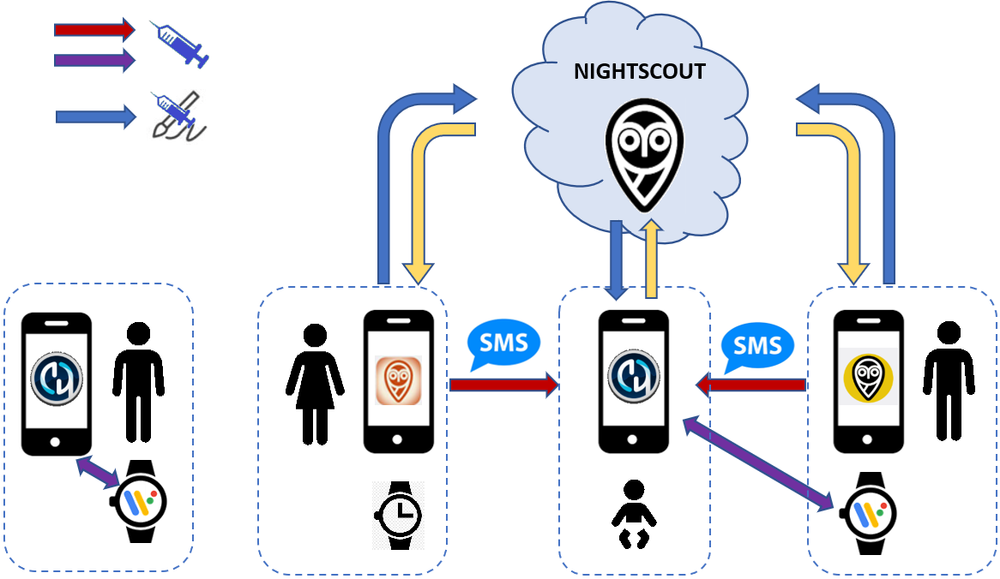

# Remote control of AAPS
There are four highly effective tools for remotely managing **AAPS**:

1) [SMS commands](RemoteControl_SMS-Commands) (follower phone can be either Android or iOS), 2) [AAPSClient](RemoteControl_aapsclient) (follower phone is Android) 3) [Nightscout](RemoteControl_nightscout) (Android, iOS or other computer/device).  
4) [Smartwatches](RemoteControl_smartwatches) (Android)

The first three are mostly appropriate for caregivers/parents, but smartwatches are very useful for caregivers/parents **and** for adults with diabetes themselves.

(RemoteControl_SMS-Commands)=

## 1) SMS Commands

See the dedicated [SMS Commands](../RemoteFeatures/SMSCommands.md) page.

(RemoteControl_aapsclient)=
## 2) AAPSClient

_Note that **NSClient** has been replaced by **AAPSClient** for AAPS version 3.2 and higher, check the version release notes for more information._

For versions of **AAPS** which are older than AAPS 3.2, if you have a caregiver/parent Android phone you can directly download and install the [**AAPSClient**](https://github.com/nightscout/AndroidAPS/releases/) apk. **AAPSClient** looks very similar in appearance to **AAPS** itself, offering the caregiver tabs that will remotely action commands in **AAPS**:

There are 2 versions of the apk that can be [downloaded from here](https://github.com/nightscout/AndroidAPS/releases/),  **AAPSClient** & **AAPSClient2** which have a subtle but important difference as explained below.

**AAPSClient** can be installed on a single phone or multiple follower phones (i.e. parent 1’s follower phone and parent 2’s follower phone) in order for both caregivers to be granted access and remote control a patient's **AAPS** phone.

Should a caregiver require a second copy of **AAPSClient** to remote control an additional patient with a Nightscout account, they should install **AAPSClient2** in addition to **AAPSClient**. **AAPSClient 2** allows a single caregiver to install the **AAPSClient** apk twice on the same follower phone in order to be given simultaneous access and remote control to two different patients.

To download **AAPSClient**, navigate to [here](https://github.com/nightscout/AndroidAPS/releases/) and click on the asset **“app-AAPSClient-release_x.x.x.x”** (it may be a newer version to that shown in the screenshot below):

Then go to  _downloads_ on your computer. On Windows, -downloads_ will show the right hand ribbon:

Once downloaded, click _show in folder_ to locate the file.

The **AAPSClient** apk can now be either:

Transferred by a USB cable onto the follower phone; or Dragged into Google drive folder, and then added onto the follower phone by clicking on the "app-AAPSClient-release" file.

### Synchronization- AAPSClient and AAPS set up (for Version 3.2.0.0 above)

Once __AAPSClient__ apk is installed on the follower phone, the user must ensure their ‘Preferences’ in Config Builder are correctly set up and aligned with __AAPS__ for Nightscout 15 (see Release Notes [here](../Maintenance/UpdateToNewVersion)). The example below provides Synchronization guidance for NSClient and NSClientV3 using Nightscout15 but there are other options available with __AAPS__ (e.g xDrip+).

Within the ‘Synchronization’ located under ‘Config Builder’, the user can opt for either Synchronization options for both __AAPS__ and follower phone being:

- Option 1: NSClient (also known as ‘v1’) - which synchronizes the user’s data with Nightscout; or

- Option 2: NSClientV3 (also referred to as ‘v3’).- which synchronizes the user’s data with Nightscout using v3 API.

The user must ensure that __both__ the AAPS and AAPS Client phones are synched together by actioning either option for v1 or v3 being:

Option 1: v1 for both phones:

- Enter your Nightscout URL

- Enter your API secret

Option 2: v3 for both phones:

- Enter your Nightscout URL under NSClientV3 tab

- Enter your NS access token under ‘Config Build’ tab. Please follow the notes [here](https://nightscout.github.io/nightscout/security/#create-a-token)

If selecting Websockets (which is optional) ensure this is activated or deactivated for both __AAPS’__ and __AAPSClient’s__ phone. Activating Websockets in __AAPS__ and not within __AAPSClient__ (and vice versa) will only cause __AAPS__ to malfunction. By enabling websockets will allow for faster synchronization with Nightscout but may lead to more phone battery consumption.

Users should ensure that both __AAPSClient__ and __AAPS__ are showing  ‘connected’ under the ‘NSClient' tab for each phone, and that ‘Profile Switches’ or ‘Temp Target' can be correctly activated in __AAPS__ once selected in __AAPSClient__.

Users should also ensure that carbs are logged in both ‘Treatments’ within both __AAPSClient__ and __AAPS__ otherwise this could indicate a malfunction within the user’s set up.

### Troubleshooting 'NS access token' configuration issues

The precise 'NS access token' configuration may differ depending upon whether your Nightscout provider is a paid for hosted site or not.

If you are struggling with **AAPS** v3 to accept the 'NS access token' and using a paid for hosted Nightscout site, you may wish to first liaise with your Nightscout provider on how to resolve the 'NS access token' difficulties. Otherwise, please reach out to the **AAPS** group but please double check that you have correctly followed the notes before doing so [here](https://nightscout.github.io/nightscout/security/#create-a-token).

### Features of AAPSClient include:

| Tab / Hamburger     | Features                                                                                                                                                                                              |
| ------------------- | ----------------------------------------------------------------------------------------------------------------------------------------------------------------------------------------------------- |
| **Action** Tab      | - Profile Switch  - Temp Target - BG Check - CGM Sensor Insert - Note - Exercise - Announcement - Question? - History Browser |
| **Food** Tab        |                                                                                                                                                                                                       |
| **Treatments** Tab  | - Check Treatments delivered including bolus and carbs entered                                                                                                                                        |
| **Maintenance** Tab | - Export and Import Settings                                                                                                                                                                          |
| **Profile** Tab     | - Creating new profile - Profile switch                                                                                                                                                      |

**AAPSClient** allows the caregiver to make many of the adjustments that are allowed directly in **AAPS** (excluding insulin boluses) remotely, via the mobile or internet network. The main benefits of **AAPSClient** are the speed and ease with which caregivers/parents can use it to remotely control **APPS**. __AAPSClient__ _can_ be much faster than entering SMS Commands, if delivering a command which would require authentication. Commands entered on **AAPSClient** are uploaded onto Nightscout.

Remote control through **AAPSClient** is only recommended if your synchronization is working well (_i.e._ you don’t see unwanted data changes like self-modification of TT, TBR etc) see [release notes for Version 2.8.1.1](#important-hints-2-8-1-1) for further details.

### AAPSClient with smartwatch options

A smartwatch can be a very useful tool for helping to manage **AAPS** with kids. A couple of different configurations are possible. If **AAPSClient** is installed on the parents phone, the [**AAPSClient WearOS** app](https://github.com/nightscout/AndroidAPS/releases/) can be downloaded and installed on a compatible smartwatch which is connected to the parent's phone. Αυτό θα εμφανίσει την τρέχουσα γλυκόζη αίματος, την κατάσταση του συστήματος και θα επιτρέψει την καταχώρηση υδατανθράκων, προσωρινών στόχων και τις αλλαγές προφίλ. ΔΕΝ θα επιτρέψει γευματική δόση ινσουλίνης από την εφαρμογή WearOS. You can read more about Smartwatches [here](#4-smartwatches).

(RemoteControl_nightscout)=
## 3) Nightscout

As well as Nightscout being a server in “the Cloud”, there is also a dedicated **Nightscout** app which can be downloaded directly from the App Store on your iPhone. If you have an Android follower phone, there is not a dedicated Nightscout app and it is better to use [**AAPSClient**](#2-aapsclient), or, if you only want to follow, and not send treatments you can download and install the [Nightwatch](https://play.google.com/store/apps/details?id=se.cornixit.nightwatch) app from the Playstore.

Once you have installed the **Nightscout** app on your iPhone, open the app and follow the set-up prompts, entering your Nightscout address (see below, left). The form of this may vary depending on how your Nightscout is hosted. (_e.g._ http://youraddresshere.herokuapp.com). Then enter your Nightscout API secret (see below, right). If not prompted for your API password, then you need to enter this by clicking on the padlock at the top of the app:

More info on setup is available directly from [Nightscout](https://nightscout.github.io/nightscout/discover/)

When you first log in, you will have a very simple display. Customize the display options, by selecting the “hamburger” in the top right and scrolling down:

Scroll down through to “Settings”. You may wish to change the “scale” to “linear” as the default for the BG display is logarithmic, and under “render basal” select “default” so that the pump basal shows up.

Select your desired options. Uncheck alarms if you use an alternative app for alarms.

Continue to scroll down until you get to “show plugins”.

You need to make sure “careportal” is checked, and can also select various other metrics (most useful are: IOB, care portal, pump, cannula age, insulin age, basal profile and OpenAPS).

Importantly, you now need to click “save” at the bottom for these changes to take effect.

After pressing “save” the app will return to your main Nightscout screen which will look a little like this:

1. Current glucose value
2. Information on AAPS system status - touch the individual tabs on the screen to display more detail. Add or remove these display options using hamburger menu.
3. Recent glucose trace with treatments (carbs, boluses) displayed
4. Longer-term glucose trace
5. "Hamburger" menu for setting display options, generating reports, editing profiles and Nightscout admin tools
6. "**+**" menu for entering treatments to send to AAPS.
7. Select different time period to display
8. Basal insulin profile
9. Green line = historical glucose Blue lines = predicted glucose

Looking in more detail at the top left menu of the Nightscout app:

1. Careportal retrospective edit
2. Turn on/off alarms
3. Hamburger - for setting preferences
4. Careportal - Log treatment - to send changes to AAPS

There is a huge amount of information on the status of the **AAPS** system in the grey tabs (and even more information is revealed if you tap the tab) on this screen:

1. 5min glucose trend
2. Bolus wizard preview
3. Press on Basal to see your current profile and basal information
4. Time since latest CGM reading in AAPS
5. **Pump**: insulin, battery % and when AAPS last connected to it
6. Last time AAPS refreshed - if this is longer than 5 mins it can indicate a connection issue between AAPS phone and pump/CGM
7. Press on IOB to see split of basal and bolus insulin
8. Insulin age in reservoir
9. Cannula age
10. Battery status of AAPS phone
11. Size of your database. If it gets too full (DIY Nightscout only - hosted services just ignore) you may start having connectivity issues. You can delete data to reduce the size of the number in the Admin tools menu (via hamburger).

Press "refresh" at the bottom of the page to close the popup.

### Sending treatments through the Nightscout app to AAPS

To set-up sending treatments from the **Nightscout** app to **AAPS**, on the main AAPS phone, go into the **AAPSClient** tab in the **AAPS** app. Open the right-hand dot menu, and open AAPSClientpreferences – synchronisation and select the relevant options in this menu. Set it to receive the different commands (temporary targets, etc) and also to synchronise profiles. If things don’t seem to be synchronised, go back to the AAPSClient tab and select “full synchronisation” and wait a few minutes.

Nightscout on your iPhone has all the same functions as Nightscout on your PC. It allows you to send many commands to **AAPS**, but it does not allow you to send insulin boluses.

### Cancelling negative insulin to avoid repeat hypos

Although you cannot actually bolus insulin, you can however “announce” insulin through Nightscout as a “correction bolus”, although it is not delivered. Because AAPS now takes that fake insulin bolus into account, announcing insulin actually works to make AAPS _less aggressive_, and can be useful for cancelling negative insulin and preventing lows in the event that your profile has been too strong (for example due to prior exercise). You will want to check this for yourself in the presence of the **AAPS** phone, in case your **Nightscout** setup differs.

Some of the most useful **Nightscout** commands are described in the table below.

#### Nightscout command table

| Most commonly used treatments                             | Function, example of when command is useful                                                                                                                                                                                                               |
| --------------------------------------------------------- | --------------------------------------------------------------------------------------------------------------------------------------------------------------------------------------------------------------------------------------------------------- |
| **Correction bolus**                                      | Allows you to announce **but <u>not</u> bolus** insulin. Very useful for cancelling negative insulin to prevent a hypo, for example in the middle of the night, if the profile has been too strong.                                     |
| **Carb correction**                                       | Announce carbs now                                                                                                                                                                                                                                        |
| **Temporary Target** **Temporary Target cancel** | Allows temp targets to be set and cancelled. Note that cancelling does not always work, in this instance you can set a new target for a short time period (2 min) which will then revert back to the normal target afterwards. |
| **Αλλαγή Προφίλ**                                         | Allows you to check the current profile which is running, and switch to another profile, either permanently, or for a defined length of time (mins).                                                                                    |

| Less widely used commands                                                                                                           | Function, example of when command is useful                                                                                                                              |
| ----------------------------------------------------------------------------------------------------------------------------------- | ------------------------------------------------------------------------------------------------------------------------------------------------------------------------ |
| **BG check**                                                                                                                        | Send a BG check to AAPS.                                                                                                                                                 |
| **Snack bolus** **Meal bolus** **Combo bolus**                                                                    | Can announce carbs (plus proteins and fat)  from 60 min in the past to 60 min in the future. Combo bolus allows insulin announcement at the same time. |
| **Announcement** **Note** **Question** **Exercise** **Open APS offline** **DAD alert** | Add these info notes (DAD = diabetic dog alert).                                                                                                                         |
| **Pump site change** **Battery change** **Insulin cartridge change**                                              | Announces these pump changes.                                                                                                                                            |
| **CGM sensor start** **CGM sensor insert** **CGM sensor stop**                                                    | Announces these CGM changes.                                                                                                                                             |
| **Temp basal start** **Temp basal end**                                                                                    | Most useful in open looping.                                                                                                                                             |

Read more about **Nightscout** options [here](https://nightscout.github.io/)

### Tips for getting the most out of the Nightscout app

1). If you get “stuck” on a page and want to be able to see the main screen again, just click “refresh” (bottom middle) and this will take you back to the **Nightscout** homepage with the BG graph.

To see the current profile which is running on the phone, press the various icons on the screen above the graph. More info (current carb ratio, sensitivity and timezone etc.) can be seen by pressing “basal” and “OpenAPS” gives info about the profile and current target etc. Both the phone battery% and the pump battery % can also be monitored. BWP gives information on what the algorithm thinks will happen in the future, given the IOB and COB.

#### Other icons in the menu: what does the pencil (edit) mean?

You can (technically) use the edit pencil to move or delete bolus or correction treatments from the last 48h.

More about this [here](https://nightscout.github.io/nightscout/discover/#edit-mode-edit)

Although this could potentially be useful for deleting announced (but not bolused for) carbs, in practice it doesn’t currently work well with **AAPS** and we recommend making changes like this via the **AAPS** app directly.

(RemoteControl_smartwatches)=
## 4) Smartwatches

### Option 1) Controlling AAPS from a Wear OS Watch

Once you have [setup **AAPS** on your watch](../WearOS/BuildingAapsWearOS.md), extensive details about the smartwatch faces and their functions can be found in [Operation of Wear AAPS on a Smartwatch](../WearOS/WearOsSmartwatch.md).

As a brief overview, the following functions can be triggered from the smartwatch:

* set a temporary target

* use the bolus calculator (calculation variables can be defined in settings on the phone)

* administer eCarbs

* administer a bolus (insulin + carbs)

* watch settings

* status

* check pump status

* check loop status

* check and change profile, CPP (Circadian Percentage Profile = time shift + percentage)

* show TDD (Total daily dose = bolus + basal per day)

* Remote bolus where the caregiver and T1D child are in different locations (this is possible for the **AAPS** watch and **AAPS** phone providing both devices are connected to the network)

#### Communication from caregivers to the watch using other apps (like WhatsApp)

It is possible to add additional apps to the watch, like WhatsApp, for messaging (for example) between caregivers and kids. It is important only to have ONE Google account associated with the phone, or the watch will not bring this data across. You need to be 13 or older to have a Samsung account, and this needs to be set up in the same email address which is used on the Android phone.

A video explaining getting WhatsApp setup for messaging on the Galaxy 4 watch (you can’t get full functionality of WhatsApp) is shown [here](https://gorilla-fitnesswatches.com/how-to-get-whatsapp-on-galaxy-watch-4/)

Making adjustments in both the **Galaxy wearable** app on the **AAPS** phone and the watch makes it possible for WhatsApp messages to announce with a slight vibration, and also for the WhatsApp message to display over the existing watchface.

### Option 2) **AAPS** on watch, for remote control of **AAPS** on a phone

Similarly to using a follower phone with either AAPSClient, Nightscout or SMS commands (link to sections) a smartwatch can be used to remotely control **AAPS** and provide full profile data. A key difference to using a follower phone is that the smartwatch to **AAPS** phone link is via bluetooth and does not require an authenticator code. As a side-note, if both smartwatch and **AAPS** phone linked by bluetooth are also on a Wi-Fi/Cellular data network, the watch will also interact with the **AAPS** phone, giving a longer range of communication. This includes remote delivery of a bolus where the caregiver with the **AAPS** watch and T1D child (with **AAPS** phone) are in different locations and which can useful in circumstances where the T1D child is in school.

A remote control smartwatch is therefore often useful in any situation where:

a)  **AAPSClient**/Nightscout/**SMS** commands cannot work; or

b)  The user wishes to avoid the need for authenticator code (as required for the follower phone with inputting data, selecting TT or entering carbs).

A smartwatch needs to have **Android wear** software (ideally 10 or higher) to be able to control **AAPS**. Please check the technical specifications of the watch, and check the [Phones page](../Getting-Started/Phones.md). Search, or ask in the **AAPS**  Facebook/Discord groups if unsure.

Specific How-to guides for setting up **AAPS** on the popular [Samsung Galaxy Watch 4 (40mm) is given below. The [Garmin](https://apps.garmin.com/en-US/apps/a2eebcac-d18a-4227-a143-cd333cf89b55?fbclid=IwAR0k3w3oes-OHgFdPO-cGCuTSIpqFJejHG-klBTm_rmyEJo6gdArw8Nl4Zc#0) watch is also a popular choice. If you have experience of setting up a different smartwatch which you think would be useful to others, please add it into these pages [edit the documentation](../SupportingAaps/HowToEditTheDocs.md) to share your findings with the wider **AAPS** community.

### Option 3) AAPSClient on a watch for remote control of **AAPS** on a phone

The software for the watch, **AAPSClient** Wear apk, can be downloaded directly from [Github](https://github.com/nightscout/AndroidAPS/releases/).

To download the software, click on the required app (in this screenshot, either **wear-aapsclient-release_3.2.0.1** or **wear-aapsclient2-release_3.2.0.1** would work, there are two versions in case you need a copy for a second caregiver watch):

Then "save as" and save the file to a convenient location on your computer:

The **AAPSClient** wear apk can be transferred to your phone and side-loaded onto the watch in the same way as the **AAPS** Wear app, as detailed in [Transferring the Wear app onto your AAPS phone](#remote-control-transferring-the-aaps-wear-app-onto-your-aaps-phone)  

