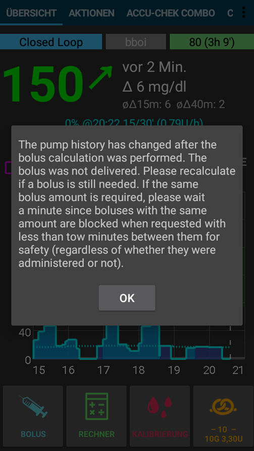

# Accu-Chek Combo Tips for basic usage

## Πώς να εξασφαλίσετε ομαλές λειτουργίες

* Πάντα ** φέρετε μαζί σας το smartphone **, αφήστε το δίπλα στο κρεβάτι σας τη νύχτα.
* Πάντα βεβαιωθείτε ότι η μπαταρία της αντλίας είναι όσο το δυνατόν πληρέστερη. Ανατρέξτε στο τμήμα της μπαταρίας για συμβουλές σχετικά με την μπαταρία.
* Είναι καλύτερο** να μην αγγίξετε την εφαρμογή ruffy **όταν το σύστημα εκτελείται. Εάν ξαναρχίσει η εφαρμογή, η σύνδεση με την αντλία μπορεί να διακοπεί. Μόλις η αντλία είναι συνδεδεμένη με το ruffy, δεν υπάρχει ανάγκη επανασύνδεσης. Ακόμα και μετά την επανεκκίνηση του τηλεφώνου, η σύνδεση επαναφέρεται αυτόματα. Αν είναι δυνατόν, μετακινήστε την εφαρμογή σε οθόνη που δεν χρησιμοποιείται ή σε φάκελο στο smartphone σας, ώστε να μην την ανοίξετε τυχαία.
* Αν ανοίξετε ακούσια την εφαρμογή κατά τη διάρκεια του κυκλώματος, είναι καλύτερο να επανεκινήσετε αμέσως το smartphone.
* Όποτε είναι δυνατόν, ενεργοποιήστε την αντλία μόνο μέσω της εφαρμογής AndroidAPS. Για να το διευκολύνετε, ενεργοποιήστε το κλείδωμα πλήκτρων στην αντλία κάτω από τα ** ΡΥΘΜΙΣΕΙΣ ΑΝΤΛΙΑΣ / ΚΛΕΙΔΩΜΑ ΠΛΗΚΤΡΩΝ/ ΕΝΕΡΓΟ **. Μόνο όταν αλλάζετε την μπαταρία ή την κασέτα, είναι απαραίτητο να χρησιμοποιήσετε τα πλήκτρα της αντλίας. 

## Η αντλία δεν είναι προσβάσιμη. Τι να κάνετε;

### Ενεργοποιήστε τον συναγερμό μη προσιτής αντλίας

* Στο AndroidAPS, μεταβείτε στο ** Ρυθμίσεις / Τοπικοί **συναγερμοί και ενεργοποιήστε** το συναγερμό όταν η αντλία **δεν είναι προσβάσιμη ορίστε το όριο [Min] **για 31 ** λεπτά. 
* This will give you enough time to not trigger the alarm when leaving the room while your phone is left on the desk, but informs you if the pump cannot be reached for a time that exceeds the duration of a temporary basal rate.

### Επαναφέρετε την προσβασιμότητα της αντλίας

* Όταν το AndroidAPS αναφέρει ένα συναγερμό ** αντλία μη προσβάσιμη **, απενεργοποιήστε το κλείδωμα κουπιών και ** πατήστε οποιοδήποτε πλήκτρο στην αντλία ** (π.χ. κάτω κουμπί). Μόλις η οθόνη της αντλίας είναι απενεργοποιημένη, πατήστε ** Ανανέωση ** στην καρτέλα ** Combo Tab ** στο AndroidAPS. Τότε συνήθως η επικοινωνία επανέρχεται.
* Εάν αυτό δεν σας βοηθήσει, επανεκκινήστε το smartphone σας. Μετά την επανεκκίνηση, το AndroidAPS και το ruffy θα επανενεργοποιηθούν και θα δημιουργηθεί νέα σύνδεση με την αντλία.
* Οι δοκιμές με διαφορετικά smartphones έδειξαν ότι ορισμένα smartphones ενεργοποιούν πιο συχνά το σφάλμα "μη ανιχνεύσιμη αντλία" από άλλα. παραθέτονται επιτυχώς δοκιμασμένα smartphones [ Τηλέφωνα AAPS ](https://docs.google.com/spreadsheets/d/1gZAsN6f0gv6tkgy9EBsYl0BQNhna0RDqA9QGycAqCQc/edit#gid=698881435). 

### Αιτίες και συνέπειες των συχνών σφαλμάτων επικοινωνίας

* Στα τηλέφωνα με ** χαμηλή μνήμη ** (ή ** επιθετικής εξοικονόμησης ενέργειας **ρύθμιση), το AndroidAPS συχνά τερματίζεται. Μπορείτε να το δείτε από το γεγονός ότι τα Bolus και η αριθμομηχανή στην Αρχική οθόνη δεν εμφανίζονται όταν ανοίξετε το AAPS επειδή αρχικοποιείται το σύστημα. Αυτό μπορεί να προκαλέσει "συναγερμούς απρόσιτης αντλίας " κατά την εκκίνηση. Στο πεδίο ** Τελευταία σύνδεση ** της καρτέλας Combo, μπορείτε να ελέγξετε πότε το AndroidAPS τελευταία επικοινωνούσε με την αντλία. 

 

* Αυτό το σφάλμα μπορεί να εξαντλήση την μπαταρία της αντλίας γρηγορότερα, επειδή το βασικό προφίλ διαβάζεται από την αντλία όταν ξαναρχίσει η εφαρμογή.
* Αυξάνει επίσης την πιθανότητα να προκαλέσει το σφάλμα που προκαλεί την απόρριψη της αντλίας από όλες τις εισερχόμενες συνδέσεις μέχρι να πιεστεί ένα κουμπί στην αντλία. 

## Η ακύρωση του προσωρινού βασικού ρυθμού αποτυγχάνει

* Περιστασιακά, το AndroidAPS δεν μπορεί να ακυρώσει αυτόματα μια ειδοποίηση **ακυρωμένο TBR **. Στη συνέχεια πρέπει να πατήσετε την ** αναβάθμιση ** στην καρτέλα AndroidAPS ** Combo ** ή να επιβεβαιωθεί ο συναγερμός στην αντλία.

## Υποδείξεις της μπαταρίας της αντλίας

### Αλλαγή μπαταρίας

* Μετά από συναγερμό ** χαμηλής μπαταρίας **, η μπαταρία θα πρέπει να αλλάξει το συντομότερο δυνατόν ώστε να έχει πάντα αρκετή ενέργεια για αξιόπιστη επικοινωνία Bluetooth με το smartphone, ακόμα και αν το τηλέφωνο βρίσκεται σε ευρύτερη απόσταση από την αντλία.
* Ακόμα και μετά από συναγερμό ** χαμηλής μπαταρίας **, η μπαταρία μπορεί να χρησιμοποιηθεί για μεγάλο χρονικό διάστημα. Ωστόσο, συνιστάται να έχετε πάντα μαζί σας μια νέα μπαταρία μετά από ένα συναγερμό χαμηλής μπαταρίας.
* Για να το κάνετε αυτό, πατήστε παρατεταμένα το ** Κλειστό κύκλωμα ** στην κύρια οθόνη και επιλέξτε **κύκλωμα αναστελμένο για 1 ώρα **. 
* Wait for the pump to communicate with the phone and the Bluetooth logo on the pump has faded.

* Απελευθερώστε το κλείδωμα πλήκτρων στην αντλία, θέστε την αντλία σε λειτουργία διακοπής, επιβεβαιώστε πιθανώς ακυρωμένο προσωρινό βασικό ρυθμό και αλλάξτε την μπαταρία.
* Then put the pump back in run mode select **Resume** when long-pressing on **Suspended** on the main screen.
* Το AndroidAPS θα επαναφέρει τον απαραίτητο προσωρινό βασικό ρυθμό με την άφιξη της επόμενης τιμής σακχάρου στο αίμα. 

### Τύπος μπαταρίας και αιτίες βραχείας διάρκειας ζωής της μπαταρίας

* Επειδή η εντατική επικοινωνία Bluetooth καταναλώνει πολλή ενέργεια, χρησιμοποιείτε μόνο ** μπαταρίες υψηλής ποιότητας ** όπως το Energizer Ultimate Lithium, το "power one" από το "μεγάλο" service pack Accu-Chek ή εάν πρόκειται για μια επαναφορτιζόμενη μπαταρία, χρησιμοποιήστε μπαταρίες Eneloop. 

 

Το εύρος για το τυπικό χρόνο ζωής των διαφορετικών τύπων μπαταριών είναι οι εξής:

* **Energizer Ultimate Lithium**: 4 έως 7 εβδομάδες
* **Power One Alkaline** (Varta) από το πακέτο υπηρεσιών: 2 έως 4 εβδομάδες
* **Eneloop rechargable** μπαταρίες (BK-3MCCE): 1 έως 3 εβδομάδες

If your battery life is significantly shorter than the ranges given above, please check the following possible causes:

* The latest version (March 2018) of the [ruffy App](https://github.com/MilosKozak/ruffy) significantly improved pump battery lifetime. Βεβαιωθείτε ότι βρίσκεστε σε αυτή την έκδοση αν έχετε προβλήματα με μικρή διάρκεια ζωής της μπαταρίας.
* Υπάρχουν ορισμένες παραλλαγές του καπακιού μπαταρίας της αντλίας Combo, το οποίο βραχυκυκλώνει εν μέρει τις μπαταρίες και τις αποστραγγίζει γρήγορα. Τα καπάκια χωρίς αυτό το πρόβλημα μπορούν να αναγνωριστούν από τις χρυσές μεταλλικές επαφές.
* Εάν το ρολόι της αντλίας δεν «επιβιώσει» από μια μικρή αλλαγή μπαταρίας, είναι πιθανό να σπάσει ο πυκνωτής ο οποίος κρατάει το ρολόι σε λειτουργία κατά τη διάρκεια μιας σύντομης διακοπής ρεύματος. Σε αυτή την περίπτωση, μόνο η αντικατάσταση της αντλίας από τη Roche θα βοηθήσει, πράγμα που δεν αποτελεί πρόβλημα κατά τη διάρκεια της περιόδου εγγύησης. 
* Το υλικό και το λογισμικό smartphone (λειτουργικό σύστημα Android και στοίβα bluetooth) επηρεάζουν επίσης τη διάρκεια ζωής της μπαταρίας της αντλίας, παρόλο που οι ακριβείς παράγοντες δεν είναι ακόμη πλήρως γνωστοί. Εάν έχετε την ευκαιρία, δοκιμάστε ένα άλλο smartphone και συγκρίνετε τη διάρκεια ζωής της μπαταρίας.

## Οι αλλαγές θερινής ώρας

* Επί του παρόντος, ο συνδυασμός προγραμμάτων οδήγησης δεν υποστηρίζει την αυτόματη ρύθμιση του χρόνου της αντλίας.
* Κατά τη διάρκεια της νύχτας μιας αλλαγής θερινής ώρας, ο χρόνος του smartphone ενημερώνεται, αλλά ο χρόνος της αντλίας παραμένει αμετάβλητος. Αυτό οδηγεί σε συναγερμό λόγω των αποκλίσεων μεταξύ των συστημάτων στις 3 π. μ.
* Εάν δεν θέλετε να ξυπνήσετε τη νύχτα,** απενεργοποιήστε τη λειτουργία αυτόματης εναλλαγής ώρας στο κινητό τηλέφωνο ** το βράδυ πριν από τη μετάβαση στο χρόνο και ρυθμίστε τις ώρες χειροκίνητα το επόμενο πρωί.

## Εκτεταμένο bolus, πολλαπλό bolus

Ο αλγόριθμος OpenAPS δεν υποστηρίζει έναν παράλληλο εκτεταμένο bolus ή πολλαπλό bolus. Αλλά μια παρόμοια θεραπεία μπορεί να επιτευχθεί με την ακόλουθη εναλλακτική λύση:

* Εισάγετε τους υδατάνθρακες, αλλά μην κάνετε bolus για αυτό. The loop algorithm will react more aggressively. Αν χρειαστεί, χρησιμοποιήστε **eCarbs**(εκτεταμένοι υδατάνθρακες).

* If you are tempted to just use the extended or multiwave bolus directly on the pump, AndroidAPS will penalize you with disabling the closed loop for the next six hours to ensure that no excess insulin dosage is calculated.

## Συναγερμοί κατά την χορήγηση bolus

* If AndroidAPS detects that an identical bolus has been successfully delivered at the same minute, bolus delivery will be prevented with identical number of insulin units. If you really want to bolus the same insulin twice in short succession, just wait two more minutes and then deliver the bolus again. If the first bolus has been interrupted or was not delivered for other reasons, you can immediately re-submit the bolus since AAPS 2.0.
* Background is a safety mechanism that reads the pump's bolus history before submitting a new bolus to correctly calculate insulin on board (IOB), even when a bolus is delivered directly from the pump. Εδώ πρέπει να αποφευχθούν οι δυσδιάκριτες καταχωρήσεις.

* Αυτός ο μηχανισμός είναι επίσης υπεύθυνος για μια δεύτερη αιτία του σφάλματος: Εάν κατά τη χρήση του υπολογισμού των bolus χορηγηθεί ένα άλλο bolus μέσω της αντλίας με τον τρόπο αυτό αλλάζει το ιστορικό των bolus, η βάση του υπολογισμού του bolus είναι λάθος και το bolus ακυρώνετε. 

