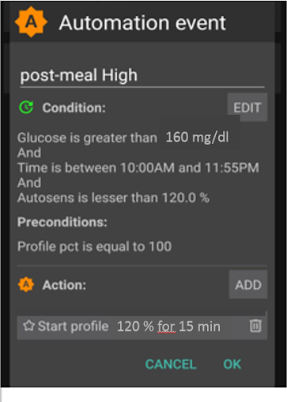

# Full Closed Loop

## Full vs. Hybrid Closed Loop (FCL, HCL)

### Definitions

In **hybrid closed loop** you gave at least one bolus prior to meals. This pushed your loop often into a temporary shut-off (temporary zero basal) and generally only into a co-management role while that given bolus was strongly active.

Also, prior to each meal, you made inputs about the carb, fat, and protein intake, and also gave indications (generally in settings, plus every day related to each meal) related to estimated carb absorption times.

AAPS also allows **full closed looping without the user giving any boli**, and without making carb inputs, in a mode called UAM = un-announced meals.

- Note that **UAM** can also be switched on in hybrid closed looping, in which case it just means that the algorithm tolerates wrong carb inputs better.

- It is discussed controversially whether e.g. for particularly high carb meals, or for people with certain eating habits or sensitivity swings, a mode with small pre-bolusses might be preferable or even needed. This would basically be a hybrid closed loop without carb info, and therefore a variant of HCL really. We stick to FCL as really **without user boli**, and once you tuned your FCL, you might even remove all „useless“ buttons on the bottom of your AAPS main screen.

### What to expect?

In 2022/23 a first medical study was conducted and published that showed patients can achieve comparatively good results with AAPS in a simple FCL mode:

> 16 adolescents with T1D (HbA1c range 43-75), and duration of diabetes of 9-15 years underwent three distinct 3-day periods of camp living, while using a modified and locked version of AndroidAPS 3.1.03. **Results:** The glycemia was controlled by the system 95% time of the study and the proportion of time below 3.9 mmol/L did not exceed 1% over the whole study period (0.72%). The HCL scenario reached significantly higher percentage of time below 3 mmol/L (HCL 1.05% vs. MA 0.0% vs. FCL 0.0%; P = 0.05) compared to other scenarios. **No difference was observed among the scenarios in the percentage of time between 3.9 and 10 mmol/L** (HCL 83.3% vs. MA 79.85% vs. **FCL 81.03%**, P = 0.58) corresponding to mean glycemia (HCL 6.65 mmol/L vs. MA 7.34 mmol/L vs. FCL 7.05 mmol/L, P = 0.28). No difference was observed in the mean daily dose of insulin or in the daily carbohydrate intake. No serious adverse event occurred during the study period. **Conclusions:** Our pilot study showed that **FCL might be a realistic mode of treatment** for people with T1D.

Source:

1)   National Library of Medicine, PubMed [First Use of Open-Source Automated Insulin Delivery AndroidAPS in Full Closed-Loop Scenario: Pancreas4ALL Randomized Pilot Study](https://pubmed.ncbi.nlm.nih.gov/36826996/);

2)  ClinicalTrials.gov National Library of Medicine, Clinical Trial [Feasibility and Safety Study of the Automated Insulin Delivery Closed Loop System Pancreas4ALL (ASAP)](https://www.clinicaltrials.gov/study/NCT04835350?term=Feasibility%20and%20Safety%20Study%20of%20the%20Automated%20Insulin%20Delivery%20Closed%20Loop%20System%20Pancreas4ALL%20(ASAP)&rank=1)

For you to enjoy the promised reduced daily burden, you will have to:

- check whether you have all pre-requisites for FCL
- set up a couple of Automations
- go through a learning and tuning stage in which you adjust the settings, notably those in your Automations. The suggestions that follow guide you in this process.

### General considerations why (not to) move from hybrid to full closed loop

The full closed loop system may **not** be **for everyone**:

- While some full closed loopers using Automations achieve TIR (70-180) around 90%  and HbA1c under 6%, you might prefer tighter control. Notably, **minimizing values over 140 mg/dl at diets with rapid carbs** probably requires pre-bolussing.
- Are you up for an informed and mindful approach towards a highly personalized calibration of your system? The **personalized tuning** can be **challenging**. This is definitely not for you if you were overwhelmed already with setting basal rate and ISFs. But balance it against what you could gain every day without counting any carbs. You might also value the gained deeper knowledge from analyzing and tuning your loop’s reponse to your meals.
- While meal management gets very easy, **activity** management might get a bit more difficult, especially considering most of us probably like to limit sports snacks, in an attempt to control body weight.
- Unfortunately, there are additional difficulties to establish a full closed loop for **kids** (see next section, pre-requisites)

## Pre-requisites for full closed looping

The main attraction of full closed looping would be that you could get close to the dream of an artificial pancreas. Indeed, it promises very easy everyday use. **“Just eat!”**

### Well-tuned hybrid closed loop

It is advisable to first establish a well-tuned hybrid closed loop before considering the transition to FCL. There are two important reasons for this:

- The UAM full closed loop requires a highly personalized (individual) tuning of settings, so the loop will give insulin mimicking YOUR successful hybrid closed loop mode.
- The UAM full closed loop comes with new parameters (in your Automations) to be set and tuned. It would be **problematic to set and tune these additional parameters before the basics were tuned “right”**. Errors could easily be balanced with counter-errors. This can work in single scenarios, but would create a highly unstable system, hard to re-calibrate better later. Also, as seen by many early testers and also in the above quoted study, you should expect to reach comparable %TIR with your *FCL* as you see today in your *HCL*. The switch is not about performance, but about convenience, -  after a bit of inconvenience: **The heart of this FCL method is a DIY set up of Automations that you have to do for yourself, analyzing *your data*, both, from *your* successful HCL, and from your initial FCL experience when tuning your settings.** This is no self-adjusting off the shelf wonder-product! The programmers of the software, and writers of this wiki, assume no responsibility. You have to find out for yourself whether and how you may want to make use of the tools, and suggested ways they might be used.

### Fast insulin (Lyumjev, Fiasp)

If the user does not bolus for meals, clearly a very fast insulin is needed so, upon realization of a starting meal-related glucose rise, the loop has any chance to eventually keep glucose in range (by common definition, under 180 mg/dl (10 mmol/l)).

A modelling study (details see LINK FullLoop V2/March2023; there section 2.2) can show in quantitative terms that *faster insulins*

- will result in significantly **lower** glucose **peaks** than slower insulins
- **tolerate** a couple of minutes **delayed** first meal bolus while not incurring unacceptable height of peaks
- **minimize the effect** on glucose peak **from different** carb load (**meal sizes**).

In conclusion, do not attempt FCL with other insulin than Lyumjev or Fiasp, unless, maybe, if you are on a very moderate to low carb diet.

Many users of Fiasp or of Lyumjev observe frequent **occlusions**, even after optimizing things like needle length or SMB delivery speed. It seems very important to have an eye on the time a **cannula (or pod)** is in use (many find **48 hrs** to be the **limit**), and whether hard-to-explain glucose rises happen at ever increasing „fake“ iob.

An incidence report in (LINK, section 2.2.) illustrates this problem and shows that per *one* occlusion you easily lose 25% TIR that day, or 5% TIR on the week, and still 1% TIR on the month.

### Excellent CGM

You do not give a mealsize-related bolus any longer; that leaves ALL insulination jobs to the algo! As glucose values are the very basis for this, please **inform yourself well about** how **your CGM** 1) principally performs  2) whether and how this may depend on data flow and intermediate apps you use, or differ between days of sensor usage   3) specifically, how and where any smoothing is done, and what this might imply for your tuning, notably for how you define a delta that is a true sign of a starting meal.

Around meals, a stable Bluetooth connectivity is absolutely essential, too, so CGM, loop, and pump can do their job without losing more valueable time.

Then, but even more importantly in all other day and night times, the CGM should not produce any artefacts (jumpy values) that the loop could **misinterpret** as sign of a starting meal. Note that also calibrations could produce jumps.

The best way currently is to use Dexcom G5 or **G6**, and to ensure via **overlapping** right and left arm sensor and transmitter utilization, that always good quality values can be used by the loop. Other ways are possible, but come with a lot of monitoring effort (via watch) and occasional time-outs for the loop.

### Meal-related limitations

Setting up a full closed loop is relatively easy for people whose diet does not consist **mainly** of components with **rapid high effect on blood glucose**, and whose meal patterns do not wildly vary day-to-day. They do not have to be low carb.

Fat or protein rich diets, or slow digestion/gastroparesis, make things easier rather than harder for the full closed loop because late carbs nicely cover for inevitable “tails” of late action from boli needed around peak time.

The most difficult meals are those with exclusively very high and high EBG components (see red in the picture): Not only does glucose shoot up rapidly, but also there is not much of a fat/protein/fibre component to balance the inevitable “tail” of insulin activity that would come with attempts to control the high glucose earlier on.

**Erratic consumption of snacks and sweet drinks** that are loaded with fast resorbing carbs is a problem.

### Lifestyle-related limitations

#### Technically stable system

Full closed looping requires a 24/7 technically stable system, especially regarding reliable **CGM** signals, but also **Bluetooth stability** with the **pump**, and avoiding (or at least early recognition of) occlusion. This could require attention to details like keeping all components well charged and in close proximity; making cannula (or pod) changes always early enough to lower the risk of occlusion; having always potentially needed parts with you. **Depending on your system, your experience with it, but also on your acceptance and general lifestyle, these aspects may or may not limit you.**

Full closed looping requires a 24/7 technically stable system, especially regarding reliable CGM signals, but also Bluetooth stability with the pump, and avoiding (or at least early recognition of) occlusion. This could require attention to details like keeping all components well charged and in close proximity; making cannula (or pod) changes always early enough to lower the risk of occlusion; having always potentially needed parts with you. Depending on your system, your experience with it, but also on your acceptance and general lifestyle, these aspects may or may not limit you.

#### Preparing for activity/sports

To prepare for activity / sports /exercise,  the normal protocol with a pump or **hybrid** closed loop is to take actions that reduce insulin on board prior to exercise.

With your **full closed loop**, the algorithm is tuned to detect meals and to give you insulin to counter glucose rises automatically. Setting a high temp. target and lower %profile right away (effective already around meal start) would be a problem.

Unusual activity levels therefore likely require **disciplined preparation** (especially **if you want to keep the need to snack during sports low**). In nights after an active day it can be smart to keep a lowered% profile, and set, for the hours after the evening meal is fully digested, an elevated (>100 mg/dl) glucose target, with “no SMBs at elevated target” selected in AAPS preferences.

#### Hurdles for kids

To establish and maintain a FCL for kids brings about some extra challenges if:

- Lyumjev is not available or well tolerated
- Hourly basal rate is very low, providing a poor basis for big SMBs
- Diet is rich in sweet components. With the typical low blood volume of a small body, strong tendency towards very high bg spikes!
- Going through marked changes of insulin sensitivity or of circadian pattern makes it difficult to keep the FCL appropriately tuned.

There are a couple of parents and kids pioneering this area, too. This paper highlights areas that would require some minimum compliance; in the end it comes down to whether the achieved results are at least comparable to where everyone stood in her/his everyday hybrid closed loop.

#### Time required for setting-up

Lastly, before enjoying a functioning full closed loop you need to have a period of a some weeks with some free time and „free head“ for set-up –. Can you get, in the time you are willing to invest, to a result that you consider good-enough is really the question. Depending on your „habits“, and which – if any - compromises (like doing cannula/pod changes more often, never starting meals when bg sits high … ) are you willing to make (and everyday able to stick to), for the ease of not having to deal with assessing meals and bolussing for them?

## Enabling boosted SMBs; safety

In hybrid closed looping, strong safety restrictions are implemented regarding bolus sizes that can be automatically given by the loop.

However, in full closed loop application, loopers themselves do no longer give a sizeable bolus around meal start. Then clearly size limits on SMBs must be widened to make the loop capable of giving large enough SMBs.

As you are operating with AAPS Master release, it is suggested you set in AAPS preferences the largest setting for maximum allowed SMB size the loop can give (maxUAMSMBBasalMinutes=120, i.e. 2 hours worth of basal at that daytime).

> If your basal rate is very low, the resulting SMB limits might be too low to allow good-enough control of your post-prandial glucose rises. In that case the solution might be to avoid diets with strong spikes and later switch to a AAPS dev variant that offers a new parameter in SMB delivery settings: smb_max_range_extension. It expands the standard maximum of 2 h worth of basal by a factor of >1. (Additionally, the default 50% SMB delivery ratio might be levated in dev variants).

Going to the max. limits on SMB size in AAPS Master will not make the FCL mode inheritantly less safe. In contrary, you replace your big meal bolus by several smaller ones that you enable your loop to give you, and even with some minutes of delay. This virtually eliminates the hypo risk in the first 1-2 hours of any meal. In hour 3 and thereafter, there should not be much difference because in HCL and FCL the loop manages with the same algorithm.

**Follow the instruction** to enable AAPS **to mimick your bolussing via a couple of SMBs**.

Check the SMB tab from time to time to see whether your SMBs are allowed to be large enough to deliver the insulinReq as needed for your full closed loop around meal starts.

If not, your tuning efforts will sometimes come to nothing!

:::{admonition} Boosting ISF can become dangerous
:class: danger

Carefully observe/analyze the SMB sizes that, briefly after meal start, result from your settings. Tune in steps, and do not vary more than 1 or 2 parameters at a time.

Setting must work good-enough for your (!) variety of meals.
:::

## Meal detection/your Automations for boosting

For successful full closed looping, ISF is the key tuning parameter. When utilizating AAPS Master + Automations, a **> 100% profile change must automatically be triggered upon meal recognition** (via glucose deltas), and provide the sharpened ISF.

AAPS Master allows up to 130% temp. profile in Hybrid Closed Loop mode. Boosting the ISF is done in 3 steps:

- Step 1 is to look up the ISF applicable for this meal time hour in the profile, and see whether e.g. Autosens suggest a modification that takes care of the current (last few hours’) insulin sensitivity status of the body.
- Step 2 applies a factor (1/profile%, as set in your Automation) to boost ISF.
- Step 3 is a check, that the suggested ISF falls within set safety limits.

### FCL Automation templates

Boxes to tick at the top: You always have the options:

- In the list of all your Automations, you can tick the check-mark (to left of each field) OFF => This de-activates that Automation.  For instance you could do this for all breakfast related FCL Automations to go to Hybrid Closed Looping for breakfast(s).
- In each Automation event template, you can tick the box for **User action** => Then the defined Actions will not automatically be executed when Conditions apply. Rather, your AAPS main screen will alert you whenever your FCL would automatically give a SMB. You have the opportunity then to say yes or no. This is **extremely useful in your tuning phase**.                                                                                                                        
  This feature can be very valueable also everyday. An example would be, if you see the “foot to floor” syndrome (suddenly rising glucose when getting up), but want to prevent a fully automatic “breakfast started” response.

The following section shows in detail how you can bundle a whole series of conditions to describe situations in which the AndroidAPS loop should increase (or decrease) insulin delivery.                                                                                                                                      As ISF cannot directly be tuned, raising profile% over 100% will do the same for our purposes.

### Automated big SMBs at bg rise

Key to success in full closed looping: **At the beginning of glucose increases from meals, very large automatic boli (SMBs) must be given by the loop as quickly as possible** “to catch up” with the evidently needed iob. (Compare with your administered bolus for similar meal in hybrid closed loop!)

First of all, **personal data** (from your time in hybrid closed loop) have to be researched to determine which **deltas** might be not meal –related, and which ones surely would be.

- As you can define the Automation to only work in a pre-defined time-window, you need only to analyse there.
- If you do very different kinds of meals (e.g. a rather high carb breakfast, but low carb lunch) you can choose to do two different (sets of) Automations for each of the time slots.
- Exclude the nights if you see occasional jumps from a compression lows
- Usually, just using the delta of the past 5 minutes suffices.
- But you can also make use one of the average deltas. By comparing the deltas in the conditions of your Automations you could even define actions of different aggressiveness depending on whether the glucose rises in an accelerated way or not.

> ( delta – short avg delta )>n   is a term that could be used for acceleration detection , to trigger first SMB at earliest sign of rising glucose. -                                                                             Caution: not possible to use with poor or highly smoothened CGM-values!

A CGM with lots of scatter will put you in a bad spot because, to be on the safe side,  you need to „sandbag“ your definition which delta is surely asign of a started meal. That means:

- your FCL loses additional time, resulting in higher glucose peaks and lower %TIR
- because you cannot use a earlier or smaller delta which could trigger, also without a meal, the SMBs that are supposed to make up for a user bolus in FCL.

Furthermore, first rises after a meal are characterized by **low iob** present. With that in mind, an Automation(#1) for a dinner might look like this:

Automation #1

If conditions apply, the loop would give 1 or 2 SMBs in the next 12 minutes, using a boosted ISF according to the set elevated profile%  (in the example, a 30% boost of insulinReq). As long as these conditions apply, the Automation rule extends by another 12 minutes. A low carb meal might have slower bg rise characteristics. It would benefit from another Automation (#2) that kicks in at lower delta, and gives a weaker insulin boost.

The same Automation probably will kick in also in higher carb meals, once the steep rise as defined in Automation#1 is over.

You need to “stage” these two (+ maybe a third) Automations to fit with what you see in your meal (variety) => Setting appropriate jump sizes, iob citeria, and amplifications will be an iterative tuning process.  Also, if you include appropriate time slots in the Conditions, you can easy do different Automations for your different daily meals times (breakfast, lunch, dinner).

Note that, still in the rise phase (!), the "overflow" of  iob must be blocked so that the late effects of the **insulin** (the "**tail**" after 3-5 hours) will not exceed the braking capacity of the loop through zero-temping (“taking away” basal, to reduce hypo risk).

With large meals there is **sometimes a second increase**. By then, usually also the iob has dropped a bit, and the more aggressive Automations take effect again. (Check that your iob condition in Automation #2 is not set too low to for this to happen).

Soon after a few intial SMBs were given comes a **balanced phase** where moderate addition of insulin should cover the additional carbs absorbed. (Except in low carb meals, where the loop might see too weak of a bg rise, and go into zero-temping right away already now).

The AndroidAPS main screen (where you always see cob=0 in UAM full loop) might in this phase ask for more carbs required. In UAM mode that simply means, you could make a very rough plausibility check: Is that amount of carbs likely in your body, un-absorbed from your meal just about an hour ago (about which you gave your loop no info)?

### iob threshold

Often, Automations #1 and/or #2 make iob rise to heights that typically are enough for **your** meals. For personalized tuning, look in your hybrid closed loop data at the max iob values that occur with well-managed meals (often: your meal bolus), and above which magnitude a hypo (or requirement for extra carbs) occured at the end.

Sensible **iob thresholds** at which you should reduce aggressiveness of your loop, might not be the same for every meal. But especially in the first hour after the start of a meal, which is very crucial in the UAM mode, these data differ little for me: Just about 30g/hour get absorbed, and to define a meaningful iob independent of the exact meal can be possible.

For exceptional meals, or to lower it if sports follow, the iob threshold can rapidly be set differently in your Automation.

Automation(#3),”iobTH reached => SMBs off”, is defined to end (or pause, until another wave of carb-related rise hits) the aggressive SMB boosting.

Automation #3

It tells the loop that above your set **iob threshold** it's better not to use any more SMBs

- The given example does that by setting TT=111 (which is kind of arbitrary; pick a number>100 that you easy recognize as your automated SMB shut-off)
- In AndroidAPS Preferences/ SMB Settings generally do not allow SMB at elevated target).                                                                                                                   
  The insulinReq will then have to be delivered with much more caution through the bottleneck of TBRs

**Caution: Automation #3 only works when there is no active TT.** So, in case you worked with EatingSoonTT, it must be ended by that time, which usually should be 30-40 mnutes after meal start.

One idea how to do this automatically would be an Automation that ends an eventually running EatingSoonTT under the condition that iob >65% * iobTH.
> Ways to work with EatingSoonTT Some loopers set (by pressing the TT button, or automated via a lowered profile glucose target if eating time slots are fairly fixed) an EatingSoonTT roughly an hour or more before meal start, just to guarantee a low starting glucose and a bit of positive iob. But, assuming the FCL is anyways always en route towards target, this might not yield much and you might rather just define an Automation that sets an EatingSoonTT at recognition of meal start (glucose delta, or acceleration = delta > avg delta). A low TT is important in this stage because any SMB is calculated by your loop using (predicted glucose minus TT)/sens, so a small TT makes the resulting insulinReq. bigger.

After the first boosted SMBs were given, your set iobTH and Automation #3 should strike a good balance of limiting the glucose peak, but also not leading to a hypo after the meal.

In case for instance your breakfast totally deviates in carb content from your average dinner, you may benefit from defining Automations that apply in the respective times of day, and have different iobTH (possibly also different deltas, and different %profile set). Both, you with defining your meal spectrum and settings (notably, iobTH), and the loop managing the unfolding bg curve, must accept certain peak heights for reducing hypo danger towards the end of the DIAs from SMBs.

### Stagnation at high bg values

In case, after a “rich” meal, a long-lasting stagnation with **high glucose** value is seen, Automation #6 (below, left),"post-meal High”, helps deal with fatty acid resistance: After multi-course meals, large greasy pizza, raclette evening, the glucose curve can form two humps or, very often, an elongated high plateau.

Automation #4

Automation #5

Automation #5, “post-meal High”, is also suitable in hybrid closed loop.

In addition, a termination-Automation #5, “Stop pmH”, is needed, so that the aggressiveness of the insulin administration is reduced, as soon as the glucose value is falling. (However, often the loop will limit more insulin anyways for hypo prevention because predicted glucose runs low already).

### Hypo prevention

The core problem here is of course that the UAM full closed loop (without carb inputs) can have **no idea how many g of carbs are still available** for absorption, and might use up that “tail” insulin, without you going into a hypo from it.

Using boosted SMBs, the loop “caught up” with what we formerly did with a meal bolus. But, **at the “tail” end of insulin activity, hypo prevention can become a serious topic**.

In preparation for your full closed loop Automations, you therefore must take a closer look at the **time course of iob** for typical meals, and judge **when it becomes too much, and how you can catch that by tuning your Automations**. That is definitely possible, because we have several adjusting screws. However, it can get a bit tricky to get it “right”, so it reasonably works for your variety of meals.

Generally, it makes no sense to keep optimising settings for one kind of meal. Once you have a good-enough setting e.g. for one kind of lunch you frequently have, test how this works with other kinds, and how you would “compromise”.

In order to prevent hypo in post-meal hours 3 – 5, reduce the aggressiveness before too much iob comes together. Specific approaches:

- Become milder and milder with the ISF already during the glucose rise, as in Automation examples #1 and #2 given.
- Define the iob threshold, from which the loop is made significantly more cautious (Automation #3, above). Note this iob can be exceeded, by the last SMB before it went into effect; and then further by TBRs if the loop sees insulinReq. Carbs getting absorbed will provide a counter-movement towards lower iob.
- The iob threshold could be differentiated according to meals: By cloning the automations, you could easily differentiate for breakfast, lunch, and dinner time slots (or even for geo-locations, like company cafeteria, or at mother-in-law etc)  
  >You could differentiate within these time slots even further by setting different TTs for low carb vs. fast carb, etc., and thus be able to “code for” different meal classes that may occur at this time of day, and call them up with Automations specially tuned for them.(That is probably not not necessary, unless your diet habits do vary a lot.).

Before a special meal challenge, you can raise your iob threshold, or make another change in any of your Automations within under 5 seconds, right from your AndroidAPS main screen (burger top left; or Automations tab, depending how you configured your AAPS.).

The hypo danger some hours after the meal is essentially a question of whether your meal composition was such, that the **insulin tails from fighting the bulk of carbs** will be **consumed by “extended carbs”** (excessive/delayed carb absorption/protein/fat/fibre).

Over time you will learn patterns, tune your Automations – maybe even adjust your eating habits a bit, e.g. just enjoy the occasional late little(!) snack that may help maintain a good **balance of insulin activity and carb absorption** for the **entire** meal (digestion, absorption) time, and thus make life for your loop (and for yourself) easier.

### Order of prorgrammed Automations

Problems can arise with overlapping definitions in Automations. Example: The problem is that delta >8 is also delta >5, i.e. there may be two competing Automations. What does the loop do then? It always decides according to the sequence in which your Automations appear when looking into the burger menue / AndroidAPS main screen.  Example: The delta > +8 rule must come first (and launch the strongest boost if all conditions apply); then comes the check for delta >5 (and a milder response). If done the other way round, the delta>8 rule would never come into effect because the delta>5 already applies, case closed.
> Tip for "house cleaning" in your Automations: Order changes are very easy to make. If you press on a list entry in AAPS/Automations, you can move the Automation in question to another position. So you can quickly (re-)arrange.

Also it is very easy and quick to adjust any conditions or actions at any time, within seconds, just on your AndroidAPS smartphone; for instance if you head into a very special eating event. (But don’t forget to set it back to normal on/for the next day).

## Αντιμετώπιση προβλημάτων

### How to get back into Hybrid Closed Loop

You can un-click the top boxes in the Automations related to your FCL, and go back to bolussing for meals and making carb inputs again.  You may have to go to AAPS Preferences/Overview/Buttons and get your Buttons “Insulin, Calculator…”  back for your AAPS HCL main screen. Be aware that now it is again up to you to bolus for meals

It can also be wise to do FCL only for meals (time slots) where Automations are fully defined and clicked on, and un-klick only those for the other meal times when you like to do hybrid looping (or have none defined yet, in your transition period).

For instance, it is perfectly possible, without any extra steps after Automations for dinner time slots are defined, to do FCL only for dinners, while breakfast and lunch are done in hybrid closed loop as you are used to.

### Are the pre-conditions for FCL still given?

- Is the basic profile still correct?
- Has the CGM quality deteriorated
- etc (see section pre-requisites)

### Glucose goes too high

- Meals are not recognized asap
    - Check regarding Bluetooth (in)stability
    - Check whether you could set smaller deltas to trigger first SMB
    - Experiment with an aperetif, soup acouple of minutes before meal start
- SMBs are too weak
    - Check order of Automations (e.g.: big delta before small delta)
    - Check (real-time) in SMB tab whether hourly profile basal and set minutes (max 120) limit allowed SMB size
    - Check (real-time) in SMB tab whether %profile must  be set bigger
- If all your settings are at the limit, you may have to live with the temporary high, or adjust your diet.
> If you are ready to use AAPS dev variants, you could also employ one that allows further expanded SMB sizes. Some users also resort to using a small pre-bolus in their “FCL”. However, this interferes with how glucose curve and hence detection of rises and triggered SMBs behave, and is therefore not easy to implement with convincing overall benefit.
- An important observation by pilot users was, that how your glucose and iob curves approach meal start matters a lot regarding how you peak from carbs: Going down (e.g. towards a set EatingSoonTT), building some iob, and curving already towards strong positive acceleration seems very helpful to keep peaks low.

### Glucose goes too low

- Meals are falsely recognized
    - Check whether you could set bigger deltas to trigger first SMB
    - Click “User action” in the related Automation, so in the futurte you can ad hoc decide to block execution of the Automatiojn if not meal-related
    - To prevent snacks from triggering SMBs as for a meal, set a TT>100 when snacking (as you would do in sports and for anti-hypo snacks, anyways)
- SMBs deliver overall too much insulin
    - Check (real-time) in SMB tab whether SMB range extention must be set smaller
    - Check (real-time) in SMB tab whether %profile must  be set smaller
    - SMB delivery ratio probably can be set smaller. Note in this case, it works across the bord for all SMBs (all time slots),
- Problems with insulin “tail” after meals
    - You may need to take a snack (seeing hypo prediction) or glucose tablets (if already in hypo zone). But note that the carbs required the loop might tell you at some point are very likely exaggerated as the loop has absolutely zero info on your carb intake (while you may be able to guess how mnuch more, incl. from fats and proteins) is still waiting to be absorbed.
    - A valueable information would be whether the problem originates mostly in the bg rise phase already. Then setting a lower iobTH might be an easy remedy.
    - If the need for additional carbs happens frequently, note down how many grams were needed (not counting what you eventually took too much and required extra insulin again).  Then use your profile IC value to estimate how much insulin less the SMBs should have delivered, and go with this info into your tuning (regarding the % profile in the Automations, or maybe also your set iobTH). This may relate to the SMBs given when glucose was high, or also extending regarding also the SMBs during the glucose rise.
    - It could well be that you simply have to accept higher glucose peaks for not going low. Or change diet to something with lower amounts of carbs, and higher amount of proteien and fats.

### More info

Make sure you stay in touch with other FCL users.

Discussion Full Closed Loop using Automations:

- English:   [Discord Channel](https://discord.gg/ChXj8BaKwA)

- German:  [German Looper Community](https://de.loopercommunity.org/t/ueber-die-kategorie-full-loop/10107)
