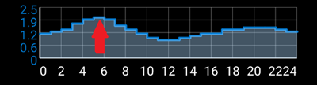

# Στόχοι

Το AndroidAPS διαθέτει μια σειρά στόχων που πρέπει να ολοκληρωθούν για να σας καθοδηγήσουν στα χαρακτηριστικά και τις ρυθμίσεις του ασφαλούς κυκλώματος. Εξασφαλίζουν ότι έχετε ρυθμίσει σωστά όλες τις λεπτομέριες στις παραπάνω ενότητες και ότι καταλαβαίνετε τι κάνει το σύστημά και γιατί μπορείτε να το εμπιστευτείτε.

Εάν είστε στην ** αναβάθμιση τηλεφώνων ** τότε μπορείτε να [ εξάγετε τις ρυθμίσεις σας ](../Usage/ExportImportSettings) για να διατηρήσετε την πρόοδό σας μέσω των στόχων. Όχι μόνο θα αποθηκευτεί η πρόοδός σας μέσω των στόχων, αλλά και οι ρυθμίσεις ασφαλείας σας όπως το μέγιστο bolus κ. λπ. Αν δεν εξάγετε και δεν εισάγετε τις ρυθμίσεις σας, θα χρειαστεί να ξεκινήσετε πάλι τους στόχους από την αρχή. Είναι καλή ιδέα να δημιουργείτε αντίγραφα ασφαλείας των ρυθμίσεών σας συχνά για καλό και για κακό. Δείτε παρακάτω για λεπτομέρειες.  

### Στόχος 1: Δημιουργία οπτικοποίησης και παρακολούθησης, ανάλυση βασικού δεδομένων και αναλογιών

* Επιλέξτε τη σωστή πηγή γλυκόζης αίματος για τη ρύθμιση. Δείτε [ Πηγή BG ](../Configuration/BG-Source.rst) για περισσότερες πληροφορίες.
* Επιλέξτε τη σωστή αντλία στο ConfigBuilder (επιλέξτε εικονική αντλία αν χρησιμοποιείτε μοντέλο αντλίας χωρίς οδηγό AndroidAPS για βρόχο) για να διασφαλίσετε ότι η κατάσταση της αντλίας σας μπορεί να επικοινωνήσει με το AndroidAPS. Αν χρησιμοποιείτε αντλία DanaR, βεβαιωθείτε ότι έχετε ακολουθήσει τις οδηγίες στο [ Αντλία ινσουλίνης DanaR ](../Configuration/DanaR-Insulin-Pump.md) για να εξασφαλίσετε τη σύνδεση μεταξύ της αντλίας και του AndroidAPS.
* Ακολουθήστε τις οδηγίες στη σελίδα [ Nightscout ](../Installing-AndroidAPS/Nightscout.md) για να βεβαιωθείτε ότι το Nightscout μπορεί να λάβει και να εμφανίσει αυτά τα δεδομένα.
* Σημειώστε ότι η διεύθυνση URL στο NSClient πρέπει να είναι ** χωρίς / api / v1 / ** στο τέλος - δείτε [ Ρυθμίσεις NSClient στις Προτιμήσεις ](../Configuration/Preferences.html#ns-client).

*Ίσως χρειαστεί να περιμένετε για την επόμενη ανάγνωση γλυκόζης στο αίμα πριν το AndroidAPS το αναγνωρίσει.*

### Στόχος 2: Ξεκινώντας από ένα ανοικτό κύκλωμα

* Επιλέξτε Ανοικτό κύκλωμα είτε από τις Προτιμήσεις είτε πατώντας παρατεταμένα το κουμπί κύκλωμα στο πάνω αριστερό μέρος της αρχικής οθόνης.
* Εργαστείτε στις [προτιμήσεις ](../Configuration/Preferences.md) για να τις ρυθμίσετε.
* Χειριστείτε χειροκίνητα τουλάχιστον 20 από τις προσωρινές προτάσεις βασικού ρυθμού για περίοδο 7 ημερών. εισαγάγετε τα στην αντλία σας και επιβεβαιώστε στο AndroidAPS ότι τα έχετε δεχτεί. Βεβαιωθείτε ότι τα δεδομένα αυτά εμφανίζονται σε AndroidAPS και Nightscout.
* Ενεργοποιήστε [ στόχους ρυθμού ](../Usage/temptarget.md), εάν είναι απαραίτητο. Χρησιμοποιήστε στόχους υπογλυκαιμίας για να αποφύγετε ότι το σύστημα θα διορθώσει πολύ έντονα λόγω αύξησης της γλυκόζης αίματος μετά από υπογλυκαιμία. 

### Στόχος 3: Κατανόηση του ανοικτού κυκλώματος, συμπεριλαμβανομένων του βασικού ρυθμού και των συστάσεων

* Αρχίστε να κατανοείτε το σκεπτικό πίσω από τις θεμελιώδεις βασικές προτάσεις εξετάζοντας[ τη βασική λογική ](https://openaps.readthedocs.io/en/latest/docs/While%20You%20Wait%20For%20Gear/Understand-determine-basal.html) και τη γραμμή πρόβλεψης στην αρχική οθόνη AndroidAPS / Nightscout και τη σύνοψη των αποτελεσμάτων από τους υπολογισμούς στην καρτέλα OpenAPS.

*Θα θελήσετε να ορίσετε το στόχο σας υψηλότερο από το συνηθισμένο έως ότου είστε σίγουροι για τους υπολογισμούς και τις ρυθμίσεις. Το σύστημα επιτρέπει έναν χαμηλό στόχο να είναι τουλάχιστον 4 ή το μέγιστο των 10 και ένας υψηλός στόχος να είναι τουλάχιστον 5 και το μέγιστο 15. Ένας προσωρινός στόχος ως μία μόνο τιμή μπορεί να είναι οπουδήποτε στην περιοχή από 4 έως 15. Ο στόχος είναι η τιμή στην οποία βασίζονται οι υπολογισμοί και όχι η ίδια με εκείνη που στοχεύετε να διατηρείτε τις τιμές γλυκόζης στο αίμα σας μέσα. Εάν ο στόχος σας είναι πολύ ευρύς (π. χ. 3 ή περισσότερα mmol), θα βρείτε συχνά επειδή η γλυκόζη στο αίμα τελικά προβλέπεται να είναι κάπου σε αυτό το ευρύ φάσμα, δεν προτείνονται πολλά κυμαινόμενα προσωρινά βασικά ποσοστά. Μπορεί να θέλετε να πειραματιστείτε με την προσαρμογή των στόχων σας ώστε να έχει ένα πιο στενό εύρος τιμών (ας πούμε, πλάτος 1 ή λιγότερο mmol) και να παρατηρήσετε πώς αλλάζει η συμπεριφορά του συστήματός σας ως αποτέλεσμα αυτού. Μπορείτε να δείτε ένα ευρύτερο εύρος (πράσινες γραμμές) στο γράφημα για τις τιμές που σκοπεύετε να διατηρήσετε τη γλυκόζη του αίματός σας εισάγοντας διαφορετικές τιμές στην επιλογή Προτίμηση> Εύρος για οπτικοποίηση.*

**Σταματήστε εδώ αν είστε σε ανοιχτό κύκλωμα με μια εικονική αντλία - μην κάνετε κλικ στην επιλογή Επαλήθευση στο τέλος αυτού του στόχου.**

### Στόχος 4: Έναρξη κλειστού κυκλώματος με χαμηλή αναλογία γλυκόζης

**Το κλειστό κύκλωμα δεν θα διορθώσει τις υψηλές τιμές BG στον αντικειμενικό στόχο 4, καθώς περιορίζεται σε χαμηλή αναστολή γλυκόζης.**

**Οι υψηλές τιμές BG πρέπει να διορθωθούν χειροκίνητα από εσάς!**

* Επιλέξτε Κλειστό κύκλωμα είτε από τις Προτιμήσεις είτε πατώντας παρατεταμένα το κουμπί Ανοικτό κύκλωμα στην επάνω αριστερή γωνία της αρχικής οθόνης.
* Ορίστε το εύρος στόχων σας ελαφρώς υψηλότερο από αυτό που συνήθως στοχεύετε, μόνο για να είστε ασφαλείς.
* Παρακολουθήστε τον τρόπο με τον οποίο είναι ενεργοποιημένος ο προσωρινός βασικός, προβάλλοντας το μπλε βασικό κείμενο στην αρχική οθόνη ή την μπλε βασική απόδοση στο γράφημα της αρχικής οθόνης.
* Βεβαιωθείτε ότι οι ρυθμίσεις σας έχουν υποστηρίξει το AndroidAPS για να αποφύγετε την αντιμετώπιση χαμηλής γλυκόζης σε διάστημα 5 ημερών. Εάν εξακολουθείτε να εμφανίζετε συχνά ή σοβαρά επεισόδια χαμηλής γλυκόζης, εξετάστε το ενδεχόμενο αλλαγής των αναλογιών DIA, βασικών, ISF και υδατανθράκων.

*Το σύστημα θα παρακάμψει τις ρυθμίσεις μέγιστο IOB στο μηδέν, πράγμα που σημαίνει ότι εάν η γλυκόζη του αίματος πέσει μπορεί να μειώσει τη βασική τιμή για εσάς, αλλά εάν η γλυκόζη του αίματος αυξάνεται, τότε θα αυξηθεί μόνο η βασική τιμή, εάν το IOB είναι αρνητικό (από προηγούμενη αναστολή χαμηλής γλυκόζης) διαφορετικά οι βασικές τιμές θα παραμείνουν οι ίδιες με το επιλεγμένο προφίλ σας. Μπορεί να αντιμετωπίσετε προσωρινά αιχμές μετά από υποβληθείσες σε θεραπεία υπογλυκαιμίες χωρίς την ικανότητα να αυξάνετε το βασικό ρυθμό στην ανάκαμψη.*

### Στόχος 5: Ρύθμιση του κλειστού κυκλώματος, αύξηση του μέγιστου IOB πάνω από 0 και σταδιακή μείωση των στόχων BG

* Αύξηση του μέγιστου συνολικού IOB OpenAPS δεν μπορεί να υπερβεί (σε OpenAPS ονομάζεται max-iob) πάνω από 0 σε διάστημα 1 ημέρας, η προεπιλεγμένη σύσταση είναι "μέσος όρος γευμάτων bolus + επί 3 μέγιστο καθημερινό βασικό" (για αλγόριθμο SMB) ή "επί 3 μέγιστο καθημερινό βασικό" (για παλαιότερο αλγόριθμο AMA), αλλά θα πρέπει να εργάζεστε αργά σε αυτό έως ότου γνωρίζετε ότι οι ρυθμίσεις σας λειτουργούν για εσάς (μέγιστος καθημερινός βασικός = μέγιστη ωριαία τιμή σε οποιοδήποτε χρονικό τμήμα της ημέρας).
    
    Αυτή η σύσταση πρέπει να θεωρηθεί ως σημείο εκκίνησης. Εάν ρυθμίσετε στο 3x και βλέπετε κινήσεις που σας ωθούν έντονα και γρήγορα τότε μειώστε τον αριθμό. Εάν είστε πολύ ανθεκτικοί, αυξήστε το πολύ λίγο τη φορά.
    
    

* Μόλις είστε σίγουροι για το πόσο IOB ταιριάζει με τα μοτίβα του κυκλώματος, τότε μειώστε τους στόχους σας στο επιθυμητό επίπεδο.

### Στόχος 6: Ρυθμίστε τις βασικές τιμές και τους συντελεστές αν χρειαστεί και, στη συνέχεια, ενεργοποιήστε τα αυτόματα αισθητήρια

* Μπορείτε να χρησιμοποιήσετε το [ autotune ](https://openaps.readthedocs.io/en/latest/docs/Customize-Iterate/autotune.html) για να ελέγξετε ότι ο βασικός σας παραμένει ακριβής ή κάντε μια παραδοσιακή δοκιμή βασικού.
* Ενεργοποιήστε το [ autosens ](../Usage/Open-APS-features.md) σε μια περίοδο 7 ημερών και παρακολουθήστε τη λευκή γραμμή στο γράφημα της αρχικής οθόνης που δείχνει πώς η ευαισθησία σας στην ινσουλίνη μπορεί να αυξάνεται ή να πέφτει ως αποτέλεσμα άσκησης ή ορμονών κλπ. και παρακολουθήστε την καρτέλα έκθεσης OpenAPS πώς το AndroidAPS προσαρμόζει το βασικό και / ή τους στόχους ανάλογα.

*Μην ξεχάσετε να καταγράψετε το βρόχο σας σε [ αυτή τη φόρμα ](http://bit.ly/nowlooping) καταγράφοντας το AndroidAPS ως τον τύπο λογισμικού κυκλώματος DIY, αν δεν το έχετε κάνει ήδη.*

### Στόχος 7: Ενεργοποίηση πρόσθετων χαρακτηριστικών oref0 για χρήση κατά τη διάρκεια της ημέρας, όπως η προηγμένη βοήθεια γεύματος (AMA)

* Τώρα θα πρέπει να αισθάνεστε σίγουροι για το πώς λειτουργεί το AndroidAPS και ποιες ρυθμίσεις αντικατοπτρίζουν καλύτερα τον διαβήτη σας
* Στη συνέχεια, σε μια περίοδο 28 ημερών μπορείτε να δοκιμάσετε πρόσθετες λειτουργίες που αυτοματοποιούν ακόμη περισσότερες εργασίες για εσάς, όπως το βοηθητικό πρόγραμμα [ βοηθός προηγμένου γεύματος ](../Usage/Open-APS-features#advanced-meal-assist-ama)

### Στόχος 8: Ενεργοποίηση πρόσθετων χαρακτηριστικών oref1 για τη χρήση κατά τη διάρκεια της ημέρας, όπως το πολύ μικρό bolus (SMB)

* Πρέπει να διαβάσετε το κεφάλαιο [ SMB σε αυτό το wiki ](../Usage/Open-APS-features#super-micro-bolus-smb) και το [ κεφάλαιο oref1 στο openAPSdocs ](https://openaps.readthedocs.io/en/latest/docs/Customize-Iterate/oref1.html) για να καταλάβετε πώς λειτουργεί το SMB, ειδικά ποια είναι η ιδέα πίσω από τον μηδενικό ρυθμό.
* Στη συνέχεια θα πρέπει να [ να αυξηθεί η μέγιστη IOB ](../Usage/Open-APS-features#maximum-total-iob-openaps-cant-go-over-openaps-max-iob) για να δείτε ότι τα SMBs να λειτουργούν καλά. η μέγιστη IOB περιλαμβάνει τώρα όλα τα IOB, όχι μόνο βασικά. Δηλαδή, εάν δοθεί ένα bolus 8 U για ένα γεύμα και το μέγιστο IOB είναι 7 U, δεν θα παραδοθούν SMBs μέχρι το IOB πέσει κάτω από 7 U. Ένα καλό ξεκίνημα είναι μέγιστου IOB = μέσος όρος bolus γευμάτων + επί 3 μέγιστο ημερησίως βασικό (μέγιστο καθημερινό βασικό = μέγιστη ωριαία τιμή σε οποιοδήποτε χρονικό τμήμα της ημέρας - βλέπε [ στόχο 5 ](../Usage/Objectives#objective-5-tuning-the-closed-loop-raising-max-iob-above-0-and-gradually-lowering-bg-targets) για απεικόνιση)
* το ελάχιστο 5 λεπτών δράσης υδατανθράκων (min_5m_carbimpact) στις ρυθμίσεις απορρόφησης έχει αλλάξει από 3 σε 8 από AMA σε SMB. Εάν κάνετε αναβάθμιση από AMA σε SMB, πρέπει να το αλλάξετε χειροκίνητα