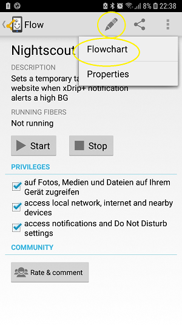

# Αυτοματοποίηση με τρίτο πρόσωπο του Android Αυτοματοποιημένο App

**This article has been written before AndroidAPS version 2.5. There is an [automation plugin in AndroidAPS](./Automation.md) itself with AndroidAPS version 2.5. For some, this here might be still useful, but should only be used by advanced users.**

Δεδομένου ότι το AndroidAPS είναι ένα σύστημα υβριδικού κλειστού κυκλώματος, είναι απαραίτητη κάποια αλληλεπίδραση με το χρήστη (π.χ. πείτε στο κύκλωμα ότι περπατάτε, τρώτε, ξαπλώνετε στον καναπέ...). Οι συχνές είσοδοι χειροκίνητων πληροφοριών μπορούν να αυτοματοποιηθούν μέσω εξωτερικών εργαλείων όπως το Automate ή το IFTTT για την επέκταση της πρόσφατης λειτουργικότητας του AndroidAPS.

## Android Automate App

Η δωρεάν εφαρμογή Android ™ Automate σάς επιτρέπει να αυτοματοποιήσετε διάφορες εργασίες στο smartphone σας. Create your automations with flowcharts, make your device automatically change settings like Bluetooth, Wi-Fi, NFC or perform actions like sending SMS, e-mail, based on your location, the time of day, or any other “event trigger”. Μπορείτε να αυτοματοποιήσετε σχεδόν τα πάντα στη συσκευή σας, Αυτοματοποιήστε ακόμη και τις προσθήκες υποστήριξης για Tasker και Locale.

Χρησιμοποιώντας αυτό το εργαλείο μπορείτε εύκολα να δημιουργήσετε ροές εργασίας για την αυτόματη θεραπεία του σακχαρώδη διαβήτη σας με βάση διάφορες προϋποθέσεις σύμφωνα με την αρχή του «αν αυτό... και αυτό... όχι αυτό..., τότε κάνε αυτό... και αυτό...'. Υπάρχουν χιλιάδες δυνατότητες που μπορείτε να διαμορφώσετε.

Μέχρι τώρα είναι απαραίτητο ** να γίνει κύκλωμα μέσω του προφίλ Nightscout **, καθώς το Automate εκτελεί τις εντολές μέσω HTTP αίτησης απευθείας στον ιστότοπό σας, ο οποίος στη συνέχεια συγχρονίζεται με την εφαρμογή AndroidAPS.

**Offline looping (direct communication between Automate and AndroidAPS app) is not supported yet**, but technologically possible. Ίσως θα υπάρξει λύση στο μέλλον. Εάν έχετε βρει έναν τρόπο να το κάνετε αυτό, παρακαλώ προσθέστε το σε αυτήν την τεκμηρίωση ή επικοινωνήστε με έναν προγραμματιστή.

### Βασικές απαιτήσεις

#### Αυτόματη εφαρμογή

Κάντε λήψη του Android Automate στο Google Play Store ή στη διεύθυνση [ https://llamalab.com/automate/ ](https://llamalab.com/automate/) και εγκαταστήστε το στο smartphone όπου εκτελείται το AndroidAPS.

In Automate, tap on hamburger menu on the upper left of the screen > Settings > Check 'Run on system startup'. Αυτό θα εκτελέσει αυτόματα τις ροές εργασίας σας κατά την εκκίνηση του συστήματος.

#### AndroidAPS

In AndroidAPS, tap on 3 dots menu on the upper right screen and go to Preferences > NSClient > Connection settings > Uncheck 'Use WiFi connection only' and 'Only if charging' as the automated treating does only work when AndroidAPS has an actual nightscout connection.

In AndroidAPS, tap on 3 dots menu on the upper right screen and go to Preferences > NSClient > Advanced Settings > Uncheck 'NS upload only (disabled sync)' and 'No upload to NS'.

Be aware of the [security issues](../Installing-AndroidAPS/Nightscout.md#security-considerations) that might occure and be very careful if you are using an [Insight pump](../Configuration/Accu-Chek-Insight-Pump#settings-in-aaps).

### Παραδείγματα ροής εργασίας

#### Παράδειγμα 1: Αν εντοπιστεί δραστηριότητα (π.χ. περπάτημα ή τρέξιμο), τότε ορίστε ένα υψηλό TT. Και αν τελειώσει η δραστηριότητα, περιμένετε 20 λεπτά και στη συνέχεια ακυρώστε το TT

This workflow will listen to the smartphone sensors (pedometer, gravity sensor...) that detect the activity behavior. If there is recent activity like walking, running or riding a bicycle present, then Automate will set a user specified high temporary target for the user specified time. If activity ends, your smartphone will detect this, wait for 20 minutes and then set the target back to normal profile value.

Download the Automate script <https://llamalab.com/automate/community/flows/27808>.

Edit the sling by tapping on the edit pencil > Flowchart

Customize the workflow according to your wishes as follows:

1. = Ρυθμίστε το υψηλό TT
2. = Go back to normal target 20 minutes after the end of activity

1 

2 

Request URL: Your NS-URL with ending /api/v1/treatments.json (e.g. https://my-cgm.herokuapp.com/api/v1/treatments.json)

Request content:

* υψηλός στοχος / χαμηλός στόχος: Η υψηλή τιμή TT (πάνω και κάτω πρέπει να είναι η ίδια τιμή)
* διάρκεια: Η διάρκεια του υψηλού TT (μετά την πάροδο του χρόνου θα αντιστραφεί ο κανονικός στόχος προφίλ εκτός αν η δραστηριότητα συνεχιστεί). 
* μυστικό: Το hash σας API SHA1. Δεν είναι το κλειδί API σας! Μπορείτε να μετατρέψετε το κλειδί API σας σε μορφή SHA1 στο [ http://www.sha1-online.com/ ](http://www.sha1-online.com/)

Save: Tap on 'Done' and on the hook

Start sling: Tap on Play button

#### Παράδειγμα 2: Εάν το xDrip + ειδοποιεί για υψηλό συναγερμό BG, τότε ορίστε ένα χαμηλό TT για ... λεπτά.

This workflow will listen to the xDrip+ notification channel. If there is triggered a user specified xDrip+ high BG alert, then Automate will set a user specified low temporary target for the user specified time. After time, another possibly alert will extend the duration of the low TT.

##### xDrip+

First, you must add a BG high alert in xDrip+ as follows:

Alert name: (Pay attention on it!) This name is essential for firing the trigger. It should be unmistakable and not similar to other alert names. Example: '180alarm' should not exist next to '80alarm'.

Threshold: BG value that should fire the high alert.

Default Snooze: Insert the duration you are planning to set for your low TT here, as the alert will come up again and maybe extend the duration of the low TT.

##### Αυτοματοποιήστε

Secondly, download the Automate script <https://llamalab.com/automate/community/flows/27809>.

Edit the sling by tapping on the edit pencil > Flowchart

Customize the workflow according to your wishes as follows:

Within the 'Notification posted?' trigger, you have to set the 'TITLE' to the name of your xDrip+ alert that should fire the trigger and add a * variable before and after that name.

Request URL: Your NS-URL with ending /api/v1/treatments.json (e.g. https://my-cgm.herokuapp.com/api/v1/treatments.json)

Request content:

* υψηλός στόχος / Χαμηλός στόχος: Η χαμηλή τιμή TT (πάνω και κάτω πρέπει να είναι η ίδια τιμή)
* διάρκεια: Η διάρκεια του χαμηλού TT (μετά από το χρόνο θα επιστρέψει ο κανονικός στόχος προφίλ). Συνιστάται να χρησιμοποιείτε την ίδια διάρκεια όπως στην xDrip + ειδοποίηση Standard snooze'
* μυστικό: Το hash σας API SHA1. Δεν είναι το κλειδί API σας! Μπορείτε να μετατρέψετε το κλειδί API σας σε μορφή SHA1 στο [ http://www.sha1-online.com/ ](http://www.sha1-online.com/)

Save: Tap on 'Done' and on the hook

Start sling: Tap on Play button

#### Παράδειγμα 3: Ας προστεθεί από εσάς!!!

Please add further workflows by uploading .flo file to Automate community (under the keyword 'Nightscout') and describe it here by doing [Pull Request on AndroidAPSdocs repository](../make-a-PR.md).

## Αν αυτό, τότε (IFTTT)

Feel free to add a Howto by PR...