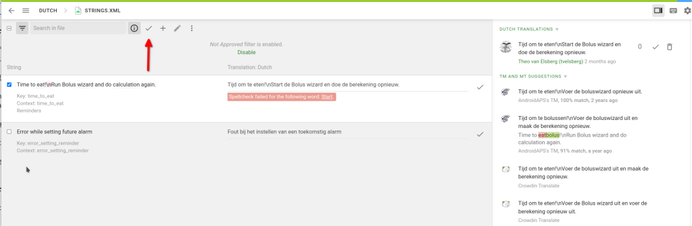

# Πώς να μεταφράσετε AndroidAPS και την τεκμηρίωση

* Go to <https://crowdin.com/project/androidaps> or <https://crowdin.com/project/androidapsdocs> and login using your Github account

* Send a join request to the docs team. Για να το κάνετε, κάντε κλικ στη σημαία της τη γλώσσα που επιθυμείτε και, στη συνέχεια, το κουμπί "Εγγραφή" στην πάνω δεξιά γωνία της επόμενης σελίδας. Παρακαλείστε να προσδιορίσετε τη γλώσσα, να δώσετε κάποιες πληροφορίες σχετικά με εσάς και την AAPS εμπειρία σας και αν θέλετε να είστε μεταφραστής ή διορθωτής (μόνο άνθρωποι ειδικευμένοι σε μετάφραση + advanced AndroidAPS χρήστες).

* Όταν σας εγκρίνουμε, κάντε κλικ στη σημαία 

## Μετάφραση strings για την εφαρμογή AndroidAPS

* Κάνε κλικ στο strings.xml
    
    

* Μεταφράστε προτάσεις στην αριστερή πλευρά προσθέτοντας νέο μεταφρασμένο κείμενο ή χρησιμοποιήστε & επεξεργασία πρότασης
    
    

* Οι προεπεξεργαστές πρέπει να στραφούν στη λειτουργία Προετοιμασίας
    
    
    
    και να εγκρίνουν μεταφρασμένα κείμενα
    
    

Όταν ένας διορθωτής εγκρίνει μια μετάφραση, θα προστεθεί στην επόμενη έκδοση του AndroidAPS. Αρχικά θα ήταν καλό να μεταβείτε στις υπάρχουσες μεταφράσεις που δεν έχουν ακόμη εγκριθεί και να ελέγξετε για λάθη ή να τις εγκρίνετε αν είναι σωστές.

## Translate docs pages

* Click the name of the docs page you want to translate
    
    

* Μετάφραση πρόταση με πρόταση
    
    1 Αμετάφραστο κείμενο εμφανίζεται με κόκκινο φόντο στην αριστερή πλευρά.
    
    2 Μπορείτε να αντιγράψετε μια πρόταση για να την επεξεργαστείτε το πεδίο, κάνοντας κλικ σχετικά με την πρόταση.
    
    3 Επεξεργαστείτε την πρόταση ή να γράψετε τον εαυτό σας μετάφραση.
    
    4 Click save
    
    

* A translated page will not be published in docs before the translation is proofread.

### Translate headline links

* When an internal link leads only to a certain page (i.e. ../Usage/Profiles.html) no translation is necessary.
* Internal links to a certain headline (i.e. ..//Usage/Profiles.html#percentage) must be translated as the headline in the other language is different from the English original.
* If you translate a headline you can transform this into the anchor link (part after # - i.e. #percentage) by turning all letters to lower case, transforming special characters to standard characters, replacing spaces by - (minus sign) and skipping punctuation marks.
    
    Here are some examples:
    
    * Was ist ein Closed Loop System mit AndroidAPS? \---> #was-ist-ein-closed-loop-system-mit-androidaps
    * Docs Updates & Änderungen \---> #docs-updates-anderungen
    * AAPS-.apk Datei \---> #aaps-apk-datei

* Check your link if it is working as intended. If it is linking to a new translated headline you may have to wait until next build to be able to check correct link syntax. In this case do not forget to make a reminder in your calendar / todo app.

#### Link translation in Markdown files (.md)

At the moment two [markup languages](./make-a-PR#code-syntax) are used in docs. Whereas files written in reStructuredText syntax (.rst) always show link address in Crowdin, for files in Markdown syntax (.md) you might have to activate HTML tag displaying in order to translate the link address.

* * *

**Make sure not to use space character at within HTML tags at the beginning or the end!**

* * *

If links are displayed like this in Crowdin

click on the cogwheel to open settings, select "Show" and click "Save".

Links will then be shown in standard HTML format and can be translated considering the rules mentioned [above](./translations#translate-headline-links).

## Proofreading

* Οι προεπεξεργαστές πρέπει να στραφούν στη λειτουργία Προετοιμασίας
    
    
    
    και να εγκρίνουν μεταφρασμένα κείμενα
    
    

* When a proofreader approves a translation it will be added to the next docs build. To speed process you can inform docs team about new translations.