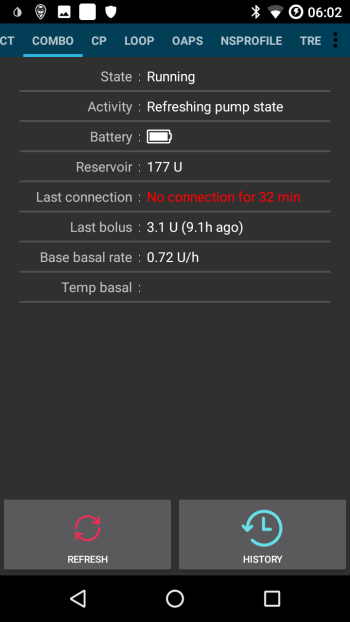

# Consejos para uso básico de Combo AccuChek

## Cómo garantizar las operaciones sin problemas

* Always **carry the smartphone with you**, leave it next to your bed at night. As your pump may lay behind or under you body while you sleep, a higher position (on a shelf or board) works best.
* Always make sure that the pump battery is as full as possible. See the battery section for tipps regarding the battery.
* Whenever possible, only operate the pump via the AAPS app. To facilitate this, activate the key lock on the pump under **PUMP SETTINGS / KEY LOCK / ON**. Únicamente cuando se cambia la batería o el cartucho, es necesario utilizar las teclas de la bomba. 

## Bomba no alcanzable. ¿Qué hacer?

### Activar alarma de bomba inalcanzable

* In AAPS, go to **Settings / Local Alarms** and activate **alarm when pump is unreachable** and set **pump not reachable limit [Min]** to **31** minutes.
* This will give you enough time to not trigger the alarm when leaving the room while your phone is left on the desk, but informs you if the pump cannot be reached for a time that exceeds the duration of a temporary basal rate.

### Restaure la posibilidad de alcance de la bomba

* When AAPS reports a **pump unreachable** alarm, first release the keylock and **press any key on the pump** (e.g. "down" button). As soon as the pump display has turned off, press **Refresh** on the **Combo Tab** in AAPS. Por lo general, la comunicación funciona de nuevo.
* If that does not help, reboot your smartphone. After the restart, AAPS will be reactivated and a new connection will be established with the pump. If you are using the old driver, ruffy will be reactivated as well.

* The tests with different smartphones have shown that certain smartphones trigger the "pump unreachable" error more often than others. See [AAPS Phones](#Phones-list-of-tested-phones) for successfully tested smartphones.

### Causas raíz y consecuencias de los errores de comunicación frecuentes

* On phones with **low memory** (or **aggressive power-saving** settings), AAPS is often shut down. Puede saber por el hecho de que los botones Bolos y Calculadora en la pantalla de inicio no se muestran al abrir AAPS porque el sistema está inicializando. Esto puede desencadenar "alarmas de bomba inalcanzable" durante el arranque. In the **Last Connection** field of the Combo tab, you can check when AAPS last communicated with the pump.

* Este error puede drenar la batería de la bomba más rápido porque el perfil basal se lee de la bomba cuando se reinicia la aplicación.
* También aumenta la probabilidad de provocar el error que hace que la bomba rechace todas las conexiones entrantes hasta que se pulsa un botón en la bomba. 

## La cancelación de la tasa basal temporal

* Occasionally, AAPS can not automatically cancel a **TBR CANCELED** alert. Then you have to either press **UPDATE** in the AAPS **Combo tab** or the alarm on the pump will need to be confirmed.

## Consideraciones sobre la batería de la bomba

### Cambiar pila

* Después de una alarma de **batería baja,** la batería debe cambiarse tan pronto como sea posible para tener siempre suficiente energía para una comunicación Bluetooth fiable con el smartphone, incluso si el teléfono está a una distancia más amplia de la bomba.
* Incluso después de una alarma **batería baja**, la batería podría ser utilizado para una cantidad significativa de tiempo. Sin embargo, se recomienda tener siempre una batería fresca con usted después de un aviso de alarma de "batería baja".
* Before changing the battery, press on the **Loop** symbol on the main screen and select **Suspend loop for 1h**. 
* Wait for the pump to communicate with the pump and the bluetooth logo on the pump has faded.

* Release the key lock on the pump, put the pump into stop mode, confirm a possibly canceled temporary basal rate, and change the battery quickly.
* When using the old driver, if the clock on the pump did not survive the battery change, re-set the date and time on the pump to exactly the date/time on your phone running AAPS. (The new driver automatically updates the pump's date and time.)
* Then put the pump back in run mode select **Resume** when pressing on the **Suspended Loop** icon on the main screen.
* AAPS will re-set a necessary temporary basal rate with the arrival of the next blood sugar value.

(Accu-Chek-Combo-Tips-for-Basic-usage-battery-type-and-causes-of-short-battery-life)=

### Tipos de batería y la causa de la corta vida de las mismas

* As intensive Bluetooth communication consumes a lot of energy, only use **high-quality batteries** like Energizer Ultimate Lithium, the "power one"s from the "large" Accu-Chek service pack, or if you are going for a rechargeable battery, use Eneloop batteries. 

 

Ranges for typical life time of the different battery types are as follows:

* **Energizer Ultimate Lithium**: de 4 a 7 semanas
* **Power One Alkaline** (Varta) from the service pack: 2 to 4 weeks
* **Eneloop rechargeable** batteries (BK-3MCCE): 1 to 3 weeks

If your battery life is significantly shorter than the ranges given above, please check the following possible causes:

* Hay algunas variantes de la tapa de la batería de tornillos de la bomba Combo, que parcialmente cortocircuita las baterías y las drena rápidamente. Las tapas sin este problema pueden ser reconocidas por los contactos de metal dorado.
* Si el reloj de la bomba no "sobrevive" a un cambio de batería corto, es probable que el capacitor esté roto, lo que mantiene el reloj en funcionamiento durante un breve corte de energía. In this case, a replacement of the pump by Roche might help, which is not a problem during the warranty period. 
* El hardware y el software del teléfono inteligente (sistema operativo Android y pila de bluetooth) también impactan la duración de la batería de la bomba, a pesar de que los factores exactos aún no se conocen completamente. Si tiene la oportunidad, pruebe otro smartphone y compare los tiempos de vida de la batería.

## Bolos extendidos, bolo Multionda

The OpenAPS algorithm does not support a parallel extended bolus or multiwave bolus. But a similar treatment can be achieved by the following alternatives:

* Use **e-Carbs** when entering carbs or using the Calculator by entering the carbs of the full meal and the duration you expect the carbs to arrive as glucose in you blood. The system will then calculate small carbs equally distributed over the whole duration which will cause th algorithm to provide equivalent insulin dosing while still permanently checking the overall rise/decrease of the blood glucose level. For a multiwave bolus approach, you can also combine a smaller immediate bolus with e-carbs. 
* Before eating, on the **Actions tab** in AAPS set as a temporary **Eating Soon** goal with target glucose 80 for several hours. The duration should be based on the interval you would choose for an extended bolus. This will keep your target lower than usual and therefore increase the amount of insulin delivered.
* Then use the **CALCULATOR** to enter the full carbs of the meal, but do not directly apply the values suggested by the bolus calculator. If a multiwave-like bolus is to be delivered, correct the insulin dosage down. Depending on the meal, the algorithm now has to deliver additional SMBs or higher temporary basal rates to counteract the increase in blood sugar. Here, the safety limitation of the basal rate (Max IE / h, Maximum basal IOB) should be very carefully experimented with and, if necessary, temporarily changed.

* If you are tempted to just use the extended or multiwave bolus directly on the pump, AAPS will penalize you with disabling the closed loop for the next six hours to ensure that no excess insulin dosage is calculated.

## Alarmas en la entrega en bolo

* If AAPS detects that an identical bolus has been successfully delivered at the same minute, bolus delivery will be prevented with identical number of insulin units. If your really want to bolus the same insulin twice in short succession, just wait two more minutes and then deliver the bolus again. If the fist bolus has been interrupted or was not delivered for other reasons, you can immediately re-submit the bolus since AAPS 2.0.
* The alarm is a safety mechanism that reads the pump's bolus history before submitting a new bolus to correctly calculate insulin on board (IOB), even when a bolus is delivered directly from the pump. Las entradas indistinguibles deben evitarse.

* Este mecanismo también es responsable de una segunda causa del error: Si durante el uso de la calculadora en bolo se entrega otro bolo a través de la bomba y, por lo tanto, cambia la historia del bolo, la base del cálculo del bolo es errónea y el bolo es abortado. 

