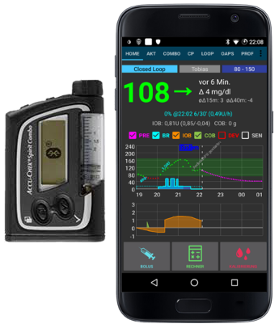

# Bomba de insulina Accu Chek Combo

**Este software es parte de una solución hazlo tú mismo y no es un producto, pero requiere que USTED lea, aprenda y entienda el sistema, incluso cómo usarlo. No es algo que haga todo el manejo de su diabetes, pero le permite mejorar su diabetes y su calidad de vida si está dispuesto a dedicar el tiempo necesario. No te precipites, pero date tiempo para aprender. Solo Usted es responsable de lo que hace con él.**

## Hardware necesario

- Una bomba de insulina Roche Accu-Chek Combo (cualquier firmware, todos funcionan)
- Un dispositivo Smartpix o Realtyme junto con el software de configuración 360 para configurar la bomba. Roche envía los dispositivos Smartpix y el software de configuración de forma gratuita a sus clientes previa solicitud.
- Un teléfono compatible: un teléfono Android con un teléfono con LineageOS 14.1 (anteriormente CyanogenMod) o Android 8.1 (Oreo). El LineageOS 14.1 tiene que ser una versión reciente de al menos junio de 2017, ya que el cambio necesario para vincular la bomba Combo solo se introdujo en ese momento. Se puede encontrar una lista de teléfonos en el documento Teléfonos AAPS. Tenga en cuenta que esta no es una lista completa y refleja la experiencia personal del usuario. Le recomendamos que también añada su experiencia y, por lo tanto, ayude a los demás (#cadenadeayuda).

- Tenga en cuenta que, aunque Android 8.1 permite comunicarse con el Combo, todavía hay problemas con AAPS en 8.1. Para usuarios avanzados, es posible realizar el emparejamiento en un teléfono rooteado y transferirlo a otro teléfono rooteado para usar con ruffy / AAPS, que también debe estar rooteado. Esto permite el uso de teléfonos con Android <8.1 pero no ha sido ampliamente probado: https://github.com/gregorybel/combo-pairing/blob/master/README.md

## Limitaciones

- Los bolos extendidos y multiondas no están soportados (consulte el apartado [Carbohidratos Extendidos](../Usage/Extended-Carbs.rst) en su lugar)
- Solo se admite un perfil basal.
- Establecer más de un perfil basal en la bomba, o administrar bolos extendidos o bolos multionda desde la bomba interfiere con TBR y fuerza al lazo cerrado a un modo de suspensión baja durante 6 horas ya que al lazo cerrado no puede funcionar de manera segura bajo estas condiciones.
- •Actualmente no es posible configurar la hora y la fecha en la bomba, por lo que los cambios de horario de verano deben realizarse manualmente (puede desactivar la actualización automática del reloj por la tarde y volver a cambiarla por la mañana junto con el reloj de la bomba para evitar una alarma durante la noche).
- Actualmente solo se admiten tasas basales en el rango de 0.05 a 10 U / h. Esto también se aplica cuando se modifica un perfil, p.ej cuando aumenta al 200%, la tasa basal más alta no debe superar las 5 U / h, ya que se duplicará. De manera similar, cuando se reduce al 50%, la tasa basal más baja debe ser de al menos 0,10 U / h.
- Si el lazo solicita que se cancele una TBR en ejecución, el Combo configurará una TBR de 90% o 110% durante 15 minutos. Esto es porque cancelar un TBR causa una alerta en la bomba que causa muchas vibraciones.
- Ocasionalmente (cada dos o tres días) AAPS puede no tratar una alerta de TBR CANCELADA, por lo que el usuario debe tratarla (presionar el botón Actualizar en AAPS para transferir la advertencia a AAPS o confirmar la alerta en la bomba).
- La estabilidad de la conexión Bluetooth varía con los diferentes teléfonos, lo que genera alertas de "bomba inaccesible", donde no hay conexión con la bomba. Si se produce ese error, asegúrese de que Bluetooth esté habilitado, presione el botón Actualizar en la barra Combo para ver si esto fue causado por un problema conexión y, si todavía no se establece ninguna conexión, reinicie el teléfono, que normalmente debería solucionarlo. Puede haber otro problema donde el reinicio no ayuda, pero se requiere presionar un botón en la bomba (que restablece el Bluetooth de la bomba), antes de que la bomba acepte las conexiones desde el teléfono nuevamente. Es muy poco lo que se puede hacer para remediar estos problemas en este punto. Entonces, si ve esos errores con frecuencia, su única opción en este momento es obtener otro teléfono que se sepa que funciona bien con AndroidAPS y el Combo (consulte más arriba).
- La emisión de un bolo de la bomba no siempre se detectará a tiempo (se verifica cuando se conecta AAPS a la bomba), y puede tomar hasta 20 minutos en el peor de los casos. Los bolos en la bomba siempre se verifican antes de un TBR alto o un bolo emitido por AAPS, pero debido a las limitaciones, AAPS rechazará las TBR / Bolus, ya que se calculó bajo premisas falsas. (-> ¡No comande bolos desde la bomba! Consulte el capítulo de Uso)
- Debe evitarse establecer un TBR en la bomba, ya que el lazo cerrado asume el control de TBR. La detección de un nuevo TBR en la bomba puede demorar hasta 20 minutos y el efecto del TBR solo se tendrá en cuenta desde el momento en que se detecte, por lo que en el peor de los casos podría haber 20 minutos de un TBR no reflejada en el IOB del algoritmo. 

## Configuración

- Configure la bomba utilizando el software de configuración 360. Si no tiene el software, comuníquese con su línea directa de Accu-Chek. Por lo general, envían a los usuarios registrados un CD con el "Software de configuración de bomba 360 °" y un dispositivo de conexión por infrarrojos USB SmartPix (el dispositivo Realtyme también funciona si tiene eso). 
  - Requerido (marcado en verde en capturas de pantalla): 
    - Establecer / dejar la configuración de menú como "Estándar", esto mostrará solo los menús / acciones compatibles en la bomba y ocultará aquellos que no son compatibles (bolo extendido / multiwave, tasas basales múltiples), lo que causa que la funcionalidad de bucle se restrinja cuando utilizado porque no es posible ejecutar el ciclo de forma segura cuando se utiliza.
    - Verifique que el texto de información rápida esté configurado en "INFORMACIÓN RÁPIDA" (sin las comillas, que se encuentran en Opciones de bomba de insulina).
    - Ajuste el ajuste máximo de TBR al 500%
    - Deshabilitar el final de la señal de la frecuencia basal temporal
    - Establecer el incremento de duración de TBR en 15 minutos
    - Habilitar Bluetooth
  - Recomendado (marcado en azul en capturas de pantalla) 
    - Establecer alarma de cartucho baja a su gusto
    - Configurar un bolus máximo adecuado para su terapia para proteger contra errores en el software
    - Del mismo modo, configure la duración máxima de TBR como salvaguarda. Permita por lo menos 3 horas, ya que la opción de desconectar la bomba por 3 horas establece un 0% por 3 horas.
    - Habilitar el bloqueo de teclas en la bomba para evitar los bolos desde la bomba, especialmente. cuando la bomba se usó antes y el bolusing rápido era un hábito.
    - Establezca el tiempo de espera de la pantalla y el tiempo de espera del menú en un mínimo de 5.5 y 5 respectivamente. Esto permite que el AAPS se recupere más rápidamente de situaciones de error y reduce la cantidad de vibraciones que pueden ocurrir durante tales errores

- Instalar AndroidAPS como se describe en la [AndroidAPS wiki](http://wiki.AndroidAPS.org).
- Asegúrese de leer la wiki para comprender cómo configurar AndroidAPS.
- Seleccione el complemento MDI en AndroidAPS, no el complemento Combo en este punto para evitar que el complemento Combo interfiera con ruffy durante el proceso de emparejamiento.
- Siga el enlace <http://ruffy.AndroidAPS.org> y clone ruffy a través de git.
- Instale ruffy y úselo para emparejar la bomba. Si no funciona después de varios intentos, cambie a la rama 'pairing', empareje la bomba y luego vuelva a cambiar a la rama original. Tenga en cuenta que el proceso de emparejamiento es algo frágil (pero solo debe hacerse una vez) y puede necesitar algunos intentos; confirme rápidamente las indicaciones y, cuando comience nuevamente, elimine la bomba de dispositivos en la configuración de Bluetooth de antemano. Otra opción para probar es ir al menú de Bluetooth después de iniciar el proceso de emparejamiento (esto permite que el Bluetooth del teléfono sea visible siempre que se muestre el menú) y volver a cambiar a ruffy después de confirmar el emparejamiento en la bomba, cuando la bomba muestra la autorización código. Si no logra emparejar la bomba (por ejemplo, después de 10 intentos), intente esperar hasta 10 s antes de confirmar el emparejamiento en la bomba (cuando se muestra el nombre del teléfono en la bomba). Si ha configurado el tiempo de espera del menú para que sea 5s arriba, necesita aumentarlo nuevamente. Algunos usuarios informaron que necesitaban hacer esto. Por último, considere la posibilidad de pasar de una habitación a otra en caso de interferencia de radio local. Al menos un usuario superó inmediatamente los problemas de emparejamiento simplemente cambiando de ubicación.
- Cuando AAPS usa ruffy, la aplicación ruffy no se puede usar. La manera más fácil es simplemente reiniciar el teléfono después del proceso de emparejamiento y dejar que AAPS comience con ruffy en segundo plano.
- Si la bomba es completamente nueva, debe poner un bolo con la bomba, para que se cree una primera entrada de historia de la bomba.
- Antes de habilitar el complemento Combo en AAPS, asegúrese de que su perfil esté configurado correctamente y activado (!) Y su perfil basal esté actualizado, ya que AAPS sincronizará el perfil basal con la bomba. Luego active el complemento Combo. Presione el botón Actualizar en la pestaña Combo para inicializar la bomba.
- Para verificar su configuración, con la bomba desconectada, use AAPS para establecer un TBR de 500% durante 15 minutos y ponga un bolo. La bomba ahora debería tener un TBR en ejecución y el bolo en la historia. AAPS debe mostrar la TBR y el bolo.

## ¿Por qué la vinculación con la bomba no funciona con la app "ruffy"?

Hay varias razones posibles. Realice los siguientes pasos:

1. Ponga una **batería nueva o totalmente cargada ** en la bomba. Mire la sección de batería para más detalles. Asegúrese de que la bomba esta muy cerca del teléfono.

2. Apague o retire cualquier otro dispositivo bluetooth de manera que no establezca conexión con el teléfono mientras la vinculación está en marcha. Cualquier comunicación bluetooth simultánea o pregunta de establecer conexión puede interferir con el proceso de vinculación.

3.     Borre los dispositivos Bluetooth ya vinculados en el menú de la bomba:**AJUSTES BLUETOOTH / CONEXION / BORRAR** hasta que se muestre **NO DEVICE**.
      

4. Borre la bomba ya conectada al teléfono vía Bluetooth: En ajustes/Bluetooth, eliminar dispositivo emparejado "**SpiritCombo**"
5. Asegúrese que el lazo de AAPS no está en ejecución. Desactive el lazo en AAPS.
6. Ahora inicie ruffy en el teléfono. Debe pulsar Reset! eliminar el antiguo emparejamiento. Y por último pulsar en Connectar!.
7. El el menú Bluetooth de la bomba, ir a **ADD DEVICE / ADD CONNECTION**. Presione * CONNECT! ** * Los pasos 5 y 6 tienen que hacerse en poco tiempo.
8. Ahora la bomba debería mostrar el nombre BT del teléfono para seleccionar el emparejamiento. Aquí es importante esperar al menos 5 segundos antes de presionar el botón de selección en la bomba. De lo contrario, la bomba no enviará la solicitud de emparejamiento al teléfono correctamente.

* Si la bomba está configurada en 5 segundos de tiempo de espera de pantalla, puede probarla con 40 segundos (configuración original). Por experiencia el tiempo entre que la bomba se muestra en el teléfono hasta que el teléfono seleccionado es de 5-10 segundos. En muchos otros casos, el emparejamiento solo se agota sin emparejar con éxito. Más tarde deberías volver a los 5 seg., para volver a los ajustes de AAPS Combo. * Si la bomba no muestra el teléfono como un dispositivo de emparejamiento, el Bluetooth de su teléfono probablemente no sea compatible con la bomba. Asegúrese de ejecutar un nuevo ** LineageOS ≥ 14.1 ** o ** Android ≥ 8.1 (Oreo) **. Si es posible pruebe otro teléfono. Usted puede encontrar una lista de los teléfonos utilizados con éxito en \[AAPS Teléfonos\] (https://docs.google.com/spreadsheets/d/1gZAsN6f0gv6tkgy9EBsYl0BQNhna0RDqA9QGycAqCQc/edit#gid=698881435).

9. Luego la bomba, debe mostrar un código de seguridad de 10 dígitos. Ruffy muestra una pantalla para ingresar el código. Así que introdúzcalo en Ruffy y deberías estar listo.
10. Reinicie el teléfono.
11. Ahora puede reiniciar el lazo AAPS.

## Uso

- Tenga en cuenta que esto no es un producto, especializado, es necesario que el usuario supervise y entienda el sistema, sus limitaciones y cómo puede fallar. Se aconseja encarecidamente NO utilizar este sistema cuando la persona lo que utiliza no es capaz de entender completamente el sistema.
- Lea la documentación de OpenAPS https://openaps.org para comprender el algoritmo de lazo cerrado en el que se basa AndroidAPS.
- Lea la wiki para conocer y comprender AndroidAPS http://wiki.AndroidAPS.org
- Esta integración usa la misma funcionalidad que proporciona el medidor que viene con el Combo. El medidor permite reflejar la pantalla de la bomba y presiona el botón hacia la bomba. La conexión a la bomba y este reenvío es lo que hace la aplicación Ruffy. Un componente de script lee la pantalla y automatiza el ingreso de bolos, TBR, etc., y se asegura de que las entradas se procesen correctamente. AAPS luego interactúa con el scripter para aplicar comandos de lazo cerrado y administrar bolos. Este modo tiene algunas restricciones: es comparativamente lento (pero lo suficientemente rápido para lo que se usa), y establecer un TBR o administrar un bolo hace que la bomba vibre.
- La integración Combo con AndroidAPS está diseñada con la suposición de que todas las entradas se realizan a través de AndroidAPS. Los bolos ingresados en la bomba directamente serán detectados por AAPS, pero puede tomar hasta 20 minutos antes de que AndroidAPS tenga conocimiento de dicho bolo. Leer bolos entregados directamente en la bomba es una característica de seguridad y no debe usarse regularmente (el ciclo requiere conocimiento de carbohidratos consumidos, que no pueden ingresarse en la bomba, que es otra razón por la cual todas las entradas deben realizarse en AndroidAPS). 
- No configure ni cancele un TBR en la bomba. El lazo asume el control de TBR y, de lo contrario, no puede funcionar de manera confiable, ya que no es posible determinar el tiempo de inicio de una TBR establecida por el usuario en la bomba.
- El primer perfil basal de la bomba se lee al inicio de la aplicación y es actualizado por AAPS. La tasa basal no se debe cambiar manualmente en la bomba, pero se detectará y corregirá como una medida de seguridad (no confíe en medidas de seguridad por defecto, esto es para detectar un cambio.
- Se recomienda habilitar el bloqueo de teclas en la bomba para evitar opción bolos de la bomba, especialmente. cuando la bomba se usó antes y el uso de la función "bolo rápido" era un hábito. Además, con el bloqueo de teclas activado, presionar accidentalmente una tecla NO interrumpe la comunicación activa entre AAPS y la bomba.
- Cuando se inicia una alerta BOLUS / TBR CANCELED en la bomba durante el bolo o la configuración de una TBR, esto se debe a una desconexión entre la bomba y el teléfono, lo que ocurre de vez en cuando. AAPS intentará reconectar y confirmar la alerta y luego volver a intentar la última acción (los bolos NO se vuelven a intentar por razones de seguridad). Por lo tanto, dicha alarma puede ignorarse ya que AAPS la confirmará automáticamente, generalmente dentro de 30 segundos (cancelarla no es un problema, pero hará que la acción activa tenga que esperar hasta que la pantalla de la bomba se apague antes de que pueda volver a conectarse a la bomba). Si la alarma de la bomba continúa, la confirmación automática falló, en cuyo caso el usuario necesita confirmar la alarma manualmente.
- Cuando se salta una alarma de cartucho bajo o batería baja durante un bolo, se confirman y se muestran como una notificación en AAPS. Si se producen mientras no hay conexión abierta a la bomba, al ir a la pestaña Combo y al presionar el botón Actualizar se hará cargo de esas alertas confirmándolas y mostrando una notificación en AAPS.
- Cuando AAPS no confirma una alerta TBR CANCELADA, o una se genera por un motivo diferente, al presionar Actualizar en la pestaña Combo se establece una conexión, se confirma la alerta y se muestra una notificación en AAPS. Esto se puede hacer de manera segura, ya que esas alertas son benignas: se volverá a establecer un TBR apropiado durante la siguiente iteración del lazo cerrado.
- Para todas las demás alertas generadas por la bomba: la conexión a la bomba mostrará el mensaje de alerta en la pestaña Combo, p.ej "Estado: E4: oclusión", además de mostrar una notificación en la pantalla principal. Un error generará una notificación urgente. AAPS nunca confirma errores graves en la bomba, pero la bomba vibra y suena para asegurarse de que el usuario esté informado de una situación crítica que necesita acción.
- Después del emparejamiento, ruffy no se debe usar directamente (AAPS se iniciará en segundo plano según sea necesario), ya que no se admite el uso de ruffy en AAPS al mismo tiempo.
- Si AAPS se bloquea (o se detiene desde el depurador) mientras AAPS y la bomba se comunicaban (usando ruffy), podría ser necesario forzar el cierre de ruffy. Reiniciar AAPS comenzará ruffy de nuevo. Reiniciar el teléfono también es una manera fácil de resolver esto si no sabes cómo forzar el cierre de una aplicación.
- No presione ningún botón en la bomba mientras se está comunicando con AAPS (el logo de bluetooth se pone en la bomba).