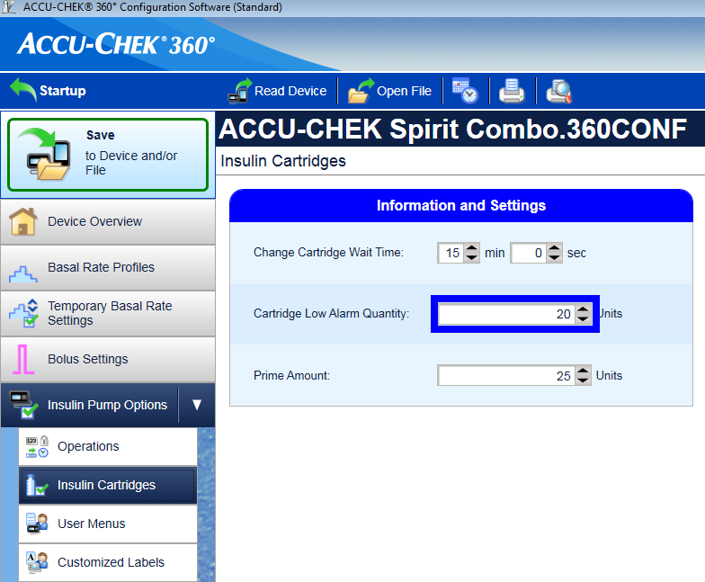

# Bomba de insulina Accu Chek Combo

**Este software es parte de una solución de DIY y no es un producto, pero requiere que USTED lea, aprenda y entienda el sistema incluyendo cómo utilizarlo. No es algo que maneja toda su diabetes, pero permite mejorarla y aumentar su calidad de vida si está dispuesto a dedicar el tiempo necesario. No se apresure en ello, pero permítese tiempo para aprender. Solo Usted es responsable de lo que hace con esto.**

## Hardware necesario

* Una bomba de insulina Roche Accu-Chek Combo (cualquier firmware, todos funcionan)
* Un dispositivo Smartpix o Realtyme junto con el software de configuración 360 para configurar la bomba. (Roche envía los dispositivos Smartpix y el software de configuración de forma gratuita a sus clientes cuando lo solicite.)
* Un teléfono compatible: un teléfono Android con un teléfono con LineageOS 14.1 (anteriormente CyanogenMod) o Android 8.1 (Oreo). 
* El LineageOS 14.1 tiene que ser una versión reciente de al menos junio de 2017, ya que el cambio necesario para vincular la bomba Combo solo se introdujo en ese momento. 
* Se puede encontrar una lista de teléfonos en el documento Teléfonos AAPS.
* Tenga en cuenta que esta no es una lista completa y refleja la experiencia personal del usuario. Le recomendamos que también añada su experiencia y, por lo tanto, ayude a los demás (#cadenadeayuda).
* Tenga en cuenta que mientras que Android 8.1 permite comunicarse con la Combo, todavía hay problemas con AAPS en 8.1.
* Para los usuarios avanzados, es posible realizar el emparejamiento en un teléfono rooteado y transferirlo a otro teléfono rooteado para utilizarlo con ruffy/AAPS, que también debe estar rooteado. Esto permite usar teléfonos con Android < 8.1 pero no ha sido ampliamente probado: https://github.com/gregorybel/combo-pairing/blob/master/README.md

## Limitaciones

* Los bolos extendidos y multiondas no están soportados (consulte el apartado [Carbohidratos Extendidos](../Usage/Extended-Carbs.rst) en su lugar).
* Solo se admite un perfil basal.
* Establecer un perfil basal distinto de 1 en la bomba o entregar bolos extendidos o bolos multionda desde la bomba interfiere con TBRs y fuerza el bucle en modo de baja suspensión durante 6 horas, ya que el lazo no puede correr de forma segura bajo estas condiciones.
* Actualmente no es posible establecer la hora y la fecha en la bomba, por lo que [cambios en el horario de verano](../Usage/Timezone-traveling#accu-chek-combo) tienen que realizarse manualmente (puede desactivar la actualización automática del reloj del teléfono por la noche y volver a cambiarlo por la mañana junto con el reloj de la bomba para evitar una alarma durante la noche).
* Actualmente solo se admiten tasas basales en el rango de 0.05 a 10 U / h. Esto también se aplica a la modificación de un perfil, p.ej. al aumentar a 200%, la tasa basal más alta no debe superar las 5 U/h ya que se duplicará. De manera similar, cuando se reduce al 50%, la tasa basal más baja debe ser de al menos 0,10 U / h.
* Si el lazo solicita que se cancele un TBR en ejecución, la Combo establecerá un TBR del 90% o el 110% durante 15 minutos en su lugar. Esto es porque cancelar un TBR causa una alerta en la bomba que causa muchas vibraciones.
* Ocasionalmente (cada dos o tres días) AAPS podría no cancelar una alerta de TBR CANCELADA, por lo que el usuario debe tratarla (presionar el botón Actualizar en AAPS para transferir la advertencia a AAPS o confirmar la alerta en la bomba).
* La estabilidad de la conexión Bluetooth varía con diferentes modelos de teléfonos, causando alertas "bomba inaccesible", donde ya no se ha establecido ninguna conexión a la bomba. 
* Si se produce ese error, asegúrese de que Bluetooth esté activado, presione el botón Actualizar en la barra Combo para ver si esto fue causado por un problema conexión y, si todavía no se establece ninguna conexión, reinicie el teléfono, esto suele solucionarlo. 
* Hay otro problema donde un reinicio no ayuda y debe ser presionado un botón de la bomba (que restablece el Bluetooth de la bomba) antes de que la bomba acepte nuevamente conexiones desde el teléfono. 
* Muy poco se puede hacer para solucionar algunos de estos problemas en este momento. Así que si ve estos errores frecuentemente su única opción en este momento es conseguir otro teléfono que se sabe que funciona bien con AndroidAPS y la Combo (ver arriba).
* La emisión de un bolo de la bomba no siempre se detectará a tiempo (se verifica cuando se conecta AAPS a la bomba), y puede tomar hasta 20 minutos en el peor de los casos. 
* Los bolos en la bomba siempre se verifican antes de un TBR alto o un bolo emitido por AAPS, pero debido a las limitaciones, AAPS rechazará las TBR / Bolus, ya que se calculó bajo premisas falsas. (-> ¡No envíe bolos desde la bomba! Ver capítulo [Uso](#usage) abajo)
* Debe evitarse establecer un TBR en la bomba, ya que el lazo cerrado asume el control de TBR. La detección de un nuevo TBR en la bomba puede demorar hasta 20 minutos y el efecto del TBR solo se tendrá en cuenta desde el momento en que se detecte, por lo que en el peor de los casos podría haber 20 minutos de un TBR no reflejada en el IOB del algoritmo. 

## Configuración

* Configure la bomba utilizando el software de configuración 360. 
* Si no tiene el software, comuníquese con soporte de Accu-Chek. Por lo general, envían a los usuarios registrados un CD con el "Software de configuración de bomba 360 °" y un dispositivo de conexión por infrarrojos USB SmartPix (el dispositivo Realtyme también funciona si tiene eso).
* **Ajustes requeridos** (marcados en verde en capturas de pantalla):
    
    * Set/leave the menu configuration as "Standard", this will show only the supported menus/actions on the pump and hide those which are unsupported (extended/multiwave bolus, multiple basal rates), which cause the loop functionality to be restricted when used because it's not possible to run the loop in a safe manner when used.
    * Verifique que el texto de información rápida esté configurado en "INFORMACIÓN RÁPIDA" (sin las comillas, que se encuentran en Opciones de bomba de insulina).
    * Ajuste el ajuste máximo de TBR al 500%
    * Deshabilitar el final de la señal de la frecuencia basal temporal
    * Establecer el incremento de duración de TBR en 15 minutos
    * Habilitar Bluetooth

* **Ajustes recomendados** (marcados azul en capturas de pantalla)
    
    * Establecer alarma de cartucho baja a su gusto
    * Configurar un bolus máximo adecuado para su terapia para proteger contra errores en el software
    * Del mismo modo, configure la duración máxima de TBR como salvaguarda. Allow at least 3 hours, since the option to disconnect the pump for 3 hours sets a 0% for 3 hours.
    * Habilitar el bloqueo de teclas en la bomba para evitar los bolos desde la bomba, especialmente. when the pump was used before and quick bolusing was a habit.
    * Establezca el tiempo de espera de la pantalla y el tiempo de espera del menú en un mínimo de 5.5 y 5 respectivamente. This allows the AAPS to recover more quickly from error situations and reduces the amount of vibrations that can occur during such errors

* Instale AndroidAPS como se describe en [AndroidAPS docs](../Installing-AndroidAPS/Building-APK.md).
* Asegúrese de leer los documentos para entender cómo configurar AndroidAPS.
* Select the **MDI plugin** in AndroidAPS, not the Combo plugin at this point to avoid the Combo plugin from interfering with ruffy during the pairing process.
* Clone [ruffy](https://github.com/MilosKozak/ruffy) desde github via git.
* Instale ruffy y úselo para emparejar la bomba.
    
    * Si no funciona después de varios intentos, cambie a la rama 'pairing', empareje la bomba y luego vuelva a cambiar a la rama original.
    * Note that the pairing processing is somewhat fragile (but only has to be done once) and may need a few attempts; quickly acknowledge prompts and when starting over, remove the pump device from the Bluetooth settings beforehand. 
    * Another option to try is to go to the Bluetooth menu after initiating the pairing process (this keeps the phone's Bluetooth discoverable as long as the menu is displayed) and switch back to ruffy after confirming the pairing on the pump, when the pump displays the authorization code.
    * Si no tiene éxito en el emparejamiento de la bomba (digamos después de 10 intentos), intente esperar hasta 10 seg. antes de confirmar el emparejamiento en la bomba (cuando el nombre del teléfono se muestra en la bomba). 
    * Si ha configurado el tiempo de espera del menú para que sea 5 seg. arriba, necesita aumentarlo nuevamente. Algunos usuarios informaron que necesitaban hacer esto. 
    * Por último, considere la posibilidad de pasar de una habitación a otra en caso de interferencia de radio local. Al menos un usuario superó inmediatamente los problemas de emparejamiento simplemente cambiando de ubicación.

* Cuando AAPS usa ruffy, la aplicación ruffy no se puede usar. The easiest way is to just reboot the phone after the pairing process and let AAPS start ruffy in the background.

* If the pump is completely new, you need to **do one bolus on the pump**, so the pump creates a first history entry.
* Before enabling the Combo plugin in AAPS make sure your profile is set up correctly and activated(!) and your basal profile is up to date as AAPS will sync the basal profile to the pump.
* Then activate the [Combo plugin](../Configuration/Config-Builder#pump). 
* Press the *Refresh* button on the Combo tab to initialize the pump.
* Para verificar su configuración, con la bomba desconectada, use AAPS para establecer un TBR de 500% durante 15 minutos y ponga un bolo.
* La bomba ahora debería tener un TBR en ejecución y el bolo en la historia. AAPS debe mostrar la TBR y el bolo.

## Why does pairing with the pump not work with the app "ruffy"?

Hay varias razones posibles. Realice los siguientes pasos:

1. Ponga una **batería nueva o totalmente cargada ** en la bomba. Mire la sección de batería para más detalles. Asegúrese de que la bomba esta muy cerca del teléfono.

2. Apague o retire cualquier otro dispositivo bluetooth de manera que no establezca conexión con el teléfono mientras la vinculación está en marcha. Cualquier comunicación bluetooth simultánea o pregunta para establecer conexión puede interferir con el proceso de vinculación.
3. Delete already connected devices in the Bluetooth menu of the pump: **BLUETOOTH SETTINGS / CONNECTION / REMOVE** until **NO DEVICE** is shown.
4. Delete a pump already connected to the phone via Bluetooth: Under Settings / Bluetooth, remove the paired device "**SpiritCombo**"
5. Asegúrese que el lazo de AAPS no está en ejecución. Desactive el lazo en AAPS.
6. Ahora inicie ruffy en el teléfono. Debe pulsar Reset! eliminar el antiguo emparejamiento. Y por último pulsar en Connectar!.
7. El el menú Bluetooth de la bomba, ir a **ADD DEVICE / ADD CONNECTION**. Press *CONNECT!**
    
    * Step 6 and 7 have to be done in a short timing.

8. Ahora la bomba debe mostrar el Nombre BT del teléfono para seleccionar y realizar la vinculación. Here it is important to wait at least 5s before you hit the select button on Pump. De lo contrario, la bomba no enviará la solicitud de emparejamiento al teléfono correctamente.

* Si la bomba está configurada en 5 segundos de tiempo de espera de pantalla, puede probarla con 40 segundos (configuración original). From experience the time between pump is showing up in phone until select phone is around 5-10s. In many other cases pairing just times out without successfully Pair. 
* Más tarde deberías volver a los 5 seg., para volver a los ajustes de AAPS Combo.
* If the pump does not show the phone as a pairing device at all, your phone's Bluetooth stack is probably not compatible with the pump. Asegúrese de ejecutar un nuevo ** LineageOS ≥ 14.1 ** o ** Android ≥ 8.1 (Oreo) **. If possible, try another smartphone. Usted puede encontrar una lista de los teléfonos ya utilizados con éxito en \[AAPS Teléfonos\] (https://docs.google.com/spreadsheets/d/1gZAsN6f0gv6tkgy9EBsYl0BQNhna0RDqA9QGycAqCQc/edit#gid=698881435). 

9. Luego la bomba, debe mostrar un código de seguridad de 10 dígitos. Ruffy muestra una pantalla para ingresar el código. Ingrese el código en la pantalla de Ruffy y listo para continuar.
10. Reinicie el teléfono.
11. Ahora puede reiniciar el lazo AAPS.

## Uso

* Tenga en cuenta que esto no es un producto. in the beginning the user needs to monitor and understand the system, its limitations and how it can fail. 
* It is strongly advised NOT to use this system when the person using it is not able to fully understand the system.
* Read the OpenAPS documentation https://openaps.org to understand the loop algorithm AndroidAPS is based upon.
* Read the [AAPS docs](https://androidaps.readthedocs.io/en/latest/) to learn about and understand AndroidAPS.
* Esta integración usa la misma funcionalidad que proporciona el medidor que viene con el Combo.
* El medidor permite reflejar la pantalla de la bomba y presiona el botón hacia la bomba. 
* The connection to the pump and this forwarding is what the ruffy app does. 
* A 'scripter' components reads the screen and automates entering boluses, TBRs etc and making sure inputs are processed correctly.
* AAPS luego interactúa con el scripter para aplicar comandos de lazo cerrado y administrar bolos.
* This mode has some restrictions: it's comparatively slow (but well fast enough for what it is used for) and setting a TBR or giving a bolus causes the pump to vibrate.
* The integration of the Combo with AndroidAPS is designed with the assumption that all inputs are made via AndroidAPS. Boluses entered on the pump directly will be detected by AAPS, but it can take up to 20 min before AndroidAPS becomes aware of such a bolus. 
* Reading boluses delivered directly on the pump is a safety feature and not meant to be regularly used (the loop requires knowledge of carbs consumed, which can't be entered on the pump, which is another reason why **all inputs should be done in AndroidAPS**). 
* No configure ni cancele un TBR en la bomba. El lazo asume el control de TBR y, de lo contrario, no puede funcionar de manera confiable, ya que no es posible determinar el tiempo de inicio de una TBR establecida por el usuario en la bomba.
* El primer perfil basal de la bomba se lee al inicio de la aplicación y es actualizado por AAPS.
* The basal rate should not be manually changed on the pump, but will be detected and corrected as a safety measure (don't rely on safety measures by default, this is meant to detect an unintended change on the pump).
* Se recomienda habilitar el bloqueo de teclas en la bomba para evitar opción bolos de la bomba, especialmente. when the pump was used before and using the "quick bolus" feature was a habit.
* Also, with keylock enabled, accidentally pressing a key will NOT interrupt active communication between AAPS and pump.
* When a BOLUS/TBR CANCELLED alert starts on the pump during bolusing or setting a TBR, this is caused by a disconnect between pump and phone, which happens from time to time. AAPS will try to reconnect and confirm the alert and then retry the last action (**boluses are NOT retried** for safety reasons). 
* Therefore, such an alarm can be ignored as AAPS will confirm it automatically, usually within 30s (cancelling it is not problem, but will lead to the currently active action to have to wait till the pump's display turns off before it can reconnect to the pump). 
* If the pump's alarm continues, automatic confirmation failed, in which case the user needs to confirm the alarm manually.
* When a low cartridge or low battery alarm is raised during a bolus, they are confirmed and shown as a notification in AAPS. 
* If they occur while no connection is open to the pump, going to the Combo tab and hitting the Refresh button will take over those alerts by confirming them and show a notification in AAPS.
* When AAPS fails to confirm a TBR CANCELLED alert, or one is raised for a different reason, hitting Refresh in the Combo tab establishes a connection, confirms the alert and shows a notification for it in AAPS. This can safely be done, since those alerts are benign - an appropriate TBR will be set again during the next loop iteration.
* For all other alerts raised by the pump: connecting to the pump will show the alert message in the Combo tab, e.g. "State: E4: Occlusion" as well as showing a notification on the main screen.
* Un error generará una notificación urgente. 
* AAPS never confirms serious errors on the pump, but let's the pump vibrate and ring to make sure the user is informed of a critical situation that needs action.
* After pairing, ruffy should not be used directly (AAPS will start in the background as needed), since using ruffy at AAPS at the same time is not supported.
* If AAPS crashes (or is stopped from the debugger) while AAPS and the pump were communicating (using ruffy), it might be necessary to force close ruffy. Reiniciar AAPS comenzará ruffy de nuevo.
* Restarting the phone is also an easy way to resolve this if you don't know how to force kill an app.
* Don't press any buttons on the pump while AAPS communicates with the pump (Bluetooth logo is shown on the pump).