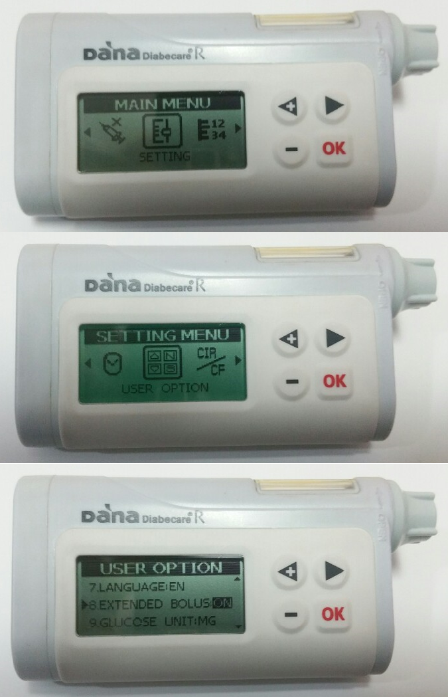

# Bomba DanaR

*Estas instrucciones son para configurar la app y la bomba si tiene una DanaR. Visite [DanaRS Insulin Pump ](./DanaRS-Insulin-Pump) si tiene una DanaRS lanzada en 2017.*

* En la bomba vaya a Main Menu > Setting > User Option
* Activar "8. Bolo extendido"

* Ir a Main Menu > Setting > Discovery
* En la configuración del teléfono, vaya a Bluetooth, explore los dispositivos cercanos, seleccione su número de serie DanaR y especifique su contraseña (la contraseña de emparejamiento es 0000). Si DanaR no aparece en el escaneo, reinicie el teléfono y cambie la batería de la bomba DanaR y vuelva a iniciar estos dos pasos.

* En AndroidAPS vaya a configuración y seleccione el modelo de DanaR que tiene (DanaR, DanaR Coreano, DanaRv2)

* Seleccione Menú pulsando los 3 puntos en la parte superior derecha. Seleccione preferencias.
* Seleccione el dispositivo Bluetooth de DanaR y haga clic en el número de serie de DanaR.
* Seleccione la contraseña de la bomba e introduzca su contraseña. (La contraseña predeterminada es 1234)
* Si quieres que AndroidAPS permita una tasa basal por encima del 200%, activa el uso de bolos extendidos por >200%. Tenga en cuenta esto significa que no puede hacer lazos con TBRs altos mientras utiliza bolos extendidos para alimentos.
* En Preferencias en la configuración de la bomba DanaR puede cambiar la velocidad de bolo por defecto utilizada (12seg por 1u, 30seg por 1u o 60s por 1u).
* Ajustar paso basal a 0.01 U/h
* Set bolus step on pump to 0.1 U/h
* Habilitar bolos extendidos en bomba

## Cambio de zona horaria al viajar con la bomba Dana R

For information on traveling across time zones see section [Timezone traveling with pumps](Timezone-traveling-danarv2-danars).