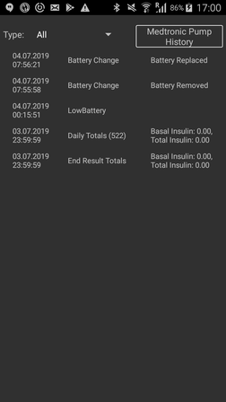

# Bombas Medtronic

**>>>> El controlador de bomba de Medtronic es de la versión 2.5 de AndroidAPS (maestro). Si bien este es el caso, el controlador Medtronic debe ser considerado como software beta. Por favor, instale sólo si es usuario experimentado. At the moment we are still fighting with double Bolus issue (We get 2 boluses in treatments, which throws IOB calculation (if you experience this bug, please enable Double Bolus Logging in Medtronic configuration and provide your logs)). <<<<**

* * *

Funciona sólo con las bombas Medtronic más antiguas (detalles a continuación). No funciona con Medtronic 640G o 670G.

* * *

## Hardware and software requirements

- **Teléfono: ** El controlador Medtronic debe funcionar con cualquier teléfono que soporte a BLUETHOOT. **IMPORTANTE: Mientras que el controlador funciona correctamente en todos los teléfonos, la activación/desactivación de Bluetooth no (esto es necesario cuando se pierde la conexión a RileyLink y el sistema no puede recuperar automáticamente pasa de vez en cuando). Necesitas obtener un dispositivo con Android 6.0 - 8.0, en el peor de los casos puedes instalar LinegaeOS 15.1 (requerido 15.1 o inferior) en tu teléfono. Estamos investigando un problema con Android 9, pero hasta ahora no hemos encontrado la resolución (parece funcionar en algunos modelos y no en otros, y en algunas veces también funciona en algunos modelos). **
- **RileyLink/Gnarl: ** Para la comunicación con Pump necesita un dispositivo que convierta los comandos BLuetooth desde el teléfono en los comandos RF que la bomba entiende. El dispositivo que se llama RileyLink (puede conseguirlo aquí [getrileylink.org ](https://getrileylink.org/)). You need stable version of device, which is for older models firmware 0.9 (older versions might not work correctly) or for newer models 2.2 (there are options to upgrade available on RL site). Si usted se siente aventurero también puede probar Gnarl ([aquí ](https://github.com/ecc1/gnarl)), que es una especie de RileyLink clon. 
- **Bomba:** El controlador sólo funciona con los siguientes modelos y versiones de firmware: 
    - 512/712
    - 515/715
    - 522/722
    - 523/723 (firmware 2.4A o inferior)
    - 554/754 versión de EU (firmware 2.6A o inferior)
    - 554/754 versión de Canadá (firmware 2.7A o inferior)

## Configuración de la bomba

- **Habilitar el modo de control remoto en la Bomba** (Utilidades -> Opciones de control Remoto, Seleccione Sí, y en la siguiente pantalla hacer Agregar ID y agregar un ID ficticio (111111 o algo similar). Debe tener al menos un ID en la lista de ID remotos. Estas opciones pueden tener un aspecto diferente en diferentes modelos de la bomba. Este paso es importante, porque cuando se establece, la bomba escuchará con más frecuencia la comunicación remota.
- **Set Max Basal** en la Bomba para su "entrada de basal max en su perfil STD" * 4 (si usted quiere tener un 400% Basal temporal como máx.). Este número debe ser de menos de 35 (como se puede ver en la bomba).
- **Establecer Bolo Máximo** en la bomba (máx es 25)
- **Establecer el perfil en STD **. Este será el único perfil que usaremos. También puedes desactivar.
- **Establecer tipo de TBR ** en Absoluto (no Porcentaje)

## Configuración de teléfono/AndroidAPS

- **No empareje RileyLink con el teléfono. ** Si ha emparejado su RileyLink, entonces AndroidAPS no podrá encontrarlo en la configuración.
- Desactive Auto-rotar en su teléfono (en algunos dispositivos Auto-rotar reinicia las sesiones BT, lo que no es algo que querramos).
- Puede configurar la bomba en AndroidAPS de dos maneras: 

1. Usando el asistente (en una nueva instalación)
2. Directamente en la pestaña Configuración (Icono Engranaje en el controlador Medtronic)

Si realiza una instalación nueva, se le lanzará directamente en el asistente. Sometimes if your BT connection is not working fully (unable to connect to pump), you might not be able to complete configuration. En este caso, seleccione la bomba virtual y después de que haya terminado el asistente, puede ir a la opción 2, que omitirá la detección de bomba.

Usted necesita establecer los siguientes elementos: (ver imagen siguiente)

- **Número de serie de la bomba **: Puede encontrarlo en el lado posterior, en la entrada SN. Necesitas obtener sólo los números, el necesario es de 6 números.
- **Tipo de bomba **: el tipo de bomba que tiene (por ejemplo, 522). 
- **Frecuencia de la bomba **: Según la frecuencia de la bomba, hay dos versiones de la bomba Medtronic (si no está seguro de la frecuencia con la que utiliza la bomba, mire [FAQ ](../Configuration/MedtronicPump#faq)): 
    - para US & Canadá, la frecuencia utilizada es 916 Mhz
    - para el resto del mundo, la frecuencia utilizada es de 868 Mhz
- **Bolus máximo en la bomba (U) ** (en una hora): Es necesario que se establezca el mismo que en la bomba. Limita la cantidad de insulina que puede suministrar con Bolus. Si lo supera, el Bolus no se realizará y se devolverá un error. Máximo que se puede utilizar es 25, por favor, establezca el valor correcto para usted aquí, para que existan sobredosis.
- **Bolus máximo basal en la bomba (U) ** (en una hora): Es necesario que se establezca el mismo que en la bomba. Limita la cantidad de basal que se puede obtener en una hora. So for example, if you want to have max TBR set to 500% and highest of your Basal patterns is 1.5 U, then you would need to set Max Basal to at least 7.5. If this setting is wrong (for example, if one of your basal pattern would go over this value, pump would return error).
- **Retardo antes de que Bolus se inicie (s) **: Se demora tiempo antes de que se envíe el bolo a la bomba, de modo que si cambia de opinión, puede cancelarlo. Canceling bolus when bolus is running is not supported by pump (if you want to stop bolus when running, you have to suspend pump and then resume).
- **Codificación Medtronic **: Este es el valor que determina, si 4b6b que codifica los dispositivos Medtronic se hará en AndroidAPS o en RileyLink. Si tiene un RileyLink con el firmware 2.x, el valor predeterminado será: utilizar la codificación de hardware (= realizada por RileyLink), si tiene el firmware de 0.x este valor se ignorará.
- **Battery Type (Power View)**: If you want to see battery power in your pump, you need to select type of battery you use (currently supported Lithium or Alkaline), this will in turn change display to display calculated percent and volts.
- **Configuración de RileyLink **: Buscará el dispositivo RileyLink/GNARL.

## Pestaña MEDTRONIC (MDT)

En la pestaña de la bomba, puede ver varias líneas que están mostrando las bombas (y las conexiones) estado actual.

- **Estatus de RileyLink **: Muestra el estado de la conexión RileyLink. El teléfono debería estar conectado a RileyLink todo el tiempo.
- **Pump Status**: Status of pump connection, this can have several values, but mostly we will see sleep icon (when pump connection is not active), when command is beeing executed, we might see "Waking Up", which is AAPS trying to make connection to your pump or description of any command that might be running on pump (ex.: Get Time, Set TBR, etc.).
- **Batería **: muestra el estado de la batería en la configuración de la batería. Este puede ser un icono simple que muestra si la batería está vacía o llena (rojo si la batería se está volviendo crítica, menos del 20%), o el porcentaje y el voltaje.
- **Última conexión **: Hora en la que la última conexión con la bomba se ha realizado correctamente.
- **Ultimo Bolo **: Cuando se puso el último bolo.
- **Tasa basal **: Esta es la tasa basal base que se ejecuta en la bomba en este momento.
- **Basal temporaria **: tasa basal temporal que se está ejecutando o está vacío.
- **Depósito **: cuánta insulina contiene el reservorio (actualizado al menos cada hora).
- **Errores**: Texto si hay un problema (en su mayoría se muestra si hay un error en la configuración).

En el extremo inferior tenemos 3 botones:

- **Renovar ** es para actualizar el estado. This should be used only after connection was not present for long time, as this action will reset data about pump (retrieve history, get/set time, get profile, get battery status, etc).
- **Historial de la bomba **: Muestra el historial de la bomba (consulte [abajo](../Configuration/MedtronicPump#pump-history))
- **RL Estado **: Mostrar estadísticas RileyLink (consulte [abajo](../Configuration/MedtronicPump#rl-status-rileylink-status))

## Historial de la bomba

El historial de la bomba se recupera cada 5 minutos y se almacena localmente. Mantenemos la historia sólo durante las últimas 24 horas, por lo que las entradas más antiguas se eliminan cuando se añaden nuevas. This is simple way to see the pump history (some entries from pump might not be displayed, because they are not relevant - for example configuration of functions that are not used by AndroidAPS).

## Estado de RL (Estado de RileyLink)

 

El diálogo tiene dos pestañas:

- **Valores **: muestra los valores de RileyLink: Direcciones configuradas, Dispositivo Conectado, Estado de conexión, Error de conexión y Versiones de firmware de RileyLink. Device Type is always Medtronic Pump, Model would be your model, Serial number is configured serial number, Pump Frequency shows which frequency you use, Last Frequency is last frequency used.
- **Histórico **: muestra el historial de comunicaciones, los cambios de estado de RileyLink, parra RileyLink y Medtronic, muestra qué comandos se han enviado a la bomba.

## Actions

Cuando se selecciona el controlador Medtronic, se pueden añadir 3 acciones posibles a la pestaña Acciones:

- **Despertar y sintonizar** -Si ve que su AndroidAPS no se ha puesto en contacto con su bomba en un tiempo (debería ponerse en contacto con ella cada 5 minutos), puede forzar a Tune Up. Esto intentará que se ponga en contacto con la bomba, buscando todas las subfrecuencias en las que la bomba puede ser contactada. Si encuentra una, la configurará como su frecuencia predeterminada. 
- **Restablecer configuración de RileyLink** -Si restablece su RileyLink/GNARL, debe utilizar esta acción, para que se pueda volver a configurar el dispositivo (conjunto de frecuencias, conjunto de tipos de frecuencia, codificación configurada).
- **Limpiar Boqueo de Bolo** -Cuando se inicia el bolo, se establece Bloqueo de Bolo, lo que evita que se emitan comandos a la bomba. Si suspende la bomba y se reanuda (para cancelar el bolo), puede eliminar dicho bloqueo. La opción sólo está visible cuando el bolo se está inyectando... 

## Notas importantes

### Registro

Dado que el controlador Medtronic es muy nuevo, es necesario habilitar el registro, de modo que podamos depurar y arreglar problemas, si se producen. Haga clic en el icono de la esquina superior izquierda, seleccione Mantenimiento y Configuración de registro. Las opciones Pump, PumpComm, PumpBTComm tienen que ser seleccionadas.

### RileyLink/GNARL

When you restart RileyLink or GNARL, you need to either do new TuneUp (action "Wake and Tune Up") or resend communication parameters (action "Reset RileyLink Config"), or else communication will fail.

### MCG

Medtronic MCG NO está soportado actualmente.

### Uso manual de la bomba

Debe evitar realizar manualmente las cosas en su bomba. All commands (bolus, TBR) should go through AndroidAPS, but if it happens that you will do manual commands, do NOT run commands with frequency less than 3 minutes (so if you do 2 boluses (for whatever reason), second should be started at least 3 minutes after first one).

## Cambios de zona horaria y DST (Hora extra solar) o viajando con bomba Medtronic y AndroidAPS

Lo importante a recordar es que nunca debes deshabilitar el lazo cuando estás viajando (a menos que tu MCG no pueda activar la modalidad fuera de línea). AAPS detectará automáticamente los cambios de zona horaria y enviará el comando a la bomba para cambiar la hora se cambie en el teléfono.

Ahora, si viaja hacia el este y su zona horaria cambia con la adición de horas (por ejemplo: desde GMT +0 hasta GMT + 2), la historia de la bomba no tendrá problema y no tiene que preocuparse... pero si viaja hacia el oeste y la zona horaria cambia eliminando horas (GMT +2 a GMT -0), la sincronización puede ser poco fiable. En texto simple, eso significa que para las próximas x horas tendrá que ser cuidadoso, porque su IOB, podría ser un poco raro.

Somos conscientes de este problema, y ya estamos buscando la posible solución (ver https://github.com/andyrozman/RileyLinkAAPS/issues/145), pero por ahora, tenga esa información en mente cuando viaja.

## Preguntas frecuentes

### ¿Puedo ver el nivel de batería erá de RileyLink/GNARL?

No. En este momento ninguno de estos dispositivos soporta esto y probablemente no lo hará en el futuro.

### ¿Es GNARL un sustituto totalmente equivalente de RileyLink?

Sí. El autor de GNARL añadió todas las funciones utilizadas por el controlador Medtronic. Se da soporte a toda la comunicación Medtronic (en el momento de la escritura (junio/2019). GNARL no se puede utilizar para la comunicación de Omnipod. La contra cara de GNARL es que tiene que construirlo usted mismo, y tiene que tener una versión compatible de hardware.

**Nota del autor: ** Tenga en cuenta que el software GNARL sigue siendo experimental y poco probado, y no debe ser considerado seguro para su uso como un RileyLink.

### ¿Dónde puedo obtener RileyLink o GNARL?

Como se mencionó antes se pueden obtener dispositivos aquí:

- RileyLink - Puede obtener el dispositivo aquí-[getrileylink.org](https://getrileylink.org/).
- GNARL-Puede obtener información aquí, pero el dispositivo debe soliciarse en otro lugar ([github.com/ecc1/gnarl](https://github.com/ecc1/gnarl)).

### ¿Qué hacer si pierdo la conexión con RileyLink y/o bomba?

1. Ejecute la acción "Despertar y Sintonizar", esta tratará de encontrar la frecuencia correcta para comunicarse con la bomba.
2. Inhabilite Bluetooth, espere 10s y vuelva a habilitarlo. Esto obligará a reconectar a RileyLink.
3. Restablezca(Reset) RileyLink, después de esta acción y no olvide ejecutar la acción "Restablecer configuración de RileyLink".
4. Pruebe 3 y 2 juntos.
5. Restablecer a RileyLink y reinicializar el teléfono.

### Cómo determinar qué frecuencia utiliza mi bomba

Si giras tu bomba, la primera línea en el lado derecho, verás un código especial de 3 letras. Las dos primeras letras determinan el tipo de frecuencia y el último determina el color. A continuación se muestran los valores posibles para la Frecuencia:

- NA-América del Norte (en la selección de frecuencia se debe seleccionar "US & Canada (916 MHz)")
- CA-Canadá (en la selección de frecuencia se debe seleccionar "US & Canada (916 MHz)")
- WW-Todo el mundo (en la selección de frecuencia se debe seleccionar "Worldwide (868 Mhz)")