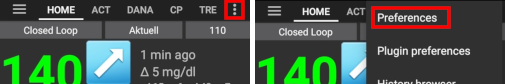

# Preferencias

Abra las preferencias haciendo clic en el menú de tres puntos en la parte superior derecha de la pantalla de inicio:

## Contraseña y ajustes

Permite establecer una contraseña para prevenir el uso accidental o no autorizado de las preferencias. Después de introducir la contraseña aquí se te requerirá introducirla para acceder a preferencias. Para eliminar la opción de contraseña en preferencias elimina el texto en el campo contraseña.

## Edad paciente

Hay límites de seguridad basados en la edad que selecciona aquí. Si sobrepasa con frecuencia los límites establecidos (como el max bolo) quizás sea momento de ir un paso más allá. Es una mala idea seleccionar una edad mayor que la real ya que podría provocar la sobredosificación introduciendo por error un valor equivocado (por ej: comerse un decimal en la cantidad del bolo por equivocación). Si desea conocer los números actuales de estos límites de seguridad codificados, desplácese hasta la característica de algoritmo que está utilizando en [esta página](../Usage/Open-APS-features.md).

## General

* Selecciona la lengua aquí. Si no está disponible, o no todas las palabras han sido traducidas entonces puedes hacer sugerencias. Los archivos de traducciones están disponibles aquí: App>Src>Main>Res>Values>String o pregunta en la sala de gitter.

## Inicio

* Mantener la pantalla encendida es útil, mientras que usted está dando una presentación. Va a consumir una gran cantidad de energía, por lo que es recomendable tener el teléfono conectado a un cargador.
* Botones le permiten elegir qué botones están visibles en la pantalla de inicio. También le da algunas opciones para la pantalla emergente que verá después de pulsar un botón.
* Ajuste rápido de wizard permite añadir un botón rápido para los snack o comidas, introduce los carbohidratos en la pantalla principal y selecciona el botón wizard para calcular el bolo para esos carbohidratos basado en tus ratios ( teniendo en cuenta glucosa o insulina a bordo).

### Ajustes avanzados

* Configuración general para entregar sólo parte del resultado del asistente de bolo. Sólo el porcentaje establecido (debe estar entre 10 y 100) del bolo calculado se entrega cuando se utiliza el asistente de bolos (bolus wizard). El porcentaje se muestra en el asistente en bolos.
    
    

* Opción para habilitar [superbolo](../Getting-Started/Screenshots#section-h) en el asistente de bolos.

### Luces de estado

* Las luces de estado proporcionan un aviso visual para el bajo nivel de reservorio y batería, así como para el cambio de cánula por tiempo vencido (cambio de sitio). La versión ampliada muestra el tiempo transcurrido / el porcentaje de la batería.
    
    
    
    Los ajustes para las luces de estado se deben hacer en la configuración de Nightscout. Establezca las siguientes variables:
    
    * Tiempo de uso de canula: CAGE_WARN y CAGE_URGENT (normalmente 48 y 72 horas)
    * Tiempo de uso de reservorio: IAGE_WARN y IAGE_URGENT (normalmente 72 y 96 horas)
    * Tiempo de uso del sensor: SAGE_WARN y SAGE_URGENT (normalmente 164 y 166 horas)
    * Tiempo de uso de la batería: BAGE_WARN y BAGE_URGENT (normalmente 240 y 360 horas)

* Umbral de advertencia de nivel del reservorio y de nivel crítico del mismo.

* Umbral de advertencia de nivel de batería y el nivel crítico de batería.

## Seguridad en los tratamientos

### Max bolo permitido [U]

Esta es la cantidad máxima de insulina en bolo que AAPS puede poner. Esta configuración existe como un límite de seguridad para evitar la administración de un bolo masivo debido a una entrada accidental o error del usuario. Se recomienda establecer esto en una cantidad razonable que corresponda aproximadamente a la cantidad máxima de insulina en bolo que probablemente necesitará para una dosis de comida o corrección. Esta restricción también se aplica a los resultados de la Calculadora de bolo.

### Máx. Carbohidratos permitidos [g]

Esta es la cantidad máxima de carbohidratos que la calculadora de bolo AAPS puede dosificar. Esta configuración existe como un límite de seguridad para evitar la administración de un bolo masivo debido a una entrada accidental o error del usuario. Se recomienda establecer esto en una cantidad razonable que corresponda aproximadamente a la cantidad máxima de carbohidratos que probablemente necesite para una comida.

## Loop

Puede alternar entre lazo abierto y cerrado aquí.

Abrir lazo significa que las sugerencias de TBR se basan en sus datos y aparecen como una notificación, pero debe elegir aceptarlas manualmente e ingresarlas manualmente en su bomba.

El lazo cerrado significa que las sugerencias de TBR se envían automáticamente a su bomba sin confirmación o aportación de usted.

La pantalla de inicio se mostrará en la esquina superior izquierda, ya sea que esté abierto o cerrado, y al mantener presionado este botón de pantalla de inicio también podrá alternar entre los dos.

### Tasa mínima de solicitud

Cuando se utiliza en lazo abierto recibirás notificaciones cada vez que AAPS recomienda ajustar basal. Para reducir el número de notificaciones puede usar un rango de objetivo más amplio o aumentar el porcentaje de la tasa mínima de solicitud. Esto define el cambio relativo necesario para desencadenar una notificación.

Nota: En el modo de lazo cerrado se recomienda un único objetivo en lugar del rango objetivo (es decir, 5,5 mmol en lugar de 5,0-7,0 mmol).

## OpenaAPS AMA

El Sistema OpenAPS AMA o asistente avanzado de comida, permite que el sistema funcione más agresivamente de manera temporal después de un bolo de comida SI se ingresa carbohidratos. Actívelo en la pestaña Configuración para ver los valores de seguridad aquí, tendrá que haber completado [Objetivo 9 ](../Usage/Objectives#objective-9-enabling-additional-oref0-features-for-daytime-use-such-as-advanced-meal-assist-ama) para utilizar esta característica. Puede leer más sobre la configuración y Autosens en los documentos de OpenAPS.

### Max U/hr que se pueden configurar la Basal Temporal

Esta configuración existe como un límite de seguridad para evitar que AAPS sea capaz de dar una tasa basal peligrosamente alta. El valor se mide en unidades por hora (u / h). Se aconseja establecer esto en algo sensato. Una buena recomendación es tomar la tasa basal más alta en su perfil y multiplicarla por 4. Por ejemplo, si la tasa basal más alta en su perfil fue de 0.5u / h, podría multiplicarla por 4 para obtener un valor de 2u / hr.

### Max IOB que OpenAPS puede proporcionar [U]

Cantidad de insulina basal adicional (en unidades) que se acumula en el cuerpo, además de su perfil basal normal. Una vez que se alcanza este valor, AAPS dejará de administrar insulina basal adicional hasta que la Insulina a Bordo (IOB) basal vuelva a estar dentro de este rango.

* Este valor no considera IOB de bolos, solo basal.
* Este valor se calcula y monitorea independientemente de su tasa basal normal. Solo se considera la insulina basal adicional además de la tasa normal.
* Este valor se mide en unidades de insulina (u).

Cuando comience el lazo cerrado, se recomienda establecer Max Basal IOB en 0 durante un período de tiempo, mientras se está acostumbrando al sistema. Esto evita que AAPS administre insulina basal adicional. Durante este tiempo, AAPS aún podrá limitar o cortar su insulina basal para ayudar a prevenir la hipoglucemia.

Este es un paso importante para:

* Disponga de un período de tiempo para acostumbrarse de manera segura al sistema AAPS y monitorear cómo funciona.
* Aproveche la oportunidad de perfeccionar su perfil basal y el Factor de sensibilidad a la insulina (FSI).
* Vea cómo AAPS limita su insulina basal para prevenir la hipoglucemia.

Cuando se sienta cómodo, puede permitir que el sistema comience a administrarle insulina basal adicional, aumentando el valor de IOB basal máxima. La pauta recomendada para esto es tomar la tasa basal más alta en su perfil y multiplicarla por 3. Por ejemplo, si la tasa basal más alta en su perfil fue de 0.5u / h, podría multiplicarla por 3 para obtener un valor de 1.5u.

* Puede comenzar de manera conservadora con este valor y aumentarlo lentamente con el tiempo. 
* Estas son solo pautas; el cuerpo de todos es diferente. Puede encontrar que necesita más o menos de lo que se recomienda aquí, pero siempre comience de manera conservadora y ajuste lentamente.

*Nota: Como medida de seguridad, Max Basal IOB está limitada a 7u.*

## Ajustes de absorción

Si ha seleccionado usar AMA Autosens, podrá ingresar su tiempo máximo de absorción de comidas y la frecuencia con la que desea que autosense se actualice. Si come comidas con alto contenido de grasas o proteínas, necesitará aumentar el tiempo de absorción de las comidas.

## Configuración de la bomba

Las opciones aquí variarán según el controlador de la bomba que haya seleccionado en 'Config Builder'. Empareje y configure su bomba de acuerdo a las instrucciones relacionadas con la misma:

* [Bomba de insulina DanaR](../Configuration/DanaR-Insulin-Pump.md) 
* [Bomba de insulina DanaRS](../Configuration/DanaRS-Insulin-Pump.md) 
* [Bomba de insulina Accu Chek Combo](../Configuration/Accu-Chek-Combo-Pump.md) 
* [Bomba Accu-Chek Insight](../Configuration/Accu-Chek-Insight-Pump.md) 
* [Infusora Medtronic](..//Configuration/MedtronicPump.md)

Si usa AndroidAPS en lazo abierto, asegúrese de haber seleccionado Bomba Virtual en config builder.

## NS Client

* Establezca su URL de 'nightscout' aquí (https://yourwebsitename.herokuapp.com o https://yourwebsitename.azurewebsites.net), y la 'API secret' (una contraseña de 12 caracteres registrada en sus variables heroku o azure). Esto permite que los datos se lean y escriban entre el sitio web nightscout y AndroidAPS. Verifique si hay errores tipográficos aquí sí está atrapado en el Objetivo 1.
* **Asegúrese de que el URL NO CONTIENE /api/v1/al final.**
    
    

* Inicio de sesión de la aplicación de registro en Nightscout grabará una nota en sus entradas de careportal cada vez que se inicie la aplicación. La aplicación no debería necesitar comenzar más de una vez al día, mayor frecuencia denota un problema.

* 'Opciones de alarma' le permite seleccionar qué alarmas nightscout predeterminadas usar a través de la aplicación. Para que suenen las alarmas, debe establecer los valores de alarma Urgente alto, Alto, Bajo y Urgente bajo en sus variables heroku o azure. Solo funcionarán mientras tenga una conexión a Nightscout y están destinados a padres / cuidadores, si tiene la fuente MCG en su teléfono y luego usan esas alarmas (por ejemplo, xdrip +).
* 'Habilitar transmisiones locales' compartirá los datos de su careportal con otras aplicaciones del teléfono, como xdrip.
* 'Utilizar siempre los valores absolutos basales' debe activarse si desea utilizar la Autoajuste correctamente.
    
    **No lo active cuando se utiliza[La bomba Insight](https://androidaps.readthedocs.io/en/latest/EN/Configuration/Accu-Chek-Insight-Pump#settings-in-aaps)! ** Esto conduciría a valores de TBR falsos en la bomba Insight.

## Comunicaciones SMS

Esta configuración permite el control remoto de la aplicación enviando instrucciones por mensaje de texto al teléfono del paciente que la aplicación seguidora, como suspender el lazo o el bolo. Más información se muestra en [Comandos SMS](../Children/SMS-Commands.rst), pero sólo se mostrará en las Preferencias de si se ha seleccionado esta opción en el Config Builder.

## Otros

* Puede establecer los valores predeterminados para sus objetivos temporales aquí, para los diferentes tipos de objetivos temporales (eating soon y actividad). Cuando selecciona un objetivo temporal, si elige, por ejemplo, "eating soon" en el cuadro desplegable, automáticamente rellenará la duración y el valor en función de las cifras que proporcionó aquí. Para obtener más información sobre el uso de Objetivos temporales, vea Abrir las características de Aps. 
* Puede establecer cantidades de purgado predeterminadas: esto hará que la bomba cuente con el valor especificado y esta insulina se cuenta como utilizada desde el depósito, pero no se cuenta en los cálculos IOB. Consulte el folleto de instrucciones en su caja de cánulas para saber cuántas unidades debe llenar las cánulas según la longitud de la aguja y la longitud del tubo.
* Puede cambiar la visualización en la pantalla de inicio y observar los valores que están dentro del rango. Tenga en cuenta que solo afecta a cómo se ven los gráficos y no afecta su objetivo o sus cálculos.
* 'Acortar títulos de pestañas' le permite ver más títulos de pestañas en la pantalla, por ejemplo, la pestaña 'Abrir APS' se convierte en 'OAPS', 'Objetivos' se convierte en 'Obj', etc.
* 'Alertas locales' le permite decidir si recibe una advertencia y a partir de cuánto tiempo no recibe los valores de glucosa en sangre (datos obsoletos) o si la bomba no está disponible. Si con frecuencia recibe alertas de bomba inaccesible, active BT Watchdog en Configuración.

## Opciones de datos

* "Fabric Upload" enviará datos de informes de fallos y datos de uso a los desarrolladores.