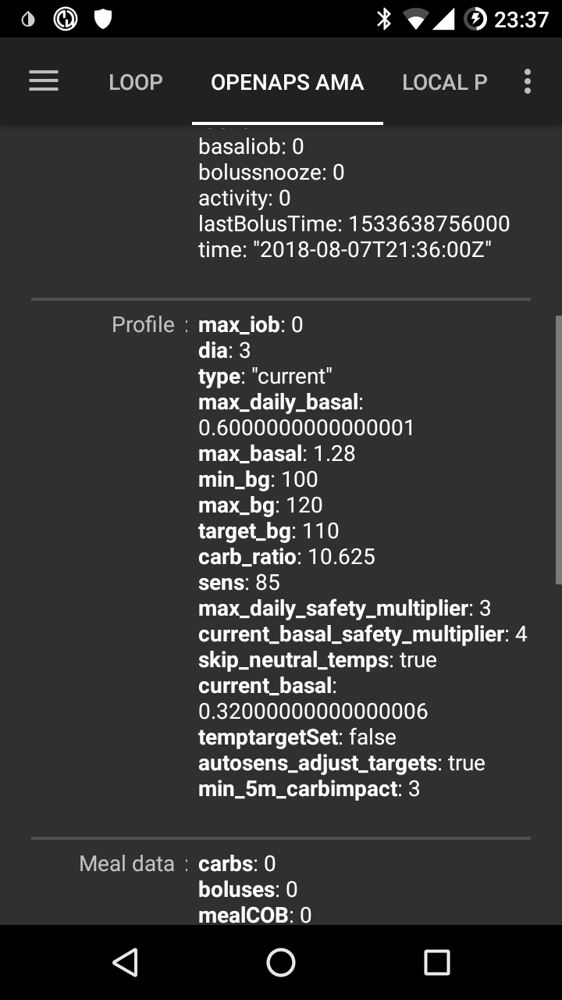

# Preguntas frecuentes para loopers

¿Como añadir preguntas a las FAQ?: Siga las siguientes [instrucciones](../make-a-PR.md)

# General

## ¿Puedo descargar directamente el archivo de instalación AndroidAPS?

No. No hay ningún archivo de apk descargable para AndroidAPS. Tienes que [montarlo](../Installing-AndroidAPS/Building-APK.md) tu mismo. Te explicamos el porqué:

AndroidAPS se utiliza para controlar tu bomba y para suministrar insulina. Según los reglamentos vigentes, en Europa todos los sistemas de clase IIa o IIb se consideran dispositivos médicos que requieren aprobación regulatoria (una marca CE) para la que se necesitan varios estudios y revisiones. La distribución de dispositivos no regulados es ilegal. Existen reglamentos similares en otras partes del mundo.

Esta reglamentación no se limita a la venta de material (en el sentido de obtener dinero para algo), sino que se aplica a cualquier forma de distribución (incluidas las distribuciones gratuitas). Construir un dispositivo médico para uno mismo es la única manera de no verse afectado por estas regulaciones.

Esta es la razón por lo que las apks no están disponibles.

## ¿Cómo empezar?

En primer lugar, necesitas **obtener componentes de hardware utilizables**:

* Una [bomba de insulina compatible ](Pump-Choices.md), 
* un [smartphone Android ](Phones.md) (Apple iOS no es compatible con AndroidAPS, puedes probar con [iOS Loop ](https://loopkit.github.io/loopdocs/)) y 
* un [sistema de monitorización continua de glucosa](../Configuration/BG-Source.rst) (Mcg). 

En segundo lugar, tienes que **configurar el hardware **. Ver el ejemplo del [tutorial de configuración paso a paso](Sample-Setup.md).

En tercer lugar, tienes que **configurar los componentes de software **: AndroidAPS y la fuente MCG/FGM.

En cuarto lugar, tienes que aprender y **entender el "diseño de referencia" de OpenAPS para comprobar los parámetros de tu tratamiento **. El principio fundamental del lazo cerrado es que tu basal y tus ratios de hidratos sean precisos. Todas las recomendaciones presuponen que tus necesidades basales están ajustadas y que cualquier pico o bajada observados vienen provocados por otros factores y que por lo tanto requieren de ajustes esporádicos (ejercicio, estrés, etc.). Los ajustes que el lazo cerrado puede realizar han sido limitados por seguridad (ver basal temporal máxima permitida en [OpenAPS Reference Design](https://openaps.org/reference-design/)), es preferible no utilizar las dosis disponibles para corregir basales mal ajustadas. Si por ejemplo usted frecuentemente esta bajo al aproximarse a una comida, entonces es probable que su basal tenga que ajustarse. Puedes usar [autotune](http://openaps.readthedocs.io/en/latest/docs/Customize-Iterate/autotune.html#phase-c-running-autotune-for-suggested-adjustments-without-an-openaps-rig) para analizar tus registros de datos y comprobar si es necesario (y con que valores) modificar tus basales, tu factor de sensibilidad (ISF) o los ratios de hidratos. O puedes probar y establecer tu basal [con el método tradicional](http://integrateddiabetes.com/basal-testing/).

## ¿Qué aspectos prácticos de lazo tengo?

### Protección con contraseña

Si quieres proteger tus preferencias, dirígete al "Menú de Preferencias" y selecciona "Contraseña para ajustes", luego escribe la contraseña que elijas. La próxima vez que vayas al menú de preferencias, preguntará por esa contraseña antes de poder continuar. Si más adelante quieres eliminar ésta opción, vuelve a "Contraseña para ajustes" y suprime el texto.

### Relojes inteligentes Android Wear

Si tienes previsto utilizar la aplicación "android wear" para suministrar bolos o cambiar configuraciones desde un smartwatch, debes asegurarte de que las notificaciones de AndroidAPS no están bloqueadas. La confirmación de la acción se realiza a través de la notificación.

### Desconectando la bomba

Si te quitas la bomba para ducharte/bañarte/nadar/hacer deporte/ etc. debes indicarselo a AndroidAPS para que tenga en cuenta que no se ha suministrado insulina durante ese tiempo y mantener la IOB correcta.

* Mantén pulsado el botón "Lazo Cerrado" ( "Lazo Abierto" si aún no lo has cerrado) en la parte superior de la pantalla. 
* Selecciona **'Desconectar bomba XY min'**
* Esto establecerá tu basal a cero durante ese periodo de tiempo.
* La duración mínima de la desconexión vendrá fijada por la duración mínima de basales temporales (TBR) que permita la bomba. Por lo tanto, si deseas desconectarte durante un periodo de tiempo más corto, deberás utilizar el tiempo de desconexión más corto disponible en tu bomba y volver a conectarte manualmente tal como se describe a continuación.
* El botón 'Lazo Cerrado' (o 'Lazo Abierto') aparecerá en rojo con el texto 'Desconectado (xx m)' mostrando el tiempo restante de desconexión.
* AAPS volverá a conectar la bomba, automáticamente, una vez haya transcurrido el tiempo seleccionado y el lazo cerrado empezará a funcionar de nuevo.
    
    

* Es posible reconectar manualmente la bomba antes de que haya transcurrido el tiempo seleccionado.

* Manten pulsado el botón rojo 'Desconectado (xx m)'.
* Selecciona "Reconectar bomba"
    
    

### Las recomendaciones no se basan en lecturas aisladas del sensor

Por razones de seguridad, las recomendaciones no se basan en una sola lectura del sensor (MCG), sino en promedios de variaciones (delta). Por lo tanto, si se pierden algunas mediciones, puede pasar un tiempo entre que se vuelvan a recibir datos y que AndroidAPS vuelva a iniciar el lazo.

### Lecturas adicionales

Hay varios blogs con buenos consejos y sugerencias para ayudarte a entender cómo funciona el lazo:

* ['Fine-tuning Settings'](http://seemycgm.com/2017/10/29/fine-tuning-settings/) en 'See my CGM'
* ['Why DIA matters'](http://seemycgm.com/2017/08/09/why-dia-matters/) en 'See my CGM'
* ['Limiting meal spikes'](https://diyps.org/2016/07/11/picture-this-how-to-do-eating-soon-mode/) en #DIYPS
* ['Hormones and autosens'](http://seemycgm.com/2017/06/06/hormones-2/) en 'See my CGM'

## ¿Qué equipo de emergencia se recomienda llevar?

En primer lugar, tienes que llevar el mismo equipo de emergencia que llevarías como T1D con terapia de bomba de insulina. Como usuario de AndroidAPS, se recomienda, encarecidamente, tener cerca el siguiente equipo adicional:

* Cargador extra para tu móvil, smartwatch y (quizá) lector de BlueTooth
* Copia de seguridad en la nube (Dropbox, Google Drive...) de las aplicaciones que usas: la última apk de AndroidAPS y la contraseña de tu "key store", el fichero de preferencias AndroidAPS, el fichero de preferencias de xDrip, la app parcheada de Dexcom,....
* Baterias para la bomba

## ¿Cómo asegurar el sensor CGM/FGM?

Puedes pegarlo con cinta adhesiva: se venden parches adhersivos perforados para los sensores habituales (busca en Google o eBay). Algunos loopers utilizan la cinta de kinesiología estándar (más barata) o cinta Rocktape.

Puedes fijarlo: se venden brazaletes para la parte superior del brazo que sujetan el MCG/FGM con una banda de goma ( busca en Google o eBay).

# Ajustes en AndroidAPS

La lista siguiente trata de ayudarte a optimizar los valores de tus ajustes. Quizás sea mejor empezar por los principales y bajar a detalle progresivamente. Trata de tener un ajuste correcto antes de pasar al siguiente. Procura realizar pequeñas modificaciones en lugar de hacer grande cambios de golpe. Puedes utilizar [Autotune ](https://autotuneweb.azurewebsites.net/) como orientación, aunque no se debe seguir ciegamente: puede que no funcione bien para ti en todas las circunstancias. Ten en cuenta que hay parámetros que interactuan con otros - puedes tener ajustes 'incorrectos' que en conjunto funcionan bien en algunas situaciones (p.e. si una basal demasiado alta coincide en el tiempo con CR demasiado alto) pero no en otras. Esto significa que es necesario tener en cuenta todos los valores y comprobar que trabajan juntos en una variedad de circunstancias.

## Duración de la actividad de la insulina (DIA)

### Descripción & pruebas

El tiempo que tarda la insulina en dejar de hacer efecto.

A menudo se elige un valor demasiado pequeño. Para la mayoría de gente estará en al menos 5 horas, y a veces 6 ó 7.

### Impacto

Un valor demasiado pequeño puede llevar a glucemias bajas. Y viceversa.

Si la DIA es demasiado pequeña, AAPS pensará antes de tiempo que la insulina del bolo anterior ya se ha consumido, y, estando con valores altos de glucemia, suministrará más insulina. (En realidad, no espera tanto tiempo, sino que predice lo que ocurriría, y sigue añadiendo la insulina). Básicamente, esto crea excedentes de insulina que AAPS no considerará en sus cálculos por considerar que ya se ha consumido.

Un ejemplo de DIA demasiado pequeña serían: valores altos de glucemia seguidos de sobre-correciones por parte de AAPS, provocando valores demasiado bajos de glucemia.

## Programación de basales (U/h)

### Descripción & pruebas

Es el caudal de insulina (Unidades / hora) en una determinada franja horaria para mantener la BG a un nivel estable.

Prueba tus basales deteniendo el lazo, ayunando, esperando unas 5 horas después de comer (para asgurar que ya has digerido los hidratos) y viendo como evoluciona tu BG. Repite unas cuantas veces.

Si la BG va disminuyendo, la basal es demasiado alta. Y viceversa.

### Impacto

Basales demasiado elevadas pueden provocar BG demasido bajas. Y viceversa.

AAPS toma como referencia las basales por defecto. Si una basal es demasiado alta, una "temporal a zero" (utilizadas para contrarrestar excesos de insulina) provocará que la IOB calculada disminuya más de lo que debería. Esto provocará que AAPS genere más correcciones de las que debería para llevar la IOB finalmente a cero.

Por lo tanto, una basal demasiado alta generará BG bajas, mientras dure esa basal y algunas horas más hasta que AAPS corrija a objetivo.

Por el contrario, una basal demasiado baja puede llevar a BG altas, y a la imposibilidad de reducir los niveles hasta el objetivo.

## Factor de sensibilidad a la insulina (ISF) (mmol/l/U o mg/dl/U)

### Descripción & pruebas

La disminución de BG esperada ante una dosis de 1U de insulina.

Asumiendo una basal correcta, puedes comprobar este parámetro deteniendo el lazo, comprobando que la IOB esté a zero y tomando algunas tabletas de glucosa (o similar) hasta asegurar un nivel de BG alto y estable.

A continuación, suministrate una cantidad determinada de insulina y observa la variación en tu BG (para acercarte a tu objetivo puedes probar con: [BG-Objetivo] * 1/ISF).

Ve con cuidado, a menudo este parámetro se establece demasido bajo. Demasiado bajo, significa que 1 U bajará la BG más y más rápido de lo esperado!!.

### Impacto

**Menor ISF** (p.e. 40 en lugar de 50) = más agresivo / más fuerte provocando una caída más grande en BGs por cada unidad de insulina. Valores demasiado bajos pueden provocar glucemias demasiado bajas.

**Mayor ISF** (p.e. 45 en lugar de 35) = menos agresivo / más débil - provocando descensos menores de BG por cada unidad de insulina. Valores demasiado altos pueden provocar glucemias demasiado altas.

**Ejemplo:**

* BG de 190 mg/dl (10,5 mmol) y el objetivo es de 100 mg/dl (5,6 mmol). 
* Por lo tanto, necesitas una corrección de 90 mg/dl (= 190-100).
* ISF = 30 => 90/30 = 3 unidades de insulina
* ISF = 45 => 90/45 = 2 unidades de insulina

Un factos de sensibilidad a la insulina (ISF) demasiado bajo puede resultar en sobre-correcciones ya que AAPS piensa que necesita más insulina, para corregir BGs altas, de la que realmente necesita. Esto puede derivar en "montañas rusas" de BG ( especialmente en ayunas). En estas circunstancias necesitas aumentar tu ISF. Esto significará que AAPS corregirá con dosis más pequeñas, evitando que las sobre-correcciones de BG altas provoquen BG demasiado bajas Esto significa que AAPS entregará dosis de corrección más pequeñas evitando provocar bajadas de BG al sobrecorregir BG altos.

Por el contrario, un ISF demasiado alto puede resultar en correcciones insuficientes, provocando que tu BG se mantenga por encima del objetivo – especialmente durante la noche.

## Ratio Carbohidratos/Insulina (IC) (g/U)

### Descripción & pruebas

Gramos de carbohidratos por unidad de insulina.

Algunas personas también utilizan I:C en lugar de IC o hablan de la proporción de carbohidratos (CR).

Suponiendo una basal correcta, puedes comprobar el parámetro: con una IOB de cero, estando en rango, si comes una cantidad conocida de carbohidratos y tomas la cantidad de insulina calculada con el IC actual (es recomendable que comas en tu horario habitual y que cuentes los hidratos con precisión).

> **NOTA:**
> 
> En algunos países Europeos raciones o unidades pan fueron utilizadas para la determinación de la cantidad de insulina que se necesita para la comida. En el principio 1 unidad de pan equivalen a 12 g de carbohidratos, más tarde algunos cambiaron a 10g de carbohidratos.
> 
> En este modelo, la cantidad de carbohidratos se fijó y la cantidad de insulina era variable. ("¿Cuánta insulina se necesita para cubrir una sola unidad de pan?")
> 
> Cuando se utiliza IC, la cantidad de insulina es fija y la cantidad de carbohidratos es variable. ("¿Cuántos gr de carbohidratos pueden estar cubiertos por una sola unidad de insulina?")
> 
> Ejemplo:
> 
> Unidad de pan (BU = 12g carbohidratos): 2,4 U/BU -> Necesita 2,4 unidades de insulina cuando come una unidad de pan.
> 
> IC correspondiente: 12/2,4 = 5,2 -> 5,2 g de carbohidratos pueden cubirse con una sola unidad de insulina.
> 
> Factor de BU 2,4 U/12g == = > IC = 12g/2,4 U = 5,0 g/U
> 
> Las tablas de conversión están disponibles en línea, por ejemplo, [here](https://www.mylife-diabetescare.com/files/media/03_Documents/11_Software/FAS/SOF_FAS_App_KI-Verha%CC%88ltnis_MSTR-DE-AT-CH.pdf).

### Impacto

**Menor IC** = menos comida por unidad, es decir, obtendrás más insulina por cantidad fija de hidratos. Podríamos decir que es "más agresiva".

**Mayor IC** = más comida por unidad, es decir, obtendrás menos insulina por cantidad fija de hidratos. Podríamos decir que es "menos agresiva".

Si, una vez digerida la comida y con la IOB a cero, tu BG continua más alta que antes de comer, es probable que tu IC sea demasiado grande. Por el contrario, si tu BG es menor que antes de comer, tu IC es demasiado pequeña.

# Algoritmo APS

## ¿Por qué se muestra "dia: 3" en la pestaña "OPENAPS AMA", a pesar de que tengo un DIA diferente en mi perfil?

En AMA, DIA en realidad no significa la "duración de la actividad de la insulina ". Es un parámetro que tiene cierta relacion con DIA. En este caso significa, "el tiempo en le que la corrección debería haber acabado". No participan en el cáclulo de la IOB. En OpenAPS SMB, este parámetro ya no es necesario.

## Perfil

### ¿Por qué usar una DIA de 5h como mínimo (duración de la actividad de la insulina) en lugar de 2-3h?

Bien explicado en [este artículo ](http://www.diabettech.com/insulin/why-we-are-regularly-wrong-in-the-duration-of-insulin-action-dia-times-we-use-and-why-it-matters/). No te olvides de `ACTIVAR EL PERFIL` después de modificar tu DIA.

### ¿Por qué motivo mi lazo baja mis BG hasta valores de hipo-glucemia sin COB?

En primer lugar, comprueba tu basal y realiza una prueba de basal sin hidratos. Si están correctas, este comportamiento tendrá origen en un ISF demasiado bajo. El aspecto de un ISF demasiado bajo es como este:

### ¿Qué causa picos postprandiales elevados en lazo cerrado?

En primer lugar, comprueba tu basal y realiza una prueba de basal sin hidratos. Si es correcta, y tu BG se acerca a tu objetivo una vez se han absorbido completamente los hidratos, prueba de poner un objetivo temporal "comida en breve" ('eating soon') en AndroidAPS un rato antes de comer, o piensa en un pre-bolus adecuando con la ayuda de tu endocrino. Si tu BG es demasiado alta despues de comer y aún demasiado alta despues de que los hidratos se hayan absorbido completamente, piensa en reducir tu IC con la ayuda de tu endocrino. Si tu BG es demasiado alta mientras haya COB y demasiado baja una vez absorbidos todos los hidratos, piensa en incrementar tu IC y en un pre-bolus apropiado con la ayuda de tu endocrino.

# Otros ajustes

## Ajustes de Nightscout

### NSClient de AndroidAPS indica "no permitido" y no carga datos. ¿Qué puedo hacer?

En NSClient compruebe 'Ajustes de conexión'. Quizás no estés conectado a una red de datos permitida, o bien tienes activada la opción "Sólo mientras este cargando" y el cable de carga no está enchufado.

## Ajustes del sensor (MCG)

### ¿Por qué AndroidAPS indica 'Origen de BG no soporta el filtrado avanzado'?

Si usas un CGM/FGM que no sea Dexcom G5 o G6 en modo nativo xDrip, recibirás esta alerta en la pestaña OpenAPS de AndroidAPS. Consulta [Suavizado de glucosa en la sangre de datos](../Usage/Smoothing-Blood-Glucose-Data-in-xDrip.md) para más detalles.

## Bomba

### ¿Dónde colocar la bomba?

Hay un sinfín de posibilidades para colocar la bomba. No importa si estás con loop o no.

### Baterías

El lazo puede reducir la batería de la bomba más rápido que el uso normal porque el sistema interactúa a través de Bluetooth mucho más de lo que hace un usuario manual. Es mejor cambiar la batería en un 25%, ya que a partir de ese punto la comunicación puede fallar. Puedes establecer alarmas de aviso para la batería de la bomba utilizando la variable PUMP_WARN_BATT_P en la web de Nightscout. Algunos trucos para alargar la vida de la bateria:

* dismunir el tiempo que pasa la pantalla LCD encendida(desde el menú de configuración de la bomba)
* reducir la duración de la iluminación de fondo (desde el menú de configuración de la bomba)
* seleccionar los ajustes de notificación para que suene en lugar de que vibre (desde el menú de configuración de la bomba) 
* sólo utilizar los botones de la bomba para recargar, usa AndroidAPS para visualizar el historial, el nivel de la bateria o la cantidad de insulina restante.
* Puede que la app AndroidAPS se cierre a menudo para ahorrar bateria o liberar memoria RAM en algunos móvies. Cuando AndroidAPS se reinicializa en cada arranque, vueleve a establecer la conexión Bluetooth con la bomba y descarga la basal actual y el historial de bolus. Esto consume batería. Para ver si esto esta sucediendo, ve a Preferencias > NSClient y habilita "Registro de inicio de la app en NS'. Nightscout va a recibir un aviso en cada reinicio de AndroidAPS, lo que facilitará identificar el problema. Para evitar que esto suceda, añade AndroidAPS en la lista de excepciones en "ajustes de batería" de tu móvil, así el modo "Ahorro de batería" no cerrará la app.
    
    Por ejemplo, para añadir la lista un teléfono de Samsung que ejecuta Android Pie:
    
    * Vaya a Configuración -> Cuidado del Dispositivo -> Batería 
    * Desplácese hasta que encuentre AndroidAPS y selecciónelo 
    * Deselecciona "Poner aplicación a dormir"
    * TAMBIÉN ir a Configuración -> Aplicaciones -> (Tres puntos símbolo en la parte superior derecha de la pantalla), seleccione "acceso especial" -> Optimizar el uso de la batería
    * Desplácese hacia AndroidAPS y asegúrese de que está desseleccionado.

* limpia los terminales de la batería con alcohol para asegurar que no queden restos de cera/grasa.

* para las bombas [Dana R/RS](../Configuration/DanaRS-Insulin-Pump.md) el procedimiento de inicio extrae una alta corriente a través de la batería para romper deliberadamente la película de pasivación (previene la pérdida de energía durante el almacenamiento), pero no siempre funciona para romperlo en un 100%. Retira y vuelve a insertar la batería 2-3 veces hasta aparezca un 100% en la pantalla, o, antes de colocarla, toca con una llave los dos terminales de la batería, pero solo un instante, para provocar un cortocircuito.
* consulta más sugerencias para [otros tipos de batería](../Usage/Accu-Chek-Combo-Tips-for-Basic-usage#battery-type-and-causes-of-short-battery-life)

### Cambiando cánulas y cartuchos

El cambio de cartucho no puede realizarse desde AndroidAPS, debe llevarse a cabo, como siempre, directamente desde la bomba.

* Mantén pulsado "Lazo Abierto"/"Lazo Cerrado" en la pestaña de inicio de AndroidAPS y selecciona "Detener Lazo 1h"
* Ahora desconecta la bomba y cambia el cartucho según las instrucciones de la bomba.
* También el llenado de tubo y la cánula se pueden hacer directamente en la bomba. En este caso, utilice el botón [ PRIME/FILL ](../Usage/CPbefore26#pump) en la pestaña de acciones sólo para registrar el cambio.
* Una vez que hayas vuelto a conectar a la bomba, continúa el lazo manteniendo pulsado "Suspendido (X m)".

El cambio de cánula no utiliza la función "cebado del equipo", pero se debe rellenar el equipo de infusión y/o la cánula con un bolo que no debe aparecer en el historial de bolos. Esto significa que no es necesario interrumpir la basal temporal que este funcionando. En la pestaña Acciones (Act), utilice el [PRIME/FILL botón](../Usage/CPbefore26#pump) para ajustar la cantidad de insulina necesaria para llenar el conjunto de infusión y comenzar el llenado. Si la cantidad no es suficiente, repite el llenado. Puedes establecer las cantidades predeterminadas de los botones en "Preferencias > Otros > Rellenar/Cebado cantidades de insulina standard". Consulta el folleto de instrucciones en tu caja de cánulas para saber cuántas unidades se deben utilizar para llenar las cánulas según la longitud de la aguja y la longitud del tubo.

## Fondo de pantalla

Puedes encontrar el fondo de pantalla AndroidAPS para tu teléfono en la página [teléfonos](../Getting-Started/Phones#phone-background).

## Uso diario

### Higiene

#### ¿Qué hacer al ducharse o bañarse?

Puede quitarte la bomba para ducharte o bañarte. Para periodos cortos de tiempo no viene a ser necesario, pero puedes indicarlo en AAPS para que los cálculos de IOB sean correctos. Pero deberías indicarlo a AAPS para obtener cálculos de IOB correctos.

Consulta el [procedimiento anterior ](../Getting-Started/FAQ#disconnect-pump).

### Trabajo

Dependiendo del tipo de su trabajo, quizás uses pautas diferentes en los días de trabajo. Como "looper" deberias considerar: - un [cambio de perfil](../Usage/Profiles.md) para la duración de tu jornada de trabajo (p.e. más de un 100% durante 8 horas si estas sentado o menos de un 100% si estás activo) - objetivos temporales altos o bajos - [desplazamiento temporal de tu perfil](../Usage/Profiles#time-shift) cuando te levantes mucho más tarde o mucho más temprano de lo normal. Si estás usando [perfiles de Nightscout](../Configuration/Config-Builder#ns-profile), tienes la opción de crear un segundo perfil (p.e. "trabajo" y "casa") y realizar un cambio de perfil diario según lo que vayas a necesitar.

## Actividades de ocio

### Deportes

Tienes que rehacer tus viejos hábitos deportivos desde tiempos anteriores al lazo de vuelta. Si usted simplemente consume uno o más carbohidratos deportivos como antes, el sistema de circuito cerrado los reconocerá y corregirá en consecuencia.

Así que usted tendría más hidratos de carbono a bordo, pero al mismo tiempo el bucle contrarrestaría y liberaría insulina.

Cuando utilices lazo, debe intentar estos pasos:

* Haga un [cambio de perfil](../Usage/Profiles.md) < 100%.
* Establecer una [objetivo de actividad temporal](../Usage/temptarget#activity-temp-target) por encima de su nivel objetivo.
* Si utiliza SMB, asegúrese de que ["Habilitar SMB con objetivos temporales altas"](../Usage/Open-APS-features#enable-smb-with-high-temp-targets) y ["Habilitar SMB siempre"](../Usage/Open-APS-features#enable-smb-always) están inhabilitados.

El pre y postprocesamiento de estos ajustes es importante. Realice los cambios en el tiempo antes del deporte y tenga en cuenta el efecto del relleno muscular.

Si usted hace deportes regularmente al mismo tiempo (es decir, la clase deportiva en su gimnasio), puede considerar utilizar [automatización ](../Usage/Automation.rst) para el cambio de perfil y TT. La automatización basada en la ubicación también puede ser una idea, pero hace que el preproceso sea más difícil.

Los porcentajes del conmutador de perfil, el valor para el objetivo temporal de la actividad y el mejor tiempo para los cambios son individuales. Empiece en el lado seguro si está buscando el valor correcto para usted (empiece con un porcentaje más bajo y un TT superior).

### Sexo

Puede quitarte la bomba, pero deberías indicárselo a AAPS para tenerlo en cuenta en los cálculos de IOB.

Consulta el [procedimiento anterior ](../Getting-Started/FAQ#disconnect-pump).

### Beber alcohol

Beber alcohol es arriesgado en lazo cerrado ya que el algoritmo no puede predecir los efecto del alcohol en BG correctamente. Puedes encontrar tu propio método para tratar con ésto usando las siguientes funciones de AndroidAPS:

* Desactivando el modo lazo cerrado y tratando la diabetes manualmente o
* estableciendo objetivos temporales altos y desactivando UAM para evitar que el bucle aumente la IOB debido a comida no indicadas o
* hacer un cambio de perfil para que sea significativamente menor del 100% 

Cuando bebas alcohol debes estar pendiente de tu sensor para evitar, manualmente, hipoglucemias comiendo carbohidratos.

### Suspendida

#### ¿Cómo puede funcionar por la noche sin radiación del móvil ni radiación WIFI?

Muchos usuarios ponen el teléfono en modo de avión por la noche. Si quieres que el lazo funcione mientras estás durmiendo, haz lo siguiente (ésto solo sirve si AAPS recibe los datos de una fuente local, como por ejemplo xDrip+ o la app parcheada de Dexcom, esto NO sirve si recibes los datos vía Nightscout):

1. Activa el modo avión en tu móvil.
2. Espera hasta que el modo avión esté activo.
3. Activar Bluetooth.

No podrás recibir llamadas ni conectarte a internet. Pero el lazo sigue en marcha.

Algunas personas han descubierto problemas con la transmisión local (AAPS no recibe valores BG de xDrip+) cuando el teléfono está en modo avión. Vaya a "Ajustes > Configuración de Interapp > Identificar receptor" e introduzca `info.nightscout.androidaps`.

### Viajando

#### ¿Cómo tratar los cambios de la zona horaria?

Con Dana R y Dana R Coreana no tienes que hacer nada. Para otras bombas ve a la página [cruzando zonas horarias](../Usage/Timezone-traveling.md) para más detalles.

## Temas Médicos

### Hospitalización

Si quieres compartir alguna información sobre AndroidAPS y lazos cerrados DIY con tus médicos, puedes imprimir la [guía a AndroidAPS para médicos de clínicas](../Resources/clinician-guide-to-AndroidAPS.md).

### Cita médica con tu endocrinólogo

#### Informes

Puedes mostrar tus informes de Nightscout (https://YOUR-NS-SITE.com/report) o comprobar [Nightscout Reporter](https://nightscout-reporter.zreptil.de/).