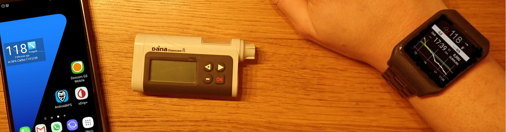
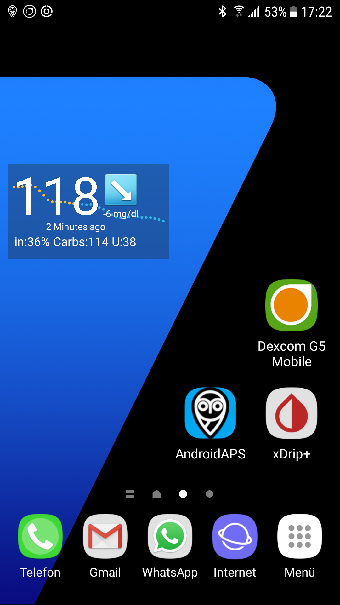
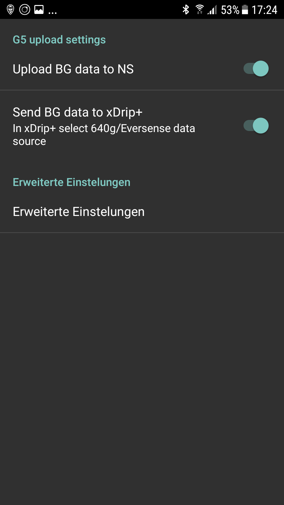

# Ejemplo de instalación: Samsung S7, DanaR, Dexcom G5 y el Smartwatch de Sony

## Descripción

En esta configuración, se utiliza el Samsung Galaxy S7 como centro de control del lazo. La aplicación Dexcom, ligeramente modificada, lee los valores de glucosa del sensor MCG Dexcom G6. Se utiliza AndroidAPS para controlar la bomba de insulina Dana R del fabricante coreano SOOIL a través de bluetooth. No se requieren otros dispositivos.

Como la aplicación Dexcom sólo ofrece opciones de alarma limitadas, la aplicación de código abierto xDrip+ se utiliza para definir no sólo alarmas altas y bajas, sino también alarmas adicionales según las necesidades individuales.

Opcionalmente se puede usar un smartwatch Android (en este ejemplo de instalación: Sony Smartwatch 3 (SWR50)) para mostrar los valores de glucosa y AndroidAPS en la muñeca. El reloj también puede ser utilizado para controlar AndroidAPS (por ejemplo, poner discretamente un bolus de comida).

El sistema funciona sin conexión. Esto significa que no hay necesidad de una conexión de datos desde el móvil a Internet para funcionar.

Sin embargo, los datos se subirán automáticamente a Nightscout "en la nube" cuando se establece una conexión de datos. De esta manera, puedes disponer de informes completos para la visita al médico o compartir los valores actuales con los miembros de la familia en cualquier momento. También es posible enviar datos a Nightscout sólo cuando se utiliza una conexión Wi-Fi (predefinida) con el fin de beneficiarse de los diferentes informes de Nightscout.

## Componentes necesarios

1. Samsung Galaxy S7
    
    * Alternativas: véase [lista de teléfonos y relojes probados ](https://docs.google.com/spreadsheets/d/1gZAsN6f0gv6tkgy9EBsYl0BQNhna0RDqA9QGycAqCQc/edit#gid=698881435) para AndroidAPS

2. [DanaRS](http://www.sooil.com/eng/product/)
    
    * Alternativas: 
    * [Accu-Check Combo](../Configuration/Accu-Chek-Combo-Pump.md)
    * [Accu-Chek Insight](../Configuration/Accu-Chek-Insight-Pump.md)
    * [DanaR](../Configuration/DanaR-Insulin-Pump.md)
    * [Algunas bombas Medtronic antiguas (además necesarias: hardware RileyLink/Gnarl, Android Phone con bluetooth low energy/BLE-chipset)](../Configuration/MedtronicPump.md)
    * Puede que otras bombas estén disponibles en el futuro, vea [futuros drivers de bomba ](Future-possible-Pump-Drivers.md) para obtener detalles.

3. [Dexcom G6](https://dexcom.com)
    
    * Alternativas: ver lista de posibles [fuentes BG](../Configuration/BG-Source.rst)

4. Opcional: Sony Smartwatch 3 (SWR50)
    
    * Alternativas: Todos los relojes [con Google Wear OS](https://wearos.google.com/intl/de_de/#find-your-watch) deben funcionar bien, para detalles ver la lista [de teléfonos probados y relojes](https://docs.google.com/spreadsheets/d/1gZAsN6f0gv6tkgy9EBsYl0BQNhna0RDqA9QGycAqCQc/edit#gid=698881435) para AndroidAPS (OS debe ser Android Wear)

## Nightscout

Consulta el detallado apartado [Nightscout setup ](../Installing-AndroidAPS/Nightscout.md)

## Configuración del ordenador

Para poder crear una aplicación Android desde el código abierto AAPS, disponible libremente, necesitas Android Studio en tu ordenador o portátil (Windows, Mac, Linux). Se pueden encontrar instrucciones detalladas en [construyendo la APK ](../Installing-AndroidAPS/Building-APK.md).

Por favor, ten paciencia al instalar Android Studio, ya que el software descarga muchos datos adicionales una vez instalado en tu ordenador.

## Configuración del Smartphone

### Comprobar firmware del smartphone

* Menú > Valores > Teléfono info > Información de software: Al menos "Android-Versión 7.0" (se ha probado con éxito en Android versión 8.0.0 Oreo-Samsung Experience Versión 9.0) 
* Para actualizar el firmware: menú > Preferencias > actualización de software

### Permitir la instalación de aplicaciones de fuentes desconocidas

Menú > Ajustes > Ajustes de seguridad > fuentes Desconocidas > deslizar hacia la derecha (= activo)

Por razones de seguridad, esta configuración debería estar inactiva una vez que la instalación de todas las aplicaciones descritas aquí se haya completado.

### Habilitar Bluetooth

1. Menú > Configuración > Conexiones > Bluetooth > control deslizante hacia la derecha (= activo)
2. Menú > Ajustes > Conexiones > Ubicación > control deslizante a la derecha (= activo)

Servicios de ubicación ("GPS") se debe activar para que Bluetooth funcione correctamente.

### Instalar la aplicación Dexcom (versión modificada)

La aplicación de Dexcom original de Google Play Store no funcionará porque no difunde los valores a otras aplicaciones. Por lo tanto, se requiere una versión ligeramente modificada por la comunidad. Sólo esta aplicación de Dexcom modificada se puede comunicar con AAPS. Además, la aplicación Dexcom modificada se puede utilizar con todos los smartphones de Android y no sólo con los que están en la lista de compatibilidad de [Dexcom](https://www.dexcom.com/dexcom-international-compatibility).

A mmol/l version and a mg/dl version of the modified Dexcom G6 app are available at <https://github.com/dexcomapp/dexcomapp/tree/master/2.4>. You have to choose G6 [app for your region](../Hardware/DexcomG6#if-using-g6-with-patched-dexcom-app).

Para ello, realice los pasos siguientes en el smartphone:

1. Si la aplicación Dexcom original ya está instalada: 
    * Detener Sensor
    * Uninstall app via Menu > Settings > Apps > Dexcom G6 Mobile > Uninstall
2. Download modified Dexcom app (check unit mg/dl or mmol/l and [region](../Hardware/DexcomG6#if-using-g6-with-patched-dexcom-app) according to your needs): <https://github.com/dexcomapp/dexcomapp/tree/master/2.4>
3. Install modified Dexcom G6 app on your smartphone (= select the downloaded APK file)
4. Start modified Dexcom G6 app, activate/calibrate the sensor according to the given instructions and wait until the warm-up phase is finished.
5. Once the modified Dexcom app shows actual glucose value, setup the warnings (hamburger menu on top left side of the screen) as follows: 
    * Urgente baja `55mg/dl` / `3.1mmol/l` (no se puede inhabilitar)
    * Baja `OFF`
    * Alta `OFF`
    * Tasa de subida `OFF`
    * Tasa de bajada `OFF`
    * Pérdida de señal `OFF`

## Instalar AndroidAPS

1. Siga las instrucciones para [construir la APK](../Installing-AndroidAPS/Building-APK#generate-signed-apk)
2. [Transferir](../Installing-AndroidAPS/Building-APK#transfer-apk-to-smartphone) el APK generado a su teléfono
3. [Configurar AndroidAPS](../Configuration/Config-Builder.md) de acuerdo a sus necesidades utilizando el asistente de configuración o de forma manual
4. En esta configuración de ejemplo hemos utilizado (entre otros)

* BG source: `Dexcom G6 App (patched)` -- click cock-wheel and activate `Upload BG data to NS` and `Send BG data to xDrip+` (see [BG source](../Configuration/BG-Source.rst))

* Cliente de NS activado (consulte [NS Client](../Configuration/Config-Builder#ns-profile) y [Configuración de Nightscout](../Installing-AndroidAPS/Nightscout.md))

## Instalar xDrip+

xDrip+ is another mature open source app that offers countless possibilities. In this setup, contrary to what the developers first wrote the app for, xDrip+ is not used to collect glucose data from the Dexcom G6, but only to output alarms and to display the current glucose value including the curve on the Android home screen in the widget. With xDrip+ the alarms can be set much more individually than with the Dexcom software, AAPS or Nightscout (no limitation in the selection of sounds, different alarms depending on day/night time etc.).

1. Descarga la última versión estable de xDrip+ con tu smartphone <https://xdrip-plus-updates.appspot.com/stable/xdrip-plus-latest.apk> - ¡no la versión de Google Play Store!
2. Instala xDrip+ seleccionando el archivo APK descargado.
3. Inicia xDrip+ y haz los siguientes ajustes (menú hamburguesa en la parte superior izquierda) 
    * Configuración > Alarmas y Alertas > Lista de nivel de Glucosa de Alertas > Crear Alertas (alta y baja) de acuerdo a sus necesidades. 
    * Las alarmas existentes pueden ser cambiadas con una pulsación larga en la alarma.
    * Configuración > Alarmas y Alertas > Calibración de Alertas: deshabilitado (recordado a través de la modificación de Dexcom app)
    * Ajustes > Hardware de Origen de Datos > 640G/EverSense
    * Ajustes > Configuración Inter-app > Aceptar Calibraciones> `ON`
    * Menu > Start sensor (is only "pro forma" and has nothing to do with the running G6 sensor. Esto es necesario, de lo contrario, aparecerá un mensaje de error con regularidad.) 

For more information about xDrip+, see here [BG source page](../Configuration/BG-Source.rst).

### Ejemplo de una configuración de alarma

The "Urgent low alarm" (below 55 mg/dl resp. 3,1 mmol) is a standard alarm from the modified Dexcom app that cannot be disabled.

Tip for meetings / church visits / cinema etc..:

If "Do not disturb" mode is activated in the Samsung Galaxy S7 (Menu > Settings > Sounds and vibration > Do not disturb: slider to right side (= active)), the phone only vibrates during urgent low alarm and does not issue an acoustic warning. For the other alarms set up via xDrip+ you can select whether the silent mode should be ignored (acoustic sound played) or not.

## Inhabilitar opción de ahorro de energía

On your Samsung Galaxy S7 go to Menu > Settings > Device Maintenance > Battery > Unmonitored Apps > + Add apps: Select the apps AndroidAPS, Dexcom G6 Mobile, xDrip+ and Android Wear (if smartwatch is used) one after the other

## Opcional: Configuración de Sony Smartwatch 3 (SWR50)

With an Android Wear smartwatch life with diabetes can be made even more inconspicuous. The watch can be used to display the current glucose level, the status of the loop etc. on the wrist. El reloj también puede ser utilizado para controlar AndroidAPS (por ejemplo, poner discretamente un bolus de comida). To do this, double tap the CGM value of the AAPSv2 watchface. The SWR50 usually runs for a full day until the battery needs to be recharged (same charger as the Samsung Galaxy S7: microUSB).

Detalles sobre la información mostrada en el watchface se pueden encontrar [aquí](../Configuration/Watchfaces.md).

* Instale la aplicación "Android Wear" en su smartphone a través de Google Play Store y conecte el smartwatch de acuerdo con las instrucciones allí.
* En AAPS elija el menú de hamburguesa (esquina superior izquierda) > Configurar Builder > General (al final de la lista) > Usar > activar en el lado izquierdo, haga clic en el engranaje > Usar ajustes y activar `Controles desde el reloj`
* En tu reloj inteligente: Pulsación larga para cambiar el watchface y selecciona `AAPSv2`
* Si es necesario reiniciar ambos dispositivos una vez.

## Ajustes de la bomba

see [Dana RS pump](../Configuration/DanaRS-Insulin-Pump.md)