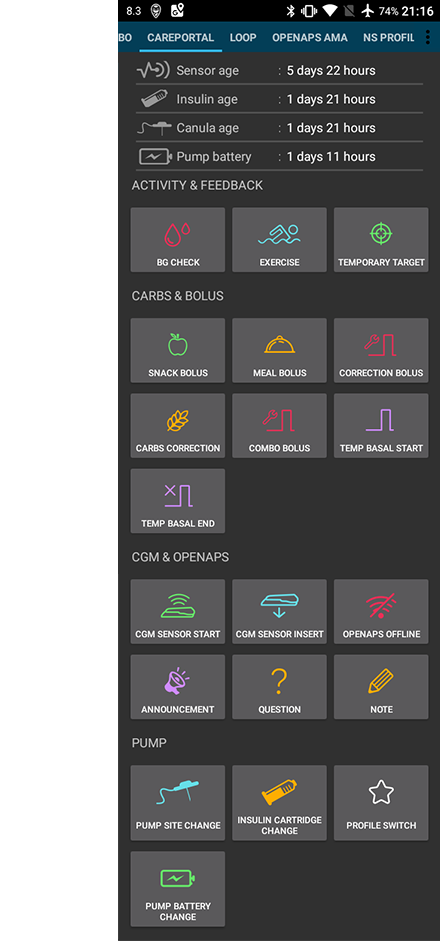

# Pantallas AndroidAPS

## Pantalla de inicio

Esta es la primera pantalla que encontrarás cuando abras AndroidAPS y contiene la mayor parte de la información que necesitarás día a día.

### Sección A

* navegar entre los diversos módulos de AndroidAPS deslizando a la izquierda o derecha

### Sección B

* cambiar el estado del lazo (lazo abierto, lazo cerrado, lazo de suspensión etc)
* ver tu perfil actual y hacer un [switch de perfil](../Usage/Profiles.md)
* ver tu nivel objetivo de glucosa en la sangre y establecer un [objetivo temporal](../Usage/temptarget.md).

Pulsación larga sobre cualquiera de los botones para modificar el ajuste. Por ejemplo mantenga pulsada la barra de destino en la parte superior derecha ("100" en la captura de pantalla de arriba) para establecer un objetivo temporal.

### Sección C

* última lectura de glucosa en la sangre de tu CGM
* cuánto tiempo hace que fue leído
* cambios en los últimos 15 y 40 minutos
* su tasa basal actual - incluyendo cualquier tasa basal temporal (TBR) programada por el sistema
* insulina a bordo (IOB)
* carbohidratos a bordo (COB)

Las luces opcionales [status](../Configuration/Preferences#overview) (CAN | INS | RES | SEN | BAT) dan una advertencia visual sobre el bajo nivel de reservorio y batería, así como el cambio de sitio vencido.

La insulina a bordo de la figura sería cero si su basal estándar estuviera en funcionamiento y no hubiera ninguna insulina restante de los bolsos anteriores. Las cifras entre corchetes muestran cuánto consiste en la insulina restante de los bolsos anteriores y cuánto es una variación basal debido a los TBRs anteriores programados por AAPS. Este segundo componente puede ser negativo si se han producido recientemente períodos de reducción de la basal.

### Sección D

Haga clic en la flecha en el lado derecho de la pantalla en la sección D para seleccionar qué información se muestra en las tablas de abajo.

### Sección E

Es el gráfico que muestra su glucosa en sangre (BG) como se lee en el monitor de glucosa (CGM) también muestra notificaciones de Nightscout, tales como las calibraciones de dedos y las entradas de los carbohidratos.

Pulsación larga en el gráfico para cambiar la escala de tiempo. Puede elegir entre 6, 8, 12, 18 o 24 horas.

Las líneas extendidas muestran los cálculos y tendencias de BG pronosticados - si lo ha seleccionado.

* **Naranja** línea: [COB](../Usage/COB-calculation.rst) (color que se utiliza generalmente para representar a los COB y los hidratos de carbono)
* **Azul oscuro** línea: IOB (color que se utiliza generalmente para representar IOB e insulina)
* **Azul claro** línea: cero-temp (predicción de BG si se establecería una tasa basal temporal en 0%)
* **Amarillo oscuro** line: [UAM ](../Configuration/Sensitivity-detection-and-COB#sensitivity-oref1) (comidas no anunciadas)

Estas líneas muestran las diferentes predicciones basado en la absorción actual de carbohidratos (COB); insulina solamente (IOB), que muestra cuánto tiempo le tomará BG, restablecerse de por encima del objetivo si las desviaciones de repente cesar y ejecutamos un cero temp hasta entonces (cero-temp) y sin previo aviso comida/efecto de detección de donde los carbohidratos se detectan pero no se han introducido en el sistema por el usuario (UAM).

La línea **azul continua** muestra la entrega basal de la bomba. La línea **azul de puntos** es la que sería la tasa basal si no hubiera ajustes basales temporales (TBRs) y la línea azul sólida es la entrega real a lo largo del tiempo.

La línea de **amarillo delgado** muestra la actividad de la Insulina. Se basa en la bajada esperada de BG por la insulina en su sistema sin oros factores (como carbohidratos) presentes.

### Sección F

Esta sección también se puede configurar utilizando las opciones de la sección D.

* **Insulin On Board** (gráfico azul): muestra la insulina que tiene a bordo. Si no hubiera TBR, SMB y sin bolsos restantes estos serían cero. La baja depende de los valores de DIA y los ajustes del perfil de insulina. 
* **Carbs On Board** (gráfico naranja): muestra los carbohidratos que tiene a bordo. La baja depende de las desviaciones que el algoritmo detecta. Si detecta una mayor absorción de carbohidratos a lo esperado, se administrará la insulina y esto incrementará el IOB (más o menos, en función de sus valores de seguridad). 
* **Desviaciones**: 
   * **GRIS** barras que muestran una desviación debido a los carbohidratos. 
   * **VERDE** barras que muestran un BG mayor al que el algoritmo esperaba. 
   * **RED ** barras que muestran que BG es menor que el algoritmo esperaba.
* **Sensibilidad** (línea blanca): muestra la sensibilidad que el Autosense ha detectado. La Sensibilidad es el cálculo de la respuesta a la insulina como resultado del ejercicio, las hormonas, etc.
* **Actividad** (línea amarilla): muestra la actividad de la insulina, calculada por su perfil de insulina (no es un derivado de IOB). El valor es más alto para la insulina más próxima a la hora punta. Esto significaría un valor negativo cuando el IOB está disminuyendo. 

### Sección G

Le permite administrar un bolo (normalmente usaría el botón Calculadora para hacer esto) y añadir una calibración CGM con sangre del dedo. También se mostrará un botón Quick Wizzard aquí si está configurado en [Config Builder](../Configuration/Config-Builder#quickwizard-settings).

## La calculadora

Cuando usted quiere hacer un bolo para comida, aquí es de donde normalmente lo hará.

### Sección A

es el lugar donde se introduce la información sobre el bolo que desea. El campo BG normalmente se llena con la lectura más reciente de la CGM. Si no tienes una CGM que funcione, entonces estará en blanco. En el campo CARBS se añade su estimación de la cantidad de carbohidratos (o equivalente) a los que desea realizar el bolo. El campo CORR es si desea modificar la dosificación final por alguna razón, y el campo CARB TIME es para hacer PRE-bolo, de modo que pueda indicar al sistema que habrá un retraso antes de que se esperen los carbohidratos. Puede poner un número negativo en este campo si está colocando un bolo para los carbohidratos ya ingeridos.

SUPER BOLUS is where the basal insulin for the next two hours is added to the immediate bolus and a zero TBR is issued for the following two hours to take back the extra insulin. La idea es entregar la insulina antes y esperar que reduzca los picos.

### Sección B

muestra el bolo calculado. If the amount of insulin on board already exceeds the calculated bolus then it will just display the amount of carbs still required.

### Sección C

le muestra los diversos elementos que se han utilizado para calcular el bolo. Puede anular la selección de cualquier que no desee incluir, pero normalmente no es algo que realizaría.

### Combinaciones de COB e IOB y lo que significan

<ul>
    <li>If you tick COB and IOB unabsorbed carbs that are not already covered with insulin + all insulin that has been delivered as TBR or SMB will be taken into account</li>
    <li>If you tick COB without IOB you run the risk of too much insulin as AAPS is not accounting for what’s already given. </li>
    <li>If you tick IOB without COB, AAPS takes account of already delivered insulin but won’t cover that off against any carbs still to be absorbed. Esto da lugar a un aviso de 'carbohidratos desaparecidos '.
</ul>

If you bolus for additional food shortly after a meal bolus (i.e. additional desert) it can be helpful to untick all boxes. This way just the new carbs are being added as the main meal won't necessarily be absorbed so IOB won't match COB accurately shortly after a meal bolus.

### Detección de COB incorrecta

If you see the warning above after using bolus wizard, AndroidAPS has detected that the calculated COB value maybe wrong. Así que si quieres bolo de nuevo después de una comida previa con COB, debes ser consciente de una posible sobredosis! Para obtener detalles, consulte las sugerencias sobre [página de cálculo de COB](../Usage/COB-calculation#detection-of-wrong-cob-values).

## Perfil de Insulina

Esto muestra el perfil de actividad de la insulina que ha escogido. The PURPLE line shows how much insulin remains after it has been injected as it decays with time and the BLUE line shows how active it is.

You will normally be using one of the Oref profiles - and the important thing to note is that the decay has a long tail. If you have been used to manual pumping you have probably been used to assuming that insulin decays over about 3.5 hours. However, when you are looping the long tail matters as the calculations are far more precise and these small amounts add up when they are subjected to the recursive calculations in the AndroidAPS algorithm.

For a more detailed discussion of the different types of insulin, their activity profiles and why all this matters you can read an article here on [Understanding the New IOB Curves Based on Exponential Activity Curves](https://openaps.readthedocs.io/en/latest/docs/While%20You%20Wait%20For%20Gear/understanding-insulin-on-board-calculations.html#understanding-the-new-iob-curves-based-on-exponential-activity-curves)

And you can read an excellent blog article about it here: [Why we are regularly wrong in the duration of insulin action (DIA) times we use, and why it matters…](http://www.diabettech.com/insulin/why-we-are-regularly-wrong-in-the-duration-of-insulin-action-dia-times-we-use-and-why-it-matters/)

Y más en: [Curvas Exponenciales de Insulina + Fiasp](http://seemycgm.com/2017/10/21/exponential-insulin-curves-fiasp/)

## Estado de Infusora

Here we see the status of the insulin pump - in this case an Accu-Chek Combo. La información que se muestra es autoexplicativa. A long press on the HISTORY button will read the data from your pump history, including your basal profile. But remember only one basal profile is supported on the Combo pump.

## Portal de Atención (Care Portal)

This replicates the functions you will find on your Nightscout screen under the "+" symbol which allows you to add notes to your records. Functions such as recording when you change a pump site, or insulin cartridge should be self explanatory. Pero esta sección no emite ningún comando a la bomba. So if you add a bolus using this screen it simply makes a note of this on your Nightscout record, the pump won't be instructed to deliver a bolus.

## Loop, MA, AMA, SMB

You don't normally need to worry about these, they show the results of the OpenAPS algorithm which runs each time the system gets a fresh reading from the CGM. Estos temas se debaten en otro lugar.

## Perfil

AndroidAPS can run using a number of different profile configuratons. Typically - as shown here - the Nightscout profile has been downloaded via the built in Nighscout client and is displayed here in read-only form. If you wanted to make any changes you would do this from your Nightscout user interface and then do a [Profile Switch](../Usage/Profiles.md) in AndroidAPS to activate the changes. Data such as the basal profile would then be automatically copied over to your pump.

**DIA:** stands for Duration of Insulin Action and it is discussed above in the section on insulin profiles.

**IC:** es la proporción de Insulina a Carbohidratos. This profile has a number of different values set for different times of day.

**ISF:** is Insulin Sensitivity Factor - the amount by which one unit of insulin will reduce your blood glucose assuming that nothing else changes.

**Basal:** is the basal profile programmed into your pump.

**Target:** is the blood glucose level that you want the rig to be aiming for all the time. You can set different levels for differenttimes of day if you wish, and you can even set an upper and lower range so that the rig will only start to make changes when the predicted blood glucose value falls outside, but if you do that then the rig will respond more slowly and you are unlikely to achieve such stable blood sugars.

## Treatment, xDrip, NSClient

These are simply logs of treatments (boluses and carbs), xDrip messages and messages sent to Nightscout via the built-in Nightscout client. Normalmente no tienes que preocuparte por nada de esto a menos que haya un problema.

## Configuraciones

Aquí es donde se ajustará la configuración de su plataforma AndroidAPS. This screenshot shows a pretty typical rig using a Combo pump, a Dexcom G5 CGM sensor being managed via xDrip+ and running with NovoRapid insulin on an Oref profile and connected to a Nightscout cloud based server.

The tick box on the right determines if that particular module will be displayed in the top menu bar (see section A at Homescreen) and the small gear wheel symbol allows access to the setting for that module, if there are any.

## Ajustes y preferencias

At the top right of the navigation bar you will find three small vertical dots. Pressing on these takes you to the app's preferences, history browser, setup wizard, about the app information and the exit button that will close AAPS.