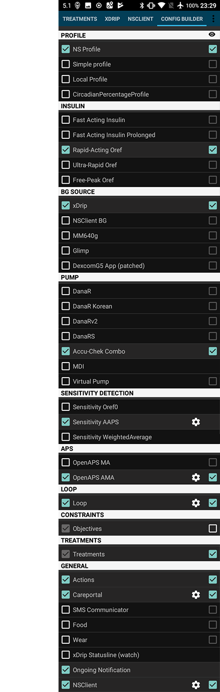

# Pantallas AndroidAPS

## Pantalla de inicio

Esta es la primera pantalla que encontrarás cuando abras AndroidAPS y contiene la mayor parte de la información que necesitarás día a día.

### Sección A

* navegar entre los diversos módulos de AndroidAPS deslizando a la izquierda o derecha

### Sección B

* cambiar el estado del lazo (lazo abierto, lazo cerrado, lazo de suspensión etc)
* ver tu perfil actual y hacer un [switch de perfil](../Usage/Profiles.md)
* ver tu nivel objetivo de glucosa en la sangre y establecer un [objetivo temporal](../Usage/temptarget.md).

Pulsación larga sobre cualquiera de los botones para modificar el ajuste. Por ejemplo mantenga pulsada la barra de destino en la parte superior derecha ("100" en la captura de pantalla de arriba) para establecer un objetivo temporal.

### Sección C

* última lectura de glucosa en la sangre de tu CGM
* cuánto tiempo hace que fue leído
* cambios en los últimos 15 y 40 minutos
* su tasa basal actual - incluyendo cualquier tasa basal temporal (TBR) programada por el sistema
* insulina a bordo (IOB)
* carbohidratos a bordo (COB)

Las luces opcionales [status](../Configuration/Preferences#overview) (CAN | INS | RES | SEN | BAT) dan una advertencia visual sobre el bajo nivel de reservorio y batería, así como el cambio de sitio vencido.

La insulina a bordo de la figura sería cero si su basal estándar estuviera en funcionamiento y no hubiera ninguna insulina restante de los bolsos anteriores. Las cifras entre corchetes muestran cuánto consiste en la insulina restante de los bolsos anteriores y cuánto es una variación basal debido a los TBRs anteriores programados por AAPS. Este segundo componente puede ser negativo si se han producido recientemente períodos de reducción de la basal.

### Sección D

Haga clic en la flecha en el lado derecho de la pantalla en la sección D para seleccionar qué información se muestra en las tablas de abajo.

### Sección E

Es el gráfico que muestra su glucosa en sangre (BG) como se lee en el monitor de glucosa (CGM) también muestra notificaciones de Nightscout, tales como las calibraciones de dedos y las entradas de los carbohidratos.

Pulsación larga en el gráfico para cambiar la escala de tiempo. Puede elegir entre 6, 8, 12, 18 o 24 horas.

Las líneas extendidas muestran los cálculos y tendencias de BG pronosticados - si lo ha seleccionado.

* **Naranja** línea: [COB](../Usage/COB-calculation.rst) (color que se utiliza generalmente para representar a los COB y los hidratos)
   
   La línea de predicción muestra dónde su BG llegará teniendo en cuenta los ajustes actuales de la bomba y asumiendo que las desviaciones debidas a la absorción de carbohidratos permanecen constantes. Esta línea sólo aparece si se conoce COB.

* **Azul oscuro** línea: IOB (color que se utiliza generalmente para representar IOB e insulina)
   
   La línea de predicción muestra lo que ocurriría bajo la influencia de la insulina solamente. Por ejemplo, si usted se ha marcado con alguna insulina y luego no ha comido carbohidratos.

* **Azul claro** línea: cero-temp (predicción de BG si se establecería una tasa basal temporal en 0%)
   
   La línea de predicción muestra cómo la línea de trayectoria del IOB cambiaría si la bomba detuviera toda la entrega de insulina (0% TBR).

* **Amarillo oscuro** line: [UAM ](../Configuration/Sensitivity-detection-and-COB#sensitivity-oref1) (comidas no anunciadas)
   
   Las comidas no anunciadas significan que se detecta un aumento significativo en los niveles de glucosa debido a las comidas, adrenalina u otras influencias. La línea de predicción es similar a la línea ORANGE COB pero supone que las desviaciones se recortarán a un ritmo constante (ampliando la tasa actual de reducción).

Por lo general, su verdadera curva de glucosa termina en el medio de estas líneas, o cerca de la que hace suposiciones que se asemejan más a su situación.

La línea **azul continua** muestra la entrega basal de la bomba. La línea **azul de puntos** es la que sería la tasa basal si no hubiera ajustes basales temporales (TBRs) y la línea azul sólida es la entrega real a lo largo del tiempo.

La línea de **amarillo delgado** muestra la actividad de la Insulina. Se basa en la bajada esperada de BG por la insulina en su sistema sin oros factores (como carbohidratos) presentes.

### Sección F

Esta sección también se puede configurar utilizando las opciones de la sección D.

* **Insulin On Board** (gráfico azul): muestra la insulina que tiene a bordo. Si no hubiera TBR, SMB y sin bolsos restantes estos serían cero. La baja depende de los valores de DIA y los ajustes del perfil de insulina. 
* **Carbs On Board** (gráfico naranja): muestra los carbohidratos que tiene a bordo. La baja depende de las desviaciones que el algoritmo detecta. Si detecta una mayor absorción de carbohidratos a lo esperado, se administrará la insulina y esto incrementará el IOB (más o menos, en función de sus valores de seguridad). 
* **Desviaciones**: 
   * **GRIS** barras que muestran una desviación debido a los carbohidratos. 
   * **VERDE** barras que muestran un BG mayor al que el algoritmo esperaba. 
   * **RED ** barras que muestran que BG es menor que el algoritmo esperaba.
* ** Sensibilidad ** (línea blanca): muestra la sensibilidad que [ Autosens ](../Usage/Open-APS-features#autosens) ha detectado. La Sensibilidad es el cálculo de la respuesta a la insulina como resultado del ejercicio, las hormonas, etc.
* **Actividad** (línea amarilla): muestra la actividad de la insulina, calculada por su perfil de insulina (no es un derivado de IOB). El valor es más alto para la insulina más próxima a la hora punta. Esto significaría un valor negativo cuando el IOB está disminuyendo. 

### Sección G

Le permite administrar un bolo (normalmente usaría el botón Calculadora para hacer esto) y añadir una calibración CGM con sangre del dedo. También se mostrará aquí un botón de Asistente rápido si está configurado en [Constructor de Configuración](../Configuration/Config-Builder#quickwizard-settings).

## La calculadora

Cuando usted quiere hacer un bolo para comida, aquí es de donde normalmente lo hará.

### Section H

es el lugar donde se introduce la información sobre el bolo que desea. El campo BG normalmente se llena con la lectura más reciente de la CGM. Si no tienes una CGM que funcione, entonces estará en blanco. En el campo CARBS se añade su estimación de la cantidad de carbohidratos (o equivalente) a los que desea realizar el bolo. El campo CORR es si desea modificar la dosificación final por alguna razón, y el campo CARB TIME es para hacer PRE-bolo, de modo que pueda indicar al sistema que habrá un retraso antes de que se esperen los carbohidratos. Puede poner un número negativo en este campo si está colocando un bolo para los carbohidratos ya ingeridos.

SUPER BOLO es el lugar en el que se añade la insulina basal para las próximas dos horas junto all bolo inmediato y basal temporal de cero durante las dos horas siguientes para recuperar la insulina adicional. La idea es entregar la insulina antes y esperar que reduzca los picos.

### Section I

muestra el bolo calculado. Si la cantidad de insulina a bordo sobrepasa ya el bolo calculado, entonces sólo se mostrará la cantidad de carbohidratos que todavía se necesitan.

### Section J

le muestra los diversos elementos que se han utilizado para calcular el bolo. Puede anular la selección de cualquier que no desee incluir, pero normalmente no es algo que realizaría.

### Combinaciones de COB e IOB y lo que significan

<ul>
    <li>Si marca COB e IOB, los carbohidratos no absorbidos que aún no están cubiertos con insulina + toda la insulina que ha sido suministrada como Basal temporal o SMB serán tenidos en cuenta</li>
    <li>Si marca COB sin IOB, corre el riesgo de exceso de insulina, ya que la AAPS no estaría contando la IOB que ya se ha dado. </li>
    <li>Si se marca IOB sin COB, AAPS tiene en cuenta la insulina ya entregada, pero no lo cubrirá frente a los carbohidratos que aún no se absorben. Esto da lugar a un aviso de 'carbohidratos desaparecidos '.
</ul>

Si usted se pone un bolo para alimentos adicionales poco después de un bolo de comida (por ejemplo, un postre adicional), puede ser útil desmarcar todas las cajas. De esta manera se añaden los nuevos carbohidratos ya que la comida principal no necesariamente es absorbida, por lo que la IOB no coincide con los COB después del bolo de comida.

### Detección de COB incorrecta

Si ve el aviso anterior después de utilizar el asistente de bolos, AndroidAPS ha detectado que el valor COB calculado puede ser incorrecto. Así que si quieres bolo de nuevo después de una comida previa con COB, debes ser consciente de una posible sobredosis! Para obtener detalles, consulte las sugerencias sobre [página de cálculo de COB](../Usage/COB-calculation#detection-of-wrong-cob-values).

## Perfil de Insulina

Esto muestra el perfil de actividad de la insulina que ha escogido. La línea PURPURA muestra cuánta insulina queda después de que se ha inyectado mientras declina con el tiempo y la línea AZUL muestra cuanta activa hay.

Normalmente usarás uno de los perfiles de Oref, y lo importante es que la bajada tiene una cola larga. Si lo ha utilizado para el inyectado manual, probablemente se ha utilizado asumiendo que la insulina decae durante más de 3,5 horas. Sin embargo, cuando se están perdiendo el tiempo de cola como los cálculos son mucho más precisos y estas pequeñas cantidades se suman cuando son sometidas a los cálculos recursivos en el algoritmo AndroidAPS.

Para una discusión más detallada de los diferentes tipos de insulina, sus perfiles de actividad y por qué todos estos asuntos importan puede leer un artículo aquí en [Comprender las nuevas curvas de IOB basadas en las Curvas de Actividad Exponencial](https://openaps.readthedocs.io/en/latest/docs/While%20You%20Wait%20For%20Gear/understanding-insulin-on-board-calculations.html#understanding-the-new-iob-curves-based-on-exponential-activity-curves)

Y puede leer un artículo excelente acerca de esto aquí: [Por qué nos equivocamos regularmente en la duración de la acción de insulina (DIA) veces que usamos, y por qué importa…](http://www.diabettech.com/insulin/why-we-are-regularly-wrong-in-the-duration-of-insulin-action-dia-times-we-use-and-why-it-matters/)

Y más en: [Curvas Exponenciales de Insulina + Fiasp](http://seemycgm.com/2017/10/21/exponential-insulin-curves-fiasp/)

## Estado de Infusora

Aquí vemos el estado de la bomba de insulina - en este caso un Combo Accu-Chek. La información que se muestra es autoexplicativa. Una pulsación larga en el botón HISTORIAL permite leer los datos de la historia de la bomba, incluyendo su perfil basal. Pero recuerde que sólo se da soporte a un perfil basal en la bomba Combo.

## Portal de Atención (Care Portal)

Careportal replicated the functions you will find on your Nightscout screen under the “+” symbol which allows you to add notes to your records.

### Corrección de Carbohidratos

La pestaña de tratamiento se puede utilizar para corregir las entradas de Hc defectuosas (es decir, los carbohidratos sobrantes o subestimados).

1. Compruebe y recuerde el COB y el IOB actuales en la pantalla de inicio.
2. Dependiendo de la bomba en la pestaña de tratamiento, los carbohidratos pueden mostrarse junto con la insulina en una sola línea o como una entrada separada (por ejemplo, en la Dana RS).
   
   

3. Suprima la entrada con la cantidad de carbohidratos erróneos.

4. Asegúrese de que los carbohidratos se eliminan correctamente comprobando COB en la pantalla de inicio de nuevo.
5. Haga lo mismo con el IOB si hay una sola línea en el tabulador, incluyendo los carbohidratos y la insulina.
   
   -> If carbs are not removed as intended and you add additional carbs as explained here (6.), COB will be too high and that might lead to too high insulin delivery.

6. Enter correct carb amount through carbs button on homescreen and make sure to set the correct event time.

7. Si sólo hay una línea en la pestaña de tratamiento, incluyendo los carbohidratos y la insulina, debe añadirse también la cantidad de insulina. Asegúrese de establecer el tiempo de ocurrencia correcto y compruebe el IOB en la pantalla de inicio después de confirmar la nueva entrada.

## Loop, MA, AMA, SMB

Normalmente no tienes que preocuparte de esto, muestran los resultados del algoritmo OpenAPS que se ejecuta cada vez que el sistema recibe una nueva lectura del sensor. Estos temas se debaten en otro lugar.

## Perfil

AndroidAPS se puede ejecutar utilizando un diferentes configuraciones de perfil. Típicamente - como se muestra aquí - el perfil de Nightscout se ha descargado a través del cliente de Nighscout y se visualiza aquí en forma de sólo lectura. Si desea realizar algún cambio, lo haría desde la interfaz el de Nightscout y, a continuación, realice un [Perfil Switch](../Usage/Profiles.md) en AndroidAPS para activar los cambios. Los datos, como el perfil basal, se copiarían entonces automáticamente en la bomba.

**DIA:** representa la Duración de la acción de insulina y se describe más arriba en la sección sobre perfiles de insulina.

**IC:** es la proporción de Insulina a Carbohidratos. Este perfil tiene un número de valores diferentes establecidos para diferentes horas del día.

**ISF:** es el factor de sensibilidad de la insulina - la cantidad de glucosa que una unidad de insulina reducirá, asumiendo que nada más cambia.

**Basal:** es el perfil basal programado en la bomba.

**Objetivo:** es el nivel de glucosa en sangre objetivo que desea para todo el tiempo. Puede establecer diferentes niveles para las diferentes horas del día, e incluso puede establecer un rango superior e inferior para que la plataforma empiece a hacer cambios cuando el valor de glucosa en sangre previsto cae fuera, pero si hace eso, la plataforma responderá más lentamente y es poco probable que consiga una glucosa estable.

## Tratamiento, xDrip, NSClient

Estos son registros de tratamientos (bolos y carbohidratos), mensajes de xDrip y mensajes enviados a Nightscout a través de Nightscout. Normalmente no tienes que preocuparte por nada de esto a menos que haya un problema.

## Configuraciones

Aquí es donde se ajustará la configuración de su plataforma AndroidAPS. Esta captura de pantalla muestra un montaje típico con una bomba Combo, un sensor Dexcom G5 que se gestiona a través de xDrip + y que se ejecuta con la insulina NovoRapid en un perfil de Oref y conectado a un servidor basado en la nube de Nightscout.

El cuadro de selección de la derecha determina si ese módulo en particular se visualizará en la barra de menús superior (consulte la sección A en la pantalla de inicio) y el símbolo de engranaje pequeño permite el acceso a la configuración de dicho módulo, si hay alguno.

## Ajustes y preferencias

En la parte superior derecha de la barra de navegación encontrarás tres pequeños puntos verticales. Al pulsar en estos se va a las preferencias de la aplicación, al navegador de historial, al asistente de configuración, a la información de la aplicación y al botón de salida que cerrará AAPS.