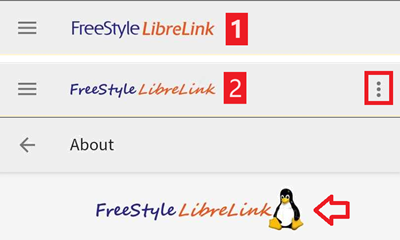

# Freestyle Libre 2

The Freestyle Libre 2 system can automatically report dangerous blood glucose levels. The Libre2 Sensor sends the current blood sugar level to a receiver (reader or smartphone) every minute. The receiver triggers an alarm if necessary. With a self-modified LibreLink app and the xDrip+ app, you can continuously receive and display your blood sugar level on your smartphone.

The sensor can be calibrated in the range of -40 mg/dl to +20 mg/dl (-2,2 mmol/l to +1,1 mmol/l) to adjust differences between finger prick measurements and sensor readings.

BG readings can also be done using a BT transmitter like with the Libre1.

Important note : This does not work with the US version of the Freestyle 2 sensor ! The US version will only connect to a reader, not a phone.

## Paso 1: Construye tu propia Librelink-App parcheada

Por razones legales, el llamado parche tiene que ser hecho por usted mismo. Utilizar motores de búsqueda para encontrar los enlaces correspondientes. There are mainly two variants: The recommended original patched app blocks any internet traffic to avoid tracking. The other variant supports LibreView which may be needed by your doctor.

The patched app has to be installed instead of the original app. The next sensor started with it will transmit the current BG values to the xDrip+ app running on your smartphone via Bluetooth.

Important: To avoid possible problems it may help to first install and uninstall the original app on an NFC capable smartphone. NFC has to be enabled. Esto no suma consumo a la batería. A continuación, instale la aplicación parcheada.

The patched app can be identified by the foreground authorization notification. The foreground authorization service improves the connection stability compared to the original app which do not use this service.

Other indications could be the Linux penguin logo three dot menu -> Info or the font of the patched app. These criteria are optional depending on the app source you choose.

Ensure that NFC is activated, enable the memory and location permission for the patched app, enable automatic time and time zone and set at least one alarm in the patched app.

Now start the Libre2 sensor with the patched app by simply scanning the sensor. Asegúrese de haber configurado todos los ajustes.

Ajustes obligatorios para el inicio del sensor con éxito:

-   NFC enabled / BT enabled
-   memory and location permission enabled
-   location service enabled
-   automatic time and time zone setting
-   set at least one alarm in the patched app

Tenga en cuenta que el servicio de ubicación es imprescindible. This is not the app location permission which has to be set also!

El sensor recuerda el dispositivo con el que se inició. Only this device can receive alarms in the future.

La primera configuración de la conexión para el sensor es fundamental. The LibreLink app tries to establish a wireless connection to the sensor every 30 seconds. Si faltan uno o más valores obligatorios, hay que establecerlos. No tienes límite de tiempo para hacer eso. The sensor is constantly trying to setup the connection. Incluso después de algunas horas. Be patient and try different settings before even think of changing the sensor.

As long as you see a red exclamation mark ("!") on the upper left corner of the LibreLink's start screen there is no connection or some other setting blocks LibreLink to signal alarms. Please check if the sound is enabled and all sorts of blocking app notifications are disabled. When the exclamation mark is gone, the connection should be established and blood sugar values are sent to the smartphone. This should happen after a maximum of 5 minutes.

If the exclamation mark remains or you get an error message, this can have several reasons:

-   Android location service is not granted - please enable it in the system settings
-   automatic time and time zone not set - please change the settings accordingly
-   activate alarms - at least one of the three alarms must be activated in LibreLink
-   Bluetooth is switched off - please switch on
-   sound is blocked
-   app notifications are blocked
-   idle screen notifications are blocked
-   you have a faulty Libre 2 sensor from a production LOT number with a 'K' followed by 8 digits. You find this printed on the yellow package. These sensors have to be replaced as they don't function on bluetooth.

Reiniciar el teléfono puede ayudar, es posible que tenga que hacerlo varias veces. As soon as the connection is established, the red exclamation mark disappears and the most important step is taken. It may happen that depending on system settings the exclamation mark remains but you still get readings. En ambos casos está bien. Sensor and phone are now connected, every minute a blood sugar value is transmitted.

In rare case it could help to empty the bluetooth cache and/or reset all network connections via the system menu. This removes all connected bluetooth devices which may help to setup a proper bluetooth connection. That procedure is save as the started sensor is remembered by the patched LibreLink app. Nothing additional has to be done here. Simply wait for the patched app to connect to the sensor.

After a successful connection the smartphone settings can be changed if necessary. Esto no es recomendable, pero es posible que desee ahorrar energía. Location service can be switched off, volume can be set to zero or alarms can be switched off again. The blood sugar levels are transferred anyway.

Al iniciar el siguiente sensor, no obstante, todos los valores deben volver a establecerse!

Remark: The patched app needs the mandatory settings set in that hour after warmup to enable a connection. For the 14 days operation time they are not needed. In most cases when you have problems with starting a sensor the location service was switched off. For Android it is needed for proper bluetooth operation(!) to connect. Please refer to Google's Android documentation.

During the 14 days you can use in parallel one or more NFC capable smartphones (not the reader device!) running the original LibreLink app for scanning via NFC. There is no time limitation to start that. You could use a parallel phone for example on day 5 or so. The parallel phones(s) could upload the blood sugar values into the Abbott Cloud (LibreView). LibreView can generate reports for your diabetes team. Hay muchos padres que necesitan absolutamente esto.

Please note that the original patched app **does not have any connection to the internet** to avoid tracking.

However there is a variant of the patched app supporting LibreView with enabled internet access. Please be aware that your data is transferred to the cloud then. But your diadoc tool- and reporting chain is fully supported then. With that variant it is also possible to move the alarms of a running sensor to a different device which not has started the sensor. Please google in diabetes related German forums how this could be done.

## Paso 2: Instalar y configurar la aplicación xDrip+

Los valores de azúcar en sangre son recibidos en el smartphone por la aplicación xDrip+.

-   If not already set up then download xDrip+ app and install one of the latest nightly builds from [here](https://github.com/NightscoutFoundation/xDrip/releases).
-   In xDrip+ select "Libre2 patched" or "Libre 2 (patched App)" as data source
-   If necessary, enter "BgReading:d,xdrip libre_receiver:v" under Less Common Settings->Extra Logging Settings->Extra tags for logging. Esto registrará mensajes de error adicionales ante problemas.
-   In xDrip+ go to Settings > Interapp Compatibility > Broadcast Data Locally and select ON.
-   In xDrip+ go to Settings > Interapp Compatibility > Accept Treatments and select OFF.
-   to enable AAPS to receive blood sugar levels (version 2.5.x and later) from xDrip+ please set [Settings > Interapp Settings > Identify Receiver "info.nightscout.androidaps"](../Configuration/xdrip.md#identify-receiver)
-   If you want to be able to use AndroidAPS to calibrate then in xDrip+ go to Settings > Interapp Compatibility > Accept Calibrations and select ON. You may also want to review the options in Settings > Less Common Settings > Advanced Calibration Settings.

## Paso 3: Iniciar el sensor

En xDrip+ inicie el sensor con "Iniciar Sensor" y "hoy no".

In fact this will not physically start any Libre2 sensor or interact with them in any case. This is simply to indicate xDrip+ that a new sensor is delivering blood sugar levels. If available, enter two bloody measured values for the initial calibration. Now the blood glucose values should be displayed in xDrip+ every 5 minutes. Skipped values, e.g. because you were too far away from your phone, will not be backfilled.

After a sensor change xDrip+ will automatically detect the new sensor and will delete all calibration data. You may check you bloody BG after activation and make a new initial calibration.

## Step 4: Configure AndroidAPS (for looping only)

-   In AndroidAPS go to Config Builder > BG Source and check 'xDrip+'
-   If AndroidAPS does not receive BG values when phone is in airplane mode, use 'Identify receiver' as describe on [xDrip+ settings page](../Configuration/xdrip.md#identify-receiver).

Until now, using Libre 2 as BG source you cannot activate ‘Enable SMB always’ and ‘Enable SMB after carbs’ within SMB algorithm. The BG values of Libre 2 are not smooth enough to use it safely. See [Smoothing blood glucose data](../Usage/Smoothing-Blood-Glucose-Data-in-xDrip.md) for more details.

## Experiences and Troubleshooting

### Conectividad

La conectividad es extraordinariamente buena. With the exception of Huawei mobile phones, all current smartphones seem to work well. The reconnect rate in case of connection loss is phenomenal. The connection can break off if the mobile phone is in the pocket opposite the sensor or if you are outdoors. When I am gardening, I use to wear my phone on the sensor side of my body. In rooms, where Bluetooth spreads over reflections, no problems should occur. If you have connectivity problems please test another phone. It may also help to set the sensor with the internal BT antenna pointing down. The slit on the applicator must be pointing down when setting the sensor.

### Value smoothing & raw values

Technically, the current blood sugar value is transmitted to xDrip+ every minute. A weighted average filter calculates a smoothed value over the last 25 minutes. Esto es obligatorio. The curves look smooth and the loop results are great. The raw values on which the alarms are based jitter a little more, but correspond to the values that the reader also displays. In addition, the raw values can be displayed in the xDrip+ graph in order to be able to react in time to rapid changes. Please switch on Less Common Settings \> Advanced Settings for Libre2 \> "show Raw values" and "show Sensors Infos". Then the raw values are additionally displayed as small white dots and additional sensor info is available in the system menu.

Los valores crudos son muy útiles cuando el azúcar en sangre se está moviendo rápido. Even if the dots are jumpier you would detect the tendency much better as using the smoothed line to make proper therapy decisions.

### Sensor runtime

El tiempo de trabajo del sensor se fija en 14 días. The 12 extra hours of Libre1 no longer exist. xDrip+ shows additional sensor information after enabling Advanced Settings for Libre2 \> "show Sensors Infos" in the system menu like the starting time. The remaining sensor time can also be seen in the patched LibreLink app. Either in the main screen as remaining days display or as the sensor start time in the three-point menu->Help->Event log under "New sensor found".

### Nuevo Sensor

A sensor exchange takes place on-the-fly: Set new sensor shortly before activation. As soon as xDrip+ receives no more data from the old sensor, start the new sensor with the patched app. After one hour new values should appear automatically in xDrip+.

If not, please check the phone settings and proceed as with the first start. Usted no tiene límite de tiempo. Trate de encontrar los ajustes correctos. No need to immediately replace the sensor before you tried different combinations. The sensors are robust and try permanently to establish a connection. Por favor, toma tu tiempo. In most cases you accidentally changed one setting which causes now problems.

Once successful please select "Sensor Stop" and "Delete calibration only" in xDrip. This indicates for xDrip+ that a new sensor is releasing blood sugar levels and the old calibrations are no longer valid and therefore have to be deleted. No real interaction is done with the Libre2 sensor here! No es necesario que inicie el sensor en xDrip+.

### Calibración

You can calibrate the Libre2 with an offset of -40 mg/dl to +20 mg/dL \[-2,2 mmol/l to +1,1 mmol/l\] (intercept). The slope isn't changeable as the Libre2 is much more accurate compared to the Libe1. Please check by fingerpricking early after setting a new sensor. It is known that there can arise big differences to the blood measurements. To be on the safe side, calibrate every 24 - 48 hours. The values are accurate up to the end of the sensor and do not jitter as with the Libre1. However, if the sensor is completely off, this will not change. The sensor should then be replaced immediately.

### Plausibility checks

The Libre2 sensors contain plausibility checks to detect bad sensor values. As soon as the sensor moves on the arm or is lifted slightly, the values may start to fluctuate. The Libre2 sensor will then shut down for safety reasons. Unfortunately, when scanning with the App, additional checks are made. The app can deactivate the sensor even though the sensor is OK. Actualmente, la prueba interna es demasiado estricta. I have completely stopped scanning and haven't had a failure since then.

### Zona horaria viajando

In other [time zones](../Usage/Timezone-traveling.md) there are two strategies for looping:

Cualquiera

1.  leave the smartphone time unchanged and shift the basal profile (smartphone in flight mode) or
2.  delete the pump history and change the smartphone time to local time.

Método 1. is great as long as you don't have to set a new Libre2 sensor on-site. If in doubt, choose method 2., especially if the trip takes longer. If you set a new sensor, the automatic time zone must be set, so method 1. sería perturbado. Please check before, if you are somewhere else, you can run otherwise fast into problems.

### Experiencias

En conjunto, es uno de los sistemas de MCG más pequeños del mercado. Small, no transmitter necessary and mostly very accurate values without fluctuations. After approx. 12 hours running-in phase with deviations of up to 30 mg/dl (1,7 mmol/l)the deviations are typical smaller than 10 mg/dl (0,6 mmol/l). Best results at the rear orbital arm, other setting points with caution! No need to set a new sensor one day ahead for soaking. That would disturb the internal levelling mechanism.

There seem to be bad sensors from time to time, which are far away from the blood values. Se queda así. These should be immediately replaced.

If the sensor moved a little bit on the skin or is lifted somehow this can cause bad results. The filament which sits in the tissue is a little bit pulled out of the tissue and will measure different results then. Lo mas probable es que veas los saltos de valores en xDrip+. Or the difference to the bloody values change. Por favor, reemplace el sensor de inmediato! The results are inaccurate now.

## Usando el transmisor bluetooth y OOP

Bluetooth transmitter can be used with the Libre2 with the latest xDrip+ nightlys and the Libre2 OOP app. You can receive blood sugar readings every 5 minutes as well as with the Libre1. Please refer to the miaomiao website to find a description. This will also work with the Bubble device and in the future with other transmitter devices. The blucon should work but has not been tested yet.

Old Libre1 transmitter devices cannot be used with the Libre2 OOP. They need to be replaced with a newer version or have a firmware upgrade for proper operation. MM1 with newest firmware is unfortunately not working yet - searching for root cause is currently ongoing.

The Libre2 OOP is creating the same BG readings as with the original reader or the LibreLink app via NFC scan. AAPS with Libre2 do a 25 minutes smoothing to avoid certain jumps. OOP generates readings every 5 minutes with the average of the last 5 minutes. Therefore the BG readings are not that smooth but match the original reader device and faster follow the "real" BG readings. If you try to loop with OOP please enable all smoothing settings in xDrip+.

The Droplet transmitter is working with Libre2 also but uses an internet service instead. Please refer to FB or a search engine to get further information. The MM2 with the tomato app also seems to use an internet service. For both devices you have to take care to have a proper internet connection to get your BG readings.

Even if the patched LibreLink app approach is smart there may be some reasons to use a bluetooth transmitter:

-   the BG readings are identical to the reader results
-   the Libre2 sensor can be used 14.5 days as with the Libre1 before
-   8 hours Backfilling is fully supported.
-   get BG readings during the one hour startup time of a new sensor

Remark: The transmitter can be used in parallel to the LibreLink app. It doesn't disturb the patched LibreLink app operation.

Comentario #2: El algoritmo OOP no se puede calibrar todavía. This will be changed in the future.

# Mejores prácticas para calibrar un sensor Libre 2

To get the best results when calibrating a libre 2 sensor there are some “rules” you should follow. They apply independently of the software combination (e.g. patched libre-app, oop2, …) that is used to handle the libre 2 values.

1.  The most important rule is to only calibrate the sensor when you have a flat bg level for at least 15 minutes. The delta between the last three readings should not exceed 10 mg/dl (over 15min not between each reading). As the libre 2 does not measure your blood glucose level but your flesh glucose level there is some time lag especially when bg level is rising or falling. This time lag can lead to way too large calibration offsets in unfavourable situations even if the bg level rise / fall is not that much. So whenever possible avoid to calibrate on rising or falling edges. -> If you have to add a calibration when you do not have a flat bg level (e.g. when starting a new sensor) it is recommended to remove that calibration(s) as soon as possible and add a new one when in flat bg levels.
2.  Actually this one is automatically taken into account when following rule 1 but to be sure: When doing comparison measurements your bg level should also be flat for about 15min. Do not compare when rising or falling. Important: You still shall do blood glucose measurements whenever you desire, just don’t use the results for calibration when rising or falling!
3.  As calibrating the sensor in flat levels is a very good starting point it is also strongly recommended to calibrate the sensor only within your desired target range like 70 mg/dl to 160 mg/dl. The libre 2 is not optimized to work over a huge range like 50 mg/dl to 350 mg/dl (at least not in a linear manner), so try to only calibrate when within your desired range. -> Simply accept that values outside your calibration range will not perfectly match blood glucose levels.
4.  Do not calibrate too often. Calibrating the sensor very often mostly leads to worse results. When the sensor delivers good results in flat conditions just don’t add any new calibration as it does not have any -useful- effect. It should be sufficient to recheck the status every 3-5 days (of course also in flat conditions).
5.  Avoid calibration when not required. This might sound silly but it is not recommended to add a new calibration if the blood glucose to flesh glucose level difference is only ±10 mg/dl (e.g. blood glucose level: 95, Libre sensor 100 -> do NOT add the 9l, blood glucose level: 95, Libre sensor 115 -> add the 95 to be taken into account for the calibration)

Some general notes: After activating a new sensor and at the sensor’s end of life it does make sense to do comparison measurements more often than 3-5 days as stated in rule nr. 4. For new and old sensors it is more likely that the raw values change and a re-calibration is required. From time to time it happens that a sensor does not provide valid values. Most likely the sensor value is way to low compared to the actual blood glucose level (e.g. sensor: 50 mg/dl, bg: 130 mg/dl) even after calibrating. If this is the case the sensor cannot be calibrated to report useful results. E.g. when using the patched libre app one can add an offset of maximal +20 mg/dl. When it happens to you that the sensor does provides way too low values, don’t hesitate to replace it as it will not get better. Even if it might be a defective sensor, when seeing sensors that do provide way too low values very often, try to use different areas to place your sensor. Even in the official area (upper arm) there might be some locations where the sensors just do not provide valid values. This is some kind of trial end error to find areas that work for you.
