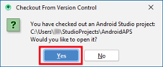
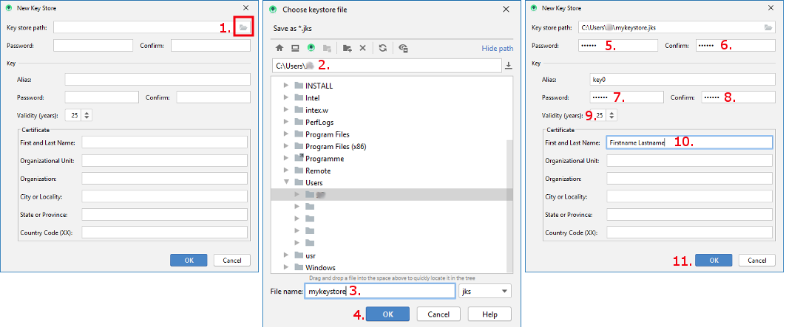

# Construyendo la APK

## Construyela tú mismo en lugar de descargarla

**AndroidAPS no está disponible como descarga debido a la regulación de los dispositivos mediales. ¡Es legal construir la aplicación para su propio uso, pero no debe dar una copia a los demás! Consulte la página [FAQ](../Getting-Started/FAQ.md) para obtener detalles.**

## ## Notas importantes

* Por favor utilice **[Android Studio Versión 3.6.1](https://developer.android.com/studio/)** o más reciente para construir el apk.
* [Windows 10 sistemas de 32 bits](../Installing-AndroidAPS/troubleshooting_androidstudio#unable-to-start-daemon-process) no son compatibles con Android Studio 3.6.1.

**Configuración bajo demanda** no está soportada por la versión actual del plugin de Gradle de Android!

Si la compilación falla con un error en la configuración personalizada, puede realizar lo siguiente:

* Abra la ventana de Preferencias, haga clic en Archivo > Configuración (en Mac, Android Studio > Preferencias).
* En el panel de la izquierda, pulse Compilar, Ejecución, Deployment > Compilador.
* Desmarque la casilla de verificación Configurar bajo demanda.
* Haga clic en Aplicar o en Aceptar.

* * *

### Este artículo se divide en dos partes.

* En la parte de descripción general hay una explicación sobre qué pasos son necesarios para crear el archivo APK.
* En el paso paso a paso encontrará las capturas de pantalla de una instalación en concreto. Debido a que las versiones de Android Studio - el entorno de desarrollo de software que usaremos para construir el APK - cambia muy rápidamente hace que esta guía no será idéntica a su instalación, pero debería darte un buen punto de partida. Android Studio también se ejecuta en Windows, Mac OS X y Linux y es posible que haya pequeñas diferencias en algunos aspectos entre cada plataforma. Si encuentras que algo importante está mal o falta, por favor informe al grupo de facebook "usuarios AndroidAPS" o en el Gitter chats [Android APS](https://gitter.im/MilosKozak/AndroidAPS) o [AndroidAPSwiki](https://gitter.im/AndroidAPSwiki/Lobby) para que podamos echar un vistazo a esto.

## Inicio

En general, los pasos necesarios para crear el archivo APK son:

1. [Instala Git](../Installing-AndroidAPS/git-install.rst)
2. [Instalar Android Studio](../Installing-AndroidAPS/Building-APK#install-android-studio)
3. [Establecer la ruta git en las preferencias de Android Studio](../Installing-AndroidAPS/Building-APK#set-git-path-in-preferences)
4. [Descargar código de AndroidAPS](../Installing-AndroidAPS/Building-APK#download-androidaps-code)
5. [Descargar Android SDK](../Installing-AndroidAPS/Building-APK#download-android-sdk)
6. [ Construir la aplicación ](../Installing-AndroidAPS/Building-APK#generate-signed-apk) (generar apk firmado)
7. [Transferir el archivo apk a su teléfono](../Installing-AndroidAPS/Building-APK#transfer-apk-to-smartphone)
8. [Identificar receptor si se utiliza xDrip+](../Installing-AndroidAPS/Building-APK#identify-receiver-if-using-xdrip)

## Tutorial paso a paso

Descripción detallada de los pasos necesarios para crear el archivo APK.

## Instalar git (si no lo tienes ya)

Siga el manual en [git página de instalación](../Installing-AndroidAPS/git-install.rst).

## Instalar Android Studio

Las siguientes capturas de pantalla se han tomado de Android Studio Versión 3.6.1. Es posible que la pantalla parezca un poco diferente si utiliza una versión más reciente de Android Studio. Pero deberías ser capaz de encontrar el camino a través del proceso. [ Se proporciona ayuda de la comunidad ](../Where-To-Go-For-Help/Connect-with-other-users.md).

Una de las cosas más importantes al instalar Android Studio: ** Be patient! ** Durante la instalación y configurar Android Studio está descargando un montón de cosas que se tomarán su tiempo.

Instale [Android Studio](https://developer.android.com/studio/install.html) y configurelo durante el primer inicio.

Seleccione "No importar valores", ya que no lo ha utilizado anteriormente.


Decida si desea compartir datos con Google o no.


En la siguiente pantalla, haga clic en "Next".


Seleccione la instalación "Estándar" y haga clic en "Siguiente".


Seleccione el tema para la interfaz de usuario que desee. (En este manual usamos "Light".) Luego haga clic en "Next". Este es sólo el esquema de colores. Usted puede seleccionar cualquier que le gusta (por ejemplo, "Darcula" para el modo oscuro). Esta selección no tiene ninguna influencia sobre la construcción del APK.


Pulse "Siguiente" en el diálogo "Verificar valores".


Espere mientras Android Studio descarga componentes adicionales y tenga paciencia. Una vez que todo se descarga el botón "Finalizar" se vuelve azul. Haga clic en el botón ahora.


## Establecer la ruta git en las preferencias

Asegúrese de que [ git esté instalado ](../Installing-AndroidAPS/git-install.rst) en el sistema.

En la pantalla de bienvenida de Android Studio, haga clic en el triángulo pequeño (1. en la siguiente captura de pantalla) y seleccione "Configuración" (2.).


### Windows

* Haga clic en el triángulo pequeño junto a Control de versiones (1.) para abrir el submenú.
* Haga clic en Git (2.).
* Asegúrese de que el método de actualización "Merge" (3.) está seleccionado.
* Check if Android Studio can locate path to git.exe automatically by clicking the button "Test" (4.)


* If automatic setting is successful git version will be displayed.
* Click "OK" in the dialog box (1.) and "OK" in the settings window (2.).


* In case file git.exe cannot be found click "OK" in the dialog box (1.) and then the button with the three dots (2.).
* Use [search function](https://www.tenforums.com/tutorials/94452-search-file-explorer-windows-10-a.html) in windows explorer to find "git.exe" if you are unsure where it can be found. You are looking for git.exe located in \bin\ folder.
* Select path to git.exe and make sure you selected the one in ** \bin\ ** folder (3.) and click "OK" (4.).
* Close settings window by clicking "OK" button (5.).


* **Reboot your computer to update system environment.**

### Mac

* Cualquier versión de git sirve. For example <https://git-scm.com/download/mac>.
* Use homebrew to install git: ```$ brew install git```.
* For details on installing git see the [official git documentation](https://git-scm.com/book/en/v2/Getting-Started-Installing-Git).
* Si instala git a través de un homebrew, no es necesario cambiar ninguna preferencia. Solo por caso: se puedan encontrar aquí: Android Studio - Preferencias.

## Descargar código de AndroidAPS

* **If you haven't already rebooted your computer after setting git path in preferences do it now. System environment must be updated.**
* On the Android Studio welcome screen click the small triangle right of "Check out project from version control" (1.).
* Select "Git" (2.).


* If you already opened Android Studio and do not see the welcome screen anymore select File (1.) > New (2.) > Project from Version Control... (3.) > Git (4.).


* Fill in the URL to the main AndroidAPS repository ("https://github.com/MilosKozak/AndroidAPS") (1.).
* Choose the directory where you want to save the cloned code.
* Click button "Test" (2.).
* If test cannot be completed successfully check URL, correct and click "Test" again.
* If URL is entered correctly "Connection successful" (3.) will be shown.
* Click button "Clone" (4.).


* Do not click "Background" while repository is cloned!


* After repository is cloned successfully open your local copy by clicking "Yes".



* In the lower right corner you will see the information that Android Studio is running background tasks.


* Grant access if your firewall is asking for permission.


* Once the background tasks are finished you will probably see the following error message:


## Descargar Android SDK

* Click File > Settings.


* Click the small triangle next to Appearance & Behaviour (1.).
* Click the small triangle next to System Settings (2.) and select Android SDK (3.)
* Check the box left of "Android 9.0 (Pie)" (4.) (API Level 28).


* Confirm changes by clicking OK.


* Accept licence agreement (1.) and click "Next" (2.).


* Wait until installation is finished.


* When SDK installation is completed the "Finish" button will turn blue. Click this button.


* Android Studio might recommend to update the gradle system. **Nunca actualice gradle! ** Esto podría llevar a dificultades!
* If you see an information on the lower right side of your Android Studio window that Android Gradle Plugin is ready to update click on the text "update" (1.) and in the dialog box on "Don't remind me again for this project" (2.).


## Generar APK firmado

Signing means that you indicate your app to be your own creation but in a digital way as a kind of digital fingerprint within the app itself. Esto es necesario porque Android tiene una regla que sólo acepta el código firmado para ejecutarse por razones de seguridad. For more information on this topic, follow [this link](https://developer.android.com/studio/publish/app-signing.html#generate-key).

* Click "Build" in the menu bar and select "Generate Signed Bundle / APK...".


* Select "APK" (1.) instead of "Android App Bundle" and click "Next" (2.).


* Make sure that module is set to "app" (1.).
* Click "Create new..." (2.) to start creating your key store.
    
    A key store in this case is nothing more than a file in which the information for signing is stored. Está encriptado y la información está protegida con contraseñas.


* Click the folder symbol (1.) to select your key store path. 
* Select the path where your key store shall be saved (2.). **Do not save in same folder as project. You must use a different directory!** One option might be your home folder.
* Type a file name for your key store (3.).
* Click "OK" (4.).
* Passwords for key store and key do not have to be very sophisticated. Make sure to remember those or make a note in a safe place. In case you will not remember your passwords in the future you see [troubleshooting for lost key store](../Installing-AndroidAPS/troubleshooting_androidstudio#lost-keystore).
* Enter (5.) and confirm (6.) the password for your key store.
* Do the same for your key (7. + 8.).
* Validity (9.) is 25 years by default. You do not have to change the default value.
* First and last name must be entered (10.). All other information is optional.
* Click "OK" (11.) when you are done.



* Make sure the box to remember passwords is checked (1.). So you don't have to enter them again next time you build the apk (i.e. when updating to a new AndroidAPS version).
* Click "Next" (2.).


* Select build variant "fullRelease" (1.). 
* Check boxes V1 and V2 for signature versions (2.).
* Click "Finish". (3.)


* Android Studio will display the information "APK(s) generated successfully..." after build is finished.
* In case build was not successful refer to the [troubleshooting section](../Installing-AndroidAPS/troubleshooting_androidstudio.rst).
* Easiest way to find the apk is to click on "Event log".


* In the event log section click "locate".


* app-full-release.apk is the file you are looking for.


## Transferir APK a smartphone

Easiest way to transfer app-full-release.apk to your phone is via [USB cable or Google Drive](https://support.google.com/android/answer/9064445?hl=en). Please note that transfer by mail might cause difficulties and is not the preferred way.

On your phone you have to allow installation from unknown sources. Manuals how to do this can be found on the internet (i.e. [here](https://www.expressvpn.com/de/support/vpn-setup/enable-apk-installs-android/) or [here](https://www.androidcentral.com/unknown-sources)).

## Identificar receptor si se utiliza xDrip+

[See xDrip+ page](../Configuration/xdrip#identify-receiver)

## Solución de problemas

Consulte la página separada [para la resolución de problemas de Android Studio](../Installing-AndroidAPS/troubleshooting_androidstudio.rst).