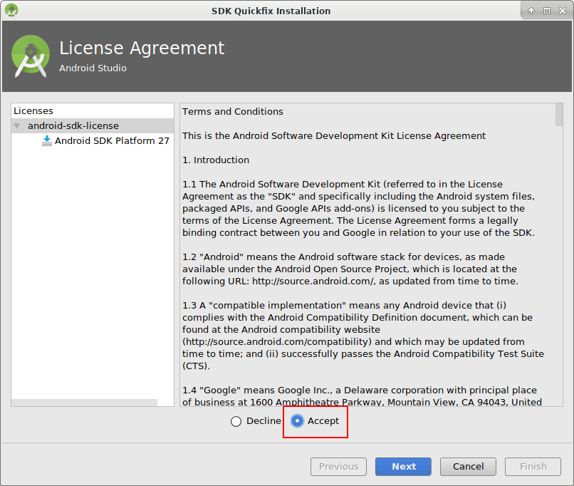
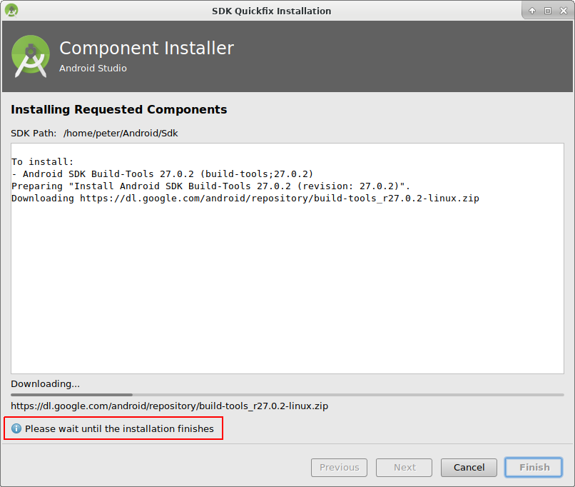
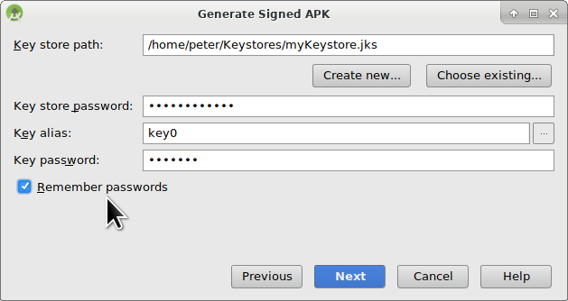

# Construyendo la APK

## Construyela tú mismo en lugar de descargarla

**AndroidAPS no está disponible como descarga debido a la regulación de los dispositivos mediales. ¡Es legal construir la aplicación para su propio uso, pero no debe dar una copia a los demás! Consulte la página [FAQ](../Getting-Started/FAQ.md) para obtener detalles.**

## ## Notas importantes

* Por favor utilice **[Android Studio Versión 3.5.1](https://developer.android.com/studio/)** o más reciente para construir el apk.
* [Windows 10 sistemas de 32 bits](../Installing-AndroidAPS/troubleshooting_androidstudio#unable-to-start-daemon-process) no son compatibles con Android Studio 3.5.1.

**Configuración bajo demanda** no está soportada por la versión actual del plugin de Gradle de Android!

If your build fails with an error regarding "on demand configuration" you can do the following:

* Abra la ventana de Preferencias, haga clic en Archivo > Configuración (en Mac, Android Studio > Preferencias).
* En el panel de la izquierda, pulse Compilar, Ejecución, Deployment > Compilador.
* Desmarque la casilla de verificación Configurar bajo demanda.
* Haga clic en Aplicar o en Aceptar.

* * *

### Este artículo se divide en dos partes.

* En la parte de descripción general hay una explicación sobre qué pasos son necesarios para crear el archivo APK.
* En el paso paso a paso encontrará las capturas de pantalla de una instalación en concreto. Because the versions of Android Studio - the software development environment which we will use to build the APK - will change very quickly this will be not identical to your installation but it should give you a good starting point. Android Studio also runs on Windows, Mac OS X and Linux and there might be small differences in some aspects between each platform. If you find that something important is wrong or missing, please inform the facebook group "AndroidAPS users" or in the Gitter chats [Android APS](https://gitter.im/MilosKozak/AndroidAPS) or [AndroidAPSwiki](https://gitter.im/AndroidAPSwiki/Lobby) so that we can have a look at this.

## Inicio

En general, los pasos necesarios para crear el archivo APK son:

* [Install git](../Installing-AndroidAPS/git-install.rst)
* Instale y configura Android Studio.
* Use git to clone the source code from the central Github repository where the developers have put the actual code for the app.
* Abra el proyecto clonado en Android Studio como proyecto activo.
* Construya el APK firmado.
* Transfiera la APK firmada generada a su teléfono.

## Tutorial paso a paso

Descripción detallada de los pasos necesarios para crear el archivo APK.

## Install git (if you don't have it)

Follow the manual on the [git installation page](../Installing-AndroidAPS/git-install.rst).

## Instalar Android Studio

The following screenshots have been taken from Android Studio Version 3.1.3. Your screen might look a bit different depending on the Android Studio version you use. Pero deberías ser capaz de encontrar el camino a través del proceso. La ayuda de la comunidad se proporciona, por ejemplo, en el grupo de Facebook [AndroidAPS](https://www.facebook.com/groups/1900195340201874/) y [en otros lugares](../Where-To-Go-For-Help/Connect-with-other-users.md).

Instale [Android Studio](https://developer.android.com/studio/install.html) y configurelo durante el primer inicio.

Seleccione "No importar valores", ya que no lo ha utilizado anteriormente.

Haga clic en "Siguiente".

Seleccione la instalación "Estándar" y haga clic en "Siguiente".

Seleccione el tema para la interfaz de usuario que desee. (En este manual usamos "Intellij". Luego haga clic en "Siguiente". Este es sólo el esquema de colores. Usted puede seleccionar cualquier que le gusta (por ejemplo, "Darcula" para el modo oscuro). Esta selección no tiene ninguna influencia sobre la construcción del APK.

Pulse "Siguiente" en el diálogo "Verificar valores".

The Android emulator (to emulate the smartphone on your PC or Mac) is not used to build the APK. You can click "Finish" to finish the installation and read the documentation later on demand.

Android Studio está descargando una gran cantidad de componentes de software que utiliza. You can click on the "Show Details" button to the what happens but that's not important at all.

Una vez que se hayan completado las descargas, haga clic en el botón "Finish".

* Applause, applause you have now finished the Android Studio installation and can start cloning the source code. ¿Tal vez es hora de un descanso?

## Establecer la ruta git en las preferencias

### Windows

* Deja que Studio sepa dónde se encuentra git.exe: Archivo - Ajustes
  
  

* En la ventana siguiente: Versión Control - Git

* Elija la ruta correcta: .../Git<b>/bin</b>

* Asegúrese de que el método de actualización "Combinar" (Merge) está seleccionado.
  
  

### Mac

* If you install git via homebrew there is no need to change any preferences. Just in case: They can be found here: Android Studio - Preferences.

## Descargar código y componentes adicionales

* Use git clone in Android Studio as shown in screenshots below. Select "Check out project from Version Control" with "Git" as concrete version control system.

Fill in the URL to the main AndroidAPS repository ("https://github.com/MilosKozak/AndroidAPS") and click "clone".

Android Studio empezará a clonar. Don't click "Background" as it goes fast and makes things more complicated at the moment.

Finish the checkout from version control with opening the project by clicking "Yes".

Use the standard "default gradle wrapper" and click "OK".

Read and close the "Tip of Day" screen of Android Studio by pressing "Close".

* Excelente, tiene su propia copia del código fuente y está listo para iniciar la construcción.
* Ahora nos estamos acercando a nuestro primer mensaje de error. Afortunadamente, Android Studio nos dará directamente la solución para esto.

Click "Install missing platform(s) and sync project" as Android Studio needs to install a missing platform.

Accept the license agreement by selecting "Accept" and clicking "Next".

As it is said in the dialog please wait until the download is finished.

Ahora ha terminado. Please click "Finish".

Aaaahhh, next error. But Android Studio suggests a similar solution. Click "Install Build Tools and sync project" as Android Studio needs to download missing Tools.

As it is said in the dialog please wait until the download is finished.

Ahora ha terminado. Please click "Finish".

And another error to handle as Android Studio needs to download again a missing platform. Click "Install missing platform(s) and sync project".

As it is said in the dialog please wait until the download is finished.

Ahora ha terminado. Please click "Finish".

Click "Install Build Tools and sync project" as Android Studio needs to download missing Tools.

As it is said in the dialog please wait until the download is finished.

Ahora ha terminado. Please click "Finish".

Yeah, the error messages are gone and the first gradle build is runing. Maybe it's time to drink some water?

Android Studio recommends to update the gradle system. **Never update gradle!** This might lead to difficulties!

Please click "Don't remind me again for this project".

The build is running again.

Yeah, the first build is successful but we are not finished.

## Generate signed APK

In the menu select "Build" and then "Generate Signed Bundle / APK...". (The menu in Android Studio changed as of September 2018. In older versions select in the menu “Build” and then “Generate Signed APK...”.)

Signing means that you sign your generated app but in a digital way as a kind of digital fingerprint in the app itself. That is necessary because Android has a rule that it only accepts signed code to run for security reasons. For more information on this topic, follow the link [here](https://developer.android.com/studio/publish/app-signing.html#generate-key) Security is a deep and complex topic and you don't need this now.

In the following dialogue box select "APK" instead of "Android App Bundle" and click button "Next".

Select "app" and click "Next".

Click "Create new..." to start creating your keystore. A keystore in this case is nothing more than a file in which the information for signing is stored. It is encrypted and the information is secured with passwords. We suggest storing it in your home folder and remember the passwords but if you lose this information it's not a big issue because then you just have to create a new one. Best practice is to store this information carefully.

* Fill in the information for the next dialog. 
  * Key store path: is the path to the keystore file. **Do not save in same folder as projekt. You must use a different directory!**
  * The password fields below are for the keystore to double check for typing errors.
  * Alias is a name for the key you need. You can leave the default or give it a fancy name you want.
  * The password fields below the key are for the key itself. As always to double check for typing errors.
  * You can let the validity at the default of 25 years.
  * You only have to fill out first name and last name but feel free to complete the rest of information. Then click "OK".

Fill in the information of the last dialog in this dialog and click "Next".

Select "full" (or "fullRelease") as flavour for the generated app. Select V1 "Jar Signature" (V2 is optional) and click "Finish". The following information might be important for later use.

* 'Release' should be your default choice for "Build Type", 'Debug' is just for people coding.
* Select the build type you want to build. 
  * full / fullRelease (i.e. recommendations automatically enacted in closed looping)
  * openloop (i.e. recommendations given to user to manually enact)
  * pumpcontrol (i.e. remote control for pump, no looping)
  * nsclient (i.e. looping data of another user is displayed and careportal entries can be added)

In the event log you see that the Signed APK was generated successfully.

Click the "locate" link in the event log.

## Transfer APK to smartphone

A file manager window opens. It might look a bit different on your system as I am using Linux. On Windows there will be the File Explorer and on Mac OS X the Finder. There you should see the directory with the generated APK file. Unfortunately this is the wrong place as "wear-release.apk" is not the signed "app" APK we are searching for.

Please change to the directory AndroidAPS/app/full/release to find the "app-full-release.apk" file. Transfer this file to your Android smartphone. You can do it on your preferred way, i.e.

* Bluetooth
* cloud upload (Google Drive or other cloud services)
* connect computer and phone by cable 
* by mail (Note that some mail apps do not allow apk attachments, in this case use other transfer method.)

In this example Gmail is used as it is fairly simple. To install the self-signed app you need to allow Android on your smartphone to do this installation even if this file is received via Gmail which is normally forbidden. If you use something other please proceed accordingly.

In the settings of your smartphone there is an area "unknown apps install" where I have to give Gmail the right to install APK files which I get via Gmail.

Select "Allow from this source". After the installation, you can disable it again.

The last step is to press on the APK file I got via Gmail and install the app. If the APK does not install and you have an older version of AndroidAPS on your phone that was signed with a different key then you will need to uninstall this first, remember to export your settings if so!

Yeah, you got it and can now start with configuring AndroidAPS for your use (CGMS, insulin pump) etc.

## Identify receiver if using xDrip

[See xDrip page](../Configuration/xdrip#identify-receiver)

## Solución de problemas

See separate page [troubleshooting Android Studio](../Installing-AndroidAPS/troubleshooting_androidstudio.rst).