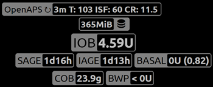

# Nightscout

(security-considerations)=

## Consideraciones de Seguridad

Besides reporting Nightscout can also be used to control AAPS. I.e. you can set temp targets or add future carbs. This information will be picked up by AAPS and it will act correspondingly. Therefore it is worth thinking about securing your Nightscout website.

### Ajustes de Nightscout

You can deny public access to your Nightscout site by using [authentication roles](https://nightscout.github.io/nightscout/security).

### Ajustes en AndroidAPS

There is an NS upload only (no sync) function in AAPS settings. By doing so AAPS will not pick up changes done in Nightscout such as temp targets or future carbs.

* Toca el menú de 3 puntos en la esquina superior derecha en la pantalla de inicio de AAPS.
* Seleccione "preferencias".
* Desplácese hacia abajo y toque "Configuración avanzada".
* Activar "sólo carga de NS

### Ajustes de seguridad adicionales

Keep your phone up to date as described in [safety first](../Getting-Started/Safety-first.md).

(manual-nightscout-setup)=

## Configuración manual de Nightscout

It is assumed you already have a Nightscout site, if not visit the [Nightscout](http://nightscout.github.io/nightscout/new_user/) page for full instructions on set up, the instructions below are then settings you will also need to add to your Nightscout site. Your Nightscout site needs to be at least version 10 (displayed as 0.10...), so please check you are running the [latest version](https://nightscout.github.io/update/update/#updating-your-site-to-the-latest-version) otherwise you will get an error message on your AAPS app. Some people find looping uses more than the azure free quota allowed, so heroku is the preferred choice.

* Ve a https://herokuapp.com/

* Pincha en App Service name

* Pincha en Application settings (azure) or Settings(ajustes) > "Reveal Config Variables (heroku)

* Añade o edita las variables siguientes:
  
  * ENABLE = careportal boluscalc food bwp cage sage iage iob cob basal ar2 rawbg pushover bgi pump openaps
  * DEVICESTATUS_ADVANCED = true
  * `SHOW_FORECAST` = `openaps`
  * `PUMP_FIELDS` = `reservoir battery clock`
  * Various alarms can be set for [monitoring the pump](https://github.com/nightscout/cgm-remote-monitor#pump-pump-monitoring), battery % in particular is encouraged: 
    * `PUMP_WARN_BATT_P` = `51`
    * `PUMP_URGENT_BATT_P` = `26` 

* Pinchar en guardar arriba en el panel.

## Configuración de Nightscout semi automatizada

Fellow looper Martin Schiftan offered a semi-automated Nightscout setup for many years free of charge. As number of users increased so did cost and therefore he had to start asking a small fee starting October 2021 - starting at €4,17 per month.

**Benefits**

* Puede instalar Nightscout con un par de clics y usarlo directamente. 
* Reducción del trabajo manual mientras Martin trata de automatizar la administración.
* Todos los ajustes se pueden realizar a través de una interfaz web fácil de usar. 
* El servicio incluye una verificación automática de la tasa basal usando Autotune. 
* The servers are located in Germany and Finland.

<https://ns.10be.de/en/index.html>

An alternative would be <https://t1pal.com/> - starting at $11,99 per month.