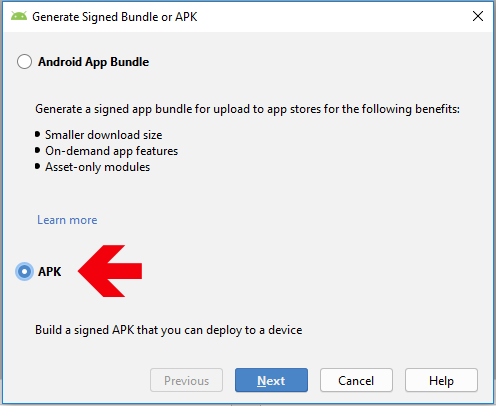
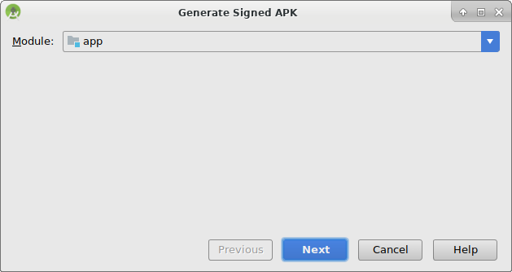
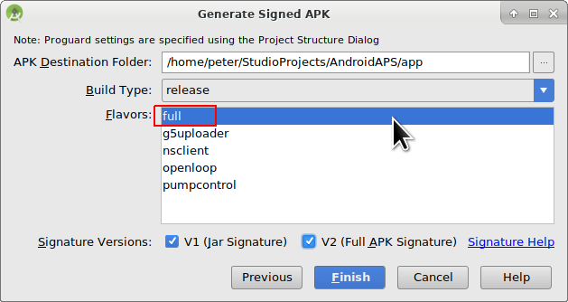
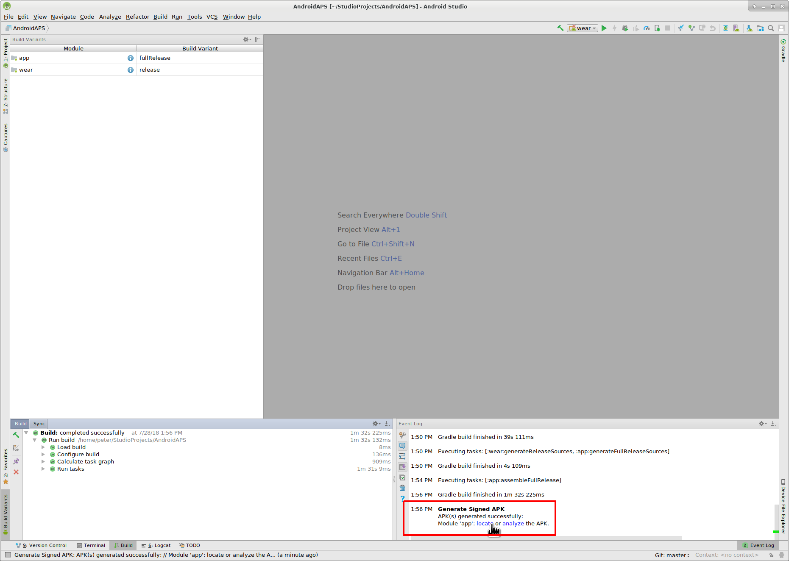

# Actualizar a una nueva versión o rama

## Construyela tú mismo en lugar de descargarla

**AndroidAPS no está disponible como descarga debido a la regulación de los dispositivos mediales. ¡Es legal construir la aplicación para su propio uso, pero no debe dar una copia a los demás! Consulte la página [FAQ](../Getting-Started/FAQ.md) para obtener detalles.**

## Notas importantes

* Please update as soon as possible after a new release is available. You will receive an [information on the AndroidAPS home screen](../Installing-AndroidAPS/Releasenotes.html#release-notes) about the new version.
* As of version 2.3 you have to use git to update. Updating via zip file does not work anymore.
* Please use [Android Studio Version 3.5.1](https://developer.android.com/studio/) or newer to build the apk.
* [Windows 10 sistemas de 32 bits](../Installing-AndroidAPS/troubleshooting_androidstudio#unable-to-start-daemon-process) no son compatibles con Android Studio 3.5.1.
* If you are using xDrip make sure to [identify the receiver](../Configuration/xdrip#identify-receiver).
* If you are using Dexcom G6 with the [patched Dexcom app](../Hardware/DexcomG6#if-using-g6-with-patched-dexcom-app) you will need the version from the [2.4 folder](https://github.com/dexcomapp/dexcomapp/tree/master/2.4).

## Rápido acceso a los usuarios experimentados

Por favor, salte este párrafo si actualiza por primera vez. El acceso rápido es para usuarios experimentados. El siguiente paso sería [instalar git](../Installing-AndroidAPS/git-install.rst) si no lo tiene ya.

Si ya ha actualizado AAPS en las versiones anteriores y utiliza un PC Windows, puede actualizar en cuatro simples pasos:

1. [Exporte los valores](../Usage/ExportImportSettings#how-to-export-settings) de la versión de AAPS existente en el teléfono para que estén en el lugar de respaldo
2. [Update local copy](../Installing-AndroidAPS/Update-to-new-version#update-your-local-copy) (VCS->Git->Pull)
3. [Genera APK firmado](../Installing-AndroidAPS/Update-to-new-version#generate-signed-apk) (¡selecciona 'app' en vez de 'reloj' en tu camino!)
4. Dependiendo de su [BG source](../Configuration/BG-Source.rst), asegúrese de que [identifique el receptor](../Configuration/xdrip#identify-receiver) en xDrip o utilice la aplicación Dexcom parchada de la carpeta [carpeta 2.4](https://github.com/dexcomapp/dexcomapp/tree/master/2.4).

## Instalar git (si no lo tienes ya)

Siga el manual en [git página de instalación](../Installing-AndroidAPS/git-install.rst).

## Actualice su copia local

* Pulse: VCS-> Git-> Pull
  
  

* Pulse en Pull (sin cambios en el campo de diálogo)
  
  

## Generar APK firmado

<!--- Text is maintained in page building-apk.md ---> En el menú, seleccione "Build" y, a continuación, "Generate Firmado Bundle/APK...". (El menú de Android Studio cambió a partir de septiembre de 2018. En las versiones anteriores, seleccione en el menú "Build" y luego "Generar APK Firmado...".)

La firma significa que usted firma su aplicación generada, pero en una forma digital como una especie de huella digital digital en la aplicación en sí. Esto es necesario porque Android tiene una regla que sólo acepta el código firmado para ejecutarse por razones de seguridad. Para obtener más información acerca de este tema, siga el enlace [aquí](https://developer.android.com/studio/publish/app-signing.html#generate-key) Seguridad es un tema profundo y complejo y no lo necesita ahora.

En el recuadro de diálogo siguiente, seleccione "APK" en lugar de "Android App Bundle" y haga clic en el botón "Next".

Seleccione "app" y haga clic en "Siguiente".

Introduzca la ruta del almacen de claves, introduzca la contraseña de la tienda de claves, seleccione alias de la clave e introduzca la contraseña de la clave.

Selecciona "Recordar contraseñas'.

Luego haga clic en "Siguiente.

Seleccione "full" (o "fullRelease") como sabor para la aplicación generada. Select V1 "Jar Signature" (V2 es opcional) y haga clic en "Finish". La siguiente información puede ser importante para su uso posterior.

* La opción 'Release' debe ser la opción predeterminada para "Tipo de compilación", "Depurar" es sólo para la codificación de personas.
* Seleccione el tipo de construcción que quiere realizar. 
  * full / fullRelease (es decir, recomendaciones promulgadas automáticamente en un lazo cerrado)
  * openloop (es decir, recomendaciones entregada al usuario para la acción manual)
  * pumpcontrol (es decir, control remoto para la bomba, sin lazo)
  * nsclient (es decir, se visualizan los datos de bucle de otro usuario y se pueden añadir entradas del portal profesional careportal)

En el registro de sucesos, verá que el APK firmado se ha generado satisfactoriamente.

Pulse el enlace "locate" en el registro de sucesos.

## Transferir APK a smartphone

**[Exporte los valores](../Usage/ExportImportSettings#how-to-export-settings) de la versión de AAPS existente en el teléfono para que estén en el lugar de respaldo.**

<!--- Text is maintained in page building-apk.md ---> Se abrirá una ventana del gestor de archivos. Puede parecer un poco diferente en su sistema, ya que estoy usando Linux. En Windows estará el Explorador de archivos y en Mac OS X the Finder. Allí debe ver el directorio con el archivo APK generado. Desafortunadamente este es el lugar incorrecto porque "wear-release.apk" no es la APK firmada que estamos buscando.

Por favor, cambie al directorio AndroidAPS/app/full/release para encontrar el archivo "app-full-release.apk". Transfiera este archivo a tu smartphone Android. Puede hacerlo de la forma que prefiera, por ejemplo:

* Bluetooth
* subido en la nube (Google Drive u otros servicios en la nube)
* conectar el ordenador y el teléfono por cable 
* por correo (Tenga en cuenta que algunas aplicaciones de correo no permiten adjuntos apk, en este caso utilizan otro método de transferencia.)

En este ejemplo, Gmail se utiliza ya que es bastante simple. Para instalar la aplicación autofirmada, es necesario permitir que Android en el smartphone realice esta instalación incluso si este archivo se recibe a través de Gmail, lo que normalmente está prohibido. Si utiliza algo otro, continúe en consecuencia.

En los ajustes de tu smartphone hay un área "instalación de aplicaciones desconocida" donde tengo que darle a Gmail el derecho de instalar archivos APK que obtengo a través de Gmail.

Seleccione "Permitir de esta fuente". Después de la instalación, puede inhabilitarla de nuevo.

El último paso es presionar en el archivo APK que tengo a través de Gmail e instalar la aplicación. Si el APK no instala y tiene una versión más antigua de AndroidAPS en su teléfono que fue firmado con una clave distinta, entonces tendrá que desinstalar esto primero, recuerde exportar sus ajustes, si es así!

Sí, ya lo tienes y ahora puedes empezar con la configuración de AndroidAPS para tu uso (MCG, bomba de insulina), etc.

## Comprobar la versión de AAPS en el teléfono

Puede comprobar la versión de AAPS en su teléfono haciendo clic en el menú de tres puntos en la parte superior derecha y luego acerca.

## Solución de problemas

Consulte la página separada [para la resolución de problemas de Android Studio](../Installing-AndroidAPS/troubleshooting_androidstudio.rst).