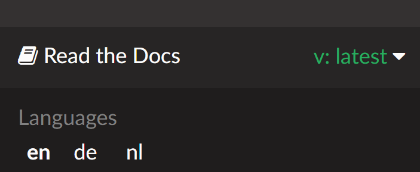

(Releasenotes-release-notes)=
# Notas de la versión

Please follow the instructions in the [update manual](UpdateToNewVersion). También puede encontrar una sección de resolución de problemas que se ocupa de las dificultades más comunes cuando se actualiza en la página de actualización manual.

Recibirá la siguiente información tan pronto como se disponga de una nueva actualización:


Entonces tienes 60 días para actualizar. If you do not update within these 60 days AAPS will fall back to LGS (low glucose suspend - see [glossary](../UsefulLinks/Glossary.md)) as in [objective 6](#objectives-objective6).

Si no se actualiza durante otros 30 días (90 días a partir de la fecha de la nueva versión), AAPS cambiará a Lazo Abierto.


Por favor, entienda que este cambio no tiene la intención de molestarlo, sino que se debe a razones de seguridad. Las nuevas versiones de AAPS no sólo proporcionan nuevas características, sino también importantes correcciones de seguridad. Por lo tanto, es necesario actualizar lo antes posible. Desafortunadamente, todavía hay informes de error de versiones muy antiguas, por lo que esto es un intento de mejorar la seguridad para cada usuario y toda la comunidad de DIY. Gracias por tu comprensión.

```{admonition} First version of AAPS
La primera versión de prueba comenzó en 2015. En 2016 se publicó la primera versión.

La cronología de estos lanzamientos no está disponible en este momento, pero como es una pregunta recurrente, lo documentamos aquí.

```


(maintenance-android-version-aaps-version)=

## Versión de Android y versión de AAPS

Si tu smartphone utiliza una versión de Android anterior a Android 9, no podrás utilizar AAPS v3 y posteriores, ya que requiere al menos Android 9.

Se han lanzado nuevas versiones de AAPS que sólo comprueban la versión de Android del teléfono, para permitir a los usuarios instalar versiones anteriores de AAPS en teléfonos con versiones de Android inferiores a Android 9. No se incluyen otras mejoras.

### Android 11 and up

- Usa la última versión de AAPS
- Descargar el código fuente de AAPS desde <https://github.com/nightscout/AndroidAPS>

### Android 9,10

- Use AAPS version **3.2.0.4**
- Download AAPS Code from <https://github.com/nightscout/AndroidAPS> branch 3.2.0.4

### Android 8

- Usa la versión de AAPS **2.8.2.1**
- Descargar el código de AAPS desde <https://github.com/nightscout/AndroidAPS> branch 2.8.2.1

### Android 7

- Usa la versión de AAPS **2.6.2**
- Descargar el código de AAPS desde <https://github.com/nightscout/AndroidAPS> branch 2.6.2

## Versión de WearOS

- AAPS requires at least WearOS API level 28 (Android 9)

```{tip}
WearOS 5, API level 34 (Android 14) has [limitations](#BuildingAapsWearOs-WearOS5).
```

(version3300)=
## Version 3.3.0.0

Version 3.3 is close ! Use the version switcher at the bottom right of your screen to see what's new.



(version3200)=
## Version 3.2.0.0 dedicada a @Philoul

Fecha de lanzamiento: 23-10-2023

### Notas importantes

- NS 15 es necesario
- Al utilizar websockets en el plugin NS v3,  los tratamientos introducidos a través de NS UI (botón más) y otras aplicaciones que utilizan la API v1, no se envían a AAPS. Esto se solucionará en futuras versiones de NS. Utiliza siempre el mismo cliente (v1 o v3) en AAPS y AAPSClient hasta que NS cambie completamente a v3 internamente. Lo mismo es válido para AAPS y el propio AAPSClient.
- Websockets en el plugin v3 funciona de forma similar al plugin v1. Sin websockets habilitados, AAPS programa regularmente descargas desde NS, lo que debería reducir el consumo de batería, porque NS no está permanentemente conectado. En el lado opuesto, supone retrasos en el intercambio de datos. Please read [here](#Important-comments-on-using-v3-versus-v1-API-for-Nightscout-with-AAPS) the important comments from the dev team before you use it!
- Si está utilizando xDrip+ como fuente de datos de glucosa, debes seleccionarlo de nuevo después de la actualización, debido a cambios internos.
- Tidepool puede utilizarse como sustituto de NS para superar el primer objetivo.
- Si envías datos a xDrip+, debes configurar el plugin de sincronización de xDrip+. In order to receive BGs from AAPS in xDrip, “xDrip+ Sync Follower” must be selected as source
- Si quieres cambiar al controlador ComboV2, Ruffy debe ser desinstalado y la bomba emparejado de nuevo a AAPS
- Para utilizar el complemento ISFDinámico, debes iniciar el Objetivo 11 (todos los anteriores deben estar en estado terminado para permitir el inicio del  objetivo 11)


### Cambios

- Controlador de bomba EOPatch2 / Glucomen Day Pump @jungsomyeonggithub @MilosKozak
- Controlador de bomba Accu-Chek Combo V2 (sin necesidad de Ruffy) @dv1
- Controlador de bomba Medtrum Nano @jbr7rr
- Controlador de bomba Korean DanaI @MilosKozak
- Soporte al MCG Glunovo @christinadamianou
- Soporte a Dexcom G7 @MilosKozak @rICTx-T1D @khskekec
- Plugin NSClient v3 @MilosKozak
- Soporte para Tidepool @MilosKozak
- Pulgin de suavizado @MilosKozak, @justmara, Suavizado Exponencial @nichi (Tsunami), Suavizado Promedio @jbr7rr
- Algoritmo ISF Dinámico @Chris Wilson, @tim2000s
- Integración Relojes Garmin & Soporte de ritmo cardiaco @buessow
- Nuevo logo @thiagomsoares
- Nuevas esferas @Philoul
- Corregidos muchos problemas de la versión 3.1
- Permitir añadir notas desde más lugares @Sergey Zorchenko
- Correcciones de la interfaz gráfica @MilosKozak @osodebailar @Andries-Smit @yodax @Philoul @dv1 @paravoid
- Nuevos comandos SMS para Lazo LGS/Cerrado @pzadroga
- Traducciones Wear @Andries-Smit
- Traslado de comunicaciones con xDrip+ a un módulo independiente @MilosKozak
- Cambios internos: actualización de versiones de librerías, migración a rx3, nueva estructura de módulos @MilosKozak
- Correcciones en el controlador de Diaconn @miyeongkim
- Más opciones de mantenimiento de la base de datos @MilosKozak
- AAPSClient proporciona información si el teléfono principal está conectado a la electricidad @MilosKozak
- Cambio en asistente de bolo. Si el MCG no está disponible, se ignora el porcentaje (es decir, se utiliza el 100%)
- Migración al sistema de compilación KTS @MilosKozak
- Mejora en la integración de CI @MilosKozak y @buessow
- Limpieza de pruebas @ryanhaining @MilosKozak
- 110k+ nuevas líneas de código, 240k líneas modificadas, 6884 archivos modificados

(Important-comments-on-using-v3-versus-v1-API-for-Nightscout-with-AAPS)=
### Important comments on using v3 versus v1 API for Nightscout with AAPS

v1 is the old protocol used for exchanging data between NS web site and NS server. It has many limitations
- v1 sends only 2 days of data
- v1 send all 2 days data on every reconnection
- using websockets is mandatory = permanent connection, more battery compsumption
- during frequent disconnects to NS connection is paused for 15 minutes to prevent high data usage

v3 is new protocol. More safe and efficient
- while using tokens you can better define access rights
- protocol is more efficient on both sides (AAPS & NS)
- It can read up to 3 months of data from NS
- you can choose to use or to not use websockets on every device (using means faster updates, not using means lower power compsumption, but slower updates ie. minutes)
- NSClient is not paused on disconnections

LIMITATIONS
- NS 15 must be used with AAPS 3.2
- v3 doesn't see updates done by v1 protocol (probably it will be resolved in some future version of NS)
- in opposite because of old uneffective method of tracking changes v1 see changes done by v3
- remember NS still uses v1 internaly so far thus is not possible to enter data through NS web UI if you are using v3. You must use AAPSClient on SMS if you want enter data remotely

RECOMMENDED SETTING
- because of all above you should choose only one method and use it on all devices (remember all other uploaders at time of writing this are using v1). If you decide to go to v3, select v3 in AAPS and all AAPSClients
- v3 is preffered because of efficiency
- using websockets or not using with v3 depends on your preference
- it HIGHLY recommended to let AAPS gather all data and then upload it to NS as a single uploader. All other devices/applications should only read from NS. By doing it you'll prevent conflicts and sync errors. This is valid for getting BG data to NS using Dexcom Share connector etc. too

## Versión 3.1.0

Fecha de lanzamiento: 19-07-2022

(Releasenotes-important-hints-3-1-0)=
### Notas importantes

- Después de actualizar, desinstalar la aplicación Wear del reloj e instalar la nueva versión (no se puede actualizar directamente)
- Usuarios de Omnipod: Actualizar cuando toque cambio del POD !!!

### Cambios

- Corrección de errores de la versión 3.0
- Corrección de congelación de la aplicación @MilosKozak
- Correcciones de los controladores de las bombas DASH @avereha
- Corrección de controladores de las bombas Dana @MilosKozak
- Importantes mejoras de la interfaz gráfica (UI), limpieza y unificación. Migración a "Material Design", estilos, tema claro, nuevos iconos, etc. @Andries-Smit @MilosKozak @osodebailar @Philoul
- Añadido Widget @MilosKozak
- Soporte para Aidex CGM @andyrozman @markvader (sólo Pumpcontrol)
- Watch [Wear OS tiles](#WearOsSmartwatch-wear-os-tiles), translations @Andries-Smit
- Código de Wear refactorizado. Not backward compatible anymore @MilosKozak
- Mejoras de accesibilidad por @Andries-Smit
- Nueva opción de protección PIN @Andries-Smit
- Permite cambiar la escala gráfica desde el menú @MilosKozak
- Más estadísticas disponibles @MilosKozak
- Complemento MDI eliminado en favor de la Bomba Virtual
- Nueva acción de automatización: Detener procesamiento (siguiendo reglas)

## Versión 3.0.0

Fecha de lanzamiento: 31-01-2022

(Releasenotes-important-hints-3-0-0)=
### Notas importantes

- **Ahora, la versión mínima requerida de Android es la 9.0**
- **Data is not migrated to new database.** Do not complain, it's so huge change so it's simply not possible. Debido a esto, después de aplicar la actualización, el IOB, los COB, los tratamientos, etc. serán elimiandos. You have to create new [profile switch](../DailyLifeWithAaps/ProfileSwitch-ProfilePercentage.md) and start with zero IOB and COB. Planifica la actualización con cuidado. La mejor situación para realizar la actualización es cuando no tengamos insulina activa ni carbohidratos.
- Use the same version of AAPS and NSClient

**Make sure to check and adjust settings after updating to 3.0 as described** [here](../Maintenance/Update3_0.md).

### Pasos de preparación

**At least two days before update:**

- disable Dexcom bridge in Nightscout
- if you are using G5/G6 and xDrip as a collector, you have to update xDrip to a nightly version newer than 14th January 2022
- if you are using G5/G6 switching to BYODA as collector is recommended to take advantage of back-smoothing (you can still use xDrip for other purposes, xDrip can receive data from BYODA)

### Cambios

- 100k lines changed, 105k new lines of code

- [Omnipod DASH support](../CompatiblePumps/OmnipodDASH.md) @AdrianLxM @avereha @bartsopers @vanelsberg

- [Dana-i support](../CompatiblePumps/DanaRS-Insulin-Pump.md) @MilosKozak

- [DiaconnG8 support](../CompatiblePumps/DiaconnG8.md)

- Glunovo support

- Internal database upgraded to Room @MilosKozak @Tebbe @AdrianLxm @Philoul @andyrozman

- Lot of code rewritten to Kotlin @MilosKozak

- New internal interface for pump drivers

- NSClient rewritten for better synchronization and more detailed customization @MilosKozak

  - Record deletion from NS is not allowed (only invalidation through NSClient)
  - Record modification from NS is not allowed
  - Sync setting available without engineering mode (for parents)
  - Ability to resync data

- Profile switch behavior change. Now is distinguished between Profile Switch *(something that user wants)* and Profile change *(when change is executed by pump)* @MilosKozak @Tebbe

- You can start activity temporary target during creation of profile switch @MilosKozak

- NSProfile is gone, just local profile can be used. Local profile can be [synced to NS](#Update3_0-nightscout-profile-cannot-be-pushed). @MilosKozak.

- Forgotten [master password reset procedure](#Update3_0-reset-master-password) @MilosKozak

- User actions tracing @Philoul

- New automation TempTargetValue trigger @Philoul

- New automation Careportal action @Philoul

- Add Bolus reminder in Carbs Dialog @Philoul

- Bolus Wizard improvement

- UI improvements @MilosKozak

- New user buttons for automations @MilosKozak

- New automation layout @MilosKozak

- History browser updated and fixed @MilosKozak

- Objective9 removed @MilosKozak

- Fixed bug associated to unstable CGM data @MilosKozak

- DanaR and DanaRS communication improvement @MilosKozak

- CircleCI integration @MilosKozak

- Files location change:

  - /AAPS/extra (engineering mode)
  - /AAPS/logs /AAPS/exports
  - /AAPS/preferences

## Versión 2.8.2

Fecha de lanzamiento: 23-01-2021

- Please see also [important hints for version 2.8.1.1](#version-2811) below.

### Cambios

- stability improvements
- more tweaking for Android 8+
- improved icons
- watch improvements
- NSClient fixes
- Bolus advisor now works with Pumpcontrol and NSClient

## Versión 2.8.1.1

Fecha de lanzamiento: 12-01-2021

(important-hints-2-8-1-1)=
### Notas importantes

- Option **NS_UPLOAD_ONLY** has been forced ON for all 2.8.1 users.
- If you use NSClient to enter TT, carbs or profile switches you must turn it off in AAPS but **only in case your synchronization is working well** (ie. you don't see unwanted data changes like self modification of TT, TBR etc).
- ATTENTION: DO NOT do this if you have any other app handle treatments ( like xDrip broadcast/upload/sync...).
- NS_UPLOAD_ONLY can only be turned off if engineering mode is enabled.

### Cambios principales

- RileyLink, Omnipod and MDT pump improvements and fixes
- forced NS_UPLOAD_ONLY
- fix for SMB & Dexcom app
- watchface fixes
- crash reporting improved
- gradle reverted to allow direct watchface instalation
- automation fixes
- RS driver improvement
- various crashes fixed
- UI fixes and improvements
- new translations

(Releasenotes-version-2-8-0)=
## Versión 2.8.0

Fecha de lanzamiento: 01-01-2021

### Notas importantes

- **Minimum Android version is 8.0 now.** For older Android versions you can still use 2.6.1.4 from old repo.
- [Objectives have changed.](#objectives-objective3) **Finish not completed objectives before update.**
- Repository location still on <https://github.com/nightscout/AndroidAPS> . If you are not familiar with git the easiest way for update is remove directory with AAPS and do a [new clone](../SettingUpAaps/BuildingAaps.md).
- Please use [Android Studio 4.1.1](https://developer.android.com/studio/) or newer to build the apk.

### Nuevas características importantes

- [Omnipod Eros support](../CompatiblePumps/OmnipodEros.md) @bartsopers @andyrozman @ktomy @samspycher @TeleRiddler @vanelsberg @eurenda and special thanks to @ps2 @itsmojo, everybody else involved in the Loop driver for Omnipod and @jlucasvt from GetRileyLink.org
- [bolus advisor](#Preferences-quick-wizard) & [eating reminder](#AapsScreens-section-j) @MilosKozak
- New watchface @rICTx-T1D
- Dana RS connection improvements @MilosKozak
- Removed "Unchanged CGM values" behavior in SMB for Dexcom native app
- New [Low Ressolution Skin](#Preferences-skin)
- New ["Pregnant" patient type](#Open-APS-features-overview-of-hard-coded-limits) @Brian Quinion
- New NSClient tablet layout @MilosKozak
- NSClient transfer insulin, senstivity and display settings directly from main AAPS @MilosKozak
- [Preferences filter](../SettingUpAaps/Preferences.md) @Brian Quinion
- New pump icons @Rig22 @@teleriddler @osodebailar
- New [insulin type Lyumjev](#Config-Builder-lyumjev)
- SetupWizard improvements @MilosKozak
- Security improvements @dlvoy
- Various improvements and fixes @AdrianLxM @Philoul @swissalpine  @MilosKozak @Brian Quinion

(Releasenotes-version-2-7-0)=
## Versión 2.7.0

Fecha de lanzamiento: 24-09-2020

**Make sure to check and adjust settings after updating to 2.7 as described** [here](../Maintenance/Update2_7.md).

You need at least start [objective 11 (in later versions objective 10!)](#objectives-objective10) in order to continue using [Automation feature](../DailyLifeWithAaps/Automations.md) (all previous objectives must be completed otherwise starting Objective 11 is not possible). If for example you did not finish the exam in [objective 3](#objectives-objective3) yet, you will have to complete the exam before you can start [objective 11](#objectives-objective11). This will not effect other objectives you have already finished. You will keep all finished objectives!

### Nuevas características importantes

- internal use of dependency injection, updates libraries, code rewritten to kotlin @MilosKozak @AdrianLxM
- using modules for Dana pumps @MilosKozak
- [new layout, layout selection](../DailyLifeWithAaps/AapsScreens.md) @MilosKozak
- new [status lights layout](#Preferences-status-lights) @MilosKozak
- [multiple graphs support](#AapsScreens-activate-optional-information) @MilosKozak
- [Profile helper](../SettingUpAaps/YourAapsProfile.md) @MilosKozak
- visualization of [dynamic target adjustment](#AapsScreens-visualization-of-dynamic-target-adjustment) @Tornado-Tim
- new [preferences layout](../SettingUpAaps/Preferences.md) @MilosKozak
- SMB algorithm update @Tornado-Tim
- [Low glucose suspend mode](#Preferences-aps-mode) @Tornado-Tim
- [carbs required notifications](#key-aaps-features-minimal-carbs-required-for-suggestion) @twain47 @Tornado-Tim
- removed Careportal (moved to Actions) @MilosKozak
- [new encrypted backup format](ExportImportSettings.md) @dlvoy
- [new SMS TOTP authentication](../RemoteFeatures/SMSCommands.md) @dlvoy
- [new SMS PUMP CONNECT, DISCONNECT](#SMSCommands-commands) commands @Lexsus
- better support for tiny basals on Dana pumps @Mackwe
- small Insight fixes @TebbeUbben @MilosKozak
- ["Default language" option](#Preferences-general) @MilosKozak
- vector icons @Philoul
- [set neutral temps for MDT pump](#MedtronicPump-configuration-of-the-pump) @Tornado-Tim
- History browser improvements @MilosKozak
- removed OpenAPS MA algorithm @Tornado-Tim
- removed Oref0 sensitivity @Tornado-Tim
- [Biometric or password protection](#Preferences-protection) for settings, bolus @MilosKozak
- [new automation trigger](../DailyLifeWithAaps/Automations.md) @PoweRGbg
- [Open Humans uploader](../SupportingAaps/OpenHumans.md) @TebbeUbben @AdrianLxM
- New documentation @Achim

(Releasenotes-version-2-6-1-4)=
## Versión 2.6.1.4

Fecha de lanzamiento: 04-05-2020

Please use [Android Studio 3.6.1](https://developer.android.com/studio/) or newer to build the apk.

### Nuevas características importantes

- Insight: Disable vibration on bolus for firmware version 3 - second attempt
- Otherwise is equal to 2.6.1.3. La actualización es opcional.

## Versión 2.6.1.3

Fecha de lanzamiento: 03-05-2020

Please use [Android Studio 3.6.1](https://developer.android.com/studio/) or newer to build the apk.

### Nuevas características importantes

- Insight: Disable vibration on bolus for firmware version 3
- Otherwise is equal to 2.6.1.2. La actualización es opcional.

## Versión 2.6.1.2

Fecha de lanzamiento: 19-04-2020

Please use [Android Studio 3.6.1](https://developer.android.com/studio/) or newer to build the apk.

### Nuevas características importantes

- Fix crashing in Insight service
- Otherwise is equal to 2.6.1.1. If you are not affected by this bug you don't need to upgrade.

## Versión 2.6.1.1

Fecha de lanzamiento: 06-04-2020

Please use [Android Studio 3.6.1](https://developer.android.com/studio/) or newer to build the apk.

### Nuevas características importantes

- Resolves SMS CARBS command issue while using Combo pump
- Otherwise is equal to 2.6.1. If you are not affected by this bug you don't need to upgrade.

## Versión 2.6.1

Fecha de lanzamiento: 21-03-2020

Please use [Android Studio 3.6.1](https://developer.android.com/studio/) or newer to build the apk.

### Nuevas características importantes

- Allow to enter only `https://` in NSClient settings
- Fixed [BGI](../UsefulLinks/Glossary.md) displaying bug on watches
- Fixed small UI bugs
- Fixed Insight crashes
- Fixed future carbs with Combo pump
- Fixed LocalProfile -> NS sync
- Insight alerts improvements
- Improved detection of boluses from pump history
- Fixed NSClient connection settings (wifi, charging)
- Fixed sending of calibrations to xDrip

(Releasenotes-version-2-6-0)=
## Versión 2.6.0

Fecha de lanzamiento: 29-02-2020

Please use [Android Studio 3.6.1](https://developer.android.com/studio/) or newer to build the apk.

### Nuevas características importantes

- Small design changes (startpage...)

- Careportal tab / menu removed

- New Local Profile plugin

  - Local profile can hold more than 1 profile
  - Profiles can be cloned and edited
  - Ability of upload profiles to NS
  - Old profile switches can be cloned to new profile in LocalProfile (timeshift and percentage is applied)
  - Veritical NumberPicker for targets

- SimpleProfile is removed

- [Extended bolus](#Extended-Carbs-extended-bolus-and-switch-to-open-loop-dana-and-insight-pump-only) feature - closed loop will be disabled

- MDT plugin: Fixed bug with duplicated entries

- Units are not specified in profile but it's global setting

- Added new settings to startup wizard

- Different UI and internal improvements

- [Wear complications](../WearOS/WearOsSmartwatch.md)

- New [SMS commands](../RemoteFeatures/SMSCommands.md) BOLUS-MEAL, SMS, CARBS, TARGET, HELP

- Fixed language support

- Objectives: [Allow to go back](#CompletingTheObjectives-go-back-in-objectives), Time fetching dialog

- Automation: [allow sorting](#Automations-the-order-of-the-automations-in-the-list-matters)

- Automation: fixed bug when automation was running with disabled loop

- New status line for Combo

- GlucoseStatus improvement

- Fixed TempTarget NS sync

- New statistics activity

- Allow Extended bolus in open loop mode

- Android 10 alarm support

- Tons on new translations

## Versión 2.5.1

Fecha de lanzamiento: 31-10-2019

Please note the [important notes](#Releasenotes-version-2-5-0) and [limitations](#Releasenotes-is-this-update-for-me-currently-is-not-supported) listed for [version 2.5.0](#Releasenotes-version-2-5-0). \* Fixed a bug in the network state receiver that lead to crashes with many (not critical but would waste a lot of energy re-calculating things). \* New versioning that will allow to do minor updates without triggering the update-notification.

(Releasenotes-version-2-5-0)=
## Versión 2.5.0

Fecha de lanzamiento: 26-10-2019

(Releasenotes-important-notes-2-5-0)=

### Notas importantes

- Please use [Android Studio Version 3.5.1](https://developer.android.com/studio/) or newer to [build the apk](../SettingUpAaps/BuildingAaps.md) or [update](UpdateToNewVersion).
- If you are using xDrip [identify receiver](#xdrip-identify-receiver) must be set.
- If you are using Dexcom G6 with the patched Dexcom app you will need the version from the [2.4 folder](https://github.com/dexcomapp/dexcomapp/tree/master/2.4).
- Glimp is supported from version 4.15.57 and newer.

(Releasenotes-is-this-update-for-me-currently-is-not-supported)=
### ¿Es esta actualización para mí? Actualmente NO es soportado

- Android 5 and lower
- Poctech
- 600SeriesUploader
- Patched Dexcom from 2.3 directory

### Nuevas características importantes

- Internal change of targetSDK to 28 (Android 9), jetpack support
- RxJava2, Okhttp3, Retrofit support
- Old [Medtronic pumps](../CompatiblePumps/MedtronicPump.md) support (RileyLink need)
- New [Automation plugin](../DailyLifeWithAaps/Automations.md)
- Allow to [bolus only part](#Preferences-advanced-settings-overview) from bolus wizard calculation
- Rendering insulin activity
- Adjusting IOB predictions by autosens result
- New support for patched Dexcom apks ([2.4 folder](https://github.com/dexcomapp/dexcomapp/tree/master/2.4))
- Signature verifier
- Allow to bypass objectives for OpenAPS users
- New [objectives](../SettingUpAaps/CompletingTheObjectives.md) - exam, application handling (If you started at least objective "Starting on an open loop" in previous versions exam is optional.)
- Fixed bug in Dana\* drivers where false time difference was reported
- Fixed bug in [SMS communicator](../RemoteFeatures/SMSCommands.md)

## Versión 2.3

Fecha de lanzamiento: 25-04-2019

### Nuevas características importantes

- Important safety fix for Insight (really important if you use Insight!)
- Fix History-Browser
- Fix delta calculations
- Language updates
- Check for GIT and warn on gradle upgrade
- More automatic testing
- Fixing potential crash in AlarmSound Service (thanks @lee-b !)
- Fix broadcast of BG data (works independently of SMS permission now!)
- New Version-Checker

## Versión 2.2.2

Fecha de lanzamiento: 07-04-2019

### Nuevas características importantes

- Autosens fix: deactivate TT raises/lowers target
- New translations
- Insight driver fixes
- SMS plugin fix

## Versión 2.2

Fecha de lanzamiento: 29-03-2019

### Nuevas características importantes

- [DST fix](#time-adjustment-daylight-savings-time-dst)
- Wear Update
- [SMS plugin](../RemoteFeatures/SMSCommands.md) update
- Go back in objectives.
- Stop loop if phone disk is full

## Versión 2.1

Fecha de lanzamiento: 03-03-2019

### Nuevas características importantes

- [Accu-Chek Insight](../CompatiblePumps/Accu-Chek-Insight-Pump.md) support (by Tebbe Ubben and JamOrHam)
- Status lights on main screen (Nico Schmitz)
- Daylight saving time helper (Roumen Georgiev)
- Fix processing profile names comming from NS (Johannes Mockenhaupt)
- Fix UI blocking (Johannes Mockenhaupt)
- Support for updated G5 app (Tebbe Ubben and Milos Kozak)
- G6, Poctech, Tomato, Eversense BG source support (Tebbe Ubben and Milos Kozak)
- Fixed disabling SMB from preferences (Johannes Mockenhaupt)

### Misc

- If you are using non default `smbmaxminutes` value you have to setup this value again

## Versión 2.0

Fecha de lanzamiento: 03-11-2018

### Nuevas características importantes

- oref1/SMB support ([oref1 documentation](https://openaps.readthedocs.io/en/latest/docs/Customize-Iterate/oref1.html)) Be sure to read the documentation to know what to expect of SMB, how it will behave, what it can achieve and how to use it so it can operate smoothly.
- [\_Accu-Chek Combo](../CompatiblePumps/Accu-Chek-Combo-Pump.md) pump support
- Setup wizard: guides you through the process of setting up AAPS

(Releasenotes-settings-to-adjust-when-switching-from-ama-to-smb)=
### Valores para ajustar cuando se cambia de AMA a SMB

- Objective 10 must be started for SMBs to be enabled (SMB tab generally shows what restrictions apply)

- maxIOB now includes \_all\_ IOB, not just added basal. Es decir, si se le da un bolo de 8 U para una comida y maxIOB es 7 U, no se entregarán SMB hasta que el IOB caiga por debajo de 7 U.

- min_5m_carbimpact default has changed from 3 to 8 going from AMA to SMB. If you are upgrading from AMA to SMB, you have to change it manually

- Note when building AAPS 2.0 apk: Configuration on demand is not supported by the current version of the Android Gradle plugin! Si la compilación falla con un error en la configuración personalizada, puede realizar lo siguiente:

  - Open the Preferences window by clicking File > Settings (on Mac, Android Studio > Preferences).
  - In the left pane, click Build, Execution, Deployment > Compiler.
  - Uncheck the Configure on demand checkbox.
  - Click Apply or OK.

(Releasenotes-overview-tab)=
### Pestaña general

- Top ribbon gives access to suspend/disable loop, view/adjust profile and to start/stop temporary targets (TTs). Los TTs utilizan los valores predeterminados establecidos en las preferencias. La nueva opción de Hypo TT es una temporal alta TT para evitar que el lazo haga una sobrecorrección muy agresiva en el rescate de carbohidratos.
- Treatment buttons: old treatment button still available, but hidden by default. Ahora la visibilidad de los botones se puede configurar. New insulin button, new carbs button (including [eCarbs/extended carbs](../DailyLifeWithAaps/ExtendedCarbs.md))
- [Colored prediction lines](#aaps-screens-prediction-lines)
- Option to show a notes field in insulin/carbs/calculator/prime+fill dialogs, which are uploaded to NS
- Updated prime/fill dialog allows priming and creating careportal entries for site change and cartridge change

### Reloj

- Separate build variant dropped, included in regular full build now. Para utilizar los controles de bolo desde el reloj, habilite este valor en el teléfono
- Wizard now only asks for carbs (and percentage if enabled in watch settings). Los parámetros que se incluyen en el cálculo se pueden configurar en la configuración del teléfono
- confirmations and info dialogs now work on wear 2.0 as well
- Added eCarbs menu entry

### Nuevos plugins

- PocTech app as BG source
- Dexcom patched app as BG source
- oref1 sensitivity plugin

### Misc

- App now uses drawer to show all plugins; plugins selected as visible in config builder are shown as tabs on top (favourites)
- Overhaul for config builder and objectives tabs, adding descriptions
- New app icon
- Lots of improvements and bugfixes
- Nightscout-independent alerts if pump is unreachable for a longer time (e.g. depleted pump battery) and missed BG readings (see *Local alerts* in settings)
- Option to keep screen on
- Option to show notification as Android notification
- Advanced filtering (allowing to always enable SMB and 6h after meals) supported with patched Dexcom app or xDrip with G5 native mode as BG source.
