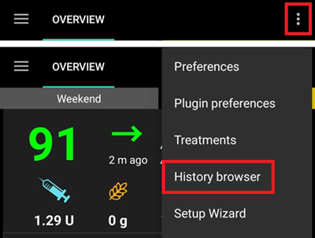
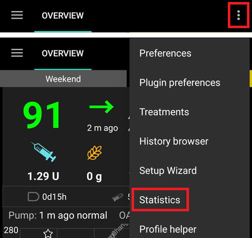

# **Reviewing your data**

## **AAPS History Browser**

**AAPS** stores all the user’s history (__**BG****, treatments, basal, targets, **Profile Switch**,…) in its own database, that cannot be exported or copied and might require clean up after a while. In order to clean up, a review of 'older history’ is required in **AAPS**. This can be done by uploading to Nightscout.

**AAPS** history can be reviewed using the ‘History’ browser, from the Overview menu.

Select the date you want to review.

Display options are available like in the Overview main graph.

The ‘history browser’ menu allows the selection of the time periods to be displayed in the following intervals: 6, 12, 18 or 24 hours.

The ‘history browser’ can be shifted forward and backwards by selecting the arrows display as per the desired time intervals (as indicated below).

To return to real time select this button:

(reviewing-statistics)=
## **AAPS Statistics**

**AAPS** provides basic monitoring statistics.

Most values are referenced by ADA 2023 [recommendations](https://diabetesjournals.org/care/article/46/Supplement_1/S97/148053/6-Glycemic-Targets-Standards-of-Care-in-Diabetes).

### Total Daily Dose

**TDD** displays one week information on:

- Σ: the Total Daily Dose of insulin (**TDD**), the sum of bolus and basal insulin delivered during the day.
- Bolus: the sum of bolus treatments and SMBs.
- Basal: only basal.
- Basal%: the proportion of basal insulin in the sum (**TDD**).
- Carbs: declared carbs and eCarbs treatments.

TDD section is calculated on the go when you display the page, and takes a few seconds to compute.

### Time in Range

Time In Range (**TIR**): 70-180 mg/dl or 3.9-10 mmol/l.

**TIR** information is available for 7 and 30 days, depending on the amount of data available within the **AAPS** database.

Time In Tight Range (TITR) 70-140 mg/dl or 3.9-7.8 mmol/l statistics are available below.

**Discuss targets with your endo**

Your diabetes may vary. Any suggested targets should be discussed with your endocrinologist or supporting medical team. If used correctly, AAPS’ statistics can be an effective tool to follow __BG__ trends and monitor progress .

Detailed 14 days **TIR** statistics.

**SD**: Standard Deviation, an [indicator](https://www.ncbi.nlm.nih.gov/pmc/articles/PMC3125941/) of BG variability (the highest = the worst).

HbA1c: the estimate of the resulting glycated hemoglobin, based on the average of CGM measurements. This is an indicative value that might not match blood HbA1c tests.

### Activity monitor

Activity monitor captures the time spent on each **AAPS** activity.

------

## **What is the difference between Nightscout vs Tidepool?**

Nightscout can facilitate the user’s storage of **AAPS’** data and offers a wide range of [reporting tools](https://nightscout.github.io/nightscout/reports/).

Whereas, Tidepool allows the user to [review their data](https://www.tidepool.org/viewing-your-data) and provides [simple sharing with your endo team](https://www.tidepool.org/providers/how-it-works#tidepool-data-platform).