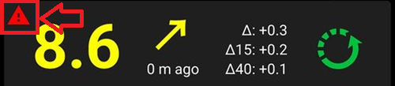

# Comprobaciones necesarias después de actualizar a AndroidAPS 3.0

* **Ahora, la versión mínima requerida de Android es la 9.0**
* **Los datos no son migrados a la nueva base de datos**

  No te quejes. Es un cambio tan grande, que simplemente no es posible. Debido a esto, después de aplicar la actualización, el IOB, los COB, los tratamientos, etc. serán elimiandos. You have to create new [profile switch](../DailyLifeWithAaps/ProfileSwitch-ProfilePercentage.md) and start with zero IOB and COB.

  Planifica la actualización con cuidado. La mejor situación para realizar la actualización es cuando no tengamos insulina activa ni carbohidratos.

* Please see the [Release Notes](../Maintenance/ReleaseNotes.md) for details on new and changed features.

## Comprobar automatizaciones

* Se han añadido nuevas restricciones. Comprueba tus automatizaciones, especialmente si tus condiciones siguen siendo válidas.
* Si se ha perdido alguna de las condiciones, es necesario que la añadas de nuevo.
* Las automatizaciones que aparecen en rojo contienen acciones inválidas. Edítalas y establece valores válidos.

  Example: A profile change to 140% was allowed earlier but is now restricted to 130%.

## Revisa la configuración de NSClient y configura las complicaciones de sincronización

* The implementation of the nsclient plugin has changed completely.
* Dirígete a la pestaña NSClient y abre la configuración en el menú de la derecha. Una nueva preferencia "Sincronización" está ahora disponible.
* Ahora puedes realizar una selección detallada sobre qué elementos se sincronizarán con tu página de Nightscout.

(Update3_0-nightscout-profile-cannot-be-pushed)=
## El perfil de Nightscout no puede ser enviado
* El perfil de Nightscout ha sido eliminado, descanse en paz.
* Para copiar tu perfil actual de Nightscout a un perfil local, dirígete a la página de tratamientos (se abrirá en el menú de la derecha).
* Busca el selector de perfil con un 100% y pulsa sobre la opción clonar.
* Se añade un nuevo perfil local, válido desde la fecha actual.
* Para actualizar el perfil desde Nightscout usa la opción "Clonar" (registro, no perfil) y guarda los cambios. You should see "Profile valid from:" set to current date.

(Update3_0-reset-master-password)=
## Restablecer contraseña maestra
* Ahora es posible restablecer la contraseña maestra, en caso de que se nos haya olvidado.
* You need to add a file named `PasswordReset` to the `/AAPS/extra` directory on your phones filesystem.
* Reiniciar AAPS.
* La nueva contraseña será el número de serie de la bomba de insulina que esté activa.
* Para Dash: El número de serie siempre es 4241.
* Para Eros, aparece en la pestaña del Pod, como "Número de sequencia".

## Señal de advertencia debajo de la lectura de glucosa

Desde la versión de 3.0 de AndroidAPS, puede aparecer una señal de advertencia debajo de la lectura de glucosa de la pantalla principal.

  

  

For details see [AAPS screens page](#aaps-screens-bg-warning-sign)

(update30-failure-message-data-from-different-pump)=
## Mensaje de error: Los datos son de bombas diferentes

   

To resolve this issue go to [config builder](#Config-Builder-pump). Cambia a bomba virtual y después vuelve a seleccionar la casilla de tu bomba actual. Eso restablecerá el estado de la bomba.
