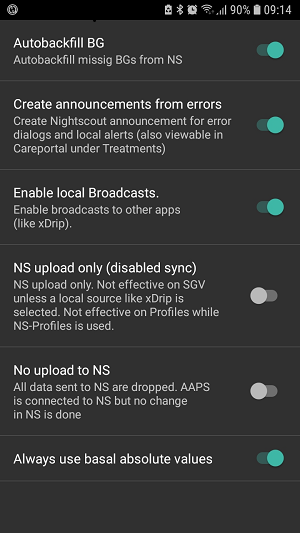
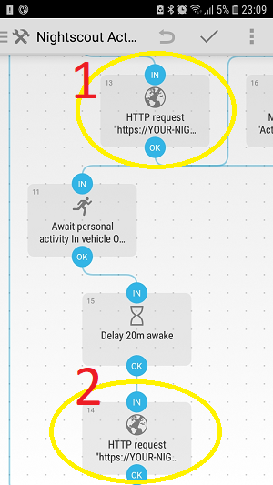
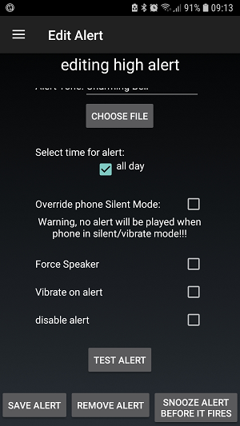

# Automatización con la aplicación Automate de Android de terceros

**This article has been written before AAPS version 2.5. There is an [automation plugin in AAPS](../DailyLifeWithAaps/Automations.md) itself with AAPS version 2.5. For some, this here might be still useful, but should only be used by advanced users.**

As AAPS is a hybrid closed loop system, some user interaction is necessary though (e.g. tell the loop that you are walking, eating soon, lying on the sofa...). Frequent manual user inputs can be automated via external tools like Automate or IFTTT to extend the recent AAPS functionality.

## Aplicación Automate de Android

La aplicación gratuita de Android™ Automate le permite automatizar varias tareas en el smartphone. Create your automations with flowcharts, make your device automatically change settings like Bluetooth, Wi-Fi, NFC or perform actions like sending SMS, e-mail, based on your location, the time of day, or any other “event trigger”. Puede automatizar casi todo lo que esté en su dispositivo, Automatizar incluso los plugins de soporte realizados para Tareas y Localización.

Usando esta herramienta puedes crear fácilmente flujos de trabajo para tratar tu diabetes en base a varias condiciones de acuerdo con el principio de 'si esto... y esto... no esto..., entonces hacer eso... y esto...'. Hay miles de posibilidades que puedes configurar.

Until now it is **necessary to loop via Nightscout Profile**, as Automate executes the commands via HTTP-request directly in your nightscout website that subsequently syncs it to your AAPS app.

**Offline looping (direct communication between Automate and AAPS app) is not supported yet**, but technologically possible. Tal vez haya una solución en el futuro. Si ha averiguado una forma de hacerlo, añádelo a esta documentación o póngase en contacto con un desarrollador.

### Requisitos básicos

#### Automate aplicación

Download Android Automate in Google Play Store or at <https://llamalab.com/automate/> and install it on your smartphone where AAPS runs.

In Automate, tap on hamburger menu on the upper left of the screen > Settings > Check 'Run on system startup'. De este modo se ejecutarán automáticamente los flujos de trabajo en el arranque del sistema.

#### AAPS

In AAPS, tap on 3 dots menu on the upper right screen and go to Preferences > NSClient > Connection settings > Uncheck 'Use WiFi connection only' and 'Only if charging' as the automated treating does only work when AAPS has an actual nightscout connection.

In AAPS, tap on 3 dots menu on the upper right screen and go to Preferences > NSClient > Advanced Settings > Uncheck 'NS upload only (disabled sync)' and 'No upload to NS'.

Be aware of the [security issues](#Nightscout-security-considerations) that might occur and be very careful if you are using an [Insight pump](#Accu-Chek-Insight-Pump-settings-in-aaps).

### Ejemplos de flujo de trabajo

#### Ejemplo 1: Si se detecta la actividad (por ejemplo, caminar o correr), establezcer un TT alto. Y si la actividad termina, entonces espere 20 minutos y luego cancele la TT

This workflow will listen to the smartphone sensors (pedometer, gravity sensor...) that detect the activity behavior. If there is recent activity like walking, running or riding a bicycle present, then Automate will set a user specified high temporary target for the user specified time. If activity ends, your smartphone will detect this, wait for 20 minutes and then set the target back to normal profile value.

Download the Automate script <https://llamalab.com/automate/community/flows/27808>.

Edit the sling by tapping on the edit pencil > Flowchart

Customize the workflow according to your wishes as follows:

1. = Establecer TT alto
2. = Go back to normal target 20 minutes after the end of activity

1 

2 

Request URL: Your NS-URL with ending /api/v1/treatments.json (e.g. https://my-cgm.herokuapp.com/api/v1/treatments.json)

Request content:

* objetivoAlto/objetivoBajo: el valor de TT alto (superior e inferior debe ser el mismo valor)
* duración: la duración del TT alto (después de que se repliegue a un objetivo de perfil regular a menos que la actividad se activa). 
* secreto: Tu hash API SHA1. NO es tu clave de api! Puede convertir la clave de API al formato SHA1 en <http://www.sha1-online.com/>

Save: Tap on 'Done' and on the hook

Start sling: Tap on Play button

#### Ejemplo 2: Si xDrip+ da una alarma BG alta, entonces se establece un bajo TT para ... minutos.

This workflow will listen to the xDrip+ notification channel. If there is triggered a user specified xDrip+ high BG alert, then Automate will set a user specified low temporary target for the user specified time. After time, another possibly alert will extend the duration of the low TT.

##### xDrip+

First, you must add a BG high alert in xDrip+ as follows:

Alert name: (Pay attention on it!) This name is essential for firing the trigger. It should be unmistakable and not similar to other alert names. Example: '180alarm' should not exist next to '80alarm'.

Threshold: BG value that should fire the high alert.

Default Snooze: Insert the duration you are planning to set for your low TT here, as the alert will come up again and maybe extend the duration of the low TT.

##### Automate

Secondly, download the Automate script <https://llamalab.com/automate/community/flows/27809>.

Edit the sling by tapping on the edit pencil > Flowchart

Customize the workflow according to your wishes as follows:

Within the 'Notification posted?' trigger, you have to set the 'TITLE' to the name of your xDrip+ alert that should fire the trigger and add a * variable before and after that name.

Request URL: Your NS-URL with ending /api/v1/treatments.json (e.g. https://my-cgm.herokuapp.com/api/v1/treatments.json)

Request content:

* objetivoAlto / objetivoBajo: el valor bajo de TT (superior e inferior debe ser el mismo valor)
* duración: la duración del TT bajo (después de que se repliegue a un objetivo de perfil regular a menos que la actividad se activa). Se recomienda que utilice la misma duración que en la alerta xDrip+ 'Tiempo de espera predefinido'
* secreto: Tu hash API SHA1. NO es tu clave de api! Puede convertir la clave de API al formato SHA1 en <http://www.sha1-online.com/>

Save: Tap on 'Done' and on the hook

Start sling: Tap on Play button

#### Ejemplo 3: Para ser añadido por ti!!!

Please add further workflows by uploading .flo file to Automate community (under the keyword 'Nightscout') and describe it here by doing [Pull Request on AndroidAPSDocs repository](../SupportingAaps/HowToEditTheDocs.md).

## Si esto, entonces eso (IFTTT)

Feel free to add a Howto by PR...