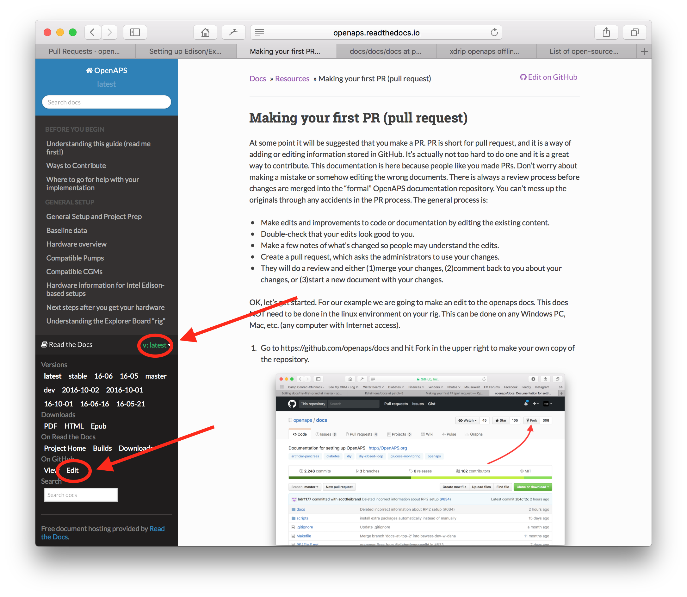
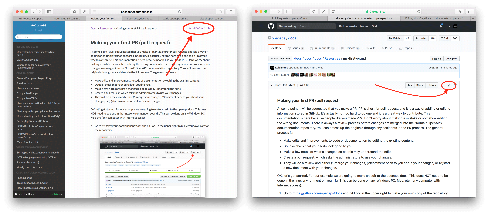
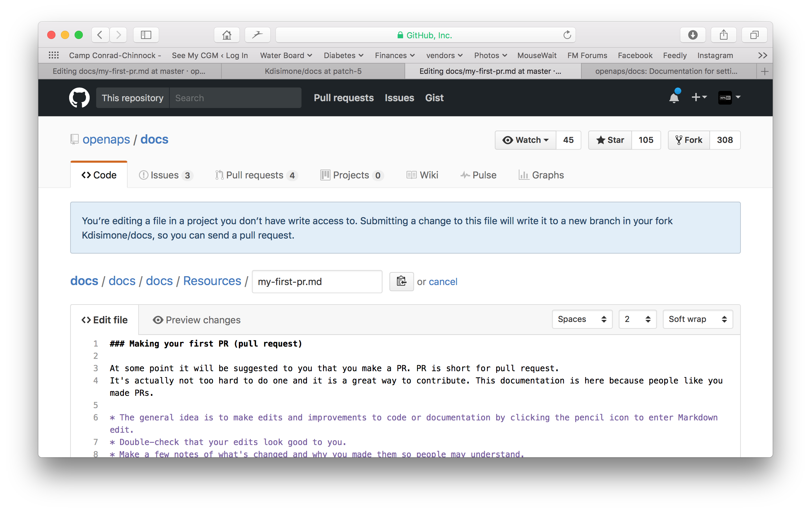
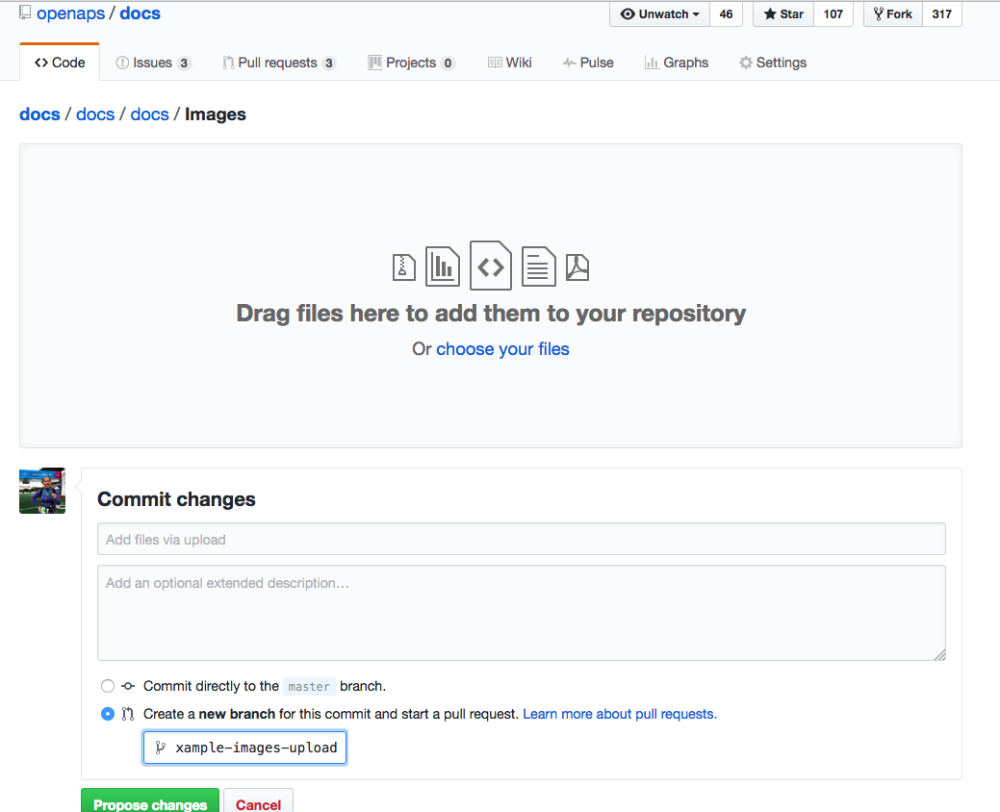

# How to edit the docs

**Esta descripción es sólo para editar la documentación en inglés. All new information must be added in English first. Si desea traducir a otros idiomas (gracias), por favor use [crowdin](https://crowdin.com/project/androidapsdocs).**

For hints how to format text (headline, bold...) and set links please see the ["code syntax"](make-a-PR-code-syntax) section of this page.

## General

For any questions, feedback or new ideas you can contact the documentation team via [discord](https://discord.gg/4fQUWHZ4Mw). Hacer una PR no es difícil, pero podemos ayudarle a editar la documentación.

En algún momento se le sugerirá que haga un PR. PR es la abreviatura de solicitud de modificación, y es una manera de agregar o editar la información almacenada en GitHub. En realidad, no es muy difícil hacer una y es una gran forma de contribuir. Esta documentación está aquí porque la gente como tú hizo PRs. No te preocupes por cometer un error o de alguna manera editar los documentos equivocados. Siempre hay un proceso de revisión antes de que los cambios se fusionen en el repositorio de documentación "formal" AndroidAPS. No se pueden estropear los originales a través de cualquier accidente en el proceso de PR. El proceso general es:

* Realice ediciones y mejoras en el código o la documentación editando el contenido existente.
* Vuelva a comprobar que sus ediciones se vean bien para usted.
* Hagan algunas notas de lo que ha cambiado para que la gente entienda las modificaciones.
* Cree una solicitud de modificación, que solicite a los administradores que utilicen los cambios.
* Van a realizar una revisión y (1) fusionar los cambios, (2) volver a comentar acerca de los cambios, o (3) iniciar un nuevo documento con los cambios.

(Nota complementaria: Si eres un alumno visual, hay un video de YouTube [aquí](https://youtu.be/4b6tsL0_kzg) mostrando el flujo de trabajo de PR.)

Por nuestro ejemplo, vamos a hacer una edición a AndroidAPSdocs. Esto NO es necesario que se haga en el entorno linux de la plataforma. Esto se puede hacer en cualquier PC con Windows, Mac, etc. (cualquier computadora con acceso a Internet).

1. Vaya a https://github.com/openaps/AndroidAPSdocs y presiones en Fork en la parte superior derecha para hacer su propia copia del repositorio.


2. Go to any page and navigate to the page you want to edit. Haz clic en la caja negra en la parte inferior izquierda de la página con la palabra verde "v: latest" o similar. En la ventana emergente que aparece, haga clic en la palabra "edit" para editarla en GitHub. 



     Or you can click on the "Edit in GitHub" link in the upper right corner, and then click the pencil icon that appears in the top bar of the page contents to be edited.
    



3. One or the other of the options in Step 2 will create a new branch in YOUR repository where your edits will be saved. Make your edits to the file.

We are using markdown for the docs pages. The file have got the suffix ".md".The Markdown specification is not fixed and we use at the moment the myst_parser for our markdown files. Take care to use the correct syntax as [described below](make-a-PR-code-syntax).



4. Ha estado trabajando en la pestaña "<>Edit file". Seleccione la pestaña "Preview changes" para refrescar la vista asegúrese de que todo lo que ha cambiado se parece a lo que ha significado (typpos sic). Si ve una mejora necesaria, vuelva a la pestaña de edición para realizar más mejoras. 


5. Cuando haya terminado de realizar las ediciones, desplácese hasta la parte inferior de la página. En el recuadro situado en la parte inferior, proporcione sus comentarios en el campo de texto que lee, "Add an optional extended description...". El título predeterminado tiene el nombre de archivo. Intente incluir una frase que explique la **razón** para el cambio. Describir la razón ayuda a los revisores a entender lo que estás intentando hacer con la PR.


6. Haga clic en el botón verde "Propose file changes" o "Commit changes". En la página que aparece, pulse "Create Pull Request" y otra vez en la página siguiente, pulse "Create Pull Request".


7. Eso completa la apertura de una solicitud de PR. GitHub asigna al PR un número, ubicado después del título y una marca de hash. Return to this page to check for feedback (or, if you have GitHub notifications emailed to you, you will get emails notifying you of any activity on the PR). La edición ahora estará en una lista de relaciones públicas que el equipo revisará y potencialmente dará retroalimentación antes de comprometerse con la documentación principal de AndroidAPS! Si quieres ver el progreso de la PR, puedes hacer clic en el logo de la campana en la esquina superior derecha de tu cuenta de GitHub y ver todos tus PRs.


PS: Your fork and branch will still be sitting on your own personal GitHub account. After you get a notification that your PR has been merged, you can delete your branch if you are done with it (Step 8's notification area will provide a link to delete the branch once it has been closed or merged). For future edits, if you follow this procedure the edits will always start with an updated version of the AndroidAPSdocs repositories. If you choose to use another method to start a PR request (e.g., editing starting from your forked repo's master branch as the starting point), you will need to ensure your repo is up-to-date by performing a "compare" first and merging in any updates that have happened since you last updated your fork. Since people tend to forget to update their repos, we recommend using the PR process outlined above until you get familiar with performing "compares".

(make-a-PR-code-syntax)=

## Sintaxis del código

We are using markdown for the docs pages. The files have got the suffix ".md".

(make-a-PR-image-size)=

### Tamaño de la imagen

If using images please use reasonable sizes. Screenshot images should be up to **1050 pixels wide**.

### Text format

* bold: `**text**`
* italic: `*text*`
* Headline 1: `# headline`
* Headline 2: `## headline`
* Headline 3: `### headline`

### ordered list

    1. first
    1. second
    1. third
    

1. first
2. second
3. third

### unordered list

    - one element
    - another element
    - and another element
    

* one element
* another element
* and another element

### multi level list

You can insert lists in lists by indenting the next level with 4 more spaces to the right than the one before.

    1. first
    1. second
    1. third
      1. one element
      1. another element
      1. and another element
    1. four
    1. five
    1. six
    

1. first
2. second
3. third 1. one element 1. another element 1. and another element
4. four
5. five
6. six

### Images

* imágenes: ``

### Links

* enlace externo: `[alt text](www.url.tld)`
* internal link to .md page: `[alt text](../folder/file.md)`
* internal link to headline: `[alt text](../folder/file.html#headline)`

### Internal links

If you want to set an internal link within the AndroidAPS documentation, please only use **relative links**. Only this will make the link work in the other languages (Czech, German...) as well.

* `[text](../Usage/Test.md)` will set an internal hyperlink one directory up from where you are and then into the subdirectory /Usage. Ending of the target file must be .md or .rst (not .html)
* `[text](./Usage/Test.md)` will set an internal hyperlink from where you are into /Usage. Ending of the target file must be .md
* To set the link to an **anchor** (i.e. a headline) you let the file extension .md in place! 
  * `[text](../Usage/Test.md#anchor)`

### Notes

    ```{admonition} Friendly Note
    :class: note
    
    This is a note.
    

    <br />```{admonition} Friendly Note
    :class: note
    
    This is a note.
    

### Warnings

    ```{admonition} Strong Warning
    :class: warning
    
    This is a warning.
    

    <br />```{admonition} Strong Warning
    :class: warning
    
    This is a warning.
    

## Adding multiple images to the documentation

If you are planning to make a lot of edits, including adding images to help illustrate parts of the documentation (thank you!), you may want to take the following approach:

* As you go and save screenshots, rename the screenshots to a descriptive name - but try not to use spaces as that confuses GitHub. Instead, use underscores. I.e. Example_batch_images_upload.png rather than "Example batch images upload.png". 
* Please use reasonable sizes. Screenshot images should be up to **1050 pixels wide**.
* You can upload images in batches easily by:
  
  1. Navigate to the images folder (https://github.com/openaps/AndroidAPSdocs/tree/master/docs/EN/images - but make sure you are in your fork/copy of the docs Images folder to be able to do this (replace "openaps" in the URL with your GitHub username)).
  
  2. Click in the upper right corner where it says "Upload files"
  
  3. Drag and drop your images into the screen
  
  4. Commit these to your branch
  
  5. Now, you can look for the URL/relative path of each file and use that to refer to when adding images into a page in the documentation.
  
  6. To see examples of how to add the images, you can look at the "raw" code of a page to see an example from a page that already has the images embedded successfully. Make sure you use the [correct code](./make-a-PR.html#code-syntax) for the page type you are on (.md or .rst). The main thing is to have a plain text description, followed by a link with a relative path to the image, like this:
    
    * For .md pages: `` (That code is exactly how the image below is embedded to be displayed.)
    * For .rst pages: `.. image:: ../images/Example_batch_images_upload.png`  
      `:alt: Example of uploading images in batches`



7. After adding images or making adjustments, you can submit a PR to the master branch of AndroidAPSdocs.