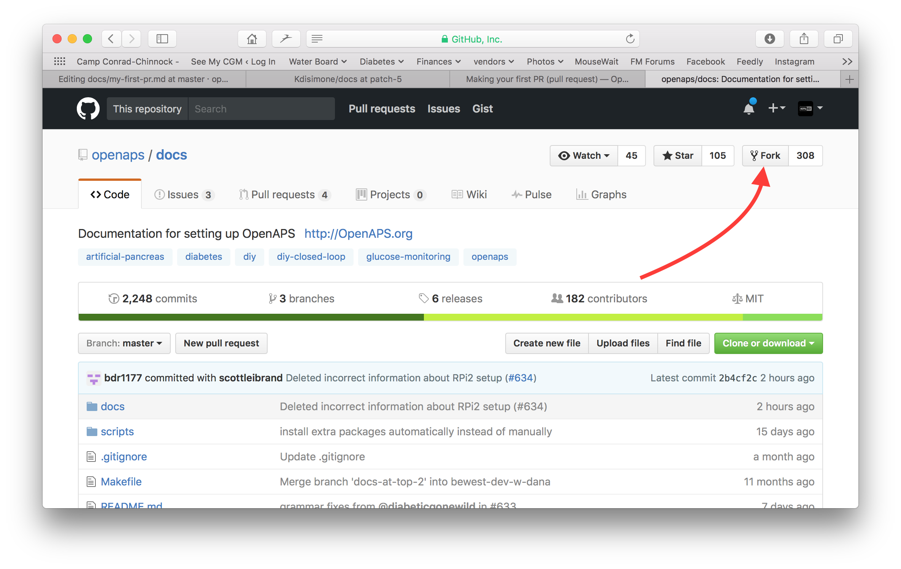
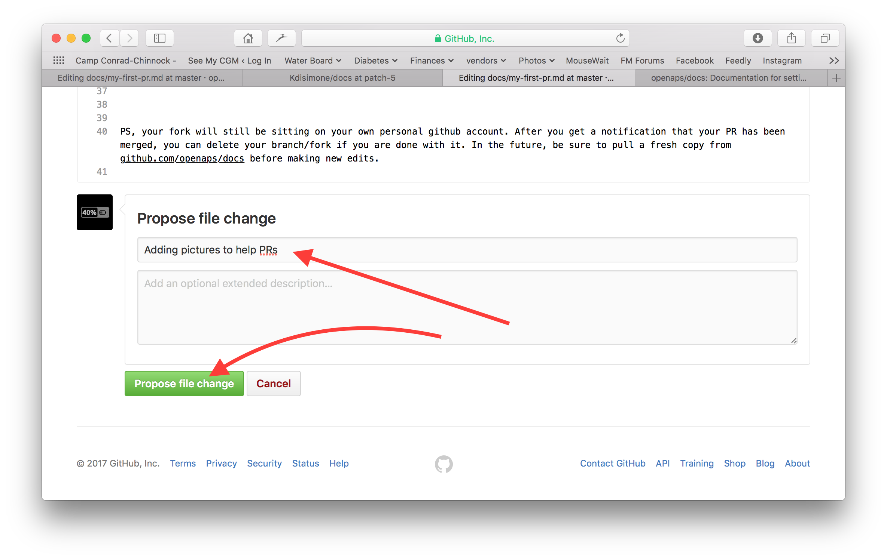

# How to edit the docs

**Esta descripción es sólo para editar la documentación en inglés. All new information must be added in English first. Si desea traducir a otros idiomas (gracias), por favor use [crowdin](https://crowdin.com/project/androidapsdocs).**

For hints how to format text (headline, bold...) and set links please see the ["code syntax"](make-a-PR-code-syntax) section of this page.

## General

For any questions, feedback or new ideas you can contact the documentation team via [discord](https://discord.gg/4fQUWHZ4Mw). Hacer una PR no es difícil, pero podemos ayudarle a editar la documentación.

En algún momento se le sugerirá que haga un PR. PR es la abreviatura de solicitud de modificación, y es una manera de agregar o editar la información almacenada en GitHub. En realidad, no es muy difícil hacer una y es una gran forma de contribuir. Esta documentación está aquí porque la gente como tú hizo PRs. No te preocupes por cometer un error o de alguna manera editar los documentos equivocados. There is always a review process before changes are merged into the "formal" AAPS documentation repository. No se pueden estropear los originales a través de cualquier accidente en el proceso de PR. El proceso general es:

* Realice ediciones y mejoras en el código o la documentación editando el contenido existente.
* Vuelva a comprobar que sus ediciones se vean bien para usted.
* Hagan algunas notas de lo que ha cambiado para que la gente entienda las modificaciones.
* Cree una solicitud de modificación, que solicite a los administradores que utilicen los cambios.
* Van a realizar una revisión y (1) fusionar los cambios, (2) volver a comentar acerca de los cambios, o (3) iniciar un nuevo documento con los cambios.

(Nota complementaria: Si eres un alumno visual, hay un video de YouTube [aquí](https://youtu.be/4b6tsL0_kzg) mostrando el flujo de trabajo de PR.)

Por nuestro ejemplo, vamos a hacer una edición a AndroidAPSdocs. Esto NO es necesario que se haga en el entorno linux de la plataforma. Esto se puede hacer en cualquier PC con Windows, Mac, etc. (cualquier computadora con acceso a Internet).

1. Vaya a https://github.com/openaps/AndroidAPSdocs y presiones en Fork en la parte superior derecha para hacer su propia copia del repositorio.

2. Go to any page and navigate to the page you want to edit. Haz clic en la caja negra en la parte inferior izquierda de la página con la palabra verde "v: latest" o similar. En la ventana emergente que aparece, haga clic en la palabra "edit" para editarla en GitHub. 

Or you can click on the "Edit in GitHub" link in the upper right corner, and then click the pencil icon that appears in the top bar of the page contents to be edited.

3. One or the other of the options in Step 2 will create a new branch in YOUR repository where your edits will be saved. Make your edits to the file.

We are using markdown for the docs pages. The file have got the suffix ".md".The Markdown specification is not fixed and we use at the moment the myst_parser for our markdown files. Take care to use the correct syntax as [described below](make-a-PR-code-syntax).

4. Ha estado trabajando en la pestaña "<>Edit file". Seleccione la pestaña "Preview changes" para refrescar la vista asegúrese de que todo lo que ha cambiado se parece a lo que ha significado (typpos sic). Si ve una mejora necesaria, vuelva a la pestaña de edición para realizar más mejoras. 

5. Cuando haya terminado de realizar las ediciones, desplácese hasta la parte inferior de la página. En el recuadro situado en la parte inferior, proporcione sus comentarios en el campo de texto que lee, "Add an optional extended description...". El título predeterminado tiene el nombre de archivo. Intente incluir una frase que explique la **razón** para el cambio. Describir la razón ayuda a los revisores a entender lo que estás intentando hacer con la PR.

6. Haga clic en el botón verde "Propose file changes" o "Commit changes". En la página que aparece, pulse "Create Pull Request" y otra vez en la página siguiente, pulse "Create Pull Request".

7. Eso completa la apertura de una solicitud de PR. GitHub asigna al PR un número, ubicado después del título y una marca de hash. Return to this page to check for feedback (or, if you have GitHub notifications emailed to you, you will get emails notifying you of any activity on the PR). The edit will now be in a list of PR's that the team will review and potentially give feedback on before committing to the main documentation for AAPS! Si quieres ver el progreso de la PR, puedes hacer clic en el logo de la campana en la esquina superior derecha de tu cuenta de GitHub y ver todos tus PRs.

PS: Your fork and branch will still be sitting on your own personal GitHub account. After you get a notification that your PR has been merged, you can delete your branch if you are done with it (Step 8's notification area will provide a link to delete the branch once it has been closed or merged). For future edits, if you follow this procedure the edits will always start with an updated version of the AndroidAPSdocs repositories. If you choose to use another method to start a PR request (e.g., editing starting from your forked repo's master branch as the starting point), you will need to ensure your repo is up-to-date by performing a "compare" first and merging in any updates that have happened since you last updated your fork. Since people tend to forget to update their repos, we recommend using the PR process outlined above until you get familiar with performing "compares".

(make-a-PR-code-syntax)=

## Sintaxis del código

We are using markdown for the docs pages. The files have got the suffix ".md".

### Text format

* bold: `**text**`
* italic: `*text*`
* Headline 1: `# headline`
* Headline 2: `## headline`
* Headline 3: `### headline`

### ordered list

    1. first
    1. second
    1. third
    

1. first
2. second
3. third

### unordered list

    - one element
    - another element
    - and another element
    

* one element
* another element
* and another element

### multi level list

You can insert lists in lists by indenting the next level with 4 more spaces to the right than the one before.

    1. first
    1. second
    1. third
      1. one element
      1. another element
      1. and another element
    1. four
    1. five
    1. six
    

1. first
2. second
3. third 
    1. one element
    2. another element
    3. and another element
4. four
5. five
6. six

### Images

To include images you use this markdown syntax.

* imágenes: ``

Images names should confirm to one of following naming rules.

* `filename-image-xx` where xx is a unique double digit number for the images in this file.
* `filename-image-xx` where xx is a meaning full name for the author of the md file.

Images are located in the images folder for the english language and propagated to the other languages automatically by Crowdin. You have nothing to do for this!

We are not translating images at the moment.

(make-a-PR-image-size)= Use a reasonable size for the images which must be readable on PC, tablet and mobiles.

* Screenshots from web pages images should be up to **1050 pixels wide**.
* Diagramms of process flows should be up to **1050 pixels wide**.
* Screenshots from the app should be up to **300 to 400 pixels wide**.

### Links

#### External links

External links are links to external web sites.

* external link: `[alt text](www.url.tld)`

#### Internal links to the start of a md file

Internal links to pages are links to the start of a md file which is hosted on our own server.

* internal link to .md page: `[alt text](../folder/file.md)`

#### Internal links to named inline refernces

Internal links to named inline refernces are links to any point in a md file which is hosted on our own server and where a reference was set to link to.

Add a named reference at the location in the target md file you want to jump to.

`(name-of-my-md-file-this-is-my-fancy-named-reference)=`

The named reference must be unique in the whole AndroidAPSDocs md files and not only the own md file it resides in!

Therefore it is a good practice to start with the filename and then the reference name you select.

Use only lowercase letters and hyphenate words.

Then link this refernce in the text you are writing with the following kind of link.

* Internal links to named inline refernces: `[alt text](name-of-my-md-file-this-is-my-fancy-named-reference)`

### Notes, Warnings, Collapsing Notes

You can add notes and warning boxes to documentation.

Furthermore you can add collapsing notes for detailed information which would users who are not interested in the details quench to read the text at all. Please use these carefully as the documentation should be as easy to read as possible.

#### Notes

::: :::{admonition} Note :class: note

This is a note. ::: :::

:::{admonition} Note :class: note

This is a note. :::

#### Advertencias

::: :::{admonition} Warning :class: warning

This is a warning. ::: :::

:::{admonition} Warning :class: warning

This is a warning. :::

#### Collapsing Notes

::: :::{admonition} further detailed readings for interested readers :class: dropdown

This admonition has been collapsed, meaning you can add longer form content here, without it taking up too much space on the page. ::: :::

:::{admonition} further detailed readings for interested readers :class: dropdown

This admonition has been collapsed, meaning you can add longer form content here, without it taking up too much space on the page. :::