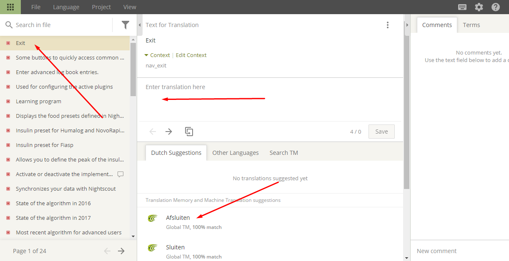

# Cómo traducir AndroidAPS y la documentación

* Go to <https://crowdin.com/project/androidaps> or <https://crowdin.com/project/androidapsdocs> and login using your Github account

* Envíe una solicitud de unión al equipo de documentación. Para ello, haz clic en la bandera del idioma deseado y luego el botón "Únete" en la esquina superior derecha de la siguiente página. Especifique un idioma, dé alguna información acerca de usted y su experiencia AAPS y si desea ser un traductor o un corrector de pruebas (sólo personas habilitadas para traducir + avanzados usuarios AndroidAPS).

* Cuando se apruebe, haga clic en la bandera 

## Traducir cadenas para AndroidAPS app

* Haga clic en strings.xml
    
    

* Traducción de frases a la izquierda añadiendo un nuevo texto traducido o utilizando la sugerencia de edición &
    
    

* Los revisores tienen que cambiar al modo de revisión
    
    
    
    y aprobar los textos traducidos
    
    

Cuando un lector de pruebas aprueba una traducción, se agregará a la siguiente versión de AndroidAPS. En el principio sería bueno también repasar las traducciones existentes que aún no están aprobadas y comprobar si hay errores o aprobarlas si son correctas.

## Traducir páginas de la documentación

* Haga clic en el nombre de la página de documentos que desea traducir
    
    

* Traducir oración por oración
    
    1 El texto no traducido se muestra con fondo rojo en el lado izquierdo.
    
    2 Puede copiar una propuesta en el campo de edición haciendo clic en la propuesta.
    
    3 Editar la propuesta o escribir la traducción usted mismo.
    
    4 Pulse Guardar
    
    

* La traducción de su página no va a ser publicado en la la documentación antes de que la traducción sea revisada.

### Traducir enlaces de títulos

* Cuando un enlace interno sólo conduce a una determinada página (es decir ../Usage/Profiles.html), no es necesaria ninguna traducción.
* Enlaces internos a un determinado título (es decir ..//Usage/Profiles.html#percentage) debe ser traducido como el titular en el otro idioma es diferente de la original en inglés.
* Si traduce un encabezado puede transformar esto en el enlace de anclaje (parte siguiente a # - i.e. #porcentaje) cambiando todas las letras a minúsculas, transformando caracteres especiales a caracteres estándar, reemplazando espacios por - (signo menos) y saltando las marcas de puntuación.
    
    Aquí tienes algunos ejemplos:
    
    * Was ist ein Closed Loop System mit AndroidAPS? \---> #was-ist-ein-closed-loop-system-mit-androidaps
    * Docs Updates & Änderungen \---> #docs-updates-anderungen
    * AAPS-.apk Datei \---> #aaps-apk-datei

* Compruebe el enlace si está trabajando como estaba previsto. Si está enlazando con un nuevo titular traducido, es posible que tenga que esperar hasta la próxima compilación para poder comprobar la sintaxis correcta del enlace. En este caso no te olvides de hacer un recordatorio en tu calendario/aplicación de tareas pendientes.

#### Traducción de enlaces en archivos Markdown (.md)

En el momento dos [lenguajes de marcación](./make-a-PR#code-syntax) se utilizan en docs. Mientras que los archivos escritos en la sintaxis de reStructuredText (.rst) siempre muestran la dirección de enlace en Crowdin, para los archivos de la sintaxis de Markdown (.md), es posible que tenga que activar la visualización de códigos HTML con el fin de traducir la dirección de enlace.

* * *

**Make sure not to use space character at within HTML tags at the beginning or the end!**

* * *

If links are displayed like this in Crowdin

click on the cogwheel to open settings, select "Show" and click "Save".

Links will then be shown in standard HTML format and can be translated considering the rules mentioned [above](./translations#translate-headline-links).

## Revisores

* Los revisores tienen que cambiar al modo de revisión
    
    
    
    y aprobar los textos traducidos
    
    

* Cuando un corrector aprueba una traducción será añadido a la siguiente construcción de documentos. Para acelerar el proceso, puede informar al equipo de documentación sobre las nuevas traducciones.