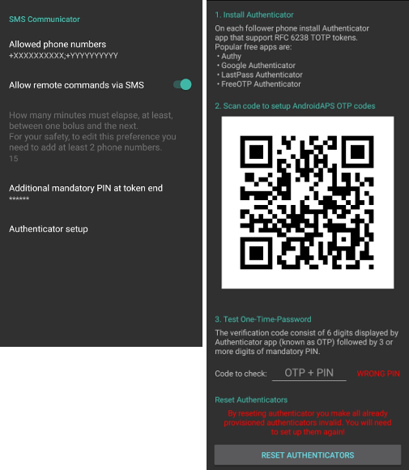

Commandes SMS
**************************************************
La sécurité avant tout
==================================================
* AndroidAPS vous permet de controler le téléphone d’un enfant à distance via un SMS. Si vous activez le Communicateur SMS, rappelez-vous toujours que le téléphone configuré pour donner des commandes distantes pourrait être volé. Donc, toujours le protéger au minimum par un code PIN. Un mot de passe robuste ou une identification biométrique sont recommandés.
* Il est également recommandé d'autoriser un `deuxième numéro de téléphone <#numero-de-tel-autorises>`_ pour les commandes SMS. Vous pouvez donc utiliser le deuxième numéro pour `désactiver temporairement <#autres>`_ la communication SMS dans le cas où votre téléphone principal serait perdu ou volé.
* AndroidAPS vous informera également par SMS si vos commandes distantes, comme un bolus ou un changement de profil, ont été effectuées. Il est conseillé de le configurer de sorte que les SMS de confirmation soient envoyés à au moins deux numéros de téléphone différents au cas où l'un des téléphones destinataires serait volé.
* **Si vous faites un bolus au moyen de commandes SMS, vous devez entrer les glucides par Nightscout (NSClient, site Web ...) !** Si vous ne le faites pas, l'IA serait correct mais le GA serait lui trop faible pouvant conduire à ne pas effectuer de bolus de correction car AAPS estimerait que vous avez trop d'insuline active.
* Depuis AndroidAPS version 2.7, une application d'authentification avec un mot de passe à usage unique basé sur l'heure doit être utilisé pour augmenter la sécurité lors de l'utilisation de commandes SMS.

Paramétrer les commandes SMS
==================================================

      
* La plupart des ajustements des cibles temporaires, suivi d'AAPS, etc. peuvent être fait avec l'application `NSClient <../Children/Children.html>`_ sur un téléphone Android avec une connexion Internet.
* Les bolus ne peuvent pas être donnés à partir de Nightscout, mais vous pouvez utiliser des commandes SMS.
* Si vous utilisez un iPhone comme follower et ne pouvez donc pas utiliser NSClient, il y a des commandes SMS supplémentaires disponibles.

* Dans les paramètres de votre téléphone android allez dans Applications > AndroidAPS > Autorisations et activez SMS

Numéros de tél autorisés
-------------------------------------------------
* Dans AndroidAPS, allez dans **Préférences > Communicateur SMS** et entrez le(s) numéro(s) de téléphone que vous autoriserez pour les commandes SMS (séparés par des points-virgules, par ex. +6412345678;+6412345679) 
* Activez 'Autoriser les commandes distantes par SMS'.
* Si vous voulez utiliser plus d'un numéro :

  * Entrez seulement un numéro.
  * Vérifiez le bon fonctionnement de ce numéro unique en envoyant et en confirmant une commande SMS.
  * Entrez le(s) numéro(s) supplémentaire(s) séparé(s) par un point-virgule, pas d'espace.
  
    .. image:: ../images/SMSCommandsSetupSpace2.png
      :alt: Commandes SMS Configurer plusieurs numéros

Délai entre les commandes bolus
-------------------------------------------------
* Vous pouvez définir un délai minimum entre les bolus envoyés par SMS.
* Pour des raisons de sécurité, vous devez ajouter au moins deux numéros de téléphone autorisés pour modifier cette valeur.

Code PIN obligatoire à la fin de l'OTP
-------------------------------------------------
* Pour des raisons de sécurité, le code de réponse doit être suivi d'un code PIN.
* Règles du code PIN :

   * 3 à 6 chiffres
   * ne pas utiliser les mêmes chiffres (par ex. 1111)
   * ne pas utiliser des chiffres qui se suivent (par ex. 1234)

Configuration de l'Authentificateur
-------------------------------------------------
* L'authentification à deux facteurs est utilisée pour améliorer la sécurité.
* Vous pouvez utiliser n'importe quelle application d'authentification qui prend en charge les jetons TOTP RFC 6238. Les applications gratuites populaires sont :

   * `Authy <https://authy.com/download/>`_
   * Google Authenticator - `Android <https://play.google.com/store/apps/details?id=com.google.android.apps.authenticator2>`_ / `iOS <https://apps.apple.com/de/app/google-authenticator/id388497605>`_
   * `LastPass Authenticator <https://lastpass.com/auth/>`_
   * `FreeOTP Authenticator <https://freeotp.github.io/>`_

* Installez l'application d'authentification de votre choix sur votre téléphone follower et scannez le QR code affiché dans AAPS.
* Testez le mot de passe à usage unique en entrant le jeton affiché dans votre application d'authentification et le code PIN que vous venez de configurer dans AAPS. Par exemple :

   * Votre code PIN obligatoire est 2020
   * Le jeton TOTP de l'application d'authentification est 457051
   * Entrez 4570512020
   
* Le texte rouge "WRONG PIN" changera **automatiquement** en vert "OK" si l'entrée est correcte. **Il n'y a aucun bouton à appuyer !**
* L'heure des deux téléphones doit être synchronisée. Les mieux est de synchroniser l'heure automatiquement à partir du réseau. Les différences d'heures peuvent entraîner des problèmes d'authentification.
* Utilisez le bouton "RESET AUTHENTICATORS" si vous voulez supprimer les autorisations.

Utiliser les commandes SMS
==================================================
* Envoyez depuis votre/vos numéro(s) de téléphone approuvé(s) un SMS au téléphone ayant AndroidAPS lancé en utilisant l'une des `commandes <../Children/SMS-Commands.html#commandes>`_ ci-dessous. 
* Le téléphone AAPS répondra pour confirmer le succès de la commande ou du statut demandé. 
* Confirmez la commande en envoyant le code si nécessaire. Par exemple :

   * Votre code PIN obligatoire est 2020
   * Le jeton TOTP de l'application d'authentification est 457051
   * Entrez 4570512020

**Astuce**: Il peut être utile d'avoir un forfait SMS pour les deux téléphones si beaucoup de SMS seront envoyés.

Commandes
==================================================
Les commandes doivent être envoyées en anglais, la réponse sera dans votre langue locale si la chaîne de réponse a déjà été `traduite <../translations.html#translate-strings-for-androidaps-app>` _.

.. image:: ../images/SMSCommands.png
  :alt: Example de commandes SMS

Boucle
--------------------------------------------------
* LOOP STOP/DISABLE
   * Réponse : La boucle a été désactivée
* LOOP START/ENABLE
   * Réponse : La boucle a été activée
* LOOP STATUS
   * La réponse dépend du statut réel
      * La Boucle est désactivée
      * La Boucle est activée
      * Suspendu (10 min)
* LOOP SUSPEND 20
   * Réponse : Suspendu (20 min)
* LOOP RESUME
   * Réponse : Boucle relancée

Données MGC
--------------------------------------------------
* Gly
   * Réponse: Dernière G: 5,6 il y a 4 min, Delta: 2 mmol, IA: 0.20U (Bolus: 0.10U Basal: 0.10U)
* CAL 5.6
   * Réponse : Pour envoyer la calibration 5.6, renvoyez le code depuis l'application Authenticator pour l'utilisateur suivie du code PIN
   * Réponse après réception du code correct : Étalonnage envoyé. La réception doit être activée dans xDrip. (**Si xDrip est installé. L'acceptation des calibrations doit être activée dans xDrip+**)

Basal
--------------------------------------------------
* BASAL STOP/CANCEL
   * Réponse : Pour arrêter la basal temp, renvoyez le code depuis l'application Authenticator pour l'utilisateur suivie du code PIN
* BASAL 0.3
   * Réponse : Pour démarrer la basal de 0,3 U/h pendant 30 min, renvoyez le code depuis l'application Authenticator pour l'utilisateur suivie du code PIN
* BASAL 0.3 20
   * Réponse : Pour démarrer la basal de 0,3 U/h pendant 20 min, renvoyez le code depuis l'application Authenticator pour l'utilisateur suivie du code PIN
* BASAL 30%
   * Réponse : Pour démarrer la Basal 30% pendant 30 min, renvoyez le code depuis l'application Authenticator pour l'utilisateur suivie du code PIN
* BASAL 30% 50
   * Réponse : Pour démarrer la Basal 30% pendant 50 min, renvoyez le code depuis l'application Authenticator pour l'utilisateur suivie du code PIN

Bolus
--------------------------------------------------
Un bolus par SMS n'est pas possible dans les 15 minutes suivant le dernier envoi de bolus dans AAPS ou après la dernière commande SMS. Vous ne pouvez ajuster la durée que si au moins deux numéros de téléphone sont entrés. La réponse dépend donc du moment où le dernier bolus a été administré.

* BOLUS 1.2
   * Réponse A : Pour injecter le bolus de 1,2 U, renvoyez le code depuis l'application Authenticator pour l'utilisateur suivie du code PIN
   * Réponse B : Bolus à distance non disponible. Réessayez plus tard.
* BOLUS 0.60 MEAL
   * Si vous spécifiez le paramètre optionnel REPAS, cela définit la Cible Temporaire Repas Imminent (valeur par défaut : 90 mg/dL, 5,0 mmol/l pour 45 min).
   * Réponse A: Pour injecter le bolus repas de 0,60 U, renvoyez le code depuis l'application Authenticator pour l'utilisateur suivie du code PIN
   * Réponse B : Bolus à distance non disponible. 
* CARBS 5
   * Réponse : Pour entrer 5g à 12:45, renvoyez le code depuis l'application Authenticator pour l'utilisateur suivie du code PIN
* CARBS 5 17:35/5:35PM
   * Réponse : Pour entrer 5g à 17:35, renvoyez le code depuis l'application Authenticator pour l'utilisateur suivie du code PIN
* EXTENDED STOP/CANCEL
   * Réponse : Pour arrêter le bolus étendu, renvoyez le code depuis l'application Authenticator pour l'utilisateur suivie du code PIN
* EXTENDED 2 120
   * Réponse : Pour démarrer le bolus étendu de 2U pendant 120 min, renvoyez le code depuis l'application Authenticator pour l'utilisateur suivie du code PIN

Profil
--------------------------------------------------
* PROFILE STATUS
   * Réponse: Profil1
* PROFILE LIST
   * Réponse : 1.`Profil1` 2.`Profil2`
* PROFILE 1
   * Réponse : Pour changer le profil vers Profile1 100%, renvoyez le code depuis l'application Authenticator pour l'utilisateur suivie du code PIN
* PROFILE 2 30
   * Réponse : Pour changer le profil vers Profile2 30%, renvoyez le code depuis l'application Authenticator pour l'utilisateur suivie du code PIN

Autres
--------------------------------------------------
* TREATMENTS REFRESH
   * Réponse : Actualiser les données depuis NS
* NSCLIENT RESTART
   * Réponse : NSCLIENT RESTART 1 receivers
* POMPE
   * Réponse : Dernière conn : il y a 1 min Temp: 0.00U/h @11:38 5/30min IA: 0.5U Réserv: 34U Batt.: 100
* PUMP CONNECT
   * Réponse : Pompe reconnectée
* PUMP DISCONNECT *30*
   * Réponse : Pour déconnecter la pompe pendant *30* min, renvoyez le code depuis l'application Authenticator pour l'utilisateur suivie du code PIN
* SMS DISABLE/STOP
   * Réponse : Pour désactiver les commandes à distance SMS renvoyer le code Any. Gardez à l'esprit que vous ne pourrez le réactiver que directement à partir de l'application AAPS du smartphone maitre.
* TARGET MEAL/ACTIVITY/HYPO   
   * Réponse : Pour définir la cible temp MEAL/ACTIVITY/HYPO, renvoyez le code depuis l'application Authenticator pour l'utilisateur suivie du code PIN
* TARGET STOP/CANCEL   
   * Réponse : Pour annuler la cible temp, renvoyez le code depuis l'application Authenticator pour l'utilisateur suivie du code PIN
* HELP
   * Réponse : BG, LOOP, TREATMENTS, .....
* HELP BOLUS
   * Réponse : BOLUS 1.2 BOLUS 1.2 MEAL

Dépannage
==================================================
SMS multiples
--------------------------------------------------
Si vous recevez toujours le même message (par ex. changement de profil) vous avez probablement mis en place une boucle infinie avec d'autres applications. Cela peut être xDrip+, par exemple. Si c'est le cas, assurez-vous que xDrip + (ou toute autre application) ne télécharge pas les traitements dans NS. 

Si l'autre application est installée sur plusieurs téléphones assurez-vous de désactiver le téléchargement NS sur chacun d'eux.

Les commandes SMS ne fonctionnent pas sur des téléphones Samsung
--------------------------------------------------
Il y a eu un signalement sur les commandes SMS s'arrêtant après une mise à jour sur le téléphone Galaxy S10. Peut être résolu en désactivant 'envoyer en tant que message chat'.

.. image:: ../images/SMSdisableChat.png
  :alt: Disable SMS as chat message
