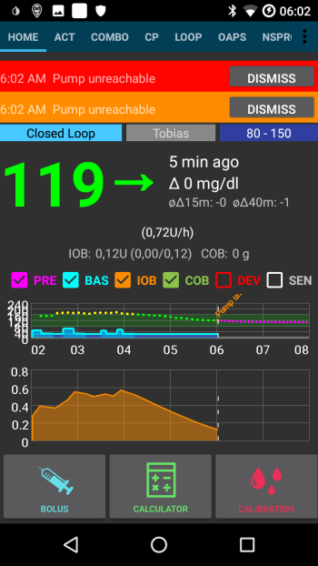

# Accu-Chek Combo conseils pour une utilisation de base

## Comment assurer les opérations en douceur

* Toujours **porter le smartphone avec vous**, laissez-le à côté de votre lit la nuit. Comme votre pompe peut se poser derrière vous ou sous votre corps pendant que vous dormez, une position plus élevée (sur une tablette ou une étagère) fonctionne mieux.
* Always make sure that the pump battery is as full as possible. See the battery section for tipps regarding the battery.
* Whenever possible, only operate the pump via the AAPS app. To facilitate this, activate the key lock on the pump under **PUMP SETTINGS / KEY LOCK / ON**. Ce n'est que lorsque vous changez la pile ou la cartouche qu'il est nécessaire d'utiliser les touches de la pompe. 

## Pompe inaccessible. Que faire ?

### Activer l'alerte pompe inaccessible

* In AAPS, go to **Settings / Local Alarms** and activate **alarm when pump is unreachable** and set **pump not reachable limit [Min]** to **31** minutes.
* Cela vous donnera suffisamment de temps pour ne pas déclencher l'alarme quand vous quittez une pièce en laissant le téléphone sur le bureau, mais vous informe si la pompe n'est pas joignable pour une durée supérieure à celle d'un d'un débit de base temporaire.

### Restaurer l'accessibilité de la pompe

* When AAPS reports a **pump unreachable** alarm, first release the keylock and **press any key on the pump** (e.g. "down" button). As soon as the pump display has turned off, press **Refresh** on the **Combo Tab** in AAPS. La plupart du temps la communication fonctionnera à nouveau.
* If that does not help, reboot your smartphone. After the restart, AAPS will be reactivated and a new connection will be established with the pump. If you are using the old driver, ruffy will be reactivated as well.

* The tests with different smartphones have shown that certain smartphones trigger the "pump unreachable" error more often than others. See [AAPS Phones](#Phones-list-of-tested-phones) for successfully tested smartphones.

### Causes racines et conséquences des fréquentes erreurs de communication

* On phones with **low memory** (or **aggressive power-saving** settings), AAPS is often shut down. Vous pouvez le constater par le fait que les boutons Bolus et Calculatrice sur l'écran d'accueil ne sont pas affichés lors de l'ouverture d'AAPS car le système est en cours d'initialisation. Cela peut déclencher une alerte "Pompe hors de portée" au démarrage. In the **Last Connection** field of the Combo tab, you can check when AAPS last communicated with the pump.

* Cette erreur peut vider la pile de la pompe plus rapidement car le profil basal est lu à partir de la pompe lorsque l'application est redémarrée.
* Cela augmente également la probabilité de provoquer l'erreur qui amène la pompe à rejeter toutes les connexions entrantes jusqu'à ce qu'un bouton de la pompe soit enfoncé. 

## Echec de l'annulation du débit de base temporaire

* Occasionally, AAPS can not automatically cancel a **TBR CANCELED** alert. Then you have to either press **UPDATE** in the AAPS **Combo tab** or the alarm on the pump will need to be confirmed.

## Considérations relatives à la pile

### Changer la pile

* Après une alarme **Pile pompe faible**, la pile doit être changée le plus rapidement possible pour toujours avoir l'énergie nécessaire à une communication Bluetooth fiable avec le smartphone, même si le téléphone se trouve à une grande distance de la pompe.
* Même après une alarme **Pile pompe faible**, la pile peut être utilisée pour une durée significative. Il est cependant recommandé de toujours avoir une pile neuve avec vous après une alarme "Niveau Batterie Bas".
* Avant de changer la pile, appuyez sur le symbole **Boucle** sur l'écran principal et sélectionnez **Suspendre la boucle pendant 1h**. 
* Attendez que la pompe communique avec le téléphone et que le logo bluetooth sur la pompe ait disparu.

* Déverrouillez les touches de la pompe, mettez la pompe à l'arrêt, confirmez si nécessaire l'annulation du débit de base temporaire et changez rapidement la pile.
* When using the old driver, if the clock on the pump did not survive the battery change, re-set the date and time on the pump to exactly the date/time on your phone running AAPS. (Le nouveau pilote met à jour automatiquement la date et l'heure de la pompe.)
* Ensuite, redémarrez la pompe, faites un appui long sur l'icone **Boucle suspendue** dans l'écran principal d'AAPS et sélectionnez **Reprendre**.
* AAPS will re-set a necessary temporary basal rate with the arrival of the next blood sugar value.

(Accu-Chek-Combo-Tips-for-Basic-usage-battery-type-and-causes-of-short-battery-life)=

### Type de pile et causes de faible autonomie

* Comme la communication Bluetooth intensive consomme beaucoup d'énergie, n'utilisez que des **piles de haute qualité** comme Energizer Ultimate Lithium, les "power one" du service pack Accu-Chek "étendu", ou si vous utilisez des batteries rechargeables, utilisez les batteries Eneloop. 

 

Ranges for typical life time of the different battery types are as follows:

* **Energizer Ultimate Lithium** : 4 à 7 semaines
* **Power One Alkaline** (Varta) from the service pack: 2 to 4 weeks
* Batteries **Eneloop rechargeables** (BK-3MCCE) : 1 à 3 semaines

If your battery life is significantly shorter than the ranges given above, please check the following possible causes:

* Il y a quelques variantes du capuchon de pile de la pompe Combo, qui court-circuite partiellement les piles et les vide rapidement. Les capuchons sans ce problème sont reconnaissables par les contacts dorés.
* Si l'horloge interne de la pompe ne "survie" pas un changement de pile court, il est probable que le condensateur qui maintient l'horloge en marche soit cassé. Dans ce cas, un remplacement de la pompe par Roche vous aidera, ce qui n'est pas un problème pendant la période de garantie. 
* Le hardwre et le software du smartphone (version de l'OS Android et de la puce bluetooth) ont aussi un impact sur la durée de vie de la pile de la pompe, même si les raisons exactes ne sont pas encore complètement connues actuellement. Si vous en avez l'occasion, essayez un autre smartphone et comparez la durée de vie de la pile.

## Bolus étendus, bolus mixtes

The OpenAPS algorithm does not support a parallel extended bolus or multiwave bolus. But a similar treatment can be achieved by the following alternatives:

* Utilisez les **e-Glucides** à partir du bouton GLUCIDES en entrant la quantité globale de glucides du repas et la durée pendant laquelle vous pensez que les glucides arriveront dans le sang. Le système calculera ensuite les petits glucides répartis de manière égale sur toute la durée de sorte que l'algorithme fournisse une dose d'insuline équivalente tout en vérifiant de façon permanente l'augmentation/diminution globale de la glycémie. For a multiwave bolus approach, you can also combine a smaller immediate bolus with e-carbs. 
* Before eating, on the **Actions tab** in AAPS set as a temporary **Eating Soon** goal with target glucose 80 for several hours. The duration should be based on the interval you would choose for an extended bolus. This will keep your target lower than usual and therefore increase the amount of insulin delivered.
* Ensuite, utilisez l'**ASSISTANT** pour entrer les glucides complets du repas, mais n'appliquez pas directement la quantité d'insuline proposée par le calculateur de bolus. Si un bolus de type mixte doit être administré, corrigez la quantité d'insuline. Selon le repas, l'algorithme doit maintenant fournir des SMB supplémentaires ou des débits de basal temporaires plus élevés pour contrer l'augmentation de la glycémie. Ici, la limitation de sécurité du débit basal (Max U/h, Les IA basales) maximales devraient être expérimentées avec beaucoup de soin et, si nécessaire, temporairement modifiées.

* If you are tempted to just use the extended or multiwave bolus directly on the pump, AAPS will penalize you with disabling the closed loop for the next six hours to ensure that no excess insulin dosage is calculated.

## Alarmes à l'administration du bolus

* If AAPS detects that an identical bolus has been successfully delivered at the same minute, bolus delivery will be prevented with identical number of insulin units. If your really want to bolus the same insulin twice in short succession, just wait two more minutes and then deliver the bolus again. If the fist bolus has been interrupted or was not delivered for other reasons, you can immediately re-submit the bolus since AAPS 2.0.
* L'alarme est un mécanisme de sécurité qui va lire l'historique des bolus de la pompe avant d'administrer un nouveau bolus pour calculer correctement l'insuline active (IA), même quand un bolus est administré directement sur la pompe. Pour cela, il faut éviter les entrées multiples identiques.

* Ce mécanisme est également responsable d'une deuxième source d'erreur: si, lors de l'utilisation de la calculatrice, un autre bolus est administré via la pompe et donc l'historique des bolus change, la base du calcul du bolus est erronée et le bolus est abandonné. 

