- - -
orphan: true
- - -

# Documentation du driver AAPS pour la pompe à insuline Omnipod

Ces instructions sont pour configurer la pompe de génération Omnipod Eros (**PAS l'Omnipod Dash**). Le pilote Omnipod est disponible dans AAPS à partir de la version 2.8.

**Ce logiciel est une partie d'un système de pancréas artificiel "Do it yourself" (faire soi-même), et ce n’est pas un produit fini destiné à la mise sur le marché. VOUS devez obligatoirement lire, apprendre et comprendre ce système, y compris la façon de l’utiliser. Attention, vous êtes le seul responsable de ce que vous faite avec ce système.**

```{contents}
:backlinks: entry
:depth: 2
```

## Configuration matérielle et logicielle requise

- **Périphérique de communication Pod**

> Composant qui permet la communication entre votre téléphone avec AAPS et les Pods de génération Eros.
> 
> > -   [Site internet OrangeLink](https://getrileylink.org/product/orangelink)
> > -  [RileyLink 433MHz](https://getrileylink.org/product/rileylink433)
> > -   [Site internet Emalink](https://github.com/sks01/EmaLink) - [Contact](mailto:getemalink@gmail.com)
> > -   DiaLink - [Contact](mailto:Boshetyn@ukr.net)
> > -   [Site internet LoopLink](https://www.getlooplink.org/) - [Contact](https://jameswedding.substack.com/) - Non testé

-   **Téléphone Mobile**

> Composant qui utilisera AAPS et enverra des commandes de contrôle au périphérique de communication Pod.
> 
> > - Supported [Omnipod driver Android phone](#Phones-list-of-tested-phones) with a version of AAPS 2.8 and related components set up.

-   **Dispositif d'injection d'Insuline**

> Composant qui interprétera les commandes reçues du périphérique de communication Pod en provenance de votre téléphone AAPS.
> 
> > - Un nouveau pod Omnipod (génération Eros - **PAS DASH**)

Ces instructions supposent que vous commencez une nouvelle session pod; si ce n'est pas le cas, soyez patient et essayez de commencer ce processus lors de votre prochain changement de pod.

## Avant de commencer

**SÉCURITÉ D'ABORD** - ne pas essayer ce processus dans un environnement où vous ne pouvez pas récupérer une erreur (pods supplémentaires, insuline, RileyLink chargé et les smartphones sont nécessaires).

**Votre PDM Omnipod ne fonctionnera plus après l'activation de votre pod par le driver AAPS Omnipod**. Vous avez précédemment utilisé votre PDM Omnipod pour envoyer des commandes à votre pod Omnipod Eros. Un pod Omnipod Eros ne permet qu'à un seul appareil de la communiquer avec lui. The device that successfully activates the pod is the only device allowed to communicate with it from that point forward. Cela signifie qu'une fois que vous activez un pod Omnipod Eros avec votre RileyLink via le pilote AAPS Omnipod, **vous ne pourrez plus utiliser votre PDM avec votre pod**. Le pilote AAPS Omnipod avec le RileyLink est maintenant votre PDM. *Cela ne veut pas dire que vous pouvez jeter votre PDM, il est recommandé de le garder comme une sauvegarde, et en cas d'urgence si jamais AAPS ne fonctionnait pas correctement.*

**Vous pouvez configurer plusieurs RileyLinks, mais un seul RileyLink à la fois peut communiquer avec un pod.** Le pilote AAPS Omnipod supporte la possibilité d'ajouter plusieurs RileyLinks dans la configuration de RileyLink, cependant, un seul RileyLink à la fois peut être sélectionné pour la communication.

**Votre pod ne s'arrêtera pas lorsque le RileyLink sera hors de portée.** Lorsque votre RileyLink est hors de portée ou que le signal est bloqué pour communiquer avec le pod actif, votre pod continuera à injecter l'insuline basale. Lors de l'activation d'un pod, le profil basal défini dans AAPS sera programmé dans le nouveau pod. Si vous perdez le contact avec le pod, il retournera à ce profil de basal. Vous ne serez pas en mesure d'émettre de nouvelles commandes tant que le RileyLink ne reviendra pas à portée et qu'il n'aura pas à nouveau rétablit la connexion.

**Les profils de débit de base de 30 min ne sont PAS pris en charge dans AAPS.** Si vous êtes nouveau sur AAPS et que vous configurez votre profil de débit de basal pour la première fois, veuillez noter que les débits de basal commençant par une demi-heure ne sont pas pris en charge et que vous devrez ajuster votre profil de débit de basal pour démarrer sur les heures. Par exemple, si vous avez un débit de basal de 1,1 unités qui commence à 09h30 et a une durée de 2 heures se terminant à 11h30, cela ne marchera pas.  Vous devrez mettre à jour ce taux de basal de 1,1 soit sur une plage horaire de 9h00 à 11h00 soit de 10h00 à 12h00.  Même si les changements de débit de basal du profil toutes les 30 min sont supportés par le matériel Omnipod lui-même, AAPS n'est pas en mesure de les prendre en compte avec ses algorithmes actuellement.

## Activation du pilote Omnipod dans AAPS

Vous pouvez activer le pilote Omnipod dans AAPS de **deux façons**:

### Option 1 : L'Assistant de configuration

Après avoir installé une nouvelle version d'AAPS, l'**Assistant de configuration** démarrera automatiquement.  Cela se produit également lors des mises à jour.  Si vous avez déjà exporté vos paramètres à partir d'une installation précédente, vous pouvez quitter l'assistant d'installation et importer vos anciens paramètres.  Pour les nouvelles installations, procédez comme suit.

Via l'**Assistant de configuration AAPS (2)** situé dans le coin supérieur droit **menu trois points (1)**, passez par les menus de l'assistant jusqu'à ce que vous arriviez à l'écran **Pompe**. Ensuite, sélectionnez le **bouton radio Omnipod (3)**.

>   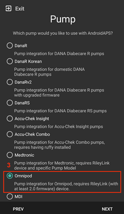

Sur le même écran, sous la sélection de la pompe, les **Paramètres du pilote Omnipod** s'affichent, dans la **Configuration du RileyLink** ajoutez votre appareil RileyLink en appuyant sur le texte **Non configuré**.

Sur l'écran de **Recherche du RileyLink** appuyez sur le bouton **Rechercher** et sélectionnez votre RileyLink en scannant tous les périphériques Bluetooth disponibles et en sélectionnant votre RileyLink dans la liste. Lorsque c'est correctement sélectionné, vous êtes basculé sur l'écran de sélection de la pompe, qui affiche les paramètres du pilote Omnipod montrant votre RileyLink sélectionné avec l'adresse MAC listée.

Appuyez sur le bouton **Suivant** pour continuer avec le reste de l'**Assistant de configuration**. Cela peut prendre jusqu'à une minute pour que le RileyLink sélectionné s'initialise et que le bouton **Suivant** devienne actif.

Detailed steps on how to setup your pod communication device are listed below in the [RileyLink Setup Section](#OmnipodEros-rileylink-setup).

**OU**

### Option 2 : Le Générateur de configuration

Via le **menu hamburger** situé dans le coin supérieur gauche, dans la **Configuration (1)** ➜**Pompe**➜**Omnipod** en sélectionnant le **bouton radio (2) Omnipod**. En sélectionnant la **case à cocher (4)** à côté de la **roue crantée (3)** cela affichera le menu Omnipod sous la forme d'un onglet intitulé **POD** dans l'interface AAPS. C'est ce que l'on appelle dans cette documentation l'onglet **Omnipod (POD)**.

> **NOTE:** A faster way to access the **Omnipod settings** can be found below in the [Omnipod Settings section](#OmnipodEros-omnipod-settings) of this document.
> 
>  

### Vérification de la sélection du pilote Omnipod

*Remarque : Si vous avez quitté l'Assistant de configuration plus tôt sans sélectionner votre RileyLink, Le pilote Omnipod est activé mais vous devrez toujours sélectionner votre RileyLink.  Vous pouvez voir l'onglet Omnipod (POD) s'afficher comme ci-dessous*

Pour vérifier que vous avez activé le pilote Omnipod dans AAPS **glissez vers la gauche** depuis l'onglet **Aperçu**, où vous verrez maintenant un onglet **Omnipod** ou **POD**.


## Configuration Omnipod

Veuillez **glisser vers la gauche** jusqu'à l'onglet **Omnipod (POD)** où vous pourrez gérer toutes les fonctions du pod et du RileyLink (certaines de ces fonctions ne sont pas activées ou visibles sans une session de pod active):

> 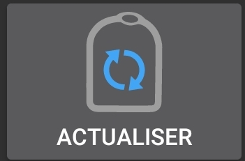 Rafraîchir la connectivité et l'état du Pod
> 
>  Gestion du Pod (activer, désactiver, tester les bips, stats du RileyLink et historique du Pod)

(OmnipodEros-rileylink-setup)=

### Configuration RileyLink

If you already successfully paired your RileyLink in the Setup Wizard or steps above, then proceed to the [Activating a Pod Section](#OmnipodEros-activating-a-pod) below.

*Remarque : Un bon indicateur visuel indiquant que le RileyLink n'est pas connecté est que les boutons Insuline et Assistant de l'onglet ACCUEIL seront manquants. Cela se produira également pendant environ les 30 premières secondes après le démarrage d'AAPS, car il se connecte activement au RileyLink.*

1. Assurez-vous que votre RileyLink est complètement chargé et mis en marche.

2. Après avoir sélectionné le pilote Omnipod, identifiez et sélectionnez votre RileyLink dans la **Configuration (1)** ➜**Pompe**➜**Omnipod**➜**Roue crantée (2)** ➜**Configuration du RileyLink (3)** en appuyant sur **Non configuré** ou sur le texte de **l'adresse MAC (si présent)**.

   > Ensure your RileyLink battery is charged and it is [positioned in close proximity](#OmnipodEros-optimal-omnipod-and-rileylink-positioning) (~30 cm away or less) to your phone for AAPS to identify it by its MAC address. Une fois sélectionné, vous pouvez continuer à activer votre première session de pod. Utilisez le bouton retour de votre téléphone pour revenir à l'interface principale AAPS.
   > 
   >  

3. Sur l'écran de **Sélection RileyLink** appuyez sur le bouton **Rechercher (4)** pour lancer un balayage bluetooth. **Sélectionnez votre RileyLink (5)** dans la liste des périphériques Bluetooth disponibles.

   >  

4. Après avoir sélectionné avec succès vous êtes revenu sur la page des paramètres Omnipod indiquant l'**adresse MAC du RileyLink actuellement sélectionné (6).**

   > 

5. Vérifiez que dans l'onglet **Omnipod (POD)** que l'**Etat du RileyLink (1)** apparaît comme étant **connecté.** Le champ **Etat du pod (2)** doit afficher **Aucun Pod actif**; si ce n'est pas le cas, veuillez réessayer l'étape précédente ou quitter AAPS pour voir si cela rafraîchit la connexion.

   > 

(OmnipodEros-activating-a-pod)=

### Activation d’un Pod

Avant de pouvoir activer un pod, veuillez vous assurer que vous avez correctement configuré et connecté votre connexion RileyLink dans les paramètres d'Omnipod

*RAPPEL : La communication avec le Pod pour l'activation de celui-ci se fait sur des périodes limitées pour des raisons de sécurité. Avant d'être appairé le signal radio du Pod est plus faible, mais après l'appairage, il fonctionnera à pleine puissance. During these procedures, make sure that your pod is* [within close proximity](#OmnipodEros-optimal-omnipod-and-rileylink-positioning) (~30 cm away or less) but not on top of or right next to the RileyLink.\*

01. Naviguez vers l'onglet **Omnipod (POD)** et cliquez sur le bouton **POD MGMT (1)** , puis cliquez sur **Activer Pod (2)**.

    >  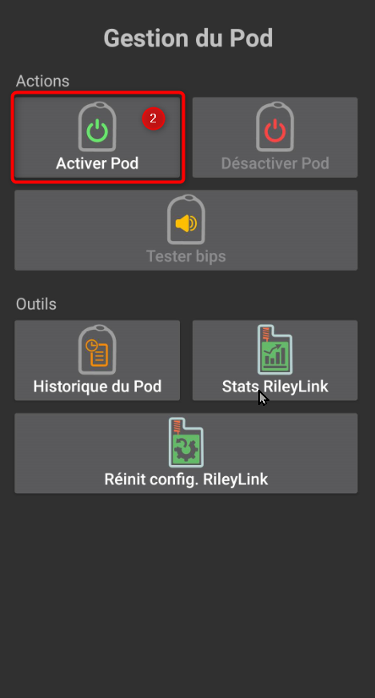

02. L'écran **Remplir le pod** s'affiche. Remplissez le nouveau pod avec au moins 80 unités d'insuline et écoutez le deux bips indiquant que le pod est prêt à être amorcé. Lors du calcul de la quantité totale d'insuline dont vous avez besoin pendant 3 jours, veuillez prendre en compte que l'amorçage du pod utilisera de 12 à 15 unités.

    > 
    > 
    > Assurez-vous que le nouveau pod et le RileyLink sont à proximité les uns des autres (~30 cm ou moins) et cliquez sur le bouton **Suivant**.

03. Sur l'écran **Initialiser le Pod** le pod commencera à amorcer (vous entendrez un clic suivi d'une série de tics pendant que le pod s'amorce). Si le RileyLink est hors de portée du pod en cours d'activation, vous recevrez un message d'erreur **Aucune réponse du Pod**. If this occurs, [move the RileyLink closer](#OmnipodEros-optimal-omnipod-and-rileylink-positioning) (~30 cm away or less) to but not on top of or right next to the Pod and click the **Retry (1)** button.

    > 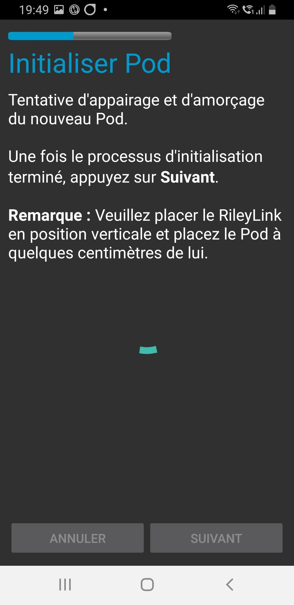 

04. Une fois amorcé avec succès, une coche verte sera affichée et le bouton **Suivant** sera activé. Cliquer sur le bouton **Suivant** pour terminer l'initialisation de l'amorçage du pod et afficher l'écran **Attacher Pod**.

    > 

05. Ensuite, préparer le site de perfusion du nouveau pod. Retirez le capuchon en plastique du pod et le papier blanc de l'adhésif et appliquez le pod à l'endroit habituel sur votre corps. Une fois terminé, cliquez sur le bouton **Suivant**.

    > 

06. La boîte de dialogue **Attacher Pod** apparaîtra. **Ne cliquez sur le bouton Ok QUE si vous êtes prêt à déployer la canule**.

    > 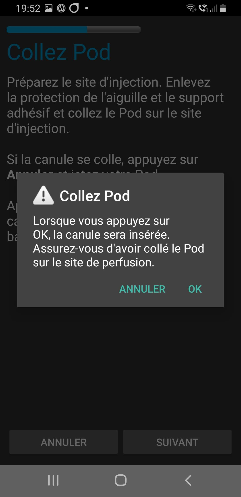

07. Après avoir appuyé sur **OK**, il peut se passer un certain temps avant que l'Omnipod réponde et insère la canule (1-2 minutes maximum), donc soyez patient.

    > Si le RileyLink est hors de portée du pod en cours d'activation, vous recevrez un message d'erreur **Aucune réponse du Pod**. Si cela se produit, rapprochez le RileyLink (~30 cm de distance ou moins) mais pas au dessus ni juste à côté du Pod et cliquez sur le bouton **Réessayer**.
    > 
    > Si le RileyLink est hors de portée Bluetooth ou n'a pas de connexion active avec le téléphone, vous recevrez un message d'erreur **Pas de réponse du RileyLink**. Si cela se produit, rapprochez le RileyLink du téléphone et cliquez sur le bouton **Réessayer**.
    > 
    > *REMARQUE : Avant d'insérer la canule, il est recommandé de pincer la peau près du point d'insertion de la canule. Cela permet une insertion en douceur de l'aiguille et réduira les risques d'occlusions.*
    > 
    > 
    > 
    >  

08. Une coche verte s'affiche, et le bouton **Suivant** est activé en cas d'insertion de canule réussie. Cliquer sur le button **Suivant**.

    > 

09. L'écran **Pod activé** s'affiche. Cliquer sur le bouton vert **Terminé**. Félicitations ! Vous avez démarré une nouvelle session de Pod actif.

    > 

10. Le menu de **Gestion du pod** devrait maintenant s'afficher avec le bouton **Activer Pod (1)** *désactivé* et le bouton **Désactiver Pod (2)** *activé*. Ceci est dû au fait qu'un pod est maintenant actif et que vous ne pouvez pas activer un pod supplémentaire sans désactiver d'abord le pod actuellement actif.

    Cliquez sur le bouton Retour de votre téléphone pour retourner à l'écran de l'onglet **Omnipod (POD)** qui affichera maintenant les informations du Pod pour votre session de pod actif, y compris le débit de basal actuel, le niveau du réservoir du pod, l'insuline injectée, les erreurs du pod et les alertes.

    For more details on the information displayed go to the [Omnipod (POD) Tab](#OmnipodEros-omnipod-pod-tab) section of this document.

    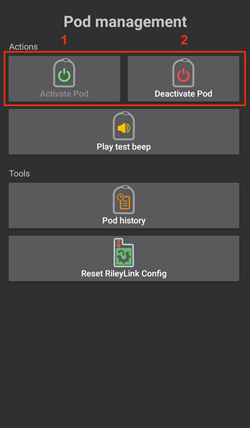 

### Désactivation du Pod

En utilisation normale, la durée de vie d'un pod est de l'ordre de trois jours (72 heures) et de 8 heures supplémentaires après l'expiration du pod soit un total de 80 heures d'utilisation du pod.

To deactivate a pod (either from expiration or from a pod failure):

1. Allez à l'onglet **Omnipod (POD)** , cliquez sur le bouton **POD MGMT (1)** , sur l'écran de **Gestion du pod** cliquez sur le bouton **Désactiver Pod (2)**.

   >  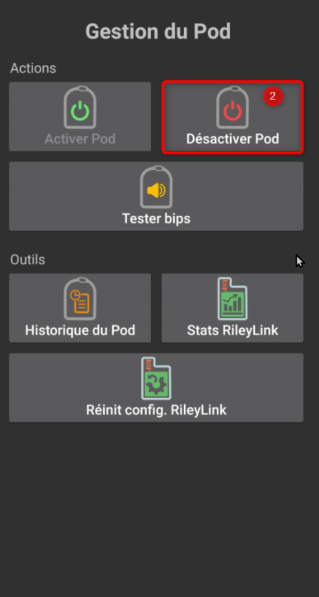

2. Sur l'écran **Désactiver Pod**, commencez par vérifier que le RileyLink se trouve à proximité du pod mais ni au dessus' ni juste à côté du pod, puis cliquez sur le bouton **Suivant** pour commencer le processus de désactivation du Pod.

   > 

3. L'écran **Désactivation Pod** apparaîtra et vous recevrez un bip de confirmation du pod que la désactivation a réussi.

   > 
   > 
   > **SI la désactivation échoue** et que vous ne recevez pas de bip de confirmation, vous pouvez recevoir un message **Pas de réponse du RileyLink** ou **Pas de réponse du Pod**. Veuillez cliquer sur le bouton **Réessayer (1)** pour essayer à nouveau de le désactiver. Si la désactivation continue à échouer, veuillez cliquer sur le bouton **Supprimer Pod (2)** pour le supprimer. Vous pouvez maintenant supprimer votre pod car la session active a été désactivée. Si votre Pod se met à hurler, vous devrez peut-être couper le son manuellement (à l'aide d'une épingle ou d'un trombone) car le bouton **Supprimer Pod (2)** ne le fera pas taire.
   > 
   > >   

4. Une coche verte apparaîtra une fois la désactivation réussie. Cliquer sur le bouton **Suivant** pour afficher l'écran désactivé du pod. Vous pouvez maintenant supprimer votre pod car la session active a été désactivée.

   > 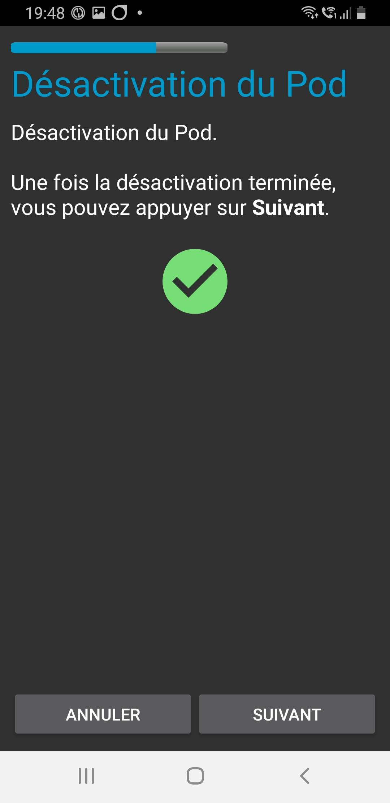

5. Cliquez sur le bouton vert pour retourner à l'écran **Gestion du pod**.

   > 

6. Vous êtes maintenant retourné dans le menu de **Gestion du pod**, appuyez sur le bouton retour de votre téléphone pour retourner à l'onglet **Omnipod (POD)**. Vérifiez que le champ **État du RileyLink :** indique **Connecté** et que le champ **État du Pod :** affiche un message **Pas de Pod actif**.

   >   

### Suspendre et reprendre l'injection d'Insuline

Le processus ci-dessous vous montre comment suspendre et reprendre l'injection d'insuline par la pompe.

*REMARQUE : si vous ne voyez pas de bouton SUSPENDRE*, son affichage n'a pas été activé dans l'onglet Omnipod (POD). Enable the **Show Suspend Delivery button in Omnipod tab** setting in the [Omnipod settings](#OmnipodEros-omnipod-settings) under **Other**.

#### Suspendre l'injection d’Insuline

Utilisez cette commande pour placer le pod actif dans un état suspendu. Dans cet état suspendu, la pod n'injectera plus aucune insuline. Cette commande imite la fonction de suspension que le PDM Omnipod d'origine envoie à un pod actif.

1. Allez dans l'onglet **Omnipod (POD)** et cliquez sur le bouton **SUSPENDRE (1)**. La commande de suspension est envoyée depuis le RileyLink vers le pod actif et le bouton **SUSPENDRE (3)** sera grisé. L'**État Pod (2)** affichera **SUSPRENDRE L'INJECTION**.

   >  

2. Lorsque la commande de suspension est confirmée avec succès par le RileyLink, une boîte de dialogue de confirmation affiche le message **Toutes les injections d'insuline ont été suspendues.**. Cliquez sur **OK** pour confirmer et continuer.

   > 

3. Votre pod actif a maintenant suspendu toute injection d'insuline. L'onglet **Omnipod (POD)** mettra à jour l' **état du Pod (1)** vers **Suspendu**. Le bouton **SUSPENDRE** sera remplacer par un nouveau bouton **Reprendre l'injection (2)**

   > 

#### Reprendre l'injection d'insuline

Use this command to instruct the active, currently suspended pod to resume insulin delivery. After the command is successfully processed, insulin will resume normal delivery using the current basal rate based on the current time from the active basal profile. The pod will again accept commands for bolus, TBR, and SMB.

1. Allez dans l'onglet **Omnipod (POD)** et assurez-vous que le champ **État Pod (1)** affiche **Suspendu**, puis appuyez sur le bouton **Reprendre l'injection (2)** pour demander au pod actuel de reprendre l'injection normale d'insuline. Un message **REPRENDRE L'INJECTION** s'affichera dans le champ **État Pod (3)** indiquant que le RileyLink envoie activement la commande au pod suspendu.

   > 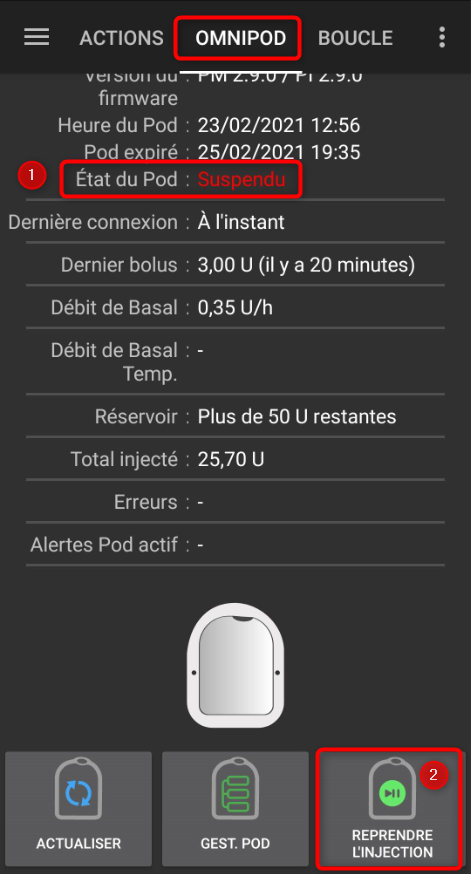 

2. Lorsque la commande Reprendre l'injection est confirmée avec succès par le RileyLink, une boîte de dialogue de confirmation affiche le message **L'injection de l'insuline a été reprise**. Cliquez sur **OK** pour confirmer et continuer.

   > 

3. L'onglet **Omnipod (POD)** mettra à jour le champ **État du pod (1)** pour afficher **EN COURS D'EXÉCUTION** et le bouton **Reprendre l'injection** sera maintenant remplacé par le bouton **SUSPENDRE (2)**.

   > 

### Valider les alertes Pod

*REMARQUE - si vous ne voyez pas de bouton ACCEPTER ALERTES, c'est parce qu'il n'est affiché dans l'onglet Omnipod (POD) QUE si l'alerte d'expiration pod ou l'alerte de réservoir bas ont été déclenchées.*

Le processus ci-dessous vous montrera comment accepter et arêter les bips du pod qui se produisent lorsque la durée d'activité du pod atteint le seuil d'alerte avant son expiration 72 heures (3 jours) après son activation. Ce délai d'avertissement est défini dans le paramètrage **Heures avant arrêt** des alertes Omnipod. La durée de vie maximale d'un pod est de 80 heures (3 jours 8 heures), cependant Insulet recommande de ne pas dépasser la limite de 72 heures (3 jours).

*REMARQUE - Si vous avez activé le paramètre "Accepter automatiquement les alertes Pod" dans les alertes Omnipod, cette alerte sera traitée automatiquement après la première occurrence et vous n'aurez PAS à l'arrêter manuellement.*

1. Lorsque le délai d'avertissement défini dans **Heures avant l'arrêt** est atteint, le pod émettra un bip d'avertissement pour vous informer qu'il approche de sa date d'expiration et qu'un changement de pod sera bientôt nécessaire. Vous pouvez le vérifier dans l'onglet **Omnipod (POD)**, le champ **Pod expiré : (1)** affichera l'heure exacte où le pod expirera (72 heures après l'activation) et le texte basculera en **rouge** après ce délai, et dessous dans le champ **Alertes Pod actives (2)** où le message de statut **Le Pod expire bientôt** est affiché. Ceci déclenchera l'affichage du bouton **ACCEPTER ALERTES (3)**. Une **notification système (4)** vous informera également de l'expiration imminente du pod

   >  

2. Allez dans l'onglet **Omnipod (POD)** et appuyez sur le bouton **ACCEPTER ALERTES (2)**. Le RileyLink envoie la commande au pod pour désactiver le bip d'avertissement d'expiration du pod et met à jour le champ **Etat pod (1)** avec **VALIDER LES ALERTES**.

   > 

3. Lors de la **désactivation réussie** des alertes, **2 bips** seront émis par le pod actif et une boîte de dialogue de confirmation affichera le message **Les alertes actives ont été acceptées.**. Cliquez sur le bouton **OK** pour confirmer et fermer la boîte de dialogue.

   > 
   > 
   > Si le RileyLink est hors de portée du pod alors que la commande d'acceptation des alertes est en cours de traitement, un message d'avertissement affichera 2 options. **Coupure son (1)** fera taire cette alerte. **OK (2)** confirmera cette alerte et permettra à l'utilisateur d'essayer d'accepter à nouveau les alertes.
   > 
   > 

4. Allez dans l'onglet **Omnipod (POD)** sous le champ **Alertes Pod actives** le message d'avertissement n'est plus affiché et le pod actif n'émettra plus de bips d'avertissement d'expiration du pod.

(OmnipodEros-view-pod-history)=

### Voir l'historique du Pod

This section shows you how to review your active pod history and filter by different action categories. L'outil historique du pod vous permet de visualiser les actions et résultats effectués dans votre pod actuellement actif pendant sa durée de vie de trois jours (72 à 80 heures).

Cette fonction est utile pour vérifier les bolus, les DBT, les changements de basal qui ont été donnés, mais vous pouvez ne pas être sûr qu'ils soient terminés. Les catégories restantes sont utiles en général pour résoudre les problèmes et déterminer l'ordre des événements qui ont conduit à un échec.

*REMARQUE :* Les commandes **incertaines** apparaîtront dans l'historique du pod, cependant en raison de leur nature, vous ne pouvez pas être sûr de leur exactitude.

1. Allez dans l'onglet **Omnipod (POD)** et appuyez sur le bouton **GEST. POD (1)** pour accéder au menu de **Gestion du pod** puis appuyez sur le bouton **Historique pod (2)** pour accéder à l'écran d'historique du pod.

   >  

2. Sur l'écran **Historique Pod** la catégorie par défaut **Tous (1)** est affichée avec la **Date / Heure (2)** de tous les pods **Actions (3)** et **Résultats (4)** dans l'ordre chronologique inverse. Utilisez le **bouton retour** de votre téléphone **2 fois** pour retourner à l'onglet **Omnipod (POD)** dans l'interface principale AAPS.

   >  

### Voir les paramètres et l'historique du RileyLink

Cette section vous montre comment revoir les paramètres de votre pod actif et du RileyLink ainsi que l'historique de la communication de chacun d'eux. Cette fonctionnalité, une fois sélectionnée, est divisée en deux sections : **Paramètres** et **Historique**.

L'utilisation principale de cette fonction est lorsque votre périphérique de communication pod est hors de la portée Bluetooth de votre téléphone après une période de temps et que l'**État du RileyLink** signale **RileyLink hors de portée**. Le bouton **ACTUALISER** de l'onglet principal **Omnipod (POD)** va essayer de rétablir manuellement la communication Bluetooth avec le RileyLink actuellement configuré dans les paramètres Omnipod.

Dans le cas où le bouton **ACTUALISER** de l'onglet principal **Omnipod (POD)** ne restaure pas la connexion avec le périphérique de communication pod, suivez les étapes supplémentaires ci-dessous pour une reconnexion manuelle.

#### Réétablir manuellement la communication Bluetooth du périphérique de communication Pod

1. À partir de l'onglet **Omnipod (POD)** lorsque l'**État RileyLink : (1)** signale **RileyLink injoignable** appuyez sur le bouton **GEST POD (2)** pour accéder au menu **Gestion du Pod**. Dans le menu de **Gestion du pod** vous verrez une notification montrant une recherche active d'une connexion RileyLink, appuyez sur le bouton **Stats RileyLink (3)** pour accéder à l'écran **Paramètres RileyLink**.

   >  

2. Dans l'écran **Paramètres RileyLink (1)** sous la section **RileyLink (2)** vous pouvez confirmer à la fois l'état de la connexion Bluetooth et l'erreur dans les champs **État de la connexion et Erreur de Connexion : (3)**. Les états *Erreur Bluetooth* et *RileyLink hors de portée* doivent être affichés. Démarrez une reconnexion manuelle du Bluetooth en appuyant sur le bouton **Actualiser (4)** dans le coin inférieur droit.

   > 
   > 
   > Si le périphérique de communication pod ne répond pas ou est hors de portée du téléphone pendant le traitement de la reconnexion Bluetooth, un message d'alerte affichera 2 options.

   - **Coupure son (1)** fera taire cette alerte.
   - **OK (2)** confirmera cette alerte et permettra à l'utilisateur d'essayer de ré-établir la connexion Bluetooth à nouveau.

   > 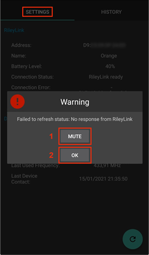

3. Si la **Connexion Bluetooth** ne se rétablit pas, essayez de **désactiver** manuellement le Bluetooth de votre téléphone, puis de le **réactiver**.

4. Après avoir réussi la reconnexion Bluetooth du RileyLink, le champ **État de la connexion : (1)** devrait signaler **RileyLink prêt**. Félicitations, vous avez maintenant reconnecté votre périphérique de communication pod à AAPS !

   > 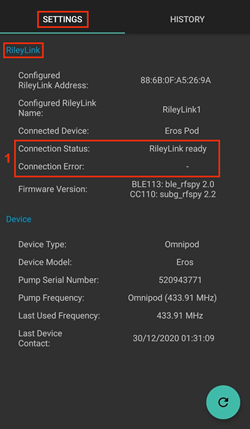

#### Paramètres du périphérique de communication pod et du Pod Actif

Cet écran vous montre les informations, états et paramètres de configuration à la fois du périphérique de communication pod actuellement configuré, et du pod Omnipod Eros actuellement actif.

1. Allez dans l'onglet **Omnipod (POD)** et appuyez sur le bouton **GEST. POD (1)** pour accéder au menu de **Gestion du Pod** puis appuyez sur le bouton **Stats RileyLink (2)** pour afficher les paramètres du **RileyLink (3)** et du pod actif **Appareil (4)**.

   >  
   > 
   > 

##### Champs RileyLink (3)

> - **Adresse :** Adresse MAC du périphérique de communication pod sélectionné défini dans les paramètres Omnipod.
> - **Nom :** Nom d’identification Bluetooth du périphérique de communication pod sélectionné défini dans les paramètres Bluetooth de votre téléphone.
> - **Niveau batterie :** Affiche le niveau de batterie actuel du périphérique de communication pod connecté
> - **Périphérique connecté :** Modèle du pod Omnipod qui communique actuellement avec le périphérique de communication pod
> - **État de la connexion :** l'état actuel de la connexion Bluetooth entre le périphérique de communication pod et le téléphone qui exécute AAPS.
> - **Erreur de Connexion :** S'il y a une erreur Bluetooth avec le périphérique de communication pod, les détails seront affichés ici.
> - **Version du firmware :** Version actuelle du firmware installée sur le périphérique de communication pod connecté.

##### Champs Appareil (4) - Avec un Pod actif

> - **Type d'appareil :** Le type d'appareil qui communique avec le périphérique de communication pod (pompe Omnipod)
> - **Appareils configurés :** Le modèle de l'appareil actif connecté au périphérique de communication pod (le nom du modèle actuel du pod Omnipod, qui est Eros)
> - **Numéro de série de pompe :** Numéro de série du pod actuellement activé
> - **Fréquence de pompe :** Fréquence radio que le périphérique de communication pod a ajustée pour communiquer avec le pod.
> - **Dernière fréquence utilisée :** Dernière fréquence radio connue que le pod a utilisé pour communiquer avec le périphérique de communication pod.
> - **Dernier contact appareil :** Date et heure du dernier contact que le périphérique de communication pod a eu avec le pod.
> - **Bouton Actualiser** Actualiser manuellement les informations de cette page.

(omnipod-eros-rileylink-and-active-pod-history)=
#### RileyLink et historique du Pod Actif

Cet écran montre les informations dans l'ordre chronologique inverse de chaque état ou action que le RileyLink ou le pod actuellement connecté fait ou a fait. L'historique complet n'est disponible que pour le pod actuellement actif, après un changement de pod, cet historique sera effacé et seuls les événements du pod nouvellement activé seront enregistrés et affichés.

1. Allez dans l'onglet **Omnipod (POD)**, cliquez sur le bouton **GEST. POD (1)** sur l'écran **Gestion du Pod** cliquez sur le bouton **Désactiver Pod (2)**.

   >  
   > 
   > 

##### Champs

> - **Date & Heure** : horodatage de chaque événement dans l'ordre chronologique inverse.
> - **Appareil :** L'appareil concerné par l'action ou l'état courant.
> - **État ou Action :** L'état courant ou l'action effectuée par l'appareil.

(OmnipodEros-omnipod-pod-tab)=

## Onglet Omnipod (POD)

Vous trouverez ci-dessous une explication de la mise en page et la signification des champs et icônes de l'onglet **Omnipod (POD)** de l'interface principale AAPS.

*REMARQUE : Si un message dans les champs d'état de l'onglet Omnipod (POD) indique (incertain), vous devez appuyer sur le bouton Actualiser pour l'effacer et actualiser l'état du pod.*

> 

### Champs

- **État RileyLink :** Affiche l'état actuel de la connexion du RileyLink

- *RileyLink hors de portée* - Le périphérique de communication pod n'est pas à portée Bluetooth du téléphone, éteint ou a un problème empêchant la communication Bluetooth.
- *RileyLink Prêt* - le périphérique de communication pod est allumé et initialise la connexion Bluetooth
- *Connecté* - Le périphérique de communication pod est allumé, connecté et capable de communiquer via Bluetooth.

- **Adresse Pod :** Affiche l'adresse courante dans laquelle le pod actif est référencé

- **LOT :** Affiche le numéro de LOT du pod actif

- **TID :** Affiche le numéro de série du pod.

- **Version du firmware :** Affiche la version du firmware du pod actif.

- **Heure du Pod :** Affiche l'heure actuelle sur le pod actif.

- **Expiration Pod :** Affiche la date et l'heure à laquelle le pod actif expirera.

- **État du Pod :** Affiche l'état du pod actif.

- **Dernière connexion :** Affiche l'heure de la dernière communication avec le pod actif.

- *À l'instant* - il y a moins de 20 secondes.
- *Il y a moins d'une minute* - plus de 20 secondes mais moins de 60 secondes.
- *il y a 1 minute* - plus de 60 secondes mais moins de 120 secondes (2 min)
- *il y a XX minutes* - il y a plus de 2 minutes comme défini par la valeur de XX

- **Dernier bolus :** Affiche le dernier bolus envoyé au pod actif et il y a combien de temps entre parenthèses.

- **Débit de Basal :** Affiche le débit Basal courant en ce moment, à partir du débit de basal du profil.

- **Débit de Basal Temp. :** Affiche le débit de basal Temporaire actuellement en cours d'exécution dans le format suivant

- Unités/heure @ heure du DBT (minutes exécutées/minutes totales prévues du DBT)
- *Exemple :* 0.00U/h @18:25 (90/120 minutes)

- **Réservoir :** Affiche plus de 50+U quand plus de 50 unités sont dans le réservoir. Sous cette valeur, les unités exactes sont affichées en jaune.

- **Total injecté :** Affiche le nombre total d'unités d'insuline injectées depuis le réservoir. *Notez que c'est une approximation comme amorçage et le remplissage du pod n'est pas un processus exact.*

- **Erreurs :** Affiche la dernière erreur rencontrée. Review the [Pod history](#OmnipodEros-view-pod-history), [RileyLink history](#omnipod-eros-rileylink-and-active-pod-history) and log files for past errors and more detailed information.

- **Alertes Pod actif :** Réservées pour les alertes en cours sur le pod actif. Normalement utilisé lorsque la date d'expiration du pod est au delà de 72 heures et que des alertes sonores natives sont en cours d'exécution.

### Icônes

- **ACTUALISER:**

  > 
  > 
  > Envoie une commande d'actualisation au pod actif pour mettre à jour la communication
  > 
  > A utiliser pour actualiser l'état du pod et rejeter les champs qui contiennent le texte (incertain).
  > 
  > See the [Troubleshooting section](#OmnipodEros-troubleshooting) below for additional information.

- **GEST. POD:**

  > 
  > 
  > Permet d'accéder au menu de gestion du pod

- **ACCEPTER ALERTES:**

  > 
  > 
  > Lorsque vous cliquez dessus, cela désactivera les bips d'expiration du pod et les notifications.
  > 
  > Le bouton ne s'affiche que lorsque la durée d'utilisation du pod dépasse le seuil d'alerte d'expiration En cas de désactivation réussi, cette icône n'apparaîtra plus.

- **DÉFINIR L'HEURE:**

  > 
  > 
  > Lorsque vous cliquez dessus, cela mettra à jour l'heure du pod avec l'heure actuelle de votre téléphone.

- **SUSPENDRE:**

  > 
  > 
  > Suspend le pod actif

- **REPRENDRE L'INJECTION:**

  > 
  > 
  > > Réactive l'injection d'insuline du pod actif actuellement suspendu

### Menu de Gestion du pod

Vous trouverez ci-dessous une explication de la mise en page et de la signification des icônes de la page **Gestion du Pod** accessible depuis l'onglet **Omnipod (POD)**.

> 

- **Activer le Pod**

  > 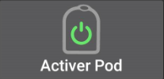
  > 
  > Amorce et active un nouveau pod

- **Désactiver Pod**

  > 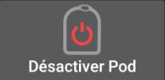
  > 
  > Désactive le pod actuellement actif.
  > 
  > Un pod partiellement appairé ignore cette commande.
  > 
  > Utilisez cette commande pour désactiver un pod urlant (erreur 49).
  > 
  > Si le bouton est désactivé (grisé), utilisez le bouton Supprimer Pod.

- **Tester les bips**

  > 
  > 
  > Joue un bip de test unique sur le pod quand vous cliquez dessus.

- **Supprimer Pod**

  > 
  > 
  > Désactive et supprime l'état d'un pod qui ne répond pas lorsque vous cliquez dessus.
  > 
  > Le bouton ne s'affiche que dans des cas très particuliers où la désactivation correcte n'est plus possible :
  > 
  > > - Un **pod n'est pas complètement appairé** et ignore donc les commandes de désactivation.
  > > - Un **pod est bloqué** pendant le processus d'appairage entre deux étapes
  > > - Un **pod ne s'appaire tout simplement pas.**

- **Historique du Pod**

  > 
  > 
  > Affiche l'historique de l'activité du pod actif

- **Stats RileyLink:**

  > 
  > 
  > Naviguer vers l'écran des statistiques du RileyLink qui affiche les paramètres actuels et l'historique de la connexion du RileyLink
  > 
  > > - **Paramètres** - affiche les paramètres du RileyLink et du pod actif
  > > - **Historique** - affiche l'historique de communication du RileyLink et du Pod

- **% Réinitialisation Bluetooth RileyLink**

  > 
  > 
  > Lorsque vous cliquez dessus, ce bouton réinitialise la configuration du périphérique de communication pod actuellement connecté.
  > 
  > > - Lorsque la communication est démarrée, des données spécifiques sont envoyées et placées dans le RileyLink > - Les registres de mémoire sont définis > - Les protocoles de communication sont définis > - La fréquence radio réglée est définie 
  > > - See [additional notes](#OmnipodEros-reset-rileylink-config-notes) at the end of this table

- **Lire Journal d'impulsions:**

  > 
  > 
  > > Copie le journal d'impulsion du pod actif dans le presse-papiers

(OmnipodEros-reset-rileylink-config-notes)=

#### *Remarque concernant Réinit config. RileyLink*

- L'utilisation principale de cette fonction est lorsque le dispositif de communication de pod actuellement actif ne répond pas et que la communication est dans un état bloqué.
- Si le périphérique de communication du pod est éteint puis rallumé, le bouton **Réinit config. RileyLink** doit être appuyé, afin de définir les paramètres dans le périphérique de communication pod.
- Si cela n'est PAS fait, AAPS devra être redémarré après la mise sous tension du périphérique de communication pod.
- Ce bouton **NE DOIT PAS** être appuyé lors du basculement entre les différents périphériques de communication du pod

(OmnipodEros-omnipod-settings)=

## Paramètres Omnipod

Les paramètres du pilote Omnipod sont configurables à partir du **menu hamburger** en haut à gauche sous **Configuration**➜**Pompe**➜**Omnipod**➜**Roue crantée (2)** en sélectionnant le **bouton radio (1)** intitulé **Omnipod**. En sélectionnant la **case à cocher (3)** à côté de la **roue crantée (2)** cela affichera le menu Omnipod sous la forme d'un onglet intitulé **OMNIPOD** ou **POD** dans l'interface AAPS. C'est ce que l'on appelle dans cette documentation l'onglet **Omnipod (POD)**.


**REMARQUE :** Un moyen plus rapide d'accéder aux **paramètres Omnipod** est d'accéder au **menu 3 points (1)** dans le coin supérieur droit de l'onglet **Omnipod (POD)** et de sélectionner **Préférences de Omnipod (2)** dans le menu déroulant.


The settings groups are listed below; you can enable or disable via a toggle switch for most entries described below:


*REMARQUE : Un astérisque (\*) indique que le paramètre par défaut est activé.*

### RileyLink

Permet le balayage d'un périphérique de communication pod. Le pilote Omnipod ne peut pas sélectionner plus d'un périphérique de communication pod à la fois.

- **Afficher le niveau de batterie transmis par OrangeLink/EmaLink/Dialink :** indique le niveau de batterie réel de l'OrangeLink/EmaLink/Dialink. Il est **fortement recommandé** à tous les utilisateurs d'OrangeLink/EmaLink/Dialink d'activer ce paramètre.

- NE FONCTIONNE PAS avec le RileyLink original.
- Peut ne pas marcher avec des alternatives au RileyLink.
- Activé - Indique le niveau de batterie actuel des périphériques de communication de pod.
- Désactivé - Indique n/a.

- **Activer l'enregistrement des changements de pile dans Actions :** Dans le menu Actions le bouton de changement de pile est activé SI vous avez activé ce paramètre ET le paramètre de rapport de la batterie ci-dessus.  Certains appareils de communication pods ont maintenant la possibilité d’utiliser des piles ordinaires qui peuvent être changées.  Cette option vous permet d'enregistrer et de réinitialiser l'âge de la pile.

### Bips de confirmation

Provides confirmation beeps from the pod for bolus, basal, SMB, and TBR delivery and changes.

- **Bips bolus activés :** Active ou désactive les bips de confirmation lorsqu'un bolus est injecté.
- **Bips basal activés :** Active ou désactive les bips de confirmation lorsqu'un nouveau débit de basal est défini. le débit de basal actif est annulé ou le débit de basal actuel est changé.
- **Bips SMB activés :** Active ou désactive les bips de confirmation lorsqu'un SMB est injecté.
- **Bips DBT activés :** Active ou désactive les bips de confirmation lorsqu'un DBT est défini ou annulé.

### Alertes

Fournit des alertes AAPS et des notifications Nightscout pour l'arrêt, l'expiration des pod, le niveau de réservoir bas, en fonction des seuils définis.

*Note an AAPS notification will ALWAYS be issued for any alert after the initial communication with the pod since the alert was triggered. Dismissing the notification will NOT dismiss the alert UNLESS automatically acknowledge Pod alerts is enabled. Pour rejeter MANUELLEMENT l'alerte, vous devez aller dans l'onglet Omnipod (POD) et appuyez sur le bouton ACCEPTER ALERTES\**

- **\*Rappel d'expiration activé :** Activer ou désactiver le rappel d'expiration du pod défini pour se déclencher lorsque le nombre défini d'heures avant l'arrêt est atteint.
- **Heures avant arrêt :** Définit le nombre d'heures avant l'arrêt du pod actif, ce qui déclenchera ensuite l'alerte de rappel d'expiration.
- **Alerte Réservoir bas activée :** Activer ou désactiver une alerte lorsque le nombre d'unités restantes dans le réservoir atteint la limite définie dans le champ "Nombre d'unités".
- **Nombre d'unités :** Défini le nombre d'unités à partir de laquelle l'alerte Réservoir bas est activée.
- **Accepter automatiquement les alertes Pod :** Lorsqu'elles sont activées, une notification sera toujours publiée, cependant immédiatement après la pemière communication avec le pod après que l'alerte ait été émise, elle sera désormais automatiquement acceptée et l'alerte sera rejetée.

### Notifications

Fournit des notifications AAPS et des alertes audibles sur le téléphone lorsqu'il n'est pas certain que les événements DBT, SMB ou bolus aient réussi.

*NOTE: These are notifications only, no audible beep alerts are made.*

- **Son pour les notifications DBT incertains activé :** Activer ou désactiver ce paramètre pour déclencher une alerte audible et une notification visuelle lorsque AAPS n’est pas certain si un DBT a été défini avec succès.
- **Son pour les notifications SMB incertains activé :** Activer ou désactiver ce paramètre pour déclencher une alerte audible et une notification visuelle lorsque AAPS n’est pas certain si un SMB a été correctement délivré.
- **Son pour les notifications bolus incertains activé :** Activer ou désactiver ce paramètre pour déclencher une alerte audible et une notification visuelle lorsque AAPS n’est pas certain si un bolus a été correctement délivré.

### Autres

Fournit des paramètres avancés pour aider au débogage.

- **Montrer le bouton Suspendre l'injection dans l'onglet Omnipod :** Masquer ou afficher le bouton de suspension de l'injection dans l'onglet **Omnipod (POD)**.
- **Afficher le bouton Journal d'impulsions dans le menu de gestion des pods :** Masquer ou afficher le bouton de journal d'impulsion dans le menu **Gestion du Pod**.
- **Afficher le bouton Stats RileyLink dans le menu de gestion du pod :** Masquer ou afficher le bouton des stats du RileyLink dans le menu **Gestion du Pod**.
- **Changement de Zone/Heure Activé :** permet de détecter automatiquement les changements de fuseau horaire ou de changement d'heure si le téléphone est utilisé dans une zone où c'est actif.

### Changement ou suppression d'un périphérique de communication pod actif (RileyLink)

Avec de nombreux modèles alternatifs au RileyLink d'origine disponibles (comme l'OrangeLink ou l'EmaLink) ou la nécessité d'avoir plusieurs versions de sauvegarde du même périphérique de communication pod (RileyLink), il est devenu nécessaire de pouvoir changer ou de supprimer le périphérique de communication pod sélectionné (RileyLink) des paramètres du Driver Omnipod.

Les étapes suivantes montreront comment **Supprimer** un périphérique de communication pod existant (RileyLink) et en **Ajouter** un nouveau.  Exécuter à la fois les étapes **Supprimer** et **Ajouter** changera votre périphérique.

1. Accédez au menu de**Sélection RileyLink** en sélectionnant le **menu 3 points (1)** dans le coin supérieur droit de l'onglet **Omnipod (POD)** et en sélectionnant les **Préférences Omnipod (2)** dans le menu déroulant. Dans le menu des **Paramètres Omnipod** sous **Configuration RileyLink (3)** appuyez sur le bouton **Non configuré** (si aucun appareil n'est sélectionné) ou **Adresse MAC** (si un périphérique est présent) pour ouvrir le menu de **Sélection RileyLink**.

   >  

### Supprimer le Périphérique de communication pod actuellement sélectionné (RileyLink)

Le processus ci-dessous vous montrera comment supprimer le périphérique de communication pod actuellement sélectionné (RileyLink) des paramètres du Driver Omnipod.

1. Dans **Configuration RileyLink** appuyez sur le texte **Non configuré (1)** pour ouvrir le menu de **Sélection RileyLink**.

   > 

2. Dans le menu de **Sélection du RileyLink** appuyez sur le bouton **Supprimer (2)** pour supprimer **le RileyLink actuellement sélectionné (3)**

   > 

3. À la demande de confirmation, appuyez sur **Oui (4)** pour confirmer la suppression de votre appareil.

   > 

4. Vous êtes retourné dans le menu **Paramètres Omnipod** où sous **Configuration RileyLink** vous verrez maintenant que le périphérique est **Non configuré (5)**.  Félicitations, vous avez supprimé avec succès le périphérique de communication pod.

   > 

### Ajouter le Périphérique de communication pod actuellement sélectionné (RileyLink)

Ce processus montrera comment ajouter un nouveau périphérique de communication pod aux paramètres du pilote Omnipod.

1. Dans la **Configuration du RileyLink** appuyez sur le texte **Non défini (1)** pour ouvrir le menu **Sélection du RileyLink**.

   > 

2. Appuyez sur le bouton **Rechercher (2)** pour commencer à chercher tous les périphériques Bluetooth disponibles.

   > 

3. Sélectionnez **votre RileyLink (3)** dans la liste des périphériques disponibles et vous serez renvoyé au menu des **Paramètres Omnipod** qui affichera l'**Adresse MAC (4)** de votre appareil nouvellement sélectionné.  Félicitations, vous avez sélectionné avec succès votre périphérique de communication pod.

   >  

## Onglet Actions (ACT)

Cet onglet est bien documenté dans la documentation principale AAPS, mais il y a quelques spécificités liées aux pod Omnipod qui diffèrent des pompes avec tubulures, surtout après les processus d'application d'un nouveau pod.

1. Allez dans l'onglet **Actions (ACT)** dans l'interface principale AAPS.
2. Dans la section **Careportal (1)** les 3 champs suivants auront leur **age réinitialisés** à 0 jours et 0 heures **après chaque changement de pod** : **Insuline** et **Canule**. C'est dû à la façon dont la pompe Omnipod est construite et opérationnelle. La **pile de la pompe** et le **réservoir d'insuline** sont intégrés à l'intérieur de chaque pod. Puisque le pod insère la canule directement dans la peau au niveau du site d'application pod, il n'y a pas de tubulure traditionnelle dans les pompes Omnipod. *Par conséquent, après un changement de pod, l'âge de chacune de ces valeurs sera automatiquement réinitialisé à zéro.* **L'âge de la pile pompe** n'est pas indiqué car la durée de vie de la pile du pod sera toujours plus grande que celle du pod (maximum 80 heures).

> 

### Niveaux

**Insulin Level**

L'affichage de la quantité d'insuline dans le Pod Omnipod Eros n'est pas exact.  Ceci est dû au fait que l'on ne sait pas exactement combien d'insuline a été mise dans le pod, ce n'est que lorsque les 2 bips sont émis en remplissant le pod que le réservoir contient plus de 85 unités. Un Pod peut contenir au maximum 200 unités. L'amorçage peut également introduire des écarts car ce n'est pas et le processus exact.  Avec ces deux facteurs, le pilote Omnipod a été écrit pour donner la meilleure estimation de l'insuline restant dans le réservoir.

> - **Au-delà de 50 unités** - Affiche la valeur de 50+U lorsque plus de 50 unités sont actuellement dans le réservoir.
> - **En dessous de 50 unités** - Affiche la quantité approximative d'insuline restante dans le réservoir.
> - **SMS** - Renvoie la valeur ou 50+U pour les réponses SMS
> - **Nightscout** - Envoie la valeur 50 vers Nightscout s'il y a plus de 50 unités (version 14,07 et plus).  Les nouvelles versions afficheront la valeur de plus de 50+ si au-dessus de 50 unités.

**Niveau pile**

L'affichage du niveau de la batterie est un paramètre qui peut être activé pour afficherer le niveau de batterie actuel des périphériques de communication pod comme l'OrangeLink, EmaLink ou Dialink.  Le hardware RileyLink n'est PAS compatible de l'affichage du niveau batterie.  Le niveau batterie est actualisé après chaque communication avec le pod, donc lors de la charge on peut ne pas avoir une augmentation linéaire.  Une mise à jour manuelle actualisera le niveau de batterie.  Lorsqu'un périphérique de communication Pod est déconnecté, la valeur 0% sera indiquée.

> - **Le hardware RileyLink n'est PAS compatible de l'affichage du niveau batterie**
> - **Le paramètre "Afficher le niveau batterie remonté par OrangeLink/EmaLink/Dialink" DOIT être activé dans les paramètres Omnipod**
> - **Le niveau batterie ne fonctionne que pour les périphériques OrangeLink, EmaLink et Dialink**
> - **L'affichage du niveau de batterie PEUT fonctionner pour d'autres appareils (en dehors du RileyLink)**
> - **SMS** - Renvoie en retour le niveau de batterie actuel quand une valeur existe, la valeur n/a ne sera pas renvoyée
> - **Nightscout** - Renvoie en retour le niveau de batterie actuel quand une valeur existe, la valeur n/a ne sera pas envoyée

(OmnipodEros-troubleshooting)=

## Troubleshooting

### Erreurs Pod

Pods fail occasionally due to a variety of issues, including hardware issues with the Pod itself. It is best practice not to call these into Insulet, since AAPS is not an approved use case. Une liste de codes défaut peut être trouvée [ici](https://github.com/openaps/openomni/wiki/Fault-event-codes) pour aider à trouver les causes.

### Empêcher l'erreur 49 échecs du pod

This failure is related to an incorrect pod state for a command or an error during an insulin delivery command. Il est vivement recommandé aux utilisateurs d'activer dans le client Nightscout *Envoi NS uniquement* dans la **Configuration**➜**Général**➜**NSClient**➜**roue crantée**➜**Paramètres Avancés** pour prévenir les éventuels échecs.

### Alertes Pompe hors de portée

Il est recommandé de configurer les alertes de la pompe sur **120 minutes** en allant dans le menu trois points en haut à droite puis en sélectionnant **Préférences**➜ **Alertes locales**➜ **Seuil d'alerte pompe hors de portée \[min\]** et en réglant **120**.

(OmnipodEros-import-settings-from-previous-aaps)=
### Importer les paramètres AAPS de versions précédentes

Veuillez noter qu'il est possible d'importer un état du Pod périmé lors de l'importation des paramètres. Par conséquent, vous pourriez perdre un Pod actif. Il est donc fortement recommandé de **ne pas importer de paramètres pendant une session de Pod actif**.

1. Désactiver votre session pod. Vérifiez que vous n'avez pas de session de pod actif.
2. Exportez vos paramètres et stockez en une copie dans un endroit sûr.
3. Désinstallez la version précédente d'AAPS et redémarrez votre téléphone.
4. Installez la nouvelle version d'AAPS et vérifiez que vous n'avez pas de session pod actif.
5. Importez vos paramètres et activez votre nouveau pod.

### Alertes Pilote Omnipod

Veuillez noter que le pilote Omnipod présente une variété d'alertes uniques dans l'onglet **Aperçu (Accueil)**, la plupart d'entre elles sont juste une information et peuvent être rejetées tandis que certaines indiquent à l'utilisateur une action à faire pour traiter la cause de l'alerte déclenchée. A summary of the main alerts that you may encounter is listed below:

#### Pas de Pod actif

Aucune session de Pod actif détectée. Cette alerte peut être temporairement rejetée en appuyant sur **REPORT ALARME** mais elle se déclenchera tant qu'un nouveau pod n'a pas été activé. Une fois activé, cette alerte disparait automatiquement.

#### Pod suspendu

Alerte informative que le Pod a été suspendu.

#### Echec Paramétrage Profil Basal. La livraison peut être suspendue ! Veuillez actualiser manuellement l'état du Pod à partir de l'onglet Omnipod et reprendre l'injection si nécessaire..

Alerte informative que le réglage du profil basal du Pod a échoué, et vous devrez appuyer sur *Actualiser* dans l'onglet Omnipod.

#### Impossible de vérifier si le bolus SMB a réussi. Si vous êtes sûr que le Bolus n'a pas réussi, vous devez supprimer manuellement l'entrée SMB dans les traitements.

Alerte que le bolus SMB n'a pas pu être vérifié, vous devrez vérifier le champ *Dernier bolus* dans l'onglet Omnipod pour voir si le bolus SMB a bien été fait et dans le cas contraire supprimer l'entrée dans l'onglet Traitements.

#### Incertain si l'action "Bolus/DBT/SMB" est terminée, merci de vérifier manuellement s'il a réussi.

En raison de la façon dont le RileyLink et l'Omnipod communiquent, des situations peuvent se produire où le fait qu'une commande ait été traitée avec succès est *incertain*. La nécessité d'informer l'utilisateur de cette incertitude était nécessaire.

Voici quelques exemples de cas où une notification incertaine peut se produire.

- **Bolus** - Les bolus incertains ne peuvent pas être vérifiés automatiquement. La notification restera jusqu'au prochain bolus mais un rafraîchissement manuel du pod effacera le message. *Par défaut, les bips d'alertes sont activés pour ce type de notification car l'utilisateur devra les vérifier manuellement.*
- **DBT, états du Pod, changements de profil, changements d'heure** - un rafraîchissement manuel du pod effacera le message. Par défaut, les bips d'alerte sont désactivés pour ce type de notification.
- **Décalage de l'heure du pod -** Lorsque l'heure du pod et l'heure de votre téléphone sont décalés, il est difficile pour la boucle AAPS de fonctionner et de faire des prédictions et des recommandations de posologie précises. Si le décalage de temps entre le pod et le téléphone est de plus de 5 minutes, alors AAPS signalera que le pod est suspendu dans l'état du Pod avec un message HANDLE TIME CHANGE. Une icône supplémentaire **Définir l'heure** apparaîtra au bas de l'onglet Omnipod (POD). Cliquer sur Définir l'heure synchronisera l'heure sur le pod avec l'heure sur le téléphone, puis vous pouvez cliquer sur le bouton REPRENDRE L'INJECTION pour continuer les opérations normales de pod.

## Bonnes pratiques

(OmnipodEros-optimal-omnipod-and-rileylink-positioning)=

### Positionnement optimal Omnipod et RileyLink

L'antenne utilisée sur le RileyLink pour communiquer avec un pod Omnipod est une antenne spirale hélicoïdale à 433 MHz. En raison de ses propriétés de construction, il émet un signal omnidirectionnel comme un donuts à trois dimensions avec l'axe z représentant l'antenne verticale. Cela signifie qu'il y a des positions optimales pour le positionnement du RileyLink, en particulier lors des séquences d'activation et de désactivation.


> *(Fig 1. Tracé graphique de l'antenne hélicoïdale en spirale dans un diagramme omnidirectionnel*)

Pour des raisons de sécurité, l'*activation* d'un pod doit être faite à une distance *plus proche (~30 cm ou moins)* que les autres opérations telles que donner un bolus paramétrer un DBT ou simplement rafraîchir l'état du pod. En raison de la nature de la transmission du signal à partir de l'antenne RileyLink, il n'est PAS recommandé de placer le pod au dessus du RileyLink ou juste à côté de celui-ci.

L'image ci-dessous montre le positionnement optimal du RileyLink lors des procédures d'activation et de désactivation du pod. Le pod peut être activé dans d'autres positions mais vous aurez le plus de chance de réussir en utilisant la même position que dans l'image ci-dessous.

*Remarque : Si après avoir positionné le pod de manière optimale, la communication RileyLink échoue, cela peut être dû à une batterie faible qui réduit la portée de transmission de l'antenne du RileyLink. Pour éviter ce problème, assurez-vous que le RileyLink est correctement chargé ou connecté directement à un câble de charge durant ce processus.*


## Où trouver de l'aide pour le pilote Omnipod

Tout le travail de développement du pilote Omnipod est fait par la communauté par des bénévoles; nous vous demandons donc d'être attentif et d'utiliser les directives suivantes lorsque vous demandez de l'aide :

- **Niveau 0 :** Lisez la section correspondante de cette documentation pour vous assurer que vous comprenez comment la fonctionnalité avec laquelle vous avez des difficultés est censée fonctionner.
- **Niveau 1 :** Si vous rencontrez toujours des problèmes que vous n'arrivez pas à résoudre en utilisant ce document, alors veuillez aller sur la chaine *#androidaps* sur **Discord** avec [ce lien d'invitation](https://discord.gg/4fQUWHZ4Mw).
- **Level 2:** Search existing issues to see if your issue has already been reported; if not, please create a new [issue](https://github.com/nightscout/AndroidAPS/issues) and attach your [log files](../GettingHelp/AccessingLogFiles.md).
- **Soyez patient - la plupart des membres de notre communauté sont des bénévoles de bonne nature, et résoudre les problèmes nécessite souvent du temps et de la patience de la part des utilisateurs et des développeurs.**
